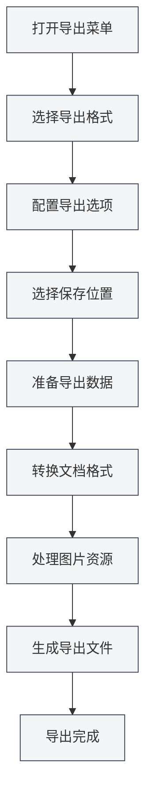

# Funcionalidad de Exportación

## Descripción General

MetaDoc admite la exportación de documentos a múltiples formatos, incluyendo PDF, HTML, DOCX, LaTeX, Markdown, JSON, entre otros. La función de exportación proporciona diferentes opciones según el formato del documento, garantizando que el documento exportado conserve su formato y estilo originales.

La función de exportación incluye automáticamente la metainformación del documento (título, autor, descripción, palabras clave) y procesa elementos como imágenes, tablas, fórmulas matemáticas, etc., durante el proceso de exportación.

<MenuItemsDemo mode="demo" :items='[{"id": "file", "items": ["export"]}]' />

<MetaInfoPanel mode="demo" :meta='{"title": "导出示例", "author": "作者", "description": "文档描述", "keywords": ["导出", "PDF"]}' :outlineJson='""' />

<MenuItemsDemo mode="demo" :items='[{"id": "file", "items": ["export"]}]' />

<MetaInfoPanel mode="demo" :meta='{"title": "导出格式", "author": "MetaDoc", "description": "支持的导出格式介绍", "keywords": ["导出", "格式"]}' :outlineJson='""' />

## Formatos de Exportación Soportados

<MenuItemsDemo mode="demo" :items='[{"id": "file", "items": ["export"]}]' />

### Exportación de Documentos Markdown

Los documentos Markdown (`.md`) se pueden exportar a los siguientes formatos:

- **PDF**: Adecuado para imprimir y compartir.
- **HTML**: Adecuado para visualización web.
- **DOCX**: Adecuado para edición en Word.
- **LaTeX**: Adecuado para artículos académicos.
- **JSON**: Adecuado para procesamiento por programas.

<MetaInfoPanel mode="demo" :meta='{"title": "LaTeX导出", "author": "系统", "description": "LaTeX文档导出选项", "keywords": ["LaTeX", "导出"]}' :outlineJson='""' /

### Exportación de Documentos LaTeX

Los documentos LaTeX (`.tex`) se pueden exportar a los siguientes formatos:

- **PDF**: Generado mediante compilación LaTeX.
- **Markdown**: Convertido a formato Markdown.
- **HTML**: Convertido a formato HTML.
- **DOCX**: Convertido a formato Word.

<MenuItemsDemo mode="demo" :items='[{"id": "file", "items": ["export"]}]' /

### Exportación de Documentos JSON

Los documentos JSON (`.json`) se pueden exportar como:

- **JSON**: Mantiene el formato JSON.

## Operaciones de Exportación

### Exportación Básica

1. **Abrir el menú de exportación**:
   - Haga clic en "Archivo" → "Exportar" en la barra de menú.
   - O utilice el atajo de teclado (si está configurado).

Las opciones de exportación en el menú Archivo son las siguientes:

<MenuItemsDemo mode="demo" :items='[{"id": "file", "items": ["export"]}]' />

2. **Seleccionar el formato de exportación**:

   - En el menú de exportación, elija el formato de destino.
   - El sistema mostrará las opciones de exportación disponibles según el formato del documento actual.

3. **Seleccionar la ubicación de guardado**:

   - En el cuadro de diálogo de guardar archivo, seleccione la ubicación.
   - Ingrese el nombre del archivo (el sistema agregará automáticamente la extensión correcta).

4. **Esperar a que se complete la exportación**:
   - Se mostrará una barra de progreso durante la exportación.
   - Se mostrará una notificación de éxito una vez completada.

### Exportación Rápida

Para formatos de uso común, se pueden usar atajos de teclado para una exportación rápida:

- **Exportar a PDF**: `Ctrl+Shift+E` (si está configurado).
- **Exportar a HTML**: Seleccionar a través del menú.

## Explicación Detallada de la Exportación Markdown

<MenuItemsDemo mode="demo" :items='[{"id": "file", "items": ["export"]}]' />

### Exportar a PDF

La exportación a PDF convierte Markdown a formato PDF:

- **Contenido incluido**: Cuerpo del documento, imágenes, tablas, fórmulas matemáticas.
- **Metainformación incluida**: Título, autor, descripción, palabras clave.
- **Estilo**: Utiliza estilos específicos para PDF, adecuados para impresión.
- **Procesamiento de imágenes**: Las imágenes se redimensionan automáticamente para ajustarse a la página.

**Casos de uso**:

- Imprimir documentos.
- Compartir documentos con otros.
- Archivar y guardar.

### Exportar a HTML

<MetaInfoPanel mode="demo" :meta='{"title": "HTML导出", "author": "系统", "description": "HTML导出设置和选项", "keywords": ["HTML", "导出"]}' :outlineJson='""' />

La exportación a HTML convierte Markdown a formato de página web:

- **Contenido incluido**: Cuerpo del documento, imágenes, tablas, fórmulas matemáticas.
- **Metainformación incluida**: Título, autor, descripción, palabras clave (en las etiquetas meta de HTML).
- **Estilo**: Utiliza estilos HTML, adecuados para visualización web.
- **Procesamiento de imágenes**: Se puede elegir mantener la URL original, convertir a base64 o guardar en una carpeta.

**Casos de uso**:

- Publicar en un sitio web.
- Ver en un navegador.
- Compartir con otros.

### Exportar a DOCX

<MenuItemsDemo mode="demo" :items='[{"id": "file", "items": ["export"]}]' />

La exportación a DOCX convierte Markdown a formato Word:

- **Contenido incluido**: Cuerpo del documento, imágenes, tablas, fórmulas matemáticas.
- **Metainformación incluida**: Título, autor, descripción, palabras clave (en las propiedades del documento Word).
- **Estilo**: Utiliza estilos de Word, permite edición posterior en Word.
- **Procesamiento de imágenes**: Las imágenes se incrustan en el documento Word.

**Casos de uso**:

- Editar posteriormente en Word.
- Colaborar en la edición con otros.
- Enviar documentos.

### Exportar a LaTeX

<MetaInfoPanel mode="demo" :meta='{"title": "LaTeX导出", "author": "学术", "description": "Markdown转LaTeX导出", "keywords": ["LaTeX", "学术"]}' :outlineJson='""' />

La exportación a LaTeX convierte Markdown a formato LaTeX:

- **Contenido incluido**: Cuerpo del documento, imágenes, tablas, fórmulas matemáticas.
- **Metainformación incluida**: Título, autor, descripción, palabras clave (en el documento LaTeX).
- **Conversión de formato**: La sintaxis Markdown se convierte a comandos LaTeX correspondientes.
- **Fórmulas matemáticas**: Mantiene el formato de fórmulas matemáticas LaTeX.

**Casos de uso**:

- Redacción de artículos académicos.
- Escenarios que requieren formato LaTeX.
- Edición posterior de documentos LaTeX.

### Exportar a JSON

<MenuItemsDemo mode="demo" :items='[{"id": "file", "items": ["export"]}]' />

La exportación a JSON guarda el documento en formato JSON:

- **Contenido incluido**: Todos los datos del documento (contenido, metainformación, esquema, etc.).
- **Formato**: Datos JSON estructurados.
- **Propósito**: Procesamiento por programas, copias de seguridad de datos.

## Explicación Detallada de la Exportación LaTeX

<MetaInfoPanel mode="demo" :meta='{"title": "LaTeX导出详解", "author": "系统", "description": "LaTeX文档导出详细说明", "keywords": ["LaTeX", "PDF", "导出"]}' :outlineJson='""' />

### Exportar a PDF

La exportación de documentos LaTeX a PDF requiere compilación LaTeX:

1. **Compilar LaTeX**: El sistema compila automáticamente el documento LaTeX.
2. **Generar PDF**: Tras una compilación exitosa, se genera el archivo PDF.
3. **Incluir metainformación**: Las propiedades del documento PDF incluyen la metainformación.

**Consideraciones**:

- Es necesario instalar una distribución LaTeX (como TeX Live).
- La compilación puede llevar algún tiempo.
- Si la compilación falla, se mostrará un mensaje de error.

### Exportar a Markdown

Los documentos LaTeX se pueden convertir a formato Markdown:

- **Conversión de formato**: Los comandos LaTeX se convierten a sintaxis Markdown.
- **Fórmulas matemáticas**: Las fórmulas LaTeX se convierten al formato de fórmulas matemáticas Markdown.
- **Tablas**: Las tablas LaTeX se convierten a tablas Markdown.

### Exportar a HTML

Los documentos LaTeX se pueden convertir a formato HTML:

- **Conversión de formato**: Los comandos LaTeX se convierten a etiquetas HTML.
- **Fórmulas matemáticas**: Se renderizan usando MathJax o KaTeX.
- **Estilo**: Se muestra utilizando estilos HTML.

### Exportar a DOCX

Los documentos LaTeX se pueden convertir a formato Word:

- **Conversión de formato**: Los comandos LaTeX se convierten a formato Word.
- **Fórmulas matemáticas**: Se convierten al formato de fórmulas matemáticas de Word.
- **Tablas**: Se convierten al formato de tablas de Word.

## Configuración de Opciones de Exportación

### Opciones de Procesamiento de Imágenes

Durante la exportación, se puede configurar el manejo de imágenes:

- **Mantener URL original**: Conserva la URL original de la imagen (adecuado para exportación HTML).
- **Convertir a Base64**: Incrusta la imagen en el documento (adecuado para exportación HTML, DOCX).
- **Guardar en carpeta**: Guarda la imagen en una carpeta especificada (adecuado para exportación HTML).

### Opciones de Exportación a PDF

La exportación a PDF admite las siguientes opciones:

- **Tamaño de página**: A4, Carta, etc.
- **Márgenes**: Márgenes personalizados.
- **Fuente**: Seleccionar tipo y tamaño de fuente.
- **Calidad de imagen**: Ajustar la calidad de la imagen.

### Opciones de Exportación a HTML

La exportación a HTML admite las siguientes opciones:

- **Estilo**: Seleccionar un tema de estilo HTML.
- **Renderizado de fórmulas matemáticas**: Elegir MathJax o KaTeX.
- **Resaltado de código**: Habilitar o deshabilitar el resaltado de código.

## Progreso de la Exportación

Durante la exportación se muestra una barra de progreso:

- **Fase de preparación**: Preparar los datos para exportar.
- **Fase de conversión**: Convertir el formato del documento.
- **Procesamiento de imágenes**: Procesar las imágenes del documento.
- **Generación del archivo**: Generar el archivo final.

Si la exportación tarda mucho tiempo, puede:

- **Ver el progreso**: Consultar el progreso actual en la barra.
- **Cancelar la exportación**: Hacer clic en el botón "Cancelar" para abortar la operación.

## Nomenclatura de Archivos Exportados

Los archivos exportados se nombran automáticamente:

- **Nombre por defecto**: Utiliza el título del documento o el nombre del archivo.
- **Extensión automática**: Agrega automáticamente la extensión según el formato de exportación.
- **Nombre personalizado**: Se puede elegir un nombre personalizado en el cuadro de diálogo de guardar.

## Consejos de Uso

### Elegir el Formato Adecuado

- **PDF**: Adecuado para impresión y compartir formalmente.
- **HTML**: Adecuado para visualización web y consulta en línea.
- **DOCX**: Adecuado para escenarios que requieren edición posterior.
- **LaTeX**: Adecuado para redacción académica y escenarios que requieren formato LaTeX.

### Recomendaciones para el Procesamiento de Imágenes

- **Exportación HTML**: Si se va a mostrar en una página web, se recomienda usar Base64 o guardar en una carpeta.
- **Exportación DOCX**: Las imágenes se incrustan automáticamente, no requiere procesamiento adicional.
- **Exportación PDF**: Las imágenes se redimensionan automáticamente para asegurar que encajen en la página.

### Exportación por Lotes

Si necesita exportar múltiples documentos:

1. Abra los documentos uno por uno.
2. Exporte cada uno al formato requerido.
3. O utilice scripts para procesamiento por lotes (usuarios avanzados).

## Preguntas Frecuentes

### P: ¿Qué hacer si la exportación falla?

R: Verifique si el documento tiene errores, asegúrese de que todas las imágenes y recursos sean accesibles. Si falla la exportación a PDF, compruebe si hay errores en la compilación LaTeX.

### P: ¿El PDF exportado tiene un formato incorrecto?

R: Revise la configuración de las opciones de exportación a PDF, ajuste el tamaño de página y los márgenes. Asegúrese de que el contenido del documento tenga el formato correcto.

### P: ¿Las imágenes no se muestran después de exportar?

R: Compruebe que las rutas de las imágenes sean correctas y que los archivos de imagen existan. Para exportación HTML, elija el método de procesamiento de imágenes adecuado.

### P: ¿Se puede personalizar el estilo de exportación?

R: Algunos formatos admiten estilos personalizables, se pueden configurar en las opciones de exportación. La exportación a PDF y HTML admite personalización de estilos.

### P: ¿La exportación incluye metainformación?

R: Sí, la exportación incluye automáticamente la metainformación del documento (título, autor, descripción, palabras clave), que se muestra en las propiedades del documento exportado.

## Documentación Relacionada

- [[core.file-operations|Operaciones de Archivo]]
- [[core.document-metadata|Metainformación del Documento]]
- [[markdown.basics|Sintaxis Markdown]]
- [[latex.basics|Sintaxis LaTeX]]
- [[latex.compilation|Compilación y Vista Previa de LaTeX]]