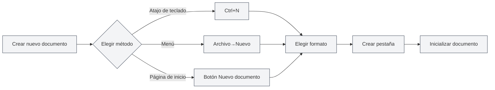
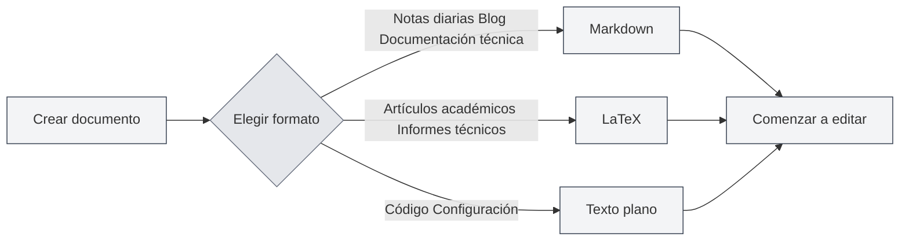
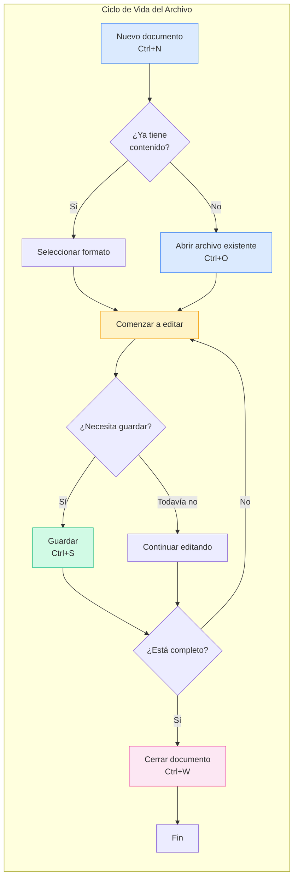

# Operaciones con Archivos

## Descripción General

Las operaciones con archivos son una función fundamental de MetaDoc. Ya sea que esté redactando documentación técnica, artículos académicos o tomando notas diarias, dominar las operaciones con archivos puede hacer que el proceso de creación sea más fluido. Este artículo detalla cómo crear, abrir, guardar y gestionar documentos.

## Nuevo Documento

<MainTabs mode="demo" />

<MenuItemsDemo mode="demo" :items='[{"id": "file", "items": ["new"]}]' />

### Crear un Documento en Blanco

MetaDoc ofrece varias formas convenientes de crear nuevos documentos. Puede elegir el método que mejor se adapte a sus hábitos de trabajo actuales:

**Método 1: Atajo de teclado (el más rápido)**

- Presione `Ctrl+N` para crear un nuevo documento inmediatamente.
- Ideal para crear rápidamente un nuevo documento mientras está editando.

**Método 2: Menú Archivo**

- Haga clic en el icono "Archivo" en la barra de menú lateral.
- Seleccione "Nuevo" en el menú desplegable.

**Método 3: Entrada desde la Página de Inicio**

- Haga clic en el botón "Nuevo documento" en la página de inicio.
- Ideal para comenzar a crear justo después de abrir la aplicación.

A continuación se muestra la interfaz del menú Archivo, que incluye operaciones comunes como Nuevo, Abrir, Guardar, etc.:

<MenuItemsDemo mode="demo" :items='[{"id": "file", "items": ["new", "open", "save", "save-as", "save-all", "close"]}]' />

<MainTabs mode="demo" />

**Estado después de crear un documento**:

Después de crear un nuevo documento, verá:

- Una nueva pestaña aparecerá en la parte superior, con el título mostrando "Sin título".
- El sistema le pedirá que elija un formato de documento (Markdown, LaTeX o texto plano).
- En este momento, el documento solo está en memoria; debe guardarlo para conservarlo en el disco.

### Seleccionar el Formato del Documento

Al crear un documento, debe seleccionar un formato. Diferentes formatos son adecuados para diferentes escenarios:

**Markdown (.md)** — El formato ligero más común

- Adecuado para: Notas diarias, entradas de blog, documentación técnica, documentación de proyectos.
- Ventajas: Sintaxis simple, fácil de leer, rica variedad de formatos de exportación.
- Ejemplo de uso: Tomar apuntes de reuniones, escribir un blog técnico, organizar notas de estudio.

**LaTeX (.tex)** — Formato profesional para composición tipográfica académica

- Adecuado para: Artículos académicos, tesis, informes técnicos, documentos matemáticos.
- Ventajas: Composición tipográfica exquisita, soporte completo para fórmulas, generación automática de índices y referencias.
- Ejemplo de uso: Redactar un artículo de investigación, escribir un libro de texto de matemáticas, preparar una presentación académica.

**Texto plano (.txt)** — El formato de texto más simple

- Adecuado para: Fragmentos de código, archivos de configuración, notas temporales.
- Ventajas: Alta compatibilidad, se puede abrir con cualquier editor.
- Ejemplo de uso: Guardar fragmentos de código, registrar información temporal.

## Abrir Documento

<MenuItemsDemo mode="demo" :items='[{"id": "file", "items": ["open"]}]' />

### Abrir un Archivo Existente

1. **Método con atajo de teclado**: Presione `Ctrl+O` para abrir el cuadro de diálogo de selección de archivos.
2. **Método desde el menú**: Haga clic en "Archivo" → "Abrir".
3. **Método desde la página de inicio**: Haga clic en el botón "Abrir archivo" en la página de inicio.

### Formatos de Archivo Soportados

MetaDoc puede abrir archivos en los siguientes formatos:

- `.md` - Documentos Markdown
- `.tex` - Documentos LaTeX
- `.txt` - Archivos de texto plano
- `.json` - Archivos en formato JSON

### Lista de Archivos Recientes

La página de inicio muestra una lista de documentos abiertos recientemente, facilitando el acceso rápido:

- Haga clic en la tarjeta de un documento reciente para abrirlo rápidamente.
- Haga clic derecho para eliminar un registro de documento reciente.
- Se muestran un máximo de 12 documentos recientes.

### Asociación de Archivos

MetaDoc admite la asociación de archivos:

- Al hacer doble clic en un archivo `.md` o `.tex` en el sistema, se abrirá automáticamente con MetaDoc.
- Si el archivo ya está abierto en otra ventana, se le notificará que el archivo ya está abierto en otra ventana.

## Guardar Documento

<MenuItemsDemo mode="demo" :items='[{"id": "file", "items": ["save", "save-as", "save-all"]}]' />

### Guardar el Documento Actual

Cultivar el buen hábito de guardar con frecuencia puede evitar la pérdida de trabajo debido a imprevistos.

**Métodos para guardar**:

- **Atajo de teclado** (recomendado): `Ctrl+S` — El método más común, manteniendo las manos en el teclado.
- **Operación desde el menú**: Haga clic en el menú "Archivo" → "Guardar".

**Primer guardado**:
Si el documento es nuevo, la primera vez que lo guarde aparecerá el cuadro de diálogo "Guardar como". Necesitará:

1. Seleccionar la ubicación de guardado (por ejemplo, la carpeta "Documentos").
2. Ingresar un nombre de archivo (por ejemplo, "plan_proyecto.md").
3. Hacer clic en el botón "Guardar".

**Guardado de actualizaciones para documentos ya guardados**:
Si el documento se ha guardado previamente, presionar `Ctrl+S` sobrescribirá directamente el archivo original sin mostrar un cuadro de diálogo.

### Guardar Como — Crear una Copia del Documento

Utilice la función "Guardar como" cuando necesite crear una nueva versión mientras conserva el documento original.

**Casos de uso**:

- Crear una copia de respaldo antes de modificar un documento.
- Guardar el documento en una ubicación diferente.
- Guardar diferentes versiones del documento con nombres distintos.

**Métodos de operación**:

- **Atajo de teclado**: `Ctrl+Shift+S`
- **Menú**: Haga clic en "Archivo" → "Guardar como"

**Ejemplo**:
Está editando "informe_v1.md" y desea guardar una copia de respaldo antes de realizar modificaciones importantes:

1. Presione `Ctrl+Shift+S`.
2. Ingrese el nuevo nombre de archivo "informe_v1_respaldo.md".
3. Haga clic en Guardar.
4. Continúe editando el documento original y modifique con tranquilidad.

### Guardar Todo — Guardar Todos los Documentos de una Vez

Cuando tiene varios documentos abiertos simultáneamente, puede usar la función "Guardar todo" para guardarlos todos de una vez.

**Métodos de operación**:

- **Atajo de teclado**: `Ctrl+K S` (presione primero `Ctrl+K`, luego `S`).
- **Menú**: Haga clic en "Archivo" → "Guardar todo".

**Casos de uso**:

- Guardar rápidamente todos los documentos abiertos al finalizar el trabajo.
- Asegurarse de que todos los cambios se hayan guardado.

### Guardado Automático — Dejar que el Sistema Guarde por Usted

MetaDoc admite la función de guardado automático, que puede guardar documentos automáticamente mientras usted se concentra en la creación.

**Método de configuración**:
Vaya a [[settings.basic|Configuración básica]], busque la opción "Guardado automático" y seleccione un intervalo de tiempo adecuado:

- **Desactivado**: Control manual del momento de guardado.
- **1 minuto**: Más seguro, pero aumenta la escritura en disco.
- **5 minutos**: Solución equilibrada (recomendado).
- **10 minutos/30 minutos/1 hora**: Adecuado para documentos largos, reduce la frecuencia de guardado.

**Cómo funciona**:

- El guardado automático se realiza en segundo plano de forma silenciosa, sin interrumpir su edición.
- Durante el guardado automático, el indicador "No guardado" en la pestaña desaparecerá.
- Puede guardar manualmente en cualquier momento (`Ctrl+S`), sin verse afectado por el guardado automático.

**Recomendaciones**:

- Para documentos importantes, se recomienda activar el guardado automático cada 5 minutos.
- Incluso con el guardado automático activado, aún se recomienda guardar manualmente en puntos clave (como al finalizar un capítulo).

## Cerrar Archivo

<MainTabs mode="demo" />

### Cerrar la Pestaña Actual

- **Atajo de teclado**: `Ctrl+W`
- **Hacer clic en el botón de cerrar de la pestaña**: Haga clic en el botón × a la derecha de la pestaña.

### Advertencia Antes de Cerrar

Si el documento tiene cambios no guardados, se le preguntará al cerrarlo:

- **Guardar**: Guardar los cambios y luego cerrar.
- **No guardar**: Descartar los cambios y cerrar directamente.
- **Cancelar**: Cancelar la operación de cierre.

### Reabrir una Pestaña Cerrada

- **Atajo de teclado**: `Ctrl+Shift+T`

Puede restaurar las pestañas cerradas recientemente (hasta 20).

## Gestión de Múltiples Pestañas

<MainTabs mode="demo" />

MetaDoc admite abrir múltiples documentos simultáneamente, cada uno mostrado en una pestaña independiente:

La barra de pestañas muestra todos los documentos abiertos y admite operaciones como cambiar, cerrar, arrastrar, etc.:

<MainTabs mode="demo" />

- **Cambiar de pestaña**: Use `Ctrl+Tab` para cambiar a la siguiente pestaña, `Ctrl+Shift+Tab` para cambiar a la anterior.
- **Ordenar arrastrando**: Arrastre una pestaña para reordenarlas.
- **Fijar pestaña**: Haga clic derecho en una pestaña y seleccione "Fijar". Las pestañas fijadas se muestran siempre a la izquierda y no se pueden cerrar.

Para más operaciones con pestañas, consulte [[core.multi-tab|Gestión de múltiples pestañas]].

## Indicador de Estado del Archivo

Las pestañas muestran el estado del documento:

- **No guardado**: Se muestra un punto (●) junto al título de la pestaña, indicando que hay cambios no guardados.
- **Guardado**: Sin marca especial.
- **Solo lectura**: Muestra un icono de candado, indicando que el archivo está en modo de solo lectura.

## Consideraciones

1. **Ruta del archivo**: Al guardar un archivo, asegúrese de tener suficiente espacio en disco y permisos de escritura.
2. **Formato del archivo**: Preste atención al elegir el formato de archivo adecuado al guardar, para evitar incompatibilidades de formato.
3. **Copia de seguridad**: Se recomienda realizar copias de seguridad periódicas de documentos importantes; puede usar la función "Guardar como" para crear copias.
4. **Conflicto de archivos**: Si un archivo es modificado externamente, MetaDoc lo detectará y le pedirá que maneje el conflicto.

## Documentación Relacionada

- [[core.editor-basics|Operaciones básicas del editor]]
- [[core.multi-tab|Gestión de múltiples pestañas]]
- [[core.document-metadata|Metadatos del documento]]
- [[core.export|Función de exportación]]
- [[settings.basic|Configuración básica]]