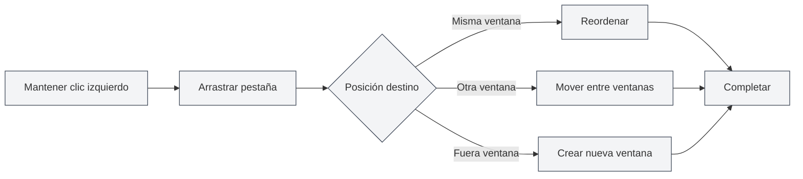

# Gestión de múltiples pestañas

## Descripción general

MetaDoc admite la gestión de múltiples pestañas, permitiéndole abrir varios documentos simultáneamente, cada uno mostrado en una pestaña independiente. Dominar las operaciones con pestañas puede mejorar significativamente su productividad.

La gestión de pestañas incluye funciones como crear, cambiar, cerrar, arrastrar para ordenar, fijar, entre otras, permitiéndole organizar y administrar múltiples documentos de manera flexible.

<MainTabs mode="demo" />

<AIChat mode="demo" />

<KnowledgeBase mode="demo" />

<ProofreadView mode="demo" />

<GraphWindow mode="demo" />

<OcrWindow mode="demo" />

<DataAnalysisWindow mode="demo" />

<AgentView mode="demo" />

<MenuItemsDemo mode="demo" :items='[{"id": "file", "items": ["new", "open", "save"]}]' />

<ViewMenuItemsDemo mode="demo" :items='["editor", "outline"]' />

<Outline mode="demo" />

<ResizableDivider mode="demo" />

<TitleMenu mode="demo" title="Ejemplo de pestañas" :position='{"top": 100, "left": 200}' path="1" :tree='{}' />

## Crear una nueva pestaña

### Crear una nueva pestaña

Existen varias formas de crear una nueva pestaña:

1.  **Atajo de teclado**: Presione `Ctrl+T` para crear rápidamente una nueva pestaña.
2.  **Hacer clic en el botón**: Haga clic en el botón "+" en el lado derecho de la barra de pestañas.
3.  **Menú**: Haga clic en "Archivo" → "Nuevo".

La barra de pestañas muestra todos los documentos abiertos y admite operaciones como crear, cambiar, cerrar, etc.:

<MainTabs mode="demo" />

La nueva pestaña abrirá un documento en blanco. Puede elegir el formato del documento (Markdown/LaTeX/Texto plano).

### Crear pestaña desde un archivo

Al abrir un archivo, se crea automáticamente una nueva pestaña:

1.  **Atajo de teclado**: Presione `Ctrl+O` para abrir el cuadro de diálogo de selección de archivos.
2.  **Menú**: Haga clic en "Archivo" → "Abrir".
3.  **Página de inicio**: Haga clic en el botón "Abrir archivo" en la página de inicio.

El archivo abierto se mostrará en una nueva pestaña.

## Cambiar entre pestañas

### Cambiar con atajos de teclado

-   **Pestaña siguiente**: `Ctrl+Tab` para cambiar a la siguiente pestaña.
-   **Pestaña anterior**: `Ctrl+Shift+Tab` para cambiar a la pestaña anterior.

El cambio es cíclico; al llegar a la última pestaña, volverá automáticamente a la primera.

### Cambiar con el ratón

-   **Hacer clic en la pestaña**: Haga clic directamente en el título de la pestaña para cambiar a ella.
-   **Rueda del ratón**: Desplazar la rueda del ratón sobre la barra de pestañas permite cambiar entre ellas.
    -   **Desplazar hacia abajo**: Cambia a la siguiente pestaña.
    -   **Desplazar hacia arriba**: Cambia a la pestaña anterior.

### Indicador de cambio de pestaña

Al usar atajos de teclado para cambiar de pestaña, se mostrará un indicador de cambio que muestra la pestaña actualmente seleccionada, facilitando la ubicación rápida.

## Cerrar pestañas

### Cerrar la pestaña actual

-   **Atajo de teclado**: `Ctrl+W` para cerrar la pestaña activa actualmente.
-   **Hacer clic en el botón de cerrar**: Haga clic en el botón × en el lado derecho de la pestaña.
-   **Clic con el botón central**: Haga clic con el botón central del ratón en la pestaña para cerrarla.

### Advertencia antes de cerrar

Si el documento en la pestaña tiene cambios no guardados, se le pedirá confirmación al cerrar:

-   **Guardar**: Guarda los cambios y luego cierra la pestaña.
-   **No guardar**: Descarta los cambios y cierra la pestaña directamente.
-   **Cancelar**: Cancela la operación de cierre y continúa editando.

### Reabrir pestañas cerradas

-   **Atajo de teclado**: `Ctrl+Shift+T` para reabrir la pestaña cerrada más recientemente.

El sistema guarda las últimas 20 pestañas cerradas. Puede restaurarlas en orden inverso al cierre.

## Arrastrar pestañas

### Reordenar

Puede arrastrar pestañas para cambiar su orden:

1.  **Mantener presionado el botón izquierdo del ratón**: Mantenga presionado el botón izquierdo sobre el título de la pestaña.
2.  **Arrastrar**: Arrastre la pestaña a la posición deseada.
3.  **Soltar**: Suelte el botón izquierdo del ratón para completar el ordenamiento.

Al arrastrar, habrá retroalimentación visual que muestra la posición de destino de la pestaña.

### Arrastrar entre ventanas

Las pestañas se pueden arrastrar a otras ventanas:

1.  **Arrastrar la pestaña**: Mantenga presionado el botón izquierdo y arrastre la pestaña.
2.  **Mover a otra ventana**: Arrastre la pestaña a otra ventana de MetaDoc.
3.  **Soltar**: Suelte el botón del ratón en la ventana de destino; la pestaña se moverá a esa ventana.

Arrastrar entre ventanas le permite organizar documentos de manera flexible entre múltiples ventanas.

### Crear una nueva ventana

Arrastrar una pestaña fuera de una ventana puede crear una nueva ventana:

1.  **Arrastrar la pestaña**: Mantenga presionado el botón izquierdo y arrastre la pestaña.
2.  **Mover fuera de la ventana**: Arrastre la pestaña fuera de los límites de la ventana actual.
3.  **Soltar**: Suelte el botón del ratón; el sistema creará una nueva ventana y abrirá la pestaña en ella.

## Fijar pestañas

### Fijar una pestaña

Una pestaña fijada siempre se mostrará en el extremo izquierdo de la barra de pestañas y no se podrá cerrar:

-   **Doble clic en la pestaña**: Haga doble clic en el título de la pestaña para fijarla.
-   **Menú contextual**: Haga clic derecho en la pestaña y seleccione "Fijar".

Una pestaña fijada:
-   Se muestra en el extremo izquierdo de la barra de pestañas.
-   Muestra un icono de candado.
-   No se puede cerrar mediante los métodos habituales.
-   No se puede arrastrar para cambiar su posición.

### Desfijar una pestaña

-   **Menú contextual**: Haga clic derecho en la pestaña fijada y seleccione "Desfijar".

Una vez desfijada, la pestaña recupera su estado normal de poder cerrarse y arrastrarse.

## Estado de las pestañas

### Estado no guardado

Las pestañas muestran el estado de guardado del documento:

-   **No guardado**: Se muestra un punto (●) junto al título de la pestaña, indicando que hay cambios sin guardar.
-   **Guardado**: No hay marca especial.

### Estado de solo lectura

Si un documento es de solo lectura, la pestaña mostrará un icono de candado:

-   **Documento de solo lectura**: Muestra un icono de candado, indicando que el documento no es editable.
-   **Documento editable**: No hay marca especial.

### Estado de vista previa

Las pestañas en estado de vista previa:

-   **Modo vista previa**: Los archivos abiertos con un solo clic se muestran en modo de vista previa.
-   **Activar con doble clic**: Haga doble clic en la pestaña de vista previa para activarla como una pestaña formal.
-   **Activación automática**: Se activa automáticamente después de editar o cambiar la vista.

## Menú contextual de la pestaña

Al hacer clic derecho en una pestaña, se muestra un menú contextual que ofrece las siguientes operaciones:

-   **Cerrar**: Cierra la pestaña actual.
-   **Cerrar otras**: Cierra todas las pestañas excepto la actual.
-   **Cerrar a la derecha**: Cierra todas las pestañas a la derecha de la actual.
-   **Fijar/Desfijar**: Fija o desfija la pestaña.
-   **Mover a nueva ventana**: Mueve la pestaña a una nueva ventana.
-   **Copiar ruta**: Copia la ruta del documento al portapapeles.

## Límite de cantidad de pestañas

MetaDoc no tiene un límite estricto para la cantidad de pestañas abiertas simultáneamente, pero se recomienda:

-   **Cantidad razonable**: Es razonable tener entre 10 y 20 pestañas abiertas a la vez.
-   **Impacto en el rendimiento**: Abrir demasiadas pestañas puede afectar el rendimiento de la aplicación.
-   **Uso de memoria**: Cada pestaña consume cierta cantidad de memoria.

Si hay demasiadas pestañas, se recomienda cerrar las que no sean necesarias.

## Referencia de atajos de teclado

### Atajos de teclado para operaciones con pestañas

| Operación               | Windows/Linux    | macOS           |
| ----------------------- | ---------------- | --------------- |
| Nueva pestaña           | `Ctrl+T`         | `Cmd+T`         |
| Cerrar pestaña          | `Ctrl+W`         | `Cmd+W`         |
| Cambiar a la siguiente  | `Ctrl+Tab`       | `Cmd+Tab`       |
| Cambiar a la anterior   | `Ctrl+Shift+Tab` | `Cmd+Shift+Tab` |
| Reabrir pestaña cerrada | `Ctrl+Shift+T`   | `Cmd+Shift+T`   |

### Operaciones con el ratón

| Operación       | Método                               |
| --------------- | ------------------------------------ |
| Cambiar pestaña | Hacer clic en el título de la pestaña |
| Cerrar pestaña  | Hacer clic en el botón × o clic central |
| Fijar pestaña   | Doble clic en el título de la pestaña |
| Arrastrar para ordenar | Mantener presionado el botón izquierdo y arrastrar |
| Cambiar con rueda | Desplazar la rueda del ratón sobre la barra de pestañas |

## Consejos de uso

### Organizar pestañas

1.  **Fijar documentos frecuentes**: Fije los documentos que use con frecuencia para un acceso rápido.
2.  **Agrupar por proyecto**: Coloque documentos relacionados juntos y organícelos arrastrando para ordenar.
3.  **Usar múltiples ventanas**: Coloque documentos de diferentes proyectos en ventanas distintas.

### Cambio rápido

1.  **Usar atajos de teclado**: Domine el uso de `Ctrl+Tab` para cambiar rápidamente entre pestañas.
2.  **Usar la rueda del ratón**: Desplace la rueda del ratón sobre la barra de pestañas para navegar rápidamente.
3.  **Usar el indicador de cambio**: Al usar atajos de teclado, se muestra el indicador de cambio para facilitar la ubicación.

### Operaciones por lotes

1.  **Cerrar múltiples pestañas**: Use las funciones "Cerrar otras" o "Cerrar a la derecha" del menú contextual.
2.  **Guardar todas las pestañas**: Use `Ctrl+K S` para guardar todos los documentos abiertos.
3.  **Reabrir**: Use `Ctrl+Shift+T` para restaurar rápidamente pestañas cerradas.

## Preguntas frecuentes

### P: ¿Cómo encontrar rápidamente una pestaña específica?

R: Use el atajo de teclado `Ctrl+Tab`. Se mostrará el indicador de cambio con todas las pestañas. Puede seguir presionando Tab para seleccionar o hacer clic directamente.

### P: ¿Qué hacer si hay demasiadas pestañas?

R: Puede fijar las pestañas más usadas, cerrar las que no necesite o usar múltiples ventanas para agrupar los documentos.

### P: ¿Cómo recuperar una pestaña cerrada por error?

R: Use el atajo de teclado `Ctrl+Shift+T` para reabrir la pestaña cerrada más recientemente.

### P: ¿Se puede cerrar una pestaña fijada?

R: Una pestaña fijada no se puede cerrar mediante los métodos habituales; primero debe desfijarse. Haga clic derecho en la pestaña fijada y seleccione "Desfijar".

### P: ¿Se puede arrastrar una pestaña entre ventanas?

R: Sí. Arrastre la pestaña a otra ventana de MetaDoc para moverla a esa ventana.

## Documentación relacionada

-   [[core.file-operations|Operaciones con archivos]]
-   [[core.multi-window|Gestión de múltiples ventanas]]
-   [[core.editor-basics|Operaciones básicas del editor]]
