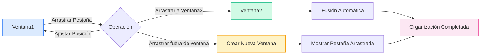

# Gestión de Ventanas Múltiples

## Descripción General

MetaDoc admite la gestión de ventanas múltiples, permitiéndole abrir diferentes documentos en distintas ventanas. A través de esta gestión, puede ver y editar múltiples documentos simultáneamente, mejorando la eficiencia del trabajo.

## Soporte de Ventanas Múltiples

### Tipos de Ventana

MetaDoc admite dos tipos de ventanas:

- **Ventana Principal**: Aloja funciones principales como la edición de documentos, la página de inicio, y admite la gestión de múltiples pestañas.
- **Ventana Auxiliar**: Ventanas de herramientas como configuración, chat de IA, OCR, etc. Son ventanas de instancia única.

### Características de las Ventanas

Características de la ventana principal:

- **Múltiples Pestañas**: Cada ventana tiene su propia lista de pestañas.
- **Estado Independiente**: Cada ventana mantiene un estado de documento independiente.
- **Soporte para Arrastrar y Soltar**: Permite separar y fusionar pestañas mediante arrastre.
- **Grupo de Ventanas**: Pre-crea ventanas inactivas para lograr una visualización rápida.

## Crear una Nueva Ventana

### Creación por Arrastre

Puede crear una nueva ventana arrastrando una pestaña:

1. **Arrastrar la Pestaña**: Arrastre la pestaña más allá del borde de la ventana.
2. **Crear Ventana**: El sistema creará automáticamente una nueva ventana.
3. **Mostrar Contenido**: La nueva ventana mostrará el contenido de la pestaña arrastrada.

La barra de pestañas admite operaciones de arrastre, permitiendo crear una nueva ventana arrastrando una pestaña fuera de la ventana:

<MainTabs mode="demo" />

**Notas importantes**:

- Una ventana con una sola pestaña no puede crear una nueva ventana mediante arrastre.
- Al arrastrar, se obtiene automáticamente una ventana precargada del grupo de ventanas para una visualización rápida.

### Creación desde el Menú Contextual

Puede crear una nueva ventana mediante el menú contextual:

1. **Clic Derecho en la Pestaña**: Haga clic derecho en la pestaña que desea mover.
2. **Seleccionar Opción**: Elija "Abrir en una nueva ventana".
3. **Crear Ventana**: El sistema creará una nueva ventana y moverá la pestaña.

### Mecanismo del Grupo de Ventanas

MetaDoc utiliza un mecanismo de grupo de ventanas para optimizar la creación:

- **Ventanas Precargadas**: El sistema pre-crea 2 ventanas inactivas.
- **Visualización Rápida**: Usar una ventana precargada permite una visualización instantánea (<100ms).
- **Reabastecimiento Automático**: Después de su uso, se agrega automáticamente una nueva ventana al grupo.

## Arrastre de Pestañas entre Ventanas

### Fusión por Arrastre

Puede arrastrar una pestaña de una ventana a otra para lograr una organización flexible de ventanas:

**Pasos de la operación**:

1. **Arrastrar la Pestaña**: Arrastre la pestaña en la ventana de origen.
2. **Arrastrar a la Ventana Destino**: Lleve la pestaña a la barra de pestañas de la ventana destino.
3. **Fusión Automática**: La pestaña se agregará automáticamente a la ventana destino.

### Posición del Arrastre

Al arrastrar, puede especificar la posición de inserción:

- **Posicionamiento Automático**: La posición de inserción se determina automáticamente según la ubicación del cursor.
- **Posición Específica**: Puede arrastrar a una posición específica para insertar.
- **Inserción al Final**: Arrastrar al final insertará la pestaña en esa posición.

### Fusión de Ventanas con una Sola Pestaña

Si la ventana de origen tiene solo una pestaña:

- **Fusión Automática**: Al arrastrarla a otra ventana, se fusionará automáticamente.
- **Cierre de Ventana**: La ventana de origen se cerrará automáticamente después de la fusión.
- **Evitar Ventanas Vacías**: Previene la aparición de ventanas sin contenido.

## Gestión de Ventanas

### Cambio entre Ventanas

Puede usar atajos de teclado del sistema para cambiar entre ventanas:

- **Alt+Tab** (Windows/Linux): Cambiar de ventana.
- **Cmd+Tab** (macOS): Cambiar de ventana.

### Estado de la Ventana

Cada ventana tiene un estado independiente:

- **Lista de Pestañas**: Cada ventana tiene su propia lista de pestañas.
- **Estado del Documento**: Cada ventana mantiene un estado de documento independiente.
- **Estado de Vista**: Cada ventana tiene un estado de vista independiente.

### Cierre de Ventanas

Formas de cerrar una ventana:

- **Botón de Cerrar**: Haga clic en el botón de cerrar de la ventana.
- **Atajo de Teclado**: Use el atajo de teclado del sistema para cerrar la ventana.
- **Opción de Menú**: Cierre la ventana a través del menú.

**Notas importantes**:

- Se le pedirá que guarde los documentos no guardados antes de cerrar una ventana.
- Las ventanas auxiliares se ocultan en lugar de cerrarse completamente.

## Sincronización de Ventanas

### Sincronización de Estado

Algunos estados se sincronizan entre ventanas:

- **Configuración de Idioma**: Los cambios de idioma se sincronizan en todas las ventanas.
- **Configuración de Tema**: Los cambios de tema se sincronizan en todas las ventanas.
- **Configuración del Sistema**: La configuración del sistema se sincroniza en todas las ventanas.

### Asociación de Archivos

Funcionalidad de asociación de archivos:

- **Prevenir Duplicados**: El mismo archivo no se abrirá simultáneamente en múltiples ventanas.
- **Localización de Ventana**: Si un archivo ya está abierto en otra ventana, se le notificará y se ubicará esa ventana.
- **Bloqueo de Archivo**: Los archivos se bloquean temporalmente durante la transferencia para evitar conflictos.

## Mejores Prácticas

1. **División de Pantalla Racional**: Use múltiples ventanas para editar en pantallas divididas y mejorar la eficiencia.
2. **Organización de Ventanas**: Coloque documentos relacionados en la misma ventana y separe los no relacionados.
3. **Gestión de Pestañas**: Use el arrastre de pestañas de manera racional para organizar el diseño de las ventanas.
4. **Cambio entre Ventanas**: Domine el uso de Alt+Tab para cambiar rápidamente entre ventanas.
5. **Guardado de Estado**: Asegúrese de guardar documentos importantes antes de cerrar una ventana.

## Notas Importantes

1. **Número de Ventanas**: Demasiadas ventanas pueden afectar el rendimiento; se recomienda controlar su número racionalmente.
2. **Bloqueo de Archivos**: Los archivos se bloquean temporalmente durante la transferencia para evitar conflictos.
3. **Estado Independiente**: El estado de cada ventana es independiente y no se afectan mutuamente.
4. **Grupo de Ventanas**: El mecanismo del grupo de ventanas se gestiona automáticamente, no requiere intervención manual.
5. **Ventanas Auxiliares**: Las ventanas auxiliares son de instancia única y se ocultan al cerrarse.

## Documentación Relacionada

- [[core.multi-tab|Gestión de Múltiples Pestañas]]
- [[core.file-operations|Operaciones con Archivos]]

<ViewMenuItemsDemo mode="demo" :items='["home", "outline"]' />

<ViewMenuItemsDemo mode="demo" :items='["chat", "agent"]' />

<MenuItemsDemo mode="demo" :items='[{"id": "file"}]' />

<MenuItemsDemo mode="demo" :items='[{"id": "edit"}]' />

<MenuItemsDemo mode="demo" :items='[{"id": "view"}]' />

<LeftMenu mode="demo" />
