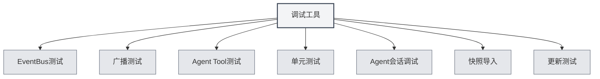

# Herramientas de Depuración

## Descripción General

Las herramientas de depuración son una funcionalidad del entorno de desarrollo proporcionada por MetaDoc, utilizadas para probar y depurar las funciones de la aplicación. Estas herramientas solo están disponibles en el entorno de desarrollo y ayudan a los desarrolladores a probar y depurar código rápidamente.

<SettingDebugSection mode="demo" />

## Introducción a las Herramientas de Depuración

<SettingDebugSection mode="demo" />

<ConsoleTerminal mode="demo" consoleKey="debug" :history='[]' />

### Acceder a las Herramientas de Depuración

Las herramientas de depuración solo están disponibles en el entorno de desarrollo:

1.  **Entorno de desarrollo**: Asegúrate de estar ejecutando en el entorno de desarrollo.
2.  **Página de configuración**: Abre la página de configuración.
3.  **Herramientas de depuración**: Encuentra la opción "Herramientas de depuración" en la página de configuración.
4.  **Abrir herramientas**: Haz clic para abrir la interfaz de las herramientas de depuración.

Puedes acceder a las herramientas de depuración a través de la barra de menú superior (solo en entorno de desarrollo):

<MenuItemsDemo mode="demo" :items='[{"id": "settings"}]' />

### Tipos de Herramientas

Las herramientas de depuración incluyen los siguientes módulos funcionales:

-   **Prueba de EventBus**: Probar eventos del EventBus.
-   **Prueba de difusión**: Probar eventos de difusión (broadcast).
-   **Prueba de Herramientas de Agente**: Probar herramientas del Agente.
-   **Pruebas unitarias**: Ejecutar pruebas unitarias.
-   **Depuración de sesión del Agente**: Depurar sesiones del Agente.
-   **Importación de instantáneas**: Importar instantáneas de documentos.
-   **Prueba de actualización**: Probar la funcionalidad de actualización.

<SettingDebugSection mode="demo" />

## Prueba de EventBus

### Enviar Evento

Puedes enviar eventos del EventBus para probarlos:

1.  **Nombre del evento**: Introduce el nombre del evento a enviar.
2.  **Datos del evento**: Opcional, introduce los datos del evento en formato JSON.
3.  **Enviar evento**: Haz clic en el botón "Enviar evento".
4.  **Ver resultado**: Consulta el resultado del envío del evento.

<ConsoleTerminal mode="demo" consoleKey="debug" :history='[]' />

### Escuchar Eventos

Puedes escuchar eventos del EventBus:

-   **Lista de eventos**: Muestra todos los eventos enviados.
-   **Detalles del evento**: Consulta la información detallada del evento.
-   **Datos del evento**: Consulta el contenido de los datos del evento.

## Prueba de Difusión

### Enviar Difusión

Puedes enviar eventos de difusión (broadcast) para probarlos:

1.  **Ventana de destino**: Selecciona el objetivo de la difusión (all/home/ai-chat, etc.).
2.  **Nombre del evento**: Introduce el nombre del evento a difundir.
3.  **Datos del evento**: Opcional, introduce los datos del evento en formato JSON.
4.  **Enviar difusión**: Haz clic en el botón "Enviar difusión".
5.  **Ver resultado**: Consulta el resultado del envío de la difusión.

<ConsoleTerminal mode="demo" consoleKey="debug" :history='[]' />

### Escuchar Difusiones

Puedes escuchar eventos de difusión:

-   **Lista de difusiones**: Muestra todas las difusiones enviadas.
-   **Detalles de la difusión**: Consulta la información detallada de la difusión.
-   **Ventana de destino**: Consulta la ventana objetivo de la difusión.

## Prueba de Herramientas de Agente

### Probar Herramienta

Puedes probar herramientas del Agente:

1.  **Seleccionar herramienta**: Selecciona la herramienta del Agente a probar.
2.  **Introducir parámetros**: Introduce los parámetros de prueba de la herramienta (formato JSON).
3.  **Seleccionar contexto**: Selecciona el ID de la pestaña (Tab ID) del contexto para la prueba.
4.  **Ejecutar prueba**: Haz clic en el botón "Ejecutar prueba".
5.  **Ver resultado**: Consulta el resultado de la prueba.

### Historial de Pruebas

Puedes consultar el historial de pruebas:

-   **Lista del historial**: Muestra todo el historial de pruebas.
-   **Resultado de la prueba**: Consulta el resultado de cada prueba.
-   **Información de error**: Consulta los mensajes de error de las pruebas.

## Pruebas Unitarias

### Prueba Individual

Puedes ejecutar una prueba unitaria individual:

1.  **Seleccionar módulo**: Selecciona el módulo a probar.
2.  **Seleccionar prueba**: Selecciona la función de prueba a ejecutar.
3.  **Editar parámetros**: Edita los parámetros de la función de prueba.
4.  **Ejecutar prueba**: Haz clic en el botón "Ejecutar prueba".
5.  **Ver resultado**: Consulta el resultado de la prueba.

<ConsoleTerminal mode="demo" consoleKey="debug" :history='[]' />

### Pruebas por Lotes

Puedes ejecutar pruebas unitarias por lotes:

1.  **Seleccionar módulo**: Selecciona uno o varios módulos.
2.  **Seleccionar contexto**: Selecciona el ID de la pestaña (Tab ID) del contexto para la prueba.
3.  **Iniciar prueba**: Haz clic en el botón "Iniciar pruebas por lotes".
4.  **Ver progreso**: Consulta el progreso de las pruebas.
5.  **Ver resultados**: Consulta todos los resultados de las pruebas.

### Resultados de la Prueba

Los resultados de la prueba incluyen:

-   **Estado de la prueba**: Indica si la prueba fue exitosa o no.
-   **Salida de la prueba**: Muestra la información de salida de la prueba.
-   **Información de error**: Muestra los mensajes de error de la prueba (si los hay).
-   **Tiempo de ejecución**: Muestra el tiempo de ejecución de la prueba.

## Depuración de Sesión del Agente

### Depurar Sesión

Puedes depurar sesiones del Agente:

1.  **Seleccionar sesión**: Selecciona la sesión del Agente a depurar.
2.  **Ver mensajes**: Consulta el historial de mensajes de la sesión.
3.  **Enviar mensaje**: Envía un mensaje de prueba.
4.  **Ver respuesta**: Consulta la respuesta del Agente.

<ConsoleTerminal mode="demo" consoleKey="debug" :history='[]' />

### Información de Depuración

Puedes consultar la información de depuración:

-   **Estado de la sesión**: Muestra el estado actual de la sesión.
-   **Llamadas a herramientas**: Consulta el historial de llamadas a herramientas.
-   **Información de error**: Consulta los mensajes de error.

## Importación de Instantáneas

### Importar Instantánea

Puedes importar instantáneas de documentos:

1.  **Seleccionar instantánea**: Selecciona el archivo de instantánea a importar.
2.  **Importar instantánea**: Haz clic en el botón "Importar instantánea".
3.  **Ver resultado**: Consulta el resultado de la importación.

<ConsoleTerminal mode="demo" consoleKey="debug" :history='[]' />

### Formato de la Instantánea

Formato del archivo de instantánea:

-   **Formato JSON**: El archivo de instantánea está en formato JSON.
-   **Contenido del documento**: Contiene el contenido completo del documento.
-   **Estado del documento**: Contiene la información del estado del documento.

## Prueba de Actualización

### Probar Actualización

Puedes probar la funcionalidad de actualización:

1.  **Seleccionar canal de actualización**: Selecciona el canal de actualización (release/dev).
2.  **Comprobar actualizaciones**: Haz clic en el botón "Comprobar actualizaciones".
3.  **Ver resultado**: Consulta el resultado de la comprobación de actualizaciones.

<SettingDebugSection mode="demo" />

## Mejores Prácticas

1.  **Entorno de desarrollo**: Utiliza las herramientas de depuración solo en el entorno de desarrollo.
2.  **Aislamiento de pruebas**: Utiliza datos de prueba independientes durante las pruebas.
3.  **Manejo de errores**: Presta atención al manejo de errores durante las pruebas.
4.  **Registro de resultados**: Registra los resultados de prueba importantes.
5.  **Uso de herramientas**: Utiliza las herramientas de depuración de manera adecuada para mejorar la eficiencia del desarrollo.

## Consideraciones

1.  **Entorno de desarrollo**: Las herramientas de depuración solo están disponibles en el entorno de desarrollo.
2.  **Seguridad de datos**: Presta atención a la seguridad de los datos durante las pruebas, evitando afectar los datos de producción.
3.  **Impacto en el rendimiento**: Algunas pruebas pueden afectar el rendimiento de la aplicación.
4.  **Manejo de errores**: Los errores durante las pruebas deben manejarse correctamente.
5.  **Limitaciones de las herramientas**: Algunas herramientas pueden tener limitaciones de uso.

## Documentación Relacionada

-   [[agent.session|Gestión de sesiones del Agente]]
-   [[agent.tools|Gestión del conjunto de herramientas]]
-   [[settings.basic|Configuración básica]]
