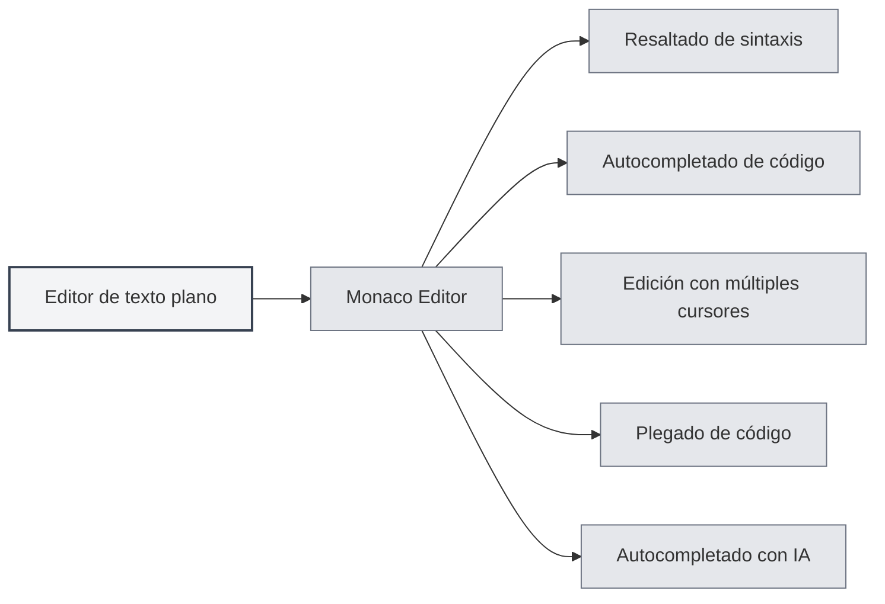
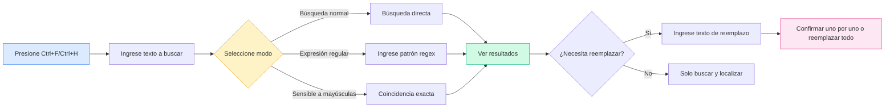

# Editor de texto plano

## Descripción general

El editor de texto plano se utiliza para editar archivos de texto plano y archivos de código. El editor de texto plano de MetaDoc está basado en Monaco Editor, ofreciendo una experiencia de edición de código profesional con funciones como resaltado de sintaxis, autocompletado de código, autocompletado con IA, entre otras.

El editor de texto plano admite múltiples formatos de archivo, incluyendo archivos de código (`.js`, `.py`, `.java`, etc.) y archivos de configuración (`.json`, `.yaml`, `.ini`, etc.), reconociendo automáticamente el lenguaje según la extensión del archivo y aplicando el resaltado de sintaxis correspondiente.

## Funciones del editor Monaco

<LaTeXEditorDemo mode="demo" />

<SearchReplaceMenu mode="demo" :position='{"top": 100, "left": 200}' :adapter='null' />

<MenuItemsDemo mode="demo" :items='[{"id": "file"}]' />

<ViewMenuItemsDemo mode="demo" :items='["editor", "outline"]' />

### Introducción al editor

El editor de texto plano utiliza Monaco Editor, que presenta las siguientes características:

- **Edición de código profesional**: Ofrece una experiencia de edición similar a Visual Studio Code.
- **Resaltado de sintaxis**: Aplica automáticamente resaltado de sintaxis según el tipo de archivo.
- **Autocompletado de código**: Admite autocompletado de código inteligente.
- **Edición con múltiples cursores**: Permite editar simultáneamente con múltiples cursores.
- **Plegado de código**: Admite el plegado de bloques de código.

### Formatos de archivo admitidos

El editor de texto plano admite los siguientes formatos de archivo:

**Archivos de código**:

- JavaScript/TypeScript: `.js`, `.jsx`, `.ts`, `.tsx`
- Python: `.py`
- Java: `.java`
- C/C++: `.c`, `.cpp`, `.h`, `.hpp`
- C#: `.cs`
- Go: `.go`
- Rust: `.rs`
- Swift: `.swift`
- Kotlin: `.kt`
- Otros: `.php`, `.rb`, `.scala`, `.dart`, `.lua`, etc.

**Archivos de configuración**:

- JSON: `.json`
- YAML: `.yaml`, `.yml`
- XML: `.xml`
- TOML: `.toml`
- INI: `.ini`, `.conf`
- SQL: `.sql`

**Archivos de script**:

- Shell: `.sh`, `.bash`, `.zsh`
- PowerShell: `.ps1`
- Otros: `.vim`, `.diff`, `.patch`, `.log`

### Reconocimiento automático de lenguaje

El editor reconoce automáticamente el lenguaje según la extensión del archivo:

- **Extensión del archivo**: Selecciona el modo de lenguaje correspondiente según la extensión.
- **Resaltado de sintaxis**: Aplica automáticamente las reglas de resaltado de sintaxis apropiadas.
- **Autocompletado de código**: Habilita la función de autocompletado para el lenguaje correspondiente.

Si el archivo no tiene extensión o la extensión no es reconocida, el editor usará el modo de texto plano.

## Resaltado de código

### Resaltado de sintaxis

El editor aplica automáticamente resaltado de sintaxis según el tipo de archivo:

- **Resaltado de palabras clave**: Las palabras clave del lenguaje se muestran en colores diferentes.
- **Resaltado de cadenas**: Las cadenas de texto se muestran en un color específico.
- **Resaltado de comentarios**: Los comentarios se muestran en gris.
- **Resaltado de funciones**: Los nombres de funciones se muestran en un color específico.

El resaltado de sintaxis hace que la estructura del código sea más clara, facilitando su lectura y edición.

### Sincronización de temas

El tema de resaltado de código sigue el tema del editor:

- **Tema claro**: Usa resaltado de sintaxis claro en el tema claro.
- **Tema oscuro**: Usa resaltado de sintaxis oscuro en el tema oscuro.
- **Sincronización automática**: Sincroniza automáticamente con la configuración del tema del editor.

## Visualización de números de línea

### Mostrar números de línea

Los números de línea se muestran en el lado izquierdo del editor, ayudándole a:

- **Localizar código**: Ir rápidamente a una línea específica.
- **Referenciar código**: Facilitar la referencia a líneas de código específicas en documentos.
- **Depurar código**: Localizar rápidamente la posición de errores.

### Configurar números de línea

La visualización de números de línea se puede configurar en los ajustes:

1. Abra la página de configuración.
2. En la sección "Configuración del editor", encuentre "Mostrar números de línea".
3. Active o desactive el interruptor para habilitar o deshabilitar los números de línea.

La configuración de números de línea afecta a todos los editores Monaco (editor de texto plano, editor LaTeX, etc.).

<MenuItemsDemo mode="demo" :items='[{"id": "file", "items": ["new", "open", "save"]}]' />

<ViewMenuItemsDemo mode="demo" :items='["editor", "outline"]' />

<MainTabs mode="demo" />

<AISuggestionGhost mode="demo" />

<LaTeXEditorDemo mode="demo" />

## Vista previa e información estadística del archivo

### Estadísticas del archivo

El editor muestra información estadística del archivo:

- **Recuento de caracteres**: Muestra el número total de caracteres del archivo.
- **Recuento de líneas**: Muestra el número total de líneas del archivo.
- **Recuento de palabras**: Muestra el número total de palabras del archivo (si es aplicable).

La información estadística se muestra en la barra de estado o en la parte inferior del editor.

### Vista previa del archivo

Al abrir un archivo, el editor:

- **Carga el contenido**: Carga rápidamente el contenido del archivo.
- **Aplica resaltado**: Aplica resaltado de sintaxis según el tipo de archivo.
- **Muestra estadísticas**: Muestra la información estadística del archivo.

### Detección del formato del archivo

El editor detecta automáticamente el formato del archivo:

- **Detección por extensión**: Identifica el formato según la extensión del archivo.
- **Detección por contenido**: Si la extensión no es clara, intenta identificar el formato basándose en el contenido.
- **Selección manual**: Se puede seleccionar manualmente el formato del archivo.

## Función de autocompletado con IA

### Autocompletado automático con IA

El editor de texto plano admite la función de autocompletado automático con IA:

- **Activación automática**: Se activa automáticamente después de dejar de escribir.
- **Activación manual**: Use `Shift+Tab` para activar manualmente el autocompletado.
- **Autocompletado inteligente**: Genera sugerencias de autocompletado basadas en el contexto.

La función de autocompletado con IA puede ayudarle a:

- **Generar código**: Generar código basado en comentarios o contexto.
- **Completar funciones**: Completar definiciones o llamadas de funciones.
- **Generar comentarios**: Generar comentarios para el código.

### Configuración del autocompletado

La configuración del autocompletado con IA es la misma que para el editor Markdown:

- **Habilitar/Deshabilitar**: Se puede habilitar o deshabilitar en la configuración.
- **Teclas de activación**: Se pueden configurar las teclas de activación (Enter, Espacio, `;`, `,`).
- **Modo de autocompletado**: Se puede elegir entre generación completa o parcial.
- **Número máximo de tokens**: Se puede establecer el número máximo de tokens para el autocompletado.

Consulte [[ai.completion|Autocompletado automático con IA]] para más detalles.

## Funciones del editor

### Plegado de código

El editor admite el plegado de bloques de código:

- **Plegar bloques de código**: Haga clic en el icono de plegado a la izquierda del número de línea.
- **Expandir bloques de código**: Haga clic en la marca de plegado para expandir.
- **Atajos de teclado**: `Ctrl+Shift+[` para plegar, `Ctrl+Shift+]` para expandir.

El plegado de código le permite concentrarse en la parte que está editando actualmente.

### Buscar y reemplazar

El editor admite una potente función de buscar y reemplazar, que le ayuda a localizar y modificar contenido rápidamente en el código:

**Operaciones básicas**:

- **Buscar**: `Ctrl+F` abre el cuadro de diálogo de búsqueda, ingrese el texto a buscar.
- **Reemplazar**: `Ctrl+H` abre el cuadro de diálogo de buscar y reemplazar, ingrese el texto a buscar y el texto de reemplazo.
- **Reemplazar uno por uno**: Reemplazar después de confirmar individualmente.
- **Reemplazar todo**: Reemplazar todas las coincidencias de una vez.

**Opciones avanzadas**:

- **Expresiones regulares**: Usar expresiones regulares para coincidencias de patrones complejos.
- **Coincidir mayúsculas/minúsculas**: Distinguir entre mayúsculas y minúsculas en la búsqueda.
- **Coincidir palabra completa**: Coincidir solo palabras completas.

**Casos de uso**:

- Modificar nombres de variables en lote.
- Buscar llamadas a funciones específicas.
- Reemplazar cadenas en el código.
- Realizar reemplazos complejos usando expresiones regulares.

La interfaz del panel de buscar y reemplazar es la siguiente:

<SearchReplaceMenu mode="demo" :position='{"top": 100, "left": 200}' :adapter='null' />

### Edición con múltiples cursores

El editor admite la edición simultánea con múltiples cursores:

- **Añadir cursor**: `Alt+clic` añade un nuevo cursor en la posición del clic.
- **Añadir cursor arriba**: `Ctrl+Alt+↑` añade un cursor en la línea de arriba.
- **Añadir cursor abajo**: `Ctrl+Alt+↓` añade un cursor en la línea de abajo.
- **Seleccionar palabra igual**: `Ctrl+D` selecciona la siguiente palabra idéntica.

La edición con múltiples cursores permite modificar varias posiciones simultáneamente, mejorando la eficiencia de edición.

## Consejos de uso

<LaTeXEditorDemo mode="demo" />

<ConsoleTerminal mode="demo" consoleKey="plaintext" :history='[]' />

### Edición eficiente

1. **Usar atajos de teclado**: Domine los atajos de teclado comunes para mejorar la eficiencia de edición.
2. **Usar plegado de código**: Plegue los bloques de código que no necesita ver.
3. **Usar múltiples cursores**: Use múltiples cursores para editar varias posiciones a la vez.

### Autocompletado de código

1. **Habilitar autocompletado con IA**: Habilite la función de autocompletado con IA para obtener sugerencias inteligentes.
2. **Usar activación manual**: Use `Shift+Tab` para activar manualmente el autocompletado cuando sea necesario.
3. **Ajustar configuración**: Ajuste la configuración de autocompletado según sus necesidades.

### Gestión de archivos

1. **Identificar formato**: Asegúrese de que la extensión del archivo sea correcta para que el formato se reconozca automáticamente.
2. **Ver estadísticas**: Consulte la información estadística del archivo para conocer su tamaño.
3. **Guardar archivo**: Guarde el archivo oportunamente para evitar perder cambios.

## Preguntas frecuentes

### P: ¿El resaltado de sintaxis es incorrecto?

R: Verifique que la extensión del archivo sea correcta. Si la extensión es incorrecta, el editor podría no reconocer el tipo de archivo. Puede seleccionar manualmente el formato del archivo.

### P: ¿El autocompletado de código no se muestra?

R: Asegúrese de que la función de autocompletado con IA esté habilitada. Algunos tipos de archivo pueden no admitir autocompletado de código.

### P: ¿Cómo cambiar el formato del archivo?

R: El formato del archivo se reconoce automáticamente según su extensión. Si necesita cambiarlo, puede renombrar el archivo o seleccionar manualmente el formato.

### P: ¿Los números de línea no se muestran?

R: Verifique si la opción "Mostrar números de línea" está habilitada en la configuración. La configuración de números de línea afecta a todos los editores Monaco.

### P: ¿El archivo es demasiado grande para editarlo?

R: Para archivos muy grandes, el editor podría limitar algunas funciones. Se recomienda usar un editor de texto especializado para manejar archivos extremadamente grandes.

## Documentación relacionada

- [[core.editor-basics|Operaciones básicas del editor]]
- [[core.editor-settings|Configuración del editor]]
- [[latex.editor|Guía de uso del editor LaTeX]]
- [[ai.completion|Autocompletado automático con IA]]