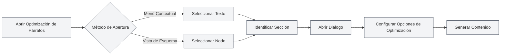

# Función de Optimización de Párrafos

## Descripción General

La función de optimización de párrafos le permite utilizar IA para optimizar párrafos o secciones específicas en un documento. Puede abrir la función de optimización de párrafos desde el menú contextual o desde la vista de esquema para generar u optimizar el contenido de un párrafo.

## Abrir la Optimización de Párrafos

### Abrir desde el Menú Contextual

Puede abrir la optimización de párrafos haciendo clic derecho en el editor:

1. **Seleccionar Texto**: Seleccione el texto que desea optimizar en el editor.
2. **Menú Contextual**: Haga clic derecho sobre el texto seleccionado.
3. **Seleccionar Optimizar**: En el menú contextual, elija "Optimizar párrafo" o una opción similar.
4. **Abrir Diálogo**: Se abrirá el cuadro de diálogo de optimización de párrafos.

### Abrir desde el Esquema

Puede abrir la optimización de párrafos desde la vista de esquema:

1. **Seleccionar Nodo**: Seleccione el nodo que desea optimizar en el árbol del esquema.
2. **Menú Contextual**: Haga clic derecho en el nodo.
3. **Seleccionar Optimizar**: En el menú contextual, elija "Optimizar párrafo" o una opción similar.
4. **Abrir Diálogo**: Se abrirá el cuadro de diálogo de optimización de párrafos.

Puede acceder a la vista de esquema a través de la barra lateral:

<ViewMenuItemsDemo mode="demo" :items='["outline"]' />

<ViewMenuItemsDemo mode="demo" :items='["chat"]' />

<AIChat mode="demo" />

La interfaz del optimizador de párrafos es la siguiente:

<SectionOptimizer mode="demo" title="Sección de Ejemplo" path="1" :tree='{"text": "示例章节", "children": []}' language="markdown" :adapter='null' />

### Identificación Automática de Secciones

La optimización de párrafos identifica automáticamente la sección actual:

- **Posición del Cursor**: Identifica la sección actual según la posición del cursor.
- **Texto Seleccionado**: Si hay texto seleccionado, utiliza ese texto.
- **Nodo del Esquema**: Si se abre desde el esquema, utiliza el nodo correspondiente del esquema.

## Opciones de Optimización

### Modo de Optimización

Puede elegir diferentes modos de optimización:

- **Generar Contenido**: Genera nuevo contenido para el párrafo.
- **Optimizar Contenido**: Optimiza el contenido existente del párrafo.
- **Añadir Contenido**: Añade nuevo contenido después del contenido existente.
- **Reemplazar Contenido**: Reemplaza el contenido existente del párrafo.

### Modo de Contexto

Puede elegir el modo de contexto:

- **Contexto Completo del Documento**: Utiliza todo el documento como contexto.
- **Contexto de la Sección**: Utiliza solo la sección actual como contexto.
- **Sin Contexto**: No utiliza información de contexto.

### Indicación Personalizada

Puede ingresar una indicación personalizada:

- **Objetivo de Optimización**: Describe el objetivo de la optimización.
- **Requisitos de Contenido**: Especifica los requisitos de contenido.
- **Requisitos de Estilo**: Indica el estilo de escritura deseado.

### Indicaciones Predefinidas

Puede utilizar indicaciones predefinidas:

- **Expandir Contenido**: Expande el contenido del párrafo.
- **Simplificar Contenido**: Simplifica el contenido del párrafo.
- **Reescribir Contenido**: Reescribe el contenido del párrafo.
- **Complementar Contenido**: Complementa el contenido del párrafo.

## Generar Contenido

### Proceso de Generación

El proceso para generar contenido:

1. **Analizar Sección**: Analiza la estructura y contenido de la sección actual.
2. **Construir Indicación**: Construye la indicación de optimización según las opciones seleccionadas.
3. **Llamar a la IA**: Invoca a la IA para generar el contenido optimizado.
4. **Mostrar Resultado**: Muestra el contenido generado en el cuadro de diálogo.

### Resultado Generado

El contenido generado se muestra en el cuadro de diálogo:

- **Previsualizar Contenido**: Puede previsualizar el contenido generado.
- **Editar Contenido**: Puede editar el contenido generado.
- **Aplicar Contenido**: Puede aplicar el contenido al documento.

### Opciones de Generación

Puede configurar opciones al generar:

- **Salida en Flujo**: Muestra el proceso de generación en tiempo real.
- **Generación Única**: Espera a que finalice la generación para mostrar el resultado.
- **Cancelar Generación**: Puede cancelar el proceso de generación en cualquier momento.

## Aplicar Contenido

### Método de Aplicación

Puede aplicar el contenido generado al documento:

- **Reemplazar**: Reemplaza el contenido original del párrafo.
- **Insertar**: Inserta contenido en una posición específica.
- **Añadir**: Añade contenido al final del párrafo.

### Posición de Aplicación

Puede especificar la posición de aplicación:

- **Posición Actual**: Aplica en la posición actual del cursor.
- **Posición de la Sección**: Aplica al inicio de la sección.
- **Final de la Sección**: Aplica al final de la sección.

## Función de Diálogo

### Continuar Diálogo

Después de generar contenido, puede continuar el diálogo:

1. **Abrir Diálogo**: Haga clic en el botón "Continuar diálogo".
2. **Entrar en Diálogo**: Accede a la interfaz de diálogo con IA.
3. **Continuar Optimizando**: Puede continuar optimizando o modificando el contenido.

### Contexto del Diálogo

El diálogo incluirá el siguiente contexto:

- **Contenido Original**: El contenido original del párrafo.
- **Contenido Generado**: El contenido generado.
- **Historial de Optimización**: El historial de optimizaciones.

## Mejores Prácticas

1. **Definir Objetivo**: Defina claramente el objetivo de optimización y utilice indicaciones claras.
2. **Elegir Contexto**: Seleccione el modo de contexto apropiado según la situación.
3. **Previsualizar Contenido**: Previsualice el contenido después de generarlo para asegurarse de que cumple los requisitos.
4. **Editar y Ajustar**: Puede editar y ajustar el contenido después de generarlo.
5. **Optimizar Múltiples Veces**: Puede optimizar varias veces para perfeccionar gradualmente el contenido.

## Consideraciones

1. **Identificación de Sección**: Asegúrese de que la sección se identifica correctamente para evitar optimizar contenido erróneo.
2. **Uso del Contexto**: Utilice el contexto de manera razonable para evitar contenido excesivamente largo.
3. **Calidad del Contenido**: El contenido generado requiere revisión y ajuste manual.
4. **Consumo de Tokens**: La función de optimización consume tokens; tenga en cuenta el uso.
5. **Guardar Documento**: Recuerde guardar el documento después de aplicar el contenido.

## Documentación Relacionada

- [[outline.basics|Función de Vista de Esquema]]
- [[ai.chat|Función de Diálogo con IA]]
- [[ai.completion|Función de Autocompletado con IA]]

<Outline mode="demo" />

<CompletionSettingsPanel mode="demo" />

<MenuItemsDemo mode="demo" :items='[{"id": "ai"}]' />

<ViewMenuItemsDemo mode="demo" :items='["chat"]' />