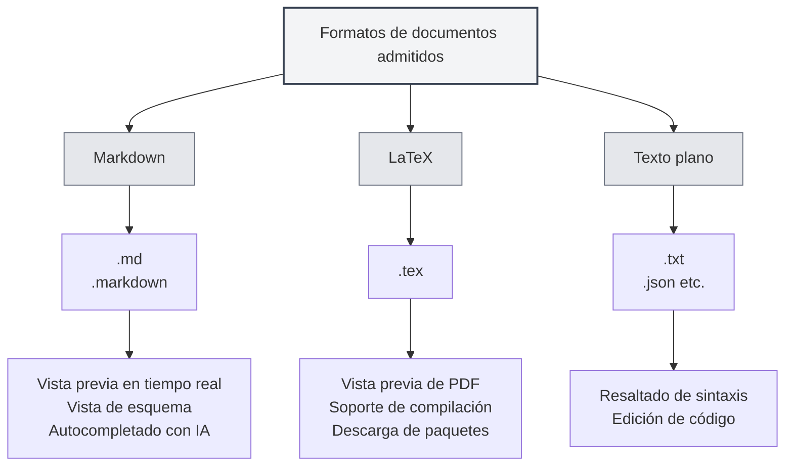

# Formatos de documentos admitidos

## Descripción general

MetaDoc admite múltiples formatos de documentos, incluyendo Markdown, LaTeX y texto plano. El sistema detecta automáticamente el formato del archivo y también permite la selección manual del formato.

<MenuItemsDemo mode="demo" :items='[{"id": "file"}]' />

<MenuItemsDemo mode="demo" :items='[{"id": "edit"}]' />

<MenuItemsDemo mode="demo" :items='[{"id": "view"}]' />

<ViewMenuItemsDemo mode="demo" :items='["home", "outline", "chat"]' />

<MainTabs mode="demo" />

<QuickStartPanel mode="demo" />

<QuickStartMarkdown mode="demo" />

<QuickStartLatex mode="demo" />

## Formatos admitidos

### Formato Markdown

**Extensiones de archivo**: `.md`, `.markdown`

**Características**:

- Admite sintaxis estándar de Markdown
- Admite sintaxis extendida (tablas, bloques de código, fórmulas matemáticas, etc.)
- Admite vista previa en tiempo real
- Admite vista de esquema
- Admite autocompletado con IA

**Casos de uso**:

- Redacción de documentación técnica
- Creación de artículos para blogs
- Toma de notas
- Redacción de documentos

### Formato LaTeX

**Extensiones de archivo**: `.tex`

**Características**:

- Formato profesional para redacción de artículos académicos
- Admite fórmulas matemáticas, tablas, gráficos
- Vista previa de PDF en tiempo real
- Admite descarga automática de paquetes
- Admite indicación de errores de compilación

**Casos de uso**:

- Redacción de artículos académicos
- Redacción de informes técnicos
- Maquetación de libros
- Maquetación de documentos complejos

### Formato de texto plano

**Extensiones de archivo**: `.txt`, `.json`, etc.

**Características**:

- Edición de texto simple
- Admite resaltado de sintaxis
- Funciones de edición de código
- No admite vista previa ni esquema

**Casos de uso**:

- Edición de archivos de código
- Edición de archivos de configuración
- Edición de texto simple
- Edición de archivos de datos

## Detección del formato de archivo

### Detección automática

MetaDoc detecta automáticamente el formato del archivo:

1. **Detección por extensión**: Prioriza la detección del formato según la extensión del archivo

   - `.md`, `.markdown` → Formato Markdown
   - `.tex` → Formato LaTeX
   - `.txt`, `.json`, etc. → Formato de texto plano

2. **Detección por contenido**: Si la extensión no determina el formato, se detecta el contenido del archivo

   - El contenido LaTeX se identifica prioritariamente como formato LaTeX
   - Otros contenidos se identifican por defecto como formato Markdown

3. **Formato por defecto**: Si no se puede detectar, se utiliza por defecto el formato Markdown

### Prioridad de detección

La detección de formato sigue la siguiente prioridad:

1. **Extensión del archivo**: Prioriza la detección por extensión
2. **Contenido del archivo**: Si la extensión no es determinante, detecta el contenido
3. **Formato por defecto**: Utiliza el formato por defecto cuando no se puede detectar

### Reglas de detección

- **Detección de Markdown**: Se identifica como Markdown cuando la extensión es `.md` o `.markdown`
- **Detección de LaTeX**: Se identifica como LaTeX cuando la extensión es `.tex` o el contenido contiene comandos LaTeX
- **Detección de texto plano**: Se identifica como texto plano para otras extensiones o cuando no se puede determinar

## Selección manual del formato

### Selección al abrir un archivo

Puede seleccionar manualmente el formato al abrir un archivo:

1. **Diálogo de abrir archivo**: En el diálogo de abrir archivo
2. **Selección de formato**: Seleccione el formato del archivo (si la detección automática es incorrecta)
3. **Confirmar apertura**: Confirme para abrir con el formato seleccionado

### Selección al crear un nuevo archivo

Puede seleccionar el formato al crear un nuevo archivo:

1. **Nuevo documento**: Haga clic en el botón "Nuevo documento"
2. **Seleccionar formato**: Seleccione el formato en el diálogo de selección de formato
3. **Crear documento**: Cree un documento con el formato especificado

### Cambiar de formato

Puede cambiar el formato de un documento ya abierto:

1. **Abrir documento**: Abra el documento cuyo formato desea cambiar
2. **Menú de formato**: Encuentre la opción para cambiar formato en el menú
3. **Seleccionar formato**: Seleccione el nuevo formato
4. **Confirmar cambio**: Confirme el cambio de formato

**Consideraciones**:

- Cambiar el formato puede afectar el contenido del documento
- Es posible que algunas características del formato no se puedan convertir
- Se recomienda hacer una copia de seguridad del documento antes de cambiar

## Comparación de características de formatos

### Soporte de funciones

| Función         | Markdown | LaTeX    | Texto plano |
| --------------- | -------- | -------- | ----------- |
| Vista previa en tiempo real | ✅       | ✅ (PDF) | ❌          |
| Vista de esquema | ✅       | ✅       | ❌          |
| Autocompletado con IA | ✅       | ✅       | ✅          |
| Fórmulas matemáticas | ✅       | ✅       | ❌          |
| Soporte de tablas | ✅       | ✅       | ❌          |
| Resaltado de código | ✅       | ✅       | ✅          |
| Soporte de metadatos | ✅       | ✅       | ❌          |

### Características del editor

| Característica  | Markdown | LaTeX | Texto plano |
| --------------- | -------- | ----- | ----------- |
| Resaltado de sintaxis | ✅       | ✅    | ✅          |
| Autocompletado  | ✅       | ✅    | ✅          |
| Indicación de errores | ✅       | ✅    | ❌          |
| Función de plegado | ✅       | ✅    | ✅          |
| Edición multicursor | ✅       | ✅    | ✅          |

## Conversión de formatos

### Formatos de exportación

Puede exportar documentos a otros formatos:

- **Markdown → PDF**: Exportar como documento PDF
- **Markdown → HTML**: Exportar como documento HTML
- **Markdown → DOCX**: Exportar como documento de Word
- **LaTeX → PDF**: Compilar como documento PDF
- **LaTeX → Markdown**: Convertir a formato Markdown

### Consideraciones para la conversión

Al convertir formatos, tenga en cuenta:

- **Compatibilidad de contenido**: Es posible que algunas características del formato no se puedan convertir
- **Pérdida de estilos**: Puede perderse parte del estilo después de la conversión
- **Ajuste de contenido**: Puede ser necesario ajustar manualmente el contenido después de la conversión

## Mejores prácticas

1. **Seleccionar el formato adecuado**: Elija el formato apropiado según el tipo de documento
2. **Usar extensiones estándar**: Utilice extensiones de archivo estándar para facilitar la detección automática
3. **Consistencia de formato**: Utilice un formato uniforme dentro del mismo proyecto
4. **Hacer copias de seguridad**: Haga una copia de seguridad del documento original antes de convertir el formato
5. **Probar la conversión**: Verifique que el contenido sea correcto después de la conversión

## Consideraciones importantes

1. **Detección de formato**: La detección automática puede no ser precisa; puede seleccionar manualmente
2. **Cambio de formato**: Cambiar el formato puede afectar el contenido del documento
3. **Compatibilidad**: El soporte de funciones varía entre diferentes formatos
4. **Extensión del archivo**: Se recomienda usar extensiones estándar
5. **Conversión de formato**: Al convertir, puede perderse parte del contenido o del estilo

## Documentación relacionada

- [[markdown.basics|Sintaxis de Markdown]]
- [[latex.basics|Sintaxis de LaTeX]]
- [[editor.plain-text|Editor de texto plano]]
- [[core.file-operations|Operaciones con archivos]]