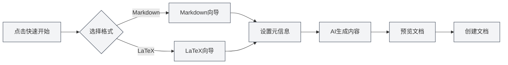

# Funciones de la página de inicio

## Descripción general

La página de inicio es la interfaz de entrada de MetaDoc, que proporciona funciones como inicio rápido, nuevo documento, abrir archivo, etc. El diseño de la página de inicio es simple y atractivo, ayudándote a comenzar a usar MetaDoc rápidamente.

## Inicio rápido

### Asistente de inicio rápido

Haz clic en el botón "Inicio rápido" para iniciar el asistente de inicio rápido:

1. **Seleccionar formato**: Elige el formato del documento (Markdown o LaTeX)
2. **Configurar metadatos**: Ingresa información como el título del documento, autor, etc.
3. **Generar contenido con IA**: Usa la IA para ayudar a generar el contenido del documento
4. **Vista previa del documento**: Previsualiza el contenido del documento generado
5. **Crear documento**: Confirma y crea el documento

La interfaz de selección de formato del asistente de inicio rápido es la siguiente:

<QuickStartPanel mode="demo" />

### Inicio rápido con Markdown

Después de seleccionar el formato Markdown:

- **Selección de plantilla**: Puedes elegir una plantilla de Markdown
- **Generación de contenido**: La IA puede generar contenido en Markdown
- **Edición rápida**: Comienza a editar inmediatamente después de la creación

La interfaz del asistente a la que se accede después de seleccionar Markdown:

<QuickStartMarkdown mode="demo" />

### Inicio rápido con LaTeX

Después de seleccionar el formato LaTeX:

- **Tipo de documento**: Puedes elegir el tipo de documento (article, book, etc.)
- **Generación de contenido**: La IA puede generar contenido en LaTeX
- **Compilar y previsualizar**: Puedes compilar y previsualizar el PDF después de la creación

La interfaz del asistente a la que se accede después de seleccionar LaTeX:

<QuickStartLatex mode="demo" />

## Nuevo documento

### Crear un documento en blanco

Haz clic en el botón "Nuevo documento" para crear rápidamente un documento en blanco:

1. Haz clic en el botón "Nuevo documento"
2. Selecciona el formato del documento (Markdown/LaTeX/Texto plano)
3. El documento se abrirá en una nueva pestaña

**Atajo de teclado**: También puedes usar `Ctrl+N` (Windows/Linux) o `Cmd+N` (macOS) para crear rápidamente.

## Abrir archivo

### Abrir un archivo existente

Haz clic en el botón "Abrir archivo" para abrir un archivo existente:

1. Haz clic en el botón "Abrir archivo"
2. Selecciona el archivo en el cuadro de diálogo de selección de archivos
3. El archivo se abrirá en una nueva pestaña

**Atajo de teclado**: También puedes usar `Ctrl+O` (Windows/Linux) o `Cmd+O` (macOS) para abrir rápidamente.

### Formatos de archivo admitidos

- **Markdown** (.md)
- **LaTeX** (.tex)
- **Texto plano** (.txt)
- **JSON** (.json)

## Manual del usuario

### Abrir el manual del usuario

Haz clic en el botón "Manual del usuario" para abrir el manual:

1. Haz clic en el botón "Manual del usuario"
2. El manual del usuario se abrirá en una nueva pestaña
3. Puedes navegar y aprender sobre varias funciones

**Atajo de teclado**: También puedes presionar la tecla `F1` para abrir rápidamente el manual del usuario.

## Lista de documentos recientes

### Ver documentos recientes

La página de inicio mostrará una lista de los documentos abiertos recientemente:

- **Cantidad mostrada**: Muestra un máximo de 12 documentos recientes
- **Tarjetas de documento**: Cada documento se muestra como una tarjeta
- **Apertura rápida**: Haz clic en la tarjeta para abrir rápidamente el documento

### Operaciones con documentos recientes

- **Abrir documento**: Haz clic en la tarjeta del documento para abrirlo
- **Eliminar registro**: Haz clic en el botón de eliminar en la tarjeta para borrar el registro
- **Menú contextual**: Hacer clic derecho en la tarjeta puede tener más opciones

### Gestión de documentos recientes

- **Actualización automática**: La lista se actualiza automáticamente después de abrir un documento
- **Registro guardado**: Los registros de documentos recientes se guardan
- **Orden de la lista**: Ordenados en orden inverso por hora de apertura

## Diálogo de perfil de usuario

### Abrir el perfil de usuario

La página de inicio puede mostrar el diálogo de perfil de usuario:

- **Primer uso**: Puede solicitar configurar el perfil de usuario en el primer uso
- **Configuración del perfil**: Puedes configurar el perfil de usuario y las preferencias de uso
- **Optimización de IA**: El perfil de usuario puede ayudar a la IA a comprender mejor tus necesidades

### Contenido del perfil de usuario

El perfil de usuario puede incluir:

- **Información básica**: Nombre, profesión, etc.
- **Preferencias de uso**: Hábitos de edición, funciones de uso común, etc.
- **Perfil de usuario**: Ayuda a la IA a comprender tu escenario de uso

## Interfaz de la página de inicio

### Diseño de la interfaz

La página de inicio utiliza un diseño centrado:

- **Parte superior**: Título y subtítulo de MetaDoc
- **Centro**: Área de botones de operación
- **Parte inferior**: Lista de documentos recientes

### Diseño visual

La página de inicio utiliza un diseño moderno y simple:

- **Fondo dinámico**: Efecto de animación de fondo dinámico
- **Decoración de cuadrícula**: Decoración de cuadrícula minimalista
- **Diseño de tarjetas**: Los botones de operación utilizan un diseño de tarjetas

## Mejores prácticas

1. **Inicio rápido**: Se recomienda usar el asistente de inicio rápido en el primer uso
2. **Atajos de teclado**: Domina el uso de atajos de teclado para mejorar la eficiencia
3. **Documentos recientes**: Utiliza la lista de documentos recientes para acceder rápidamente a documentos de uso común
4. **Perfil de usuario**: Configura tu perfil de usuario para una mejor experiencia con la IA
5. **Manual del usuario**: Consulta el manual del usuario cuando encuentres problemas

## Consideraciones

1. **Visualización de la página de inicio**: La página de inicio solo se muestra cuando no hay documentos abiertos
2. **Inicio rápido**: El asistente de inicio rápido se puede cerrar en cualquier momento
3. **Documentos recientes**: La lista de documentos recientes muestra un máximo de 12
4. **Perfil de usuario**: La configuración del perfil de usuario es opcional
5. **Idioma de la interfaz**: El idioma de la interfaz de la página de inicio sigue la configuración del idioma del sistema

## Documentación relacionada

- [[quick-start.guide|Guía de inicio rápido]]
- [[core.file-operations|Operaciones de archivo]]
- [[user.profile|Perfil de usuario]]
- [[views.types|Tipos de vista]]

<MenuItemsDemo mode="demo" :items='[{"id": "file"}]' />

<MenuItemsDemo mode="demo" :items='[{"id": "edit"}]' />

<MenuItemsDemo mode="demo" :items='[{"id": "view"}]' />

<ViewMenuItemsDemo mode="demo" :items='["home", "outline", "chat", "agent"]' />

<MainTabs mode="demo" />

<UserProfileView mode="demo" />