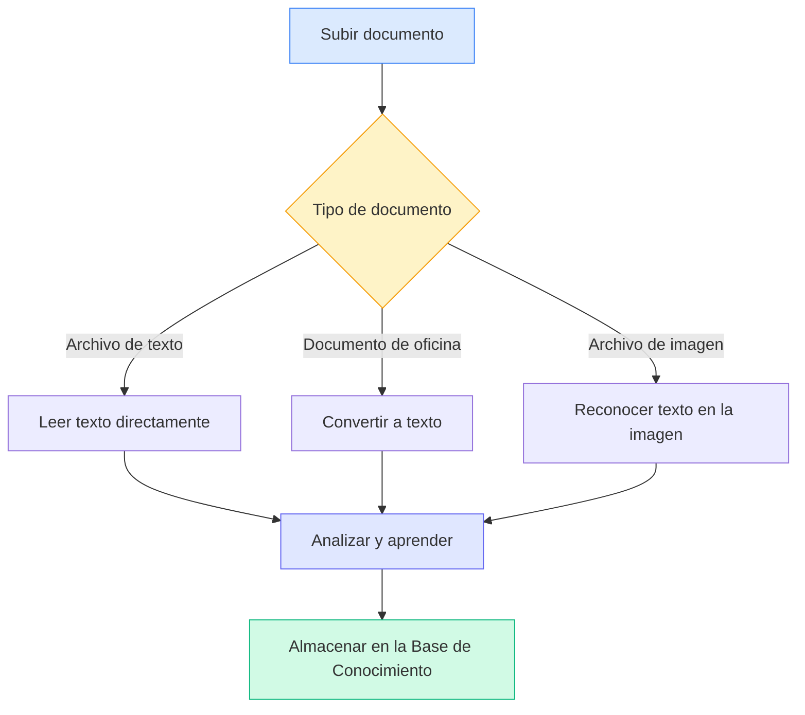
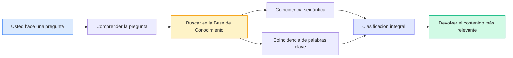

# Configuración de la Base de Conocimiento

## Descripción General

La Base de Conocimiento es el sistema de gestión de documentos inteligente de MetaDoc. Al "enseñar" sus documentos a la Base de Conocimiento, la IA puede comprender y hacer referencia a ese contenido, proporcionándole respuestas y sugerencias más precisas.

Esta guía le ayudará a configurar la Base de Conocimiento para que funcione mejor para usted.

## Habilitar la Función de Base de Conocimiento

En la página de configuración de la Base de Conocimiento, primero debe habilitar la función:

1.  Encuentre el interruptor "Habilitar Base de Conocimiento"
2.  Cambie el interruptor al estado "Habilitado"
3.  Configure los parámetros relacionados con la Base de Conocimiento

Puede acceder a la gestión de la Base de Conocimiento a través de la barra de menú superior:

<KnowledgeBase mode="demo" />

La imagen anterior muestra las áreas funcionales principales de la interfaz de gestión de la Base de Conocimiento:

-   **Panel izquierdo**: Lista de bases de conocimiento y función de búsqueda
-   **Área central**: Lista de documentos añadidos
-   **Detalles a la derecha**: Información detallada y estado de procesamiento del documento seleccionado
-   **Barra de herramientas inferior**: Botones de acción como añadir documento, comenzar procesamiento, eliminar, etc.

## Seleccionar el Modo de Procesamiento

### Introducción a los Dos Modos

MetaDoc ofrece dos modos para procesar documentos:

**Procesamiento en la Nube (Recomendado)**

-   Envía los documentos al servicio en la nube para su análisis
-   Velocidad de procesamiento rápida, sin consumir recursos locales
-   Requiere conexión a Internet

**Procesamiento Local (En Desarrollo)**

-   Procesa los documentos directamente en su computadora
-   Los datos permanecen completamente locales, protegiendo la privacidad
-   Requiere una configuración de computadora más potente

La versión actual solo admite el modo de procesamiento en la nube. Puede seleccionarlo en la configuración:

<MenuItemsDemo mode="demo" :items='[{"id": "settings"}]' />

### Ventajas del Procesamiento en la Nube

Para la mayoría de los usuarios, recomendamos usar el procesamiento en la nube:

-   **Fácil de empezar**: No requiere configurar entornos locales complejos
-   **Ahorra tiempo**: Más rápido al procesar grandes volúmenes de documentos
-   **Ahorra recursos**: No consume memoria ni procesador de su computadora
-   **Mantenimiento simple**: Se actualiza automáticamente, sin gestión manual

### Cuándo Necesitar Procesamiento Local

Si tiene las siguientes necesidades, puede esperar a que esté disponible la función de procesamiento local:

-   Procesar documentos confidenciales altamente sensibles
-   Trabajar frecuentemente en entornos sin conexión a Internet
-   Poseer una configuración de computadora de alto rendimiento (con tarjeta gráfica dedicada)
-   Necesidad de procesar documentos masivos (más de 10 GB)

```mermaid
graph TB
    A[Configurar Base de Conocimiento] --> B{Seleccionar modo de procesamiento}
    B -->|Procesamiento en la nube| C[Conectar al servicio en la nube]
    B -->|Procesamiento local| D[Configurar entorno local]
    C --> E[Comenzar a procesar documentos]
    D --> E
    E --> F[La IA puede usar la Base de Conocimiento]
    style A fill:#dbeafe,stroke:#3b82f6
    style B fill:#fef3c7,stroke:#f59e0b
    style C fill:#d1fae5,stroke:#10b981
    style E fill:#e0e7ff,stroke:#6366f1
    style F fill:#fce7f3,stroke:#ec4899
```

<SettingKnowledgeBaseSection mode="demo" />

## Comprender el Funcionamiento de la Base de Conocimiento

### Cómo se "Aprenden" los Documentos

<RAGToolDisplay mode="demo" />

Cuando añade un documento a la Base de Conocimiento, MetaDoc ejecuta los siguientes pasos:

1.  **Leer el contenido del documento**

    -   Extrae texto de formatos como PDF, Word, imágenes, etc.
    -   Mantiene la estructura y la información de formato del documento

2.  **Comprender el significado del documento**

    -   Convierte el texto en una "representación semántica" que la IA puede entender
    -   Es como poner etiquetas inteligentes al documento

3.  **Crear un índice**

    -   Crea un índice para búsquedas rápidas
    -   Permite a la IA encontrar contenido relevante en un instante

4.  **Almacenar el conocimiento**
    -   Guarda los resultados del procesamiento en la base de datos local
    -   Listo para ser consultado en cualquier momento

<KnowledgeBase mode="demo" />

## Tipos de Documentos Soportados

### Formatos que se Pueden Procesar Directamente

La Base de Conocimiento de MetaDoc admite múltiples formatos de documentos comunes:

**Basados en Texto**

-   Documentos Markdown (.md) – Formato preferido para documentación técnica
-   Documentos LaTeX (.tex) – Formato común para artículos académicos
-   Archivos de texto plano (.txt) – Registros de texto simples

**Documentos de Oficina**

-   Archivos PDF (.pdf) – El formato de documento más universal
-   Documentos de Word (.docx) – Formato de Microsoft Office

**Basados en Imágenes**

-   Imágenes PNG (.png) – Capturas de pantalla, diagramas
-   Imágenes JPEG (.jpg, .jpeg) – Fotografías, documentos escaneados

### Modo de Procesamiento para Diferentes Documentos

MetaDoc procesa diferentes tipos de documentos de distintas maneras:

**Documentos de Texto** (Markdown, LaTeX, TXT)

-   Lee directamente el contenido de texto
-   Conserva la estructura de títulos y el formato
-   Velocidad de procesamiento más rápida

**Documentos de Oficina** (PDF, Word)

-   Primero los convierte a texto plano
-   Extrae estructura como títulos, párrafos, etc.
-   Conserva la jerarquía lógica del documento

**Documentos de Imagen** (PNG, JPG)

-   Usa tecnología OCR para reconocer texto en las imágenes
-   Adecuado para procesar documentos en papel escaneados
-   El tiempo de procesamiento es relativamente más largo

<RAGToolDisplay mode="demo" />

## Mecanismo de Recuperación Inteligente

### Cómo Encuentra Contenido Relevante la Base de Conocimiento

Cuando la IA necesita usar la Base de Conocimiento, MetaDoc emplea una estrategia de recuperación inteligente:

**Coincidencia Semántica**

-   No solo coincide palabras clave, sino que comprende el significado de la pregunta
-   Ejemplo: al buscar "cómo instalar", también puede encontrar contenido relacionado como "pasos de instalación", "guía de despliegue"

**Recuperación Híbrida**

-   Combina comprensión semántica y coincidencia de palabras clave
-   Garantiza precisión y mejora la recuperación
-   Ordena automáticamente, mostrando primero el contenido más relevante

**Respuesta Rápida**

-   Utiliza algoritmos de indexación eficientes
-   Respuesta en milisegundos, sin afectar la fluidez de la conversación

<KnowledgeBase mode="demo" />

## Explicación del Procesamiento por Fragmentos

### Por Qué es Necesario Fragmentar

Para una recuperación más eficiente, MetaDoc divide los documentos largos en fragmentos más pequeños:

**Ventajas de la Fragmentación**

-   **Localización precisa**: Puede encontrar párrafos específicos dentro del documento
-   **Mayor velocidad**: Los fragmentos pequeños se procesan más rápido y se recuperan más rápidamente
-   **Mantener el contexto**: Hay superposición entre fragmentos adyacentes, no se corta la semántica

**Configuración Predeterminada**

-   Cada fragmento tiene aproximadamente 500 caracteres (unos 250 caracteres chinos)
-   Superposición de 50 caracteres entre fragmentos adyacentes
-   Esta configuración logra un equilibrio entre precisión y eficiencia

### Ejemplo de Fragmentación

Supongamos que hay un artículo largo:

Texto original: [Párrafo inicial... Párrafo intermedio... Párrafo final...]

Después de fragmentar:

-   Fragmento 1: Párrafo inicial + parte del contenido intermedio
-   Fragmento 2: Parte del contenido intermedio (área superpuesta) + más contenido intermedio
-   Fragmento 3: Más contenido intermedio + párrafo final

De esta manera, incluso si la pregunta solo involucra "contenido intermedio", se puede encontrar la parte relevante con precisión.

<SettingKnowledgeBaseSection mode="demo" />

## Recomendaciones de Configuración

### Configuración Recomendada para Primeros Usos

Si es la primera vez que usa la Base de Conocimiento, se recomienda la siguiente configuración:

-   **Modo de procesamiento**: Procesamiento en la nube (predeterminado)
-   **Sensibilidad de recuperación**: Media (valor predeterminado)
    -   Sensibilidad demasiado alta: Puede devolver demasiado contenido no relacionado
    -   Sensibilidad demasiado baja: Puede omitir algún contenido relacionado
    -   Configuración media: Equilibra ambas

### Para Diferentes Tipos de Documentos

**Documentación Técnica/Manuales**

-   Adecuado para crear una base de conocimiento especializada
-   La IA puede responder con precisión preguntas técnicas
-   Admite la recuperación de fragmentos de código

**Artículos Académicos**

-   Conserva la información completa de citas
-   Admite la asociación de conocimientos entre documentos
-   Adecuado para revisiones bibliográficas e investigación

**Notas Diarias**

-   Crea una base de conocimiento personal
-   Recupera rápidamente registros pasados
-   Admite referencias durante la escritura creativa

### Sugerencias de Uso

**1. Mantenimiento Periódico**

-   Elimine documentos obsoletos o que ya no necesite
-   Actualice nuevas versiones de documentos existentes
-   Mantenga la Base de Conocimiento ordenada y precisa

**2. Clasificación Razonable**

-   Agrupe documentos de temas relacionados
-   Asigne nombres claros a las bases de conocimiento
-   Facilita la gestión y el uso

**3. Consideraciones de Privacidad**

-   Suba documentos confidenciales con precaución
-   Comprenda cómo se procesan los datos
-   Elija el modo de procesamiento adecuado

<RAGToolDisplay mode="demo" />

## Consideraciones

### Aspectos a Tener en Cuenta Antes de Usar

1.  **Tiempo de Procesamiento**

    -   Documentos pequeños (1-10 páginas): Unos segundos
    -   Documentos medianos (10-50 páginas: Decenas de segundos
    -   Documentos grandes (más de 50 páginas): Puede llevar varios minutos
    -   Espere pacientemente a que finalice el procesamiento

2.  **Espacio de Almacenamiento**

    -   La Base de Conocimiento ocupará cierto espacio en el disco duro
    -   Aproximadamente 2-3 veces el tamaño del documento original
    -   Limpiar periódicamente documentos no utilizados puede liberar espacio

3.  **Requisitos de Red**

    -   Se necesita conexión a Internet para añadir documentos
    -   No se necesita red para la recuperación (ya almacenada localmente)
    -   Una red inestable puede afectar la velocidad de procesamiento

4.  **Formato de Archivo**
    -   Asegúrese de que el formato del archivo subido sea correcto
    -   Los archivos dañados pueden no procesarse
    -   Los PDF cifrados deben descifrarse primero

### Preguntas Frecuentes

**P: ¿Son seguros los documentos en la Base de Conocimiento?**
R: Los datos vectoriales de los documentos procesados se almacenan localmente. Si se usa procesamiento en la nube, el documento original se envía al servicio en la nube para su procesamiento y se elimina una vez completado. Se recomienda no subir contenido altamente sensible.

**P: ¿Qué tan grandes pueden ser los documentos procesados?**
R: Se recomienda que un solo documento no supere los 100 MB. Los documentos muy grandes se pueden dividir en varios documentos más pequeños para su procesamiento.

**P: ¿Se pueden modificar los documentos después de procesarlos?**
R: El contenido en la Base de Conocimiento es una "instantánea" del documento original. Si el documento se actualiza, debe volver a añadirse a la Base de Conocimiento.

**P: ¿Por qué no se puede recuperar algún contenido?**
R: Posibles razones: 1) El documento aún no ha terminado de procesarse; 2) El contenido está en una imagen y el reconocimiento OCR falló; 3) Las palabras de búsqueda y la forma de expresar el contenido del documento difieren mucho.

## Documentación Relacionada

-   [[knowledge-base.management|Gestión de la Base de Conocimiento]] - Aprenda a añadir, eliminar y gestionar documentos en la Base de Conocimiento
-   [[knowledge-base.usage|Uso de la Base de Conocimiento]] - Comprenda cómo usar la Base de Conocimiento en conversaciones con la IA
-   [[ai.chat|Función de Chat con IA]] - Explore las funciones avanzadas del chat con IA
