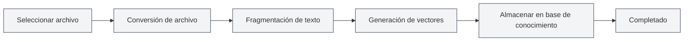

# Gestión de la Base de Conocimiento

## Descripción General

<KnowledgeBase mode="demo" />

La gestión de la base de conocimiento es la función central del sistema MetaDoc RAG (Generación Aumentada por Recuperación), que le permite agregar documentos a la base de conocimiento para proporcionar información contextual a los diálogos de IA mediante búsqueda vectorial. La base de conocimiento ayuda a la IA a comprender mejor el contenido de sus documentos y proporcionar respuestas más precisas.

## Habilitar la Base de Conocimiento

### Activar la función de Base de Conocimiento

En la página de configuración de la base de conocimiento, primero debe habilitar la función:

1.  Encuentre el interruptor "Habilitar base de conocimiento"
2.  Cambie el interruptor al estado "Habilitado"
3.  Configure los parámetros relacionados con la base de conocimiento

Puede acceder a la gestión de la base de conocimiento a través de la barra de menú superior:

<MenuItemsDemo mode="demo" :items='[{"id": "settings"}]' />

### Configuración de la Base de Conocimiento

<SettingKnowledgeBaseSection mode="demo" />

Antes de habilitar la base de conocimiento, puede configurar los parámetros relevantes en la página de configuración:

La imagen anterior muestra las principales opciones de la interfaz de configuración de la base de conocimiento:

-   **Habilitar base de conocimiento**: Activa o desactiva la función de base de conocimiento.
-   **Modo de incrustación (Embedding)**: Elija procesamiento en la nube o local (en desarrollo).
-   **Umbral de confianza**: Controla el filtrado de relevancia de los resultados de búsqueda.
-   **Número máximo de resultados**: Limita el número máximo de resultados devueltos por cada búsqueda.

### Interfaz de Gestión de la Base de Conocimiento

<KnowledgeBase mode="demo" />

Una vez habilitada la base de conocimiento, puede agregar y gestionar documentos en la interfaz de gestión:

La interfaz de gestión de la base de conocimiento proporciona las siguientes funciones:

-   **Lista de documentos**: Vea todos los documentos agregados a la base de conocimiento.
-   **Agregar documento**: Admite múltiples formatos como PDF, Word, imágenes, Markdown, etc.
-   **Estado de procesamiento**: Muestra el progreso del procesamiento de documentos en tiempo real.
-   **Prueba de búsqueda**: Prueba la efectividad de la recuperación de la base de conocimiento.

Después de habilitar la base de conocimiento, las funciones de IA (como diálogo con IA, completado por IA) utilizarán automáticamente la información de la base de conocimiento para mejorar la calidad de las respuestas.

**Notas importantes**:

-   Después de habilitar la base de conocimiento, las funciones de IA buscarán contenido en la base, lo que puede afectar la velocidad de respuesta.
-   La base de conocimiento necesita tener archivos agregados primero para ser útil.
-   Se recomienda habilitar la base de conocimiento después de agregar archivos.

<RAGToolDisplay mode="demo" />

## Configuración del Umbral de Confianza

### Comprender el Umbral de Confianza

El umbral de confianza (Score Threshold) controla el criterio de filtrado para los resultados de búsqueda en la base de conocimiento:

-   **Umbral bajo (0.1-0.3)**: Devuelve más resultados, pero puede incluir contenido no relevante.
-   **Umbral medio (0.4-0.6)**: Equilibra relevancia y cantidad, recomendado para uso general.
-   **Umbral alto (0.7-0.9)**: Solo devuelve resultados altamente relevantes, pero puede omitir información relevante.

### Recomendaciones de Configuración

-   **Escenario general**: Recomendado 0.5, equilibra precisión y cobertura.
-   **Necesidad de alta precisión**: Recomendado 0.7-0.8, asegura resultados muy relevantes.
-   **Búsqueda exploratoria**: Recomendado 0.3-0.4, obtiene más información relacionada.

La configuración del umbral afecta a todas las funciones de IA que utilizan la base de conocimiento, incluidos el diálogo con IA, el completado por IA, etc.

<SettingKnowledgeBaseSection mode="demo" />

## Gestión de Archivos de la Base de Conocimiento

### Agregar Archivos a la Base de Conocimiento

1.  En la página de gestión de la base de conocimiento, haga clic en el botón "Agregar archivo".
2.  Seleccione el archivo que desea agregar (admite múltiples formatos).
3.  El sistema procesará el archivo automáticamente:
    -   Convierte el archivo a texto.
    -   Divide el texto en fragmentos (chunks).
    -   Genera incrustaciones vectoriales (embeddings).
    -   Almacena en la base de conocimiento.

**Formatos de archivo admitidos**:

-   Markdown (.md)
-   LaTeX (.tex)
-   PDF (.pdf)
-   Word (.docx)
-   Imágenes (.png, .jpg, etc., mediante reconocimiento OCR)
-   Texto plano (.txt)

### Flujo de Procesamiento de Archivos

### Gestión de la Lista de Archivos

<KnowledgeBase mode="demo" />

La página de gestión de la base de conocimiento muestra todos los archivos agregados:

-   **Nombre del archivo**: Muestra el nombre del archivo.
-   **Estado**: Indica si el archivo está habilitado.
-   **Número de fragmentos**: Muestra en cuántos fragmentos se dividió el archivo.
-   **Número de vectores**: Muestra la cantidad de vectores generados.
-   **Acciones**: Proporciona operaciones de gestión de archivos.

### Habilitar/Deshabilitar Archivos

Puede deshabilitar temporalmente un archivo sin eliminarlo:

1.  En la lista de archivos, encuentre el archivo que desea operar.
2.  Haga clic en el botón "Habilitar" o "Deshabilitar".
3.  Una vez deshabilitado, el archivo no se buscará, pero los datos se conservarán.

**Casos de uso**:

-   Excluir temporalmente ciertos archivos.
-   Probar el efecto de diferentes combinaciones de archivos.
-   Conservar un archivo pero no usarlo temporalmente.

### Eliminar Archivos

1.  En la lista de archivos, encuentre el archivo que desea eliminar.
2.  Haga clic en el botón "Eliminar".
3.  Confirme la operación de eliminación.

Eliminar un archivo hará lo siguiente:

-   Elimina el registro del archivo.
-   Elimina todos los fragmentos de datos relacionados.
-   Elimina todos los vectores relacionados.
-   La operación no se puede deshacer.

**Notas importantes**:

-   La operación de eliminación no se puede deshacer, proceda con precaución.
-   Eliminar archivos grandes puede llevar algún tiempo.
-   Para recuperarlo, deberá agregarlo nuevamente después de eliminarlo.

### Renombrar Archivos

1.  En la lista de archivos, encuentre el archivo que desea renombrar.
2.  Haga clic en el botón "Renombrar".
3.  Ingrese el nuevo nombre del archivo.
4.  Confirme el cambio de nombre.

Renombrar solo cambia el nombre mostrado, no afecta el contenido del archivo ni los datos vectoriales.

### Vista Previa de Archivos

Puede obtener una vista previa del contenido de los archivos en la base de conocimiento:

1.  En la lista de archivos, encuentre el archivo que desea previsualizar.
2.  Haga clic en el botón "Vista previa".
3.  Vea el contenido de texto del archivo.

La función de vista previa puede ayudarle a:

-   Confirmar si el contenido del archivo es correcto.
-   Verificar si el archivo fue procesado correctamente.
-   Comprender la estructura de texto del archivo.

### Descargar Archivos

Puede descargar archivos de la base de conocimiento:

1.  En la lista de archivos, encuentre el archivo que desea descargar.
2.  Haga clic en el botón "Descargar".
3.  Seleccione la ubicación de guardado.

El archivo descargado es una copia del archivo original, que puede usarse para respaldo o compartir.

<RAGToolDisplay mode="demo" />

## Reconstrucción de Vectores

### Reconstruir Vectores

Si hay problemas con los datos vectoriales de un archivo, o si actualizó el modelo de Embedding, puede reconstruir los vectores:

1.  En la lista de archivos, encuentre el archivo cuyos vectores desea reconstruir.
2.  Haga clic en el botón "Reconstruir vectores".
3.  Espere a que se complete la reconstrucción.

Reconstruir vectores hará lo siguiente:

-   Reprocesa el texto del archivo.
-   Regenera las incrustaciones vectoriales (embeddings).
-   Actualiza el índice de vectores.

**Casos de uso**:

-   Cambió el modelo de Embedding.
-   Datos vectoriales corruptos.
-   Necesita actualizar la representación vectorial.

### Reconstruir Todos los Vectores

Si necesita reconstruir los vectores de todos los archivos:

1.  Haga clic en el botón "Reconstruir todos los vectores".
2.  Confirme la operación.
3.  Espere a que se complete la reconstrucción de todos los archivos.

Reconstruir todos los vectores puede llevar mucho tiempo, especialmente si hay muchos archivos.

<KnowledgeBase mode="demo" />

## Prueba de Búsqueda en la Base de Conocimiento

### Probar la Función de Búsqueda

Puede probar la función de búsqueda en la página de gestión de la base de conocimiento:

1.  Ingrese el texto de consulta en el cuadro de búsqueda.
2.  Haga clic en el botón "Buscar".
3.  Revise los resultados de la búsqueda.

Los resultados de búsqueda mostrarán:

-   Fragmentos de texto coincidentes.
-   Puntuación de similitud.
-   Archivo de origen.
-   Información contextual.

### Parámetros de Búsqueda

Al probar la búsqueda, puede ajustar:

-   **Texto de consulta**: Ingrese el contenido que desea buscar.
-   **Número de resultados**: Establece la cantidad de resultados a devolver.
-   **Umbral**: Establece el umbral mínimo de similitud.

<RAGToolDisplay mode="demo" />

## Vaciar la Base de Conocimiento

### Vaciar Todos los Datos

Si necesita vaciar toda la base de conocimiento:

1.  Haga clic en el botón "Vaciar base de conocimiento".
2.  Confirme la operación.
3.  Espere a que se complete el vaciado.

Vaciar la base de conocimiento hará lo siguiente:

-   Elimina todos los registros de archivos.
-   Elimina todos los fragmentos de datos.
-   Elimina todos los vectores.
-   La operación no se puede deshacer.

**Notas importantes**:

-   La operación de vaciado no se puede deshacer, proceda con precaución.
-   Se recomienda hacer una copia de seguridad de los archivos importantes antes de vaciar.
-   Después de vaciar, deberá agregar archivos nuevamente.

## Mejores Prácticas

1.  **Organización de archivos**: Organice los archivos por tema o proyecto para facilitar la gestión.
2.  **Actualización periódica**: Después de actualizar el contenido de un archivo, reconstruya los vectores oportunamente.
3.  **Ajuste del umbral**: Ajuste el umbral de confianza según los resultados de uso real.
4.  **Limpieza de archivos**: Elimine periódicamente los archivos que ya no necesite para mantener la base de conocimiento ordenada.
5.  **Copia de seguridad de archivos importantes**: Se recomienda hacer una copia de seguridad de los archivos importantes antes de agregarlos a la base de conocimiento.

## Notas Importantes

1.  **Tamaño del archivo**: Los archivos grandes requieren más tiempo de procesamiento, sea paciente.
2.  **Espacio de almacenamiento**: La base de conocimiento ocupará cierto espacio de almacenamiento.
3.  **Tiempo de procesamiento**: Agregar archivos y procesar vectores requiere tiempo, no interrumpa el proceso.
4.  **Formato de archivo**: Asegúrese de que el formato del archivo sea correcto, de lo contrario podría no procesarse.
5.  **Conexión de red**: El uso del modo API para generar vectores requiere conexión a Internet.

## Documentación Relacionada

-   [[knowledge-base.config|Configuración de la Base de Conocimiento]]
-   [[knowledge-base.usage|Uso de la Base de Conocimiento]]
-   [[settings.llm|Configuración de LLM]]
-   [[ai.chat|Función de Diálogo con IA]]
