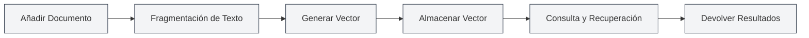
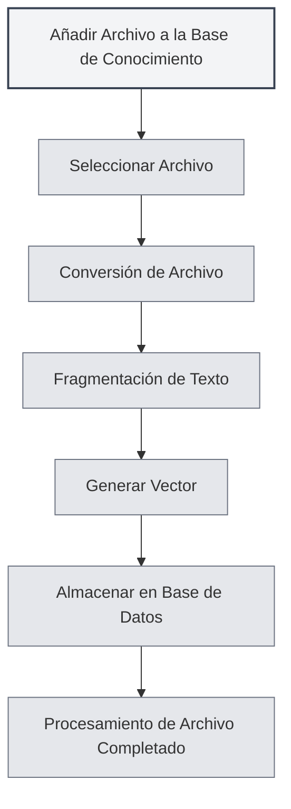

# Uso de la Base de Conocimiento

## Descripción General

La Base de Conocimiento es el sistema RAG (Generación Aumentada por Recuperación) de MetaDoc, que proporciona información contextual para las funciones de IA mediante búsqueda vectorial. Un uso adecuado de la base de conocimiento puede mejorar significativamente la precisión y relevancia de las respuestas de la IA.

<KnowledgeBase mode="demo" />

## Introducción a la Base de Conocimiento

### ¿Qué es la Base de Conocimiento?

La Base de Conocimiento es un sistema de almacenamiento y recuperación de documentos que puede:

- **Almacenar documentos**: Convertir documentos en vectores y almacenarlos
- **Búsqueda semántica**: Buscar contenido relevante basándose en la similitud semántica
- **Mejorar la IA**: Proporcionar información contextual para los diálogos de IA

### Cómo Funciona

<RAGToolDisplay mode="demo" />

La Base de Conocimiento utiliza tecnología de incrustaciones vectoriales:

1. **Procesamiento de documentos**: Dividir los documentos en fragmentos de texto
2. **Vectorización**: Generar incrustaciones vectoriales para cada fragmento de texto
3. **Almacenamiento**: Guardar los vectores en la base de datos
4. **Recuperación**: Generar un vector para la consulta y buscar contenido similar

<KnowledgeBase mode="demo" />

## Añadir Archivos a la Base de Conocimiento

### Añadir Archivos

1. Abre la página de gestión de la base de conocimiento
2. Haz clic en el botón "Añadir archivo"
3. Selecciona el archivo que deseas añadir
4. Espera a que se complete el procesamiento del archivo

### Formatos de Archivo Soportados

La base de conocimiento admite los siguientes formatos de archivo:

- **Markdown** (.md): Documentos Markdown
- **LaTeX** (.tex): Documentos LaTeX
- **PDF** (.pdf): Documentos PDF
- **Word** (.docx): Documentos de Word
- **Imágenes** (.png, .jpg, etc.): Reconocimiento de texto mediante OCR
- **Texto plano** (.txt): Archivos de texto plano

### Procesamiento de Archivos

<RAGToolDisplay mode="demo" />

Después de añadir un archivo, el sistema automáticamente:

1. **Convierte el texto**: Transforma el archivo en contenido de texto
2. **Fragmenta el texto**: Divide el texto en fragmentos de tamaño fijo
3. **Genera vectores**: Crea incrustaciones vectoriales para cada fragmento
4. **Almacena los datos**: Guarda los vectores y el texto en la base de datos

El tiempo de procesamiento depende del tamaño del archivo; los archivos grandes pueden requerir más tiempo.

<KnowledgeBase mode="demo" />

## Gestión de Archivos de la Base de Conocimiento

### Lista de Archivos

La página de gestión de la base de conocimiento muestra todos los archivos añadidos:

- **Nombre del archivo**: El nombre del archivo
- **Tamaño/Número de fragmentos**: Tamaño del archivo y cantidad de fragmentos de datos
- **Estado**: Si el archivo está habilitado o no

### Operaciones con Archivos

<RAGToolDisplay mode="demo" />

#### Habilitar/Deshabilitar Archivos

- **Habilitar**: El archivo será recuperado y utilizado para las funciones de IA
- **Deshabilitar**: El archivo no será recuperado, pero los datos se conservan

#### Vista Previa de Archivos

Haz clic en un archivo para previsualizar su contenido:

- **Ver contenido**: Consulta el texto del archivo en el panel de vista previa
- **Abrir editor**: Abre el archivo en el editor

#### Renombrar Archivos

1. Selecciona el archivo que deseas renombrar
2. Haz clic en el botón de edición junto al nombre del archivo
3. Introduce el nuevo nombre de archivo
4. Confirma el cambio de nombre

#### Eliminar Archivos

1. Selecciona el archivo que deseas eliminar
2. Haz clic en el botón "Eliminar"
3. Confirma la operación de eliminación

Eliminar un archivo borrará todos los vectores y fragmentos de datos relacionados.

#### Descargar Archivos

Puedes descargar archivos de la base de conocimiento:

1. Selecciona el archivo que deseas descargar
2. Haz clic en el botón "Descargar"
3. Selecciona la ubicación de guardado

<KnowledgeBase mode="demo" />

## Búsqueda Vectorial

### Principio de Búsqueda

La búsqueda vectorial utiliza el algoritmo ANN (Vecinos Más Cercanos Aproximados):

- **Similitud vectorial**: Calcula la similitud entre el vector de consulta y los vectores de los documentos
- **Similitud de coseno**: Utiliza la similitud de coseno para medir el grado de similitud
- **Ordenar resultados**: Devuelve los resultados ordenados por similitud

### Métodos de Búsqueda

<RAGToolDisplay mode="demo" />

La base de conocimiento admite dos métodos de búsqueda:

- **Búsqueda vectorial**: Basada en la similitud semántica
- **Recuperación híbrida**: Combina búsqueda vectorial y coincidencia de palabras clave

### Prueba de Búsqueda

Puedes probar la función de búsqueda en la página de gestión de la base de conocimiento:

1. Introduce el texto de consulta en el cuadro de búsqueda
2. Ajusta el umbral de confianza
3. Haz clic en el botón "Buscar"
4. Consulta los resultados de la búsqueda

### Umbral de Confianza

El umbral de confianza controla el filtrado de los resultados de búsqueda:

- **Umbral bajo (0.1-0.3)**: Devuelve más resultados, pero puede incluir contenido no relacionado
- **Umbral medio (0.4-0.6)**: Equilibra relevancia y cantidad (recomendado)
- **Umbral alto (0.7-0.9)**: Solo devuelve resultados altamente relevantes

<KnowledgeBase mode="demo" />

## Recuperación Híbrida

### Mecanismo de Recuperación

La recuperación híbrida combina dos métodos:

- **Búsqueda vectorial**: Basada en la similitud semántica
- **Coincidencia de palabras clave**: Basada en la coincidencia de texto

### Mecanismo de Puntuación

La recuperación híbrida utiliza una puntuación combinada:

- **Similitud vectorial**: Puntuación de similitud semántica
- **Coincidencia de palabras clave**: Puntuación de coincidencia de texto
- **Puntuación combinada**: Puntuación final que combina ambas puntuaciones

### Ventajas

Las ventajas de la recuperación híbrida:

- **Precisión**: La búsqueda vectorial proporciona comprensión semántica
- **Exactitud**: La coincidencia de palabras clave proporciona coincidencias exactas
- **Equilibrio**: Combina las ventajas de ambos métodos

<RAGToolDisplay mode="demo" />

## Prueba de Búsqueda

### Probar la Búsqueda

Puedes probar la búsqueda en la página de gestión de la base de conocimiento:

1. **Introducir consulta**: Introduce el contenido a consultar en el cuadro de búsqueda
2. **Ajustar umbral**: Utiliza el control deslizante para ajustar el umbral de confianza
3. **Ejecutar búsqueda**: Haz clic en el botón "Buscar" o presiona Enter
4. **Ver resultados**: Consulta los resultados de la búsqueda en el área de resultados

### Resultados de la Búsqueda

Los resultados de la búsqueda mostrarán:

- **Texto coincidente**: Fragmentos de texto relacionados con la consulta
- **Similitud**: Puntuación de similitud entre el texto y la consulta
- **Archivo de origen**: El archivo del que proviene el texto

### Ordenación de Resultados

Los resultados de la búsqueda se ordenan por similitud:

- **Más relevante**: Los resultados con mayor similitud aparecen primero
- **Relevancia decreciente**: Ordenados por similitud decreciente

## Reconstrucción de Vectores

### Reconstruir Vectores

Si los datos vectoriales de un archivo presentan problemas, puedes reconstruirlos:

1. Selecciona el archivo cuyos vectores deseas reconstruir
2. Haz clic en el botón "Reconstruir vectores"
3. Espera a que se complete la reconstrucción

### Reconstruir Todos los Vectores

Puedes reconstruir los vectores de todos los archivos:

1. Haz clic en el botón "Reconstruir todos los vectores"
2. Confirma la operación
3. Espera a que se complete la reconstrucción de todos los archivos

### Escenarios de Reconstrucción

Escenarios en los que es necesario reconstruir vectores:

- **Cambiar modelo de Embedding**: Es necesario reconstruir después de cambiar el modelo
- **Datos vectoriales dañados**: Cuando los datos vectoriales presentan problemas
- **Actualizar representación vectorial**: Cuando se necesita actualizar la representación vectorial

## Vaciar la Base de Conocimiento

### Operación de Vaciar

Si necesitas vaciar toda la base de conocimiento:

1. Haz clic en el botón "Vaciar base de conocimiento"
2. Confirma la operación
3. Espera a que se complete el vaciado

### Impacto del Vaciado

Vaciar la base de conocimiento:

- Eliminará todos los registros de archivos
- Eliminará todos los fragmentos de datos
- Eliminará todos los vectores
- La operación no se puede deshacer

**Notas importantes**:

- La operación de vaciado no se puede deshacer, procede con precaución
- Se recomienda hacer una copia de seguridad de los archivos importantes antes de vaciar
- Después de vaciar, será necesario volver a añadir los archivos

<KnowledgeBase mode="demo" />

## Uso en Funciones de IA

### Diálogo con IA

La base de conocimiento proporciona automáticamente contexto para los diálogos de IA:

- **Recuperación automática**: Recupera automáticamente conocimientos relevantes según el contenido del diálogo
- **Inyección de contexto**: Inyecta los resultados de la recuperación en el contexto del diálogo
- **Respuestas mejoradas**: Genera respuestas más precisas basándose en el contenido de la base de conocimiento

### Completado por IA

La base de conocimiento puede mejorar la función de completado por IA:

- **Comprensión del contexto**: Comprende el contexto basándose en el contenido de la base de conocimiento
- **Generación de contenido**: Genera contenido relacionado con el contenido de la base de conocimiento
- **Mejora de la precisión**: Aumenta la precisión del contenido completado

### Herramientas de Agente

La base de conocimiento puede utilizarse como una herramienta de Agente:

- **Herramienta RAG**: Utiliza la recuperación RAG en el flujo de trabajo del Agente
- **Provisión de contexto**: Proporciona información contextual relevante al Agente
- **Ejecución de tareas**: Ayuda al Agente a completar tareas que requieren conocimiento

## Mejores Prácticas

1. **Organización de archivos**: Organiza los archivos por tema o proyecto
2. **Actualización periódica**: Reconstruye los vectores oportunamente después de actualizar el contenido de los archivos
3. **Ajuste de umbrales**: Ajusta el umbral de confianza según los resultados de uso
4. **Limpieza de archivos**: Elimina periódicamente los archivos que ya no sean necesarios
5. **Prueba de búsqueda**: Prueba periódicamente la función de búsqueda para asegurar un buen rendimiento

## Consideraciones

1. **Habilitar la base de conocimiento**: Es necesario habilitar la función de base de conocimiento antes de usarla
2. **Procesamiento de archivos**: Los archivos grandes requieren tiempo de procesamiento, ten paciencia
3. **Espacio de almacenamiento**: La base de conocimiento ocupa cierto espacio de almacenamiento
4. **Conexión de red**: El modo API requiere conexión a Internet
5. **Seguridad de datos**: Presta atención a la protección de información sensible en la base de conocimiento

## Documentación Relacionada

- [[knowledge-base.management|Gestión de la Base de Conocimiento]]
- [[knowledge-base.config|Configuración de la Base de Conocimiento]]
- [[settings.llm|Configuración de LLM]]
- [[ai.chat|Función de Diálogo con IA]]

<KnowledgeBase mode="demo" />

<RAGToolDisplay mode="demo" />