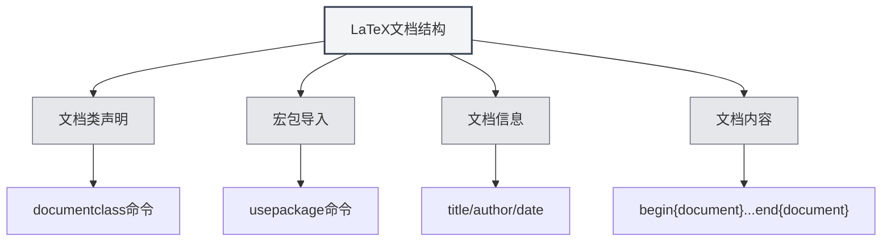

# Sintaxis de LaTeX

## Descripción general

LaTeX es un sistema de composición tipográfica basado en TeX, ampliamente utilizado para la redacción de artículos académicos y documentos científicos. MetaDoc ofrece soporte completo para la edición, compilación y vista previa de LaTeX.

<LaTeXEditorDemo mode="demo" />

<PdfPreviewPanel mode="demo" />

<LaTeXCompilerPanel mode="demo" />

<LaTeXConsole mode="demo" />

## Sintaxis básica

### Estructura del documento

La estructura básica de un documento LaTeX:

```latex
\documentclass{article}
\usepackage[utf8]{inputenc}

\title{Título del documento}
\author{Autor}
\date{\today}

\begin{document}
\maketitle

\section{Título de la sección}
Contenido...

\end{document}
```



### Fórmulas matemáticas

**Fórmulas en línea**:

```latex
Esta es una fórmula en línea: $E = mc^2$
```

**Fórmulas en bloque**:

```latex
\begin{equation}
\int_{-\infty}^{\infty} e^{-x^2} dx = \sqrt{\pi}
\end{equation}
```

**Fórmulas de varias líneas**:

```latex
\begin{align}
x &= a + b \\
y &= c + d
\end{align}
```

### Tablas

Usa el entorno `tabular`:

```latex
\begin{tabular}{|c|c|c|}
\hline
Columna 1 & Columna 2 & Columna 3 \\
\hline
Dato 1 & Dato 2 & Dato 3 \\
\hline
\end{tabular}
```

### Inserción de imágenes

Usa el entorno `figure`:

```latex
\begin{figure}[h]
\centering
\includegraphics[width=0.8\textwidth]{image.png}
\caption{Título de la imagen}
\label{fig:example}
\end{figure}
```

### Referencias bibliográficas

Usa `BibTeX` o `natbib`:

```latex
\bibliographystyle{plain}
\bibliography{references}
```

## Compilación y vista previa

Los documentos LaTeX necesitan ser compilados para generar un PDF. Consulta [[latex.compilation|Compilación y vista previa de LaTeX]] para más detalles.

Una vez compilado, puedes ver el resultado en la [[latex.pdf-preview|función de vista previa de PDF]].

## Documentación relacionada

- [[latex.editor|Guía de uso del editor de LaTeX]]
- [[latex.compilation|Compilación y vista previa de LaTeX]]
- [[latex.pdf-preview|Función de vista previa de PDF]]
- [[latex.console|Salida de la consola]]
