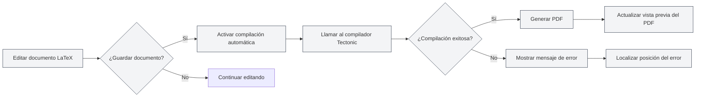
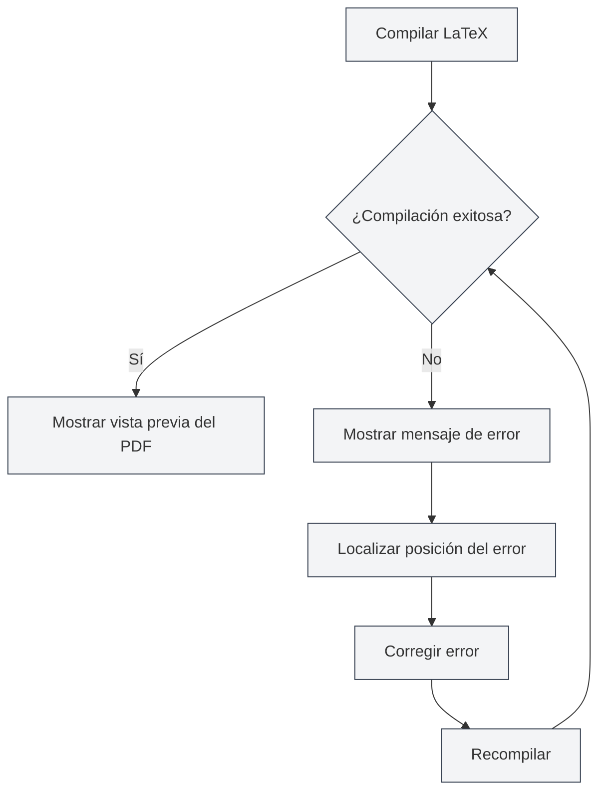

# Compilación y vista previa de LaTeX

## Descripción general

Los documentos LaTeX necesitan ser compilados para generar PDF. MetaDoc utiliza el compilador Tectonic, que admite funciones como compilación automática, vista previa en tiempo real y localización de errores, permitiéndole escribir y depurar documentos LaTeX de manera eficiente.

El proceso de compilación descarga automáticamente los paquetes necesarios, sin necesidad de configuración manual, simplificando enormemente el flujo de trabajo de LaTeX.

## Compilar documentos LaTeX

<LaTeXCompilerPanel mode="demo" />

### Compilación automática

MetaDoc admite la función de compilación automática:

- **Compilar al guardar**: Se activa la compilación automáticamente al guardar el documento LaTeX.
- **Compilación manual**: Haga clic en el botón "Compilar" de la barra de herramientas para activar la compilación manualmente.
- **Estado de compilación**: Durante la compilación se muestra el progreso y el estado.

### Proceso de compilación

<LaTeXConsole mode="demo" />

El proceso de compilación incluye los siguientes pasos:

1.  **Preparar entorno de compilación**: Verificar si el compilador Tectonic está disponible.
2.  **Descargar paquetes**: Descargar automáticamente los paquetes LaTeX utilizados en el documento.
3.  **Ejecutar compilación**: Ejecutar el compilador Tectonic para generar el PDF.
4.  **Procesar salida**: Procesar el registro de compilación y los mensajes de error.
5.  **Actualizar vista previa**: Si la compilación es exitosa, actualizar la vista previa del PDF.

### Opciones de compilación

<LaTeXEditorDemo mode="demo" />

La compilación admite las siguientes opciones:

- **Compilador**: Utilizar el compilador Tectonic (predeterminado).
- **Modo de compilación**: Modo no interactivo, se detiene al encontrar errores.
- **Directorio de salida**: El archivo PDF se guarda en el mismo directorio que el documento.

### Tiempo de compilación

<ConsoleTerminal mode="demo" consoleKey="demo" :history='[{"content": "Tectonic编译器启动...", "type": "out"}, {"content": "解析文档结构", "type": "out"}]' />

El tiempo de compilación depende de:

- **Tamaño del documento**: A mayor tamaño, mayor tiempo de compilación.
- **Cantidad de paquetes**: Cuantos más paquetes se utilicen, mayor será el tiempo de la primera compilación (necesita descargarlos).
- **Cantidad de imágenes**: Cuantas más imágenes contenga, mayor será el tiempo de compilación.

La primera compilación puede llevar más tiempo porque necesita descargar los paquetes. Las compilaciones posteriores serán más rápidas.

## Vista previa del PDF

<PdfPreviewPanel mode="demo" pdfUrl="" />

### Actualización automática

La vista previa del PDF se actualiza automáticamente tras una compilación exitosa:

- **Vista previa en tiempo real**: Muestra la vista previa del PDF inmediatamente después de una compilación exitosa.
- **Actualización automática**: Actualiza automáticamente la vista previa cuando cambia el contenido del PDF.
- **Desplazamiento sincronizado**: Admite la localización sincronizada entre el PDF y el código.

### Funciones de vista previa

<LaTeXCompilerPanel mode="demo" />

El panel de vista previa del PDF ofrece las siguientes funciones:

- **Navegación de páginas**: Página anterior, página siguiente, saltar a una página específica.
- **Control de zoom**: Acercar, alejar, restablecer zoom.
- **Actualizar vista previa**: Actualizar manualmente la vista previa del PDF.
- **Localizar en el código**: Desde una posición en el PDF, localizar el código LaTeX correspondiente.

Consulte [[latex.pdf-preview|Funciones de vista previa de PDF]].

La interfaz del panel de vista previa del PDF es la siguiente:

<PdfPreviewPanel mode="demo" pdfUrl="" />

## Salida de la consola

<LaTeXConsole mode="demo" />

### Registro de compilación

El registro del proceso de compilación se muestra en el panel de salida de la consola:

- **Salida estándar**: La salida normal del proceso de compilación.
- **Mensajes de error**: Información de errores y advertencias de compilación.
- **Actualización en tiempo real**: El registro se actualiza en tiempo real durante la compilación.

La interfaz del panel de salida de la consola es la siguiente:

<ConsoleTerminal mode="demo" consoleKey="demo" :history='[{"content": "编译开始...", "type": "out"}, {"content": "正在下载宏包: amsmath", "type": "out"}, {"content": "警告: 未定义的引用", "type": "warn"}, {"content": "编译完成", "type": "out"}]' />

### Mensajes de error

<ConsoleTerminal mode="demo" consoleKey="demo" :history='[{"content": "错误: 未定义的命令", "type": "error"}, {"content": "警告: 超文本引用未找到", "type": "warn"}]' />

Los errores de compilación se muestran en diferentes colores:

- **Error**: Se muestra en rojo, indica fallo en la compilación.
- **Advertencia**: Se muestra en amarillo, indica posibles problemas.
- **Información**: Se muestra en gris, indica información general.

### Localización de errores

Los errores de compilación muestran:

- **Posición del error**: Muestra el número de línea y columna donde ocurrió el error.
- **Tipo de error**: Muestra el tipo y descripción del error.
- **Salto rápido**: Hacer clic en el mensaje de error permite saltar a la posición correspondiente en el código.

Consulte [[latex.console|Salida de la consola]].

## Localizar en el PDF

<LaTeXEditorDemo mode="demo" />

### Desde el código al PDF

En el editor de LaTeX, puede:

1.  **Seleccionar código**: Seleccionar el código LaTeX.
2.  **Menú contextual**: Hacer clic derecho y seleccionar "Localizar en el PDF".
3.  **Saltar a vista previa**: La vista previa del PDF saltará automáticamente a la posición correspondiente.

### Desde el PDF al código

En la vista previa del PDF, puede:

1.  **Hacer clic en una posición del PDF**: Hacer clic en una ubicación dentro del PDF.
2.  **Salto automático**: El editor saltará automáticamente a la posición del código LaTeX correspondiente.

Esta función le permite cambiar rápidamente entre el PDF y el código, facilitando la depuración y edición.

## Manejo de errores de compilación

<LaTeXConsole mode="demo" />

### Tipos comunes de errores

La compilación de LaTeX puede encontrar los siguientes errores:

- **Errores de sintaxis**: Sintaxis LaTeX incorrecta.
- **Paquete faltante**: Uso de un paquete no instalado (Tectonic lo descargará automáticamente).
- **Archivo faltante**: El archivo referenciado no existe.
- **Error de codificación**: Codificación de archivo incorrecta.

### Flujo de manejo de errores

### Técnicas de depuración

1.  **Revisar la consola**: Examine cuidadosamente los mensajes de error en la salida de la consola.
2.  **Localizar el error**: Utilice la función de localización de errores para encontrar rápidamente el código problemático.
3.  **Corregir paso a paso**: Comience desde el primer error y corríjalos uno por uno.
4.  **Verificar sintaxis**: Asegúrese de que la sintaxis LaTeX sea correcta.
5.  **Verificar archivos**: Asegúrese de que los archivos referenciados existan y las rutas sean correctas.

## Compilador Tectonic

<LaTeXCompilerPanel mode="demo" />

### Introducción al compilador

MetaDoc utiliza el compilador Tectonic, que tiene las siguientes características:

- **No requiere instalación de distribución TeX**: Tectonic es un archivo binario independiente.
- **Descarga automática de paquetes**: Descarga automáticamente los paquetes necesarios desde CTAN durante la compilación.
- **Compilación rápida**: En comparación con las distribuciones TeX tradicionales, la velocidad de compilación es mayor.
- **Soporte multiplataforma**: Compatible con Windows, macOS y Linux.

### Gestión de paquetes

Tectonic gestiona automáticamente los paquetes de LaTeX:

- **Descarga automática**: Se descargan automáticamente en el primer uso.
- **Gestión de caché**: Los paquetes descargados se almacenan en caché, haciendo las compilaciones posteriores más rápidas.
- **Gestión de versiones**: Gestiona automáticamente las versiones de los paquetes.

No necesita descargar ni configurar manualmente ningún paquete, solo utilice el comando `\usepackage{}` en su documento.

## Consejos de uso

<LaTeXEditorDemo mode="demo" />

### Mejorar la velocidad de compilación

1.  **Reducir imágenes**: Disminuya la cantidad de imágenes en el documento.
2.  **Optimizar código**: Optimice la estructura del código LaTeX.
3.  **Usar caché**: Aproveche la caché de paquetes de Tectonic.

### Depurar errores de compilación

1.  **Ver registro completo**: Revise el registro completo de compilación en la consola.
2.  **Verificar sintaxis**: Revise cuidadosamente la sintaxis de LaTeX.
3.  **Compilar paso a paso**: Comente partes del código para localizar el problema gradualmente.
4.  **Consultar documentación**: Consulte la documentación de los paquetes de LaTeX.

### Optimizar el flujo de compilación

1.  **Compilar al guardar**: Active la compilación automática al guardar.
2.  **Usar vista previa**: Utilice la vista previa del PDF para ver rápidamente el resultado.
3.  **Función de localización**: Use la función de localización para cambiar rápidamente entre código y PDF.

## Preguntas frecuentes

### P: ¿Qué hacer si falla la compilación?

R: Revise los mensajes de error en la salida de la consola y corrija el código según las indicaciones. Los problemas comunes incluyen errores de sintaxis, archivos faltantes, etc.

### P: ¿El tiempo de compilación es muy largo?

R: La primera compilación necesita descargar paquetes, es normal que tarde más. Las compilaciones posteriores serán más rápidas. Si sigue siendo lenta, verifique el tamaño del documento y la cantidad de imágenes.

### P: ¿Falla la descarga de paquetes?

R: Verifique su conexión a Internet, asegúrese de poder acceder a CTAN. Tectonic reintentará la descarga automáticamente.

### P: ¿La vista previa del PDF no se actualiza?

R: Haga clic en el botón "Actualizar" para refrescar manualmente la vista previa, o verifique si la compilación fue exitosa.

### P: ¿Cómo ver el registro de compilación?

R: El registro de compilación se muestra en el panel de salida de la consola, donde puede ver la salida estándar, mensajes de error y advertencias.

## Documentación relacionada

- [[latex.editor|Guía de uso del editor LaTeX]]
- [[latex.basics|Sintaxis de LaTeX]]
- [[latex.pdf-preview|Funciones de vista previa de PDF]]
- [[latex.console|Salida de la consola]]

<LaTeXCompilerPanel mode="demo" />

<LaTeXEditorDemo mode="demo" />
