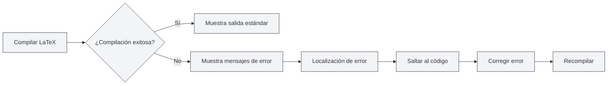

# Salida de la Consola

## Descripción General

El panel de salida de la consola muestra la información de registro del proceso de compilación de LaTeX, incluyendo la salida estándar, mensajes de error, advertencias, etc. Al revisar la salida de la consola, puede comprender el proceso de compilación, localizar errores y depurar problemas.

La salida de la consola utiliza el editor Monaco para su visualización, ofreciendo funciones como resaltado de sintaxis, localización de errores y filtrado de registros, permitiéndole ver y analizar los registros de compilación de manera eficiente.

## Salida de Compilación LaTeX

<LaTeXConsole mode="demo" />

### Salida Estándar

La salida estándar del proceso de compilación se muestra en la consola:

- **Progreso de la compilación**: Muestra las distintas etapas de la compilación.
- **Descarga de paquetes**: Muestra información sobre los paquetes descargados.
- **Información de compilación**: Muestra detalles del proceso de compilación.

La salida estándar se muestra como texto normal, ayudándole a entender el proceso de compilación.

La interfaz del panel de salida de la consola es la siguiente:

<ConsoleTerminal mode="demo" consoleKey="demo" :history='[{"content": "Compilación iniciada...", "type": "out"}, {"content": "Advertencia: referencia no definida", "type": "warn"}, {"content": "Compilación completada", "type": "out"}]' />

### Formato de Salida

<ConsoleTerminal mode="demo" consoleKey="demo" :history='[{"content": "Información de salida estándar", "type": "out"}, {"content": "Mensaje de advertencia", "type": "warn"}, {"content": "Mensaje de error", "type": "error"}]' />

La salida de la consola utiliza diferentes colores para distinguir los tipos de información:

- **Salida estándar**: Texto gris, muestra información normal de compilación.
- **Mensajes de error**: Texto rojo, muestra errores de compilación.
- **Mensajes de advertencia**: Texto amarillo, muestra advertencias de compilación.
- **Información de depuración**: Texto gris oscuro, muestra información de depuración.

## Visualización de Mensajes de Error

<LaTeXConsole mode="demo" />

### Formato de Error

Los errores de compilación se muestran en un formato específico:

- **Ubicación del error**: Muestra el nombre del archivo, número de línea y columna donde ocurrió el error.
- **Tipo de error**: Muestra el tipo de error (por ejemplo, error de sintaxis, archivo faltante, etc.).
- **Descripción del error**: Muestra una descripción detallada del error.

### Localización de Errores

La salida de la consola soporta la función de localización de errores:

- **Hacer clic en el error**: Al hacer clic en un mensaje de error, se salta a la posición correspondiente en el código.
- **Resaltado**: La línea de código correspondiente al error se resalta.
- **Reparación rápida**: Localiza rápidamente la posición del error para facilitar su corrección.

### Tipos Comunes de Errores

La compilación de LaTeX puede encontrar los siguientes errores:

- **Errores de sintaxis**: Sintaxis de LaTeX incorrecta.
- **Comando no definido**: Uso de un comando de LaTeX no definido.
- **Entorno no cerrado**: Entorno que no se cerró correctamente.
- **Archivo faltante**: Archivo referenciado que no existe.
- **Error de paquete**: Fallo al cargar un paquete o conflicto entre paquetes.

## Visualización de Mensajes de Advertencia

<ConsoleTerminal mode="demo" consoleKey="demo" :history='[{"content": "Advertencia: referencia no definida", "type": "warn"}]' />

### Formato de Advertencia

Las advertencias de compilación se muestran en un formato específico:

- **Ubicación de la advertencia**: Muestra la ubicación donde ocurrió la advertencia.
- **Tipo de advertencia**: Muestra el tipo de advertencia.
- **Descripción de la advertencia**: Muestra una descripción detallada de la advertencia.

### Manejo de Advertencias

Los mensajes de advertencia generalmente no detienen la compilación, pero pueden afectar el resultado final:

- **Revisar advertencias**: Examine cuidadosamente los mensajes de advertencia para comprender posibles problemas.
- **Corregir advertencias**: Corrija el código según la información de la advertencia.
- **Ignorar advertencias**: Si la advertencia no afecta el resultado, puede ignorarse temporalmente.

## Filtrado de Registros

<LaTeXConsole mode="demo" />

### Función de Filtrado

La salida de la consola soporta la función de filtrado de registros:

- **Filtrar por tipo**: Mostrar solo errores, advertencias o salida estándar.
- **Filtrar por palabra clave**: Filtrar registros que contengan palabras clave específicas.
- **Filtrar por tiempo**: Filtrar registros de un período de tiempo específico.

### Configuración del Filtro

El filtrado de registros se puede configurar en el panel de la consola:

1.  Abra el panel de salida de la consola.
2.  Utilice las opciones de filtro para seleccionar el contenido a mostrar.
3.  Ingrese palabras clave para buscar y filtrar.

### Borrar Registros

Para borrar la salida de la consola:

- **Botón Borrar**: Haga clic en el botón "Borrar" de la consola.
- **Atajo de teclado**: `Ctrl+L` (si está configurado).

Borrar los registros eliminará toda la información de registro mostrada.

## Operaciones con Registros

<ConsoleTerminal mode="demo" consoleKey="demo" :history='[{"content": "Contenido del registro de compilación...", "type": "out"}]' />

### Copiar Registros

Copiar la salida de la consola al portapapeles:

- **Botón Copiar**: Haga clic en el botón "Copiar" de la consola.
- **Atajo de teclado**: `Ctrl+C` (después de seleccionar el texto).

Copiar registros permite guardarlos en otro lugar o compartirlos con otros.

### Guardar Registros

Guardar la salida de la consola en un archivo:

- **Botón Guardar**: Haga clic en el botón "Guardar registro" de la consola.
- **Selección de archivo**: Elija la ubicación y el nombre del archivo.

Los archivos de registro guardados pueden usarse para análisis posteriores o reportes de problemas.

### Análisis con IA

La salida de la consola soporta la función de análisis con IA:

- **Habilitar análisis IA**: Active el interruptor de análisis IA en el panel de la consola.
- **Análisis automático**: La IA analizará automáticamente los mensajes de error y proporcionará sugerencias de corrección.
- **Ver sugerencias**: Revise las sugerencias de corrección de errores proporcionadas por la IA.

La función de análisis con IA puede ayudarle a comprender y corregir errores de compilación rápidamente.

## Configuración de la Consola

<LaTeXConsole mode="demo" />

### Opciones de Visualización

La salida de la consola soporta las siguientes opciones de visualización:

- **Mostrar números de línea**: Muestra los números de línea de los registros.
- **Ajuste de línea automático**: Las líneas largas se ajustan automáticamente.
- **Tamaño de fuente**: Ajusta el tamaño de fuente de visualización de los registros.

### Configuración del Tema

La salida de la consola sigue el tema del editor:

- **Tema claro**: Usa un fondo claro en el tema claro.
- **Tema oscuro**: Usa un fondo oscuro en el tema oscuro.
- **Sincronización automática**: Sincroniza automáticamente con la configuración del tema del editor.

## Consejos de Uso

<ConsoleTerminal mode="demo" consoleKey="demo" :history='[{"content": "Localizando posición del error...", "type": "out"}]' />

### Localización Rápida de Errores

1.  **Revisar mensajes de error**: Examine cuidadosamente el formato y contenido de los mensajes de error.
2.  **Usar la función de localización**: Haga clic en el mensaje de error para saltar rápidamente a la posición en el código.
3.  **Verificar contexto**: Revise el código alrededor de la posición del error.

### Comprender los Registros de Compilación

1.  **Leer la salida estándar**: Comprenda las distintas etapas del proceso de compilación.
2.  **Enfocarse en los errores**: Priorice la corrección de los mensajes de error.
3.  **Revisar advertencias**: Revise los mensajes de advertencia para entender posibles problemas.

### Técnicas de Depuración

1.  **Compilación paso a paso**: Comente partes del código para localizar problemas gradualmente.
2.  **Ver registro completo**: Revise el registro de compilación completo para entender el proceso.
3.  **Usar análisis IA**: Habilite la función de análisis IA para obtener sugerencias de corrección.

## Preguntas Frecuentes

<LaTeXConsole mode="demo" />

### P: ¿La salida de la consola no se muestra?

R: Asegúrese de que el panel de salida de la consola esté abierto. Se abrirá automáticamente al compilar un documento LaTeX.

### P: ¿Cómo encontrar errores rápidamente?

R: Los mensajes de error se muestran en rojo. Haga clic en ellos para saltar rápidamente a la posición en el código.

### P: ¿Qué hacer si hay demasiados registros?

R: Use la función de filtrado para eliminar registros innecesarios, o use la función de borrado para limpiar registros antiguos.

### P: ¿Cómo guardar el registro de compilación?

R: Haga clic en el botón "Guardar registro" de la consola y seleccione la ubicación para guardar el archivo de registro.

### P: ¿El análisis IA no es preciso?

R: El análisis IA es solo una referencia. Se recomienda juzgar combinando la información del error y el contexto del código. Puede corregir manualmente o reanalizar.

## Documentación Relacionada

- [[latex.compilation|Compilación y Vista Previa de LaTeX]]
- [[latex.editor|Guía de Uso del Editor LaTeX]]
- [[latex.pdf-preview|Función de Vista Previa PDF]]

<PdfPreviewPanel mode="demo" pdfUrl="" />

<LaTeXCompilerPanel mode="demo" />

<LaTeXEditorDemo mode="demo" />