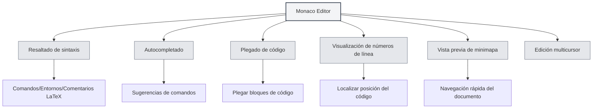

# Guía de uso del editor LaTeX

## Descripción general

El editor LaTeX de MetaDoc está basado en Monaco Editor, ofreciendo una experiencia profesional de edición de código LaTeX. El editor admite resaltado de sintaxis, autocompletado, plegado de código y otras funciones para ayudarle a escribir documentos LaTeX de manera eficiente.

Monaco Editor es el núcleo del editor utilizado por Visual Studio Code, con una potente capacidad de edición de código y ricas características funcionales.

<PdfPreviewPanel mode="demo" pdfUrl="" />

<ConsoleTerminal mode="demo" consoleKey="demo" :history='[{"content": "Compilación completada", "type": "out"}]' />

<LaTeXEditor mode="demo" />

## Introducción a Monaco Editor

Monaco Editor proporciona las siguientes características para la edición de LaTeX:

- **Resaltado de sintaxis**: Los diferentes elementos de sintaxis como comandos, entornos y comentarios de LaTeX se muestran en colores distintos.
- **Autocompletado**: Muestra sugerencias de autocompletado automáticamente al escribir comandos LaTeX.
- **Plegado de código**: Admite plegar bloques de código para facilitar la navegación en documentos largos.
- **Visualización de números de línea**: Muestra números de línea para facilitar la localización del código.
- **Vista previa de minimapa**: Muestra una miniatura del código en el lado derecho para navegar rápidamente por la estructura del documento.
- **Edición multicursor**: Admite la edición simultánea con múltiples cursores.

<LaTeXEditorDemo mode="demo" />

## Resaltado de código y sugerencias de sintaxis

### Resaltado de sintaxis

El editor LaTeX identifica y resalta automáticamente:

- **Comandos**: Comandos LaTeX como `\documentclass`, `\usepackage`, etc.
- **Entornos**: Marcadores de entorno como `\begin{document}`, `\end{document}`, etc.
- **Comentarios**: Líneas de comentario que comienzan con `%`.
- **Fórmulas matemáticas**: Áreas de fórmulas matemáticas envueltas en `$`, `$$`.
- **Caracteres especiales**: Caracteres especiales como `&`, `#`, `$`.

El resaltado de sintaxis hace que la estructura del código sea más clara, facilitando su lectura y edición.

### Sugerencias de sintaxis

El editor mostrará sugerencias de sintaxis en las siguientes situaciones:

- **Al escribir comandos**: Muestra automáticamente los comandos LaTeX disponibles después de escribir `\`.
- **Al escribir entornos**: Muestra los nombres de entorno disponibles después de escribir `\begin{`.
- **Al escribir nombres de paquetes**: Muestra nombres de paquetes comunes después de escribir `\usepackage{`.

Las sugerencias de sintaxis le ayudan a escribir rápidamente los comandos LaTeX correctos, reduciendo errores de entrada.

<LaTeXEditor mode="demo" />

## Visualización de números de línea

### Mostrar números de línea

Los números de línea se muestran en el lado izquierdo del editor, ayudándole a:

- **Localizar código**: Ir rápidamente a una línea específica.
- **Encontrar errores**: Los errores de compilación muestran el número de línea, facilitando la localización del problema.
- **Referenciar código**: Facilitar la referencia a líneas de código específicas en el documento.

### Configurar números de línea

La visualización de números de línea se puede configurar en los ajustes:

1. Abra la página de ajustes.
2. Encuentre la opción "Mostrar números de línea".
3. Active o desactive el interruptor para habilitar o deshabilitar los números de línea.

La configuración de números de línea afecta a todos los editores Monaco (editor LaTeX, editor de texto plano, etc.).

<LaTeXEditorDemo mode="demo" />

## Vista previa del minimapa

### Función del minimapa

El minimapa es una miniatura del código en el lado derecho del editor:

- **Navegación rápida**: Puede ver la estructura completa del documento en el minimapa.
- **Posicionamiento rápido**: Haga clic en el minimapa para saltar rápidamente a la posición correspondiente.
- **Vista previa de la estructura**: Comprenda las diferentes partes del documento a través de las diferencias de color.

### Mostrar/Ocultar minimapa

El minimapa se puede controlar de las siguientes maneras:

1. Haga clic derecho en el editor.
2. Busque la opción "Minimapa" o "Minimap".
3. Cambie el estado de visualización.

El minimapa es especialmente útil para editar documentos largos, ayudándole a comprender rápidamente la estructura del documento.

## Plegado de código

### Función de plegado

El plegado de código le permite plegar bloques de código, ocultando las partes que no necesita ver:

- **Plegar entornos**: Plegar bloques de entorno `\begin{...}...\end{...}`.
- **Plegar funciones**: Plegar definiciones de comandos personalizados.
- **Plegar comentarios**: Plegar grandes secciones de comentarios.

### Usar el plegado

- **Plegar**: Haga clic en el icono de plegado a la izquierda del número de línea, o use el atajo de teclado `Ctrl+Shift+[`.
- **Expandir**: Haga clic en la marca de plegado, o use el atajo de teclado `Ctrl+Shift+]`.
- **Plegar todo**: Use el atajo de teclado `Ctrl+K Ctrl+0` para plegar todos los bloques de código.
- **Expandir todo**: Use el atajo de teclado `Ctrl+K Ctrl+J` para expandir todos los bloques de código.

El plegado de código le permite concentrarse en la parte que está editando actualmente, mejorando la eficiencia de edición.

<LaTeXEditorDemo mode="demo" />

## Autocompletado

### Activación del autocompletado

El editor mostrará automáticamente sugerencias de autocompletado en las siguientes situaciones:

- **Al escribir comandos**: Muestra una lista de comandos LaTeX después de escribir `\`.
- **Al escribir entornos**: Muestra nombres de entorno después de escribir `\begin{`.
- **Al escribir nombres de paquetes**: Muestra nombres de paquetes comunes después de escribir `\usepackage{`.
- **Otros caracteres**: También puede mostrar sugerencias relacionadas después de escribir otros caracteres.

### Aceptar autocompletado

- **Tecla Enter**: Acepta la sugerencia de autocompletado actualmente seleccionada.
- **Tecla Tab**: Acepta la sugerencia de autocompletado actualmente seleccionada.
- **Teclas de flecha**: Mueve la selección hacia arriba/abajo en la lista de autocompletado.
- **Tecla Esc**: Cancela las sugerencias de autocompletado.

### Configuración del autocompletado

La función de autocompletado se puede configurar en los ajustes del editor:

- **Sugerencias rápidas**: Muestra automáticamente sugerencias de autocompletado después de otros caracteres.
- **Caracteres de activación**: Muestra automáticamente autocompletado después de caracteres específicos (como `\`).
- **Caracteres de aceptación**: Acepta automáticamente el autocompletado al escribir caracteres de envío.

<LaTeXEditor mode="demo" />

## Funciones de edición

### Edición multicursor

Monaco Editor admite la edición simultánea con múltiples cursores:

- **Alt+Clic**: Agrega un nuevo cursor en la posición del clic.
- **Ctrl+Alt+Flecha arriba/abajo**: Agrega un cursor arriba/abajo.
- **Ctrl+D**: Selecciona la siguiente palabra idéntica y agrega un cursor.
- **Ctrl+Shift+L**: Selecciona todas las palabras idénticas y agrega cursores.

La edición multicursor permite modificar múltiples posiciones simultáneamente, mejorando la eficiencia de edición.

### Selección de columna

Admite el modo de selección de columna:

- **Alt+Shift+Arrastrar**: Selecciona un área rectangular.
- **Alt+Shift+Teclas de flecha**: Expande la selección de columna.

La selección de columna es adecuada para editar tablas o código alineado.

### Formateo de código

El editor admite formateo básico de código:

- **Sangría automática**: Sangra automáticamente según la estructura del código.
- **Ajuste de línea automático**: Muestra líneas largas con ajuste automático.
- **Método de sangría**: Admite diferentes métodos de sangría (espacios, Tab).

<LaTeXEditorDemo mode="demo" />

## Buscar y reemplazar

### Función de búsqueda

- **Atajo de teclado**: `Ctrl+F` abre el cuadro de diálogo de búsqueda.
- **Resaltado**: Los resultados de la búsqueda se resaltan en el documento.
- **Búsqueda circular**: Comienza automáticamente desde el principio al llegar al final del documento.

### Función de reemplazo

- **Atajo de teclado**: `Ctrl+H` abre el cuadro de diálogo de buscar y reemplazar.
- **Reemplazo individual**: Reemplaza el texto coincidente uno por uno.
- **Reemplazar todo**: Reemplaza todo el texto coincidente de una vez.

### Opciones avanzadas

La búsqueda y reemplazo admite las siguientes opciones:

- **Distinguir mayúsculas y minúsculas**: Solo coincide con texto que tenga exactamente las mismas mayúsculas/minúsculas.
- **Coincidencia de palabra completa**: Solo coincide con palabras completas.
- **Expresión regular**: Usa expresiones regulares para la coincidencia de patrones.

<LaTeXEditorDemo mode="demo" />

## Referencia de atajos de teclado

### Atajos de edición

| Operación | Windows/Linux | macOS   |
| --------- | ------------- | ------- |
| Deshacer  | `Ctrl+Z`      | `Cmd+Z` |
| Rehacer   | `Ctrl+Y`      | `Cmd+Y` |
| Copiar    | `Ctrl+C`      | `Cmd+C` |
| Pegar     | `Ctrl+V`      | `Cmd+V` |
| Seleccionar todo | `Ctrl+A` | `Cmd+A` |
| Buscar    | `Ctrl+F`      | `Cmd+F` |
| Reemplazar | `Ctrl+H`     | `Cmd+H` |

### Atajos de plegado de código

| Operación     | Windows/Linux   | macOS          |
| ------------- | --------------- | -------------- |
| Plegar        | `Ctrl+Shift+[`  | `Cmd+Option+[` |
| Expandir      | `Ctrl+Shift+]`  | `Cmd+Option+]` |
| Plegar todo   | `Ctrl+K Ctrl+0` | `Cmd+K Cmd+0`  |
| Expandir todo | `Ctrl+K Ctrl+J` | `Cmd+K Cmd+J`  |

### Atajos multicursor

| Operación               | Windows/Linux  | macOS          |
| ----------------------- | -------------- | -------------- |
| Agregar cursor          | `Alt+Clic`     | `Option+Clic`  |
| Agregar cursor arriba   | `Ctrl+Alt+↑`   | `Cmd+Option+↑` |
| Agregar cursor abajo    | `Ctrl+Alt+↓`   | `Cmd+Option+↓` |
| Seleccionar siguiente palabra idéntica | `Ctrl+D` | `Cmd+D` |
| Seleccionar todas las palabras idénticas | `Ctrl+Shift+L` | `Cmd+Shift+L` |

<LaTeXEditor mode="demo" />

## Consejos de uso

### Entrada rápida

1. **Autocompletado de comandos**: Después de escribir `\`, use las teclas de flecha para seleccionar el comando y presione Enter para aceptar.
2. **Autocompletado de entornos**: Después de escribir `\begin{`, seleccione el nombre del entorno y el editor completará automáticamente `\end{...}`.
3. **Autocompletado de nombres de paquetes**: Después de escribir `\usepackage{`, seleccione el nombre del paquete para agregar rápidamente el paquete.

<LaTeXEditor mode="demo" />

### Organización del código

1. **Usar plegado**: Plegue los bloques de código que no necesita ver para mantener el área de edición ordenada.
2. **Usar comentarios**: Agregue comentarios para explicar la funcionalidad del código, facilitando el mantenimiento posterior.
3. **Sangría adecuada**: Mantenga una sangría de código consistente para mejorar la legibilidad.

<LaTeXEditorDemo mode="demo" />

### Localización de errores

1. **Ver números de línea**: Los errores de compilación muestran el número de línea, localícelo rápidamente en el editor.
2. **Usar búsqueda**: Use la función de búsqueda para localizar rápidamente comandos o texto específicos.
3. **Usar el minimapa**: Navegue rápidamente por la estructura del documento en el minimapa.

## Preguntas frecuentes

### P: ¿No se muestra el autocompletado?

R: Verifique si la opción "Sugerencias rápidas" en los ajustes del editor está habilitada. Deberían mostrarse automáticamente sugerencias de autocompletado después de escribir `\`.

### P: ¿Cómo se pliega el código?

R: Haga clic en el icono de plegado a la izquierda del número de línea, o use el atajo de teclado `Ctrl+Shift+[`. Los bloques de entorno plegados mostrarán una marca de plegado a la izquierda del número de línea.

### P: ¿No se muestra el minimapa?

R: Verifique si la opción "Minimapa" en los ajustes del editor está habilitada. El minimapa se muestra en el lado derecho del editor.

### P: ¿Cómo saltar rápidamente a una línea específica?

R: Use el atajo de teclado `Ctrl+G` (Windows/Linux) o `Cmd+G` (macOS) para abrir el cuadro de diálogo "Ir a línea", ingrese el número de línea y salte.

### P: ¿El formateo del código es incorrecto?

R: Monaco Editor sangrará automáticamente según la sintaxis de LaTeX. Si la sangría es incorrecta, puede ajustarla manualmente o usar la tecla Tab.

## Documentación relacionada

- [[latex.basics|Sintaxis de LaTeX]]
- [[latex.compilation|Compilación y vista previa de LaTeX]]
- [[latex.pdf-preview|Función de vista previa PDF]]
- [[latex.console|Salida de la consola]]
- [[core.editor-basics|Operaciones básicas del editor]]
- [[core.editor-settings|Ajustes del editor]]
