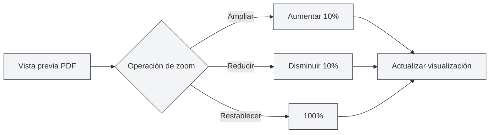

# Función de vista previa de PDF

## Descripción general

La función de vista previa de PDF le permite ver en tiempo real el efecto del PDF compilado mientras edita documentos LaTeX. El panel de vista previa ofrece ricas funciones interactivas, incluyendo zoom, cambio de página, posicionamiento, etc., permitiéndole editar y depurar documentos LaTeX de manera eficiente.

La vista previa de PDF se mostrará automáticamente después de una compilación exitosa de LaTeX, y admite posicionamiento bidireccional con el editor de código, facilitando el cambio rápido entre el PDF y el código.

<PdfPreviewPanel mode="demo" pdfUrl="" />

## Introducción a la vista previa de PDF

### Panel de vista previa

El panel de vista previa de PDF se muestra a la derecha o debajo del editor LaTeX, e incluye:

- **Área de contenido del PDF**: Muestra el contenido de las páginas del PDF
- **Barra de herramientas**: Proporciona botones de acción como zoom, cambio de página, actualizar, etc.
- **Información de página**: Muestra el número de página actual y el total de páginas

La interfaz del panel de vista previa de PDF es la siguiente:

<PdfPreviewPanel mode="demo" pdfUrl="" />

<LaTeXCompilerPanel mode="demo" />

### Visualización automática

La vista previa de PDF se mostrará automáticamente en las siguientes situaciones:

- **Compilación exitosa**: Se muestra automáticamente la vista previa del PDF después de una compilación exitosa de LaTeX
- **Abrir documento**: Se muestra automáticamente la vista previa al abrir un documento LaTeX que ya tiene un PDF
- **Apertura manual**: Haga clic en el botón "Vista previa" de la barra de herramientas para abrir la vista previa manualmente

<PdfPreviewPanel mode="demo" pdfUrl="" />

## Zoom del PDF

### Ampliar PDF

Para ampliar la vista previa del PDF:

- **Botón de la barra de herramientas**: Haga clic en el botón "Ampliar" (icono +) de la barra de herramientas
- **Rueda del ratón**: Mantenga presionada la tecla `Ctrl` y gire la rueda del ratón hacia arriba
- **Atajo de teclado**: `Ctrl+=` (si está configurado)

Cada ampliación aumenta la escala de zoom en un 10%.

<LaTeXEditorDemo mode="demo" />

### Reducir PDF

Para reducir la vista previa del PDF:

- **Botón de la barra de herramientas**: Haga clic en el botón "Reducir" (icono -) de la barra de herramientas
- **Rueda del ratón**: Mantenga presionada la tecla `Ctrl` y gire la rueda del ratón hacia abajo
- **Atajo de teclado**: `Ctrl+-` (si está configurado)

Cada reducción disminuye la escala de zoom en un 10%.

### Restablecer zoom

Para restablecer el zoom del PDF al 100%:

- **Botón de la barra de herramientas**: Haga clic en el botón "Restablecer zoom" de la barra de herramientas
- **Atajo de teclado**: `Ctrl+0` (si está configurado)

### Rango de zoom

El rango de zoom admitido para el PDF:

- **Valor mínimo**: 20% (0.2x)
- **Valor máximo**: 500% (5x)
- **Valor predeterminado**: 100% (1x)

La escala de zoom se limitará automáticamente al rango válido.

<PdfPreviewPanel mode="demo" pdfUrl="" />

## Actualización del PDF

### Actualización manual

Para actualizar manualmente la vista previa del PDF:

- **Botón de la barra de herramientas**: Haga clic en el botón "Actualizar" de la barra de herramientas
- **Atajo de teclado**: `F5` (si está configurado)

La actualización recargará el archivo PDF, mostrando los resultados de la compilación más reciente.

### Actualización automática

La vista previa del PDF se actualizará automáticamente en las siguientes situaciones:

- **Compilación exitosa**: Se actualiza automáticamente la vista previa después de una compilación exitosa de LaTeX
- **Actualización del archivo PDF**: Se actualiza automáticamente cuando se detecta una actualización del archivo PDF

### Momento de actualización

Se recomienda actualizar el PDF en las siguientes situaciones:

- **Después de modificar el código**: Después de modificar el código LaTeX y recompilar
- **Vista previa anómala**: Cuando la vista previa del PDF muestra anomalías o contenido incorrecto
- **Edición prolongada**: Después de una edición prolongada para ver el efecto más reciente

<LaTeXEditorDemo mode="demo" />

## Posicionamiento del PDF al código

### Desde el PDF al código

Al hacer clic en una ubicación en la vista previa del PDF, el editor saltará automáticamente a la posición correspondiente del código LaTeX:

1. **Haga clic en la ubicación del PDF**: Haga clic en la ubicación que desea ver en la vista previa del PDF
2. **Salto automático**: El editor salta automáticamente al código LaTeX correspondiente
3. **Resaltado**: La línea de código correspondiente se resaltará

Esta función le permite ubicar rápidamente el código fuente desde el efecto del PDF, facilitando la depuración y modificación.

<PdfPreviewPanel mode="demo" pdfUrl="" />

### Desde el código al PDF

En el editor LaTeX, puede:

1. **Seleccionar código**: Seleccione el código LaTeX que desea ver
2. **Menú contextual**: Haga clic derecho y seleccione "Posicionar al PDF"
3. **Salto a vista previa**: La vista previa del PDF salta automáticamente a la posición correspondiente

### Posicionamiento bidireccional

Función de posicionamiento bidireccional entre el PDF y el código:

- **PDF → Código**: Haga clic en una ubicación del PDF para saltar al código
- **Código → PDF**: Seleccione código para saltar a la ubicación del PDF
- **Desplazamiento sincronizado**: Admite desplazamiento sincronizado entre el PDF y el código

<ConsoleTerminal mode="demo" consoleKey="demo" :history='[{"content": "Navegación de páginas PDF...", "type": "out"}]' />

## Navegación de páginas del PDF

### Operaciones de cambio de página

La vista previa del PDF admite las siguientes operaciones de cambio de página:

- **Página anterior**: Haga clic en el botón "Página anterior" de la barra de herramientas, o use las teclas de dirección
- **Página siguiente**: Haga clic en el botón "Página siguiente" de la barra de herramientas, o use las teclas de dirección
- **Ir a página**: Ingrese el número de página en el cuadro de entrada de página y presione Enter

### Información de página

La vista previa del PDF muestra la siguiente información de página:

- **Número de página actual**: Muestra el número de página que se está viendo actualmente
- **Número total de páginas**: Muestra el número total de páginas del PDF
- **Cuadro de entrada de página**: Permite ingresar directamente un número de página para saltar

### Visualización de múltiples páginas

La vista previa del PDF admite el modo de visualización de múltiples páginas:

- **Modo de una página**: Muestra una página a la vez
- **Modo de múltiples páginas**: Muestra varias páginas a la vez (en la vista previa principal)

El modo de múltiples páginas es adecuado para navegar rápidamente por todo el documento.

<PdfPreviewPanel mode="demo" pdfUrl="" />

## Guardado del PDF

### Guardar PDF

Para guardar el archivo PDF actual:

- **Botón de la barra de herramientas**: Haga clic en el botón "Guardar" de la barra de herramientas
- **Menú**: Haga clic en "Archivo" → "Guardar PDF"
- **Atajo de teclado**: `Ctrl+S` (si el PDF es el documento activo actual)

Guardar el PDF almacenará el archivo PDF en el mismo directorio que el documento.

### Abrir directorio del PDF

Para abrir el directorio donde se encuentra el archivo PDF:

- **Botón de la barra de herramientas**: Haga clic en el botón "Abrir directorio" de la barra de herramientas
- **Menú**: Haga clic en "Archivo" → "Abrir directorio del PDF"

Después de abrir el directorio, puede ver y gestionar el archivo PDF en el administrador de archivos.

<LaTeXEditorDemo mode="demo" />

## Modos de interacción del PDF

### Modo puntero

El modo puntero es el modo de interacción predeterminado:

- **Seleccionar texto**: Puede seleccionar texto en el PDF
- **Copiar texto**: Puede copiar el texto seleccionado
- **Clic para posicionar**: Haga clic en una ubicación del PDF para posicionarse en el código

### Modo mano

El modo mano se utiliza para arrastrar el PDF:

- **Arrastrar PDF**: Mantenga presionado el botón izquierdo del ratón para arrastrar el contenido del PDF
- **Mover vista**: Mueva la posición de la vista del PDF
- **Adecuado para PDF grandes**: Adecuado para ver PDF de gran tamaño

Para cambiar de modo:

- **Botón de la barra de herramientas**: Haga clic en el botón de cambio de modo de la barra de herramientas
- **Atajo de teclado**: Tecla `H` para cambiar al modo mano

## Consejos de uso

### Vista previa eficiente

1. **Usar zoom**: Ajuste la escala de zoom adecuada según el contenido
2. **Usar posicionamiento**: Use la función de posicionamiento para cambiar rápidamente entre código y PDF
3. **Usar actualización**: Actualice oportunamente después de modificar el código para ver el efecto

### Técnicas de depuración

1. **Ubicar errores**: Desde el PDF al código, encuentre rápidamente la ubicación del problema
2. **Comparar efectos**: Compare el efecto del PDF con el código, verifique si el formato es correcto
3. **Navegación multipágina**: Use el modo de múltiples páginas para navegar rápidamente por todo el documento

### Optimización de rendimiento

1. **Zoom razonable**: No use escalas de zoom excesivamente grandes
2. **Cerrar vista previa**: Cierre el panel de vista previa cuando no sea necesario para ahorrar recursos
3. **Estrategia de actualización**: Elija actualización automática o manual según sea necesario

## Preguntas frecuentes

### P: ¿La vista previa del PDF no se muestra?

R: Asegúrese de que el documento LaTeX se haya compilado correctamente. Si la compilación falla, la vista previa del PDF no se mostrará. Verifique los mensajes de error en la salida de la consola.

### P: ¿La vista previa del PDF no se actualiza?

R: Haga clic en el botón "Actualizar" para actualizar manualmente la vista previa, o recompile el documento LaTeX. Asegúrese de que el archivo PDF se haya generado correctamente.

### P: ¿Cómo posicionarse desde el PDF al código?

R: Haga clic en la ubicación que desea ver en la vista previa del PDF, el editor saltará automáticamente al código LaTeX correspondiente.

### P: ¿Cómo posicionarse desde el código al PDF?

R: Seleccione el código LaTeX, haga clic derecho y seleccione "Posicionar al PDF", la vista previa del PDF saltará automáticamente a la posición correspondiente.

### P: ¿El zoom del PDF no funciona?

R: Asegúrese de que el panel de vista previa del PDF se haya cargado completamente. Si el problema persiste, intente actualizar la vista previa del PDF.

## Documentación relacionada

- [[latex.compilation|Compilación y vista previa de LaTeX]]
- [[latex.editor|Guía de uso del editor LaTeX]]
- [[latex.console|Salida de la consola]]

<LaTeXCompilerPanel mode="demo" />

<LaTeXEditorDemo mode="demo" />

<ConsoleTerminal mode="demo" consoleKey="demo" :history='[{"content": "Registro de compilación...", "type": "out"}]' />
