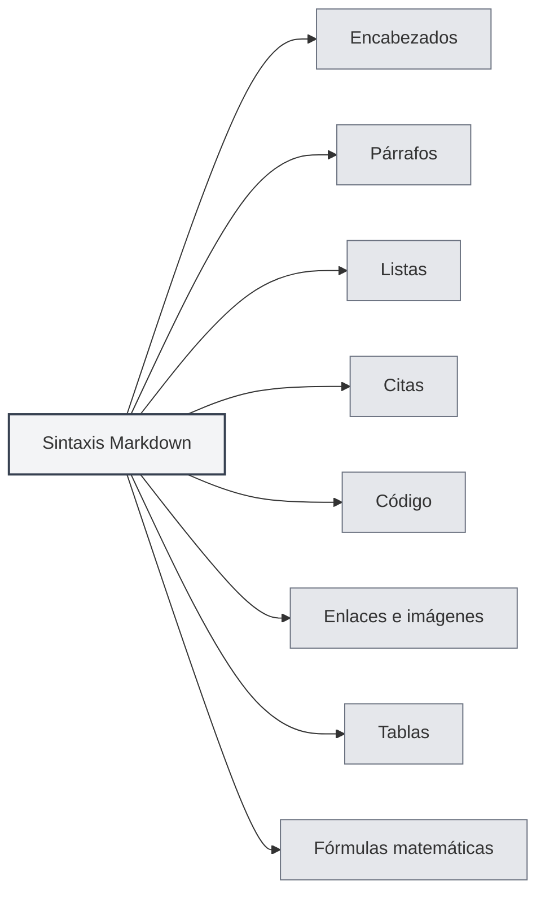

# Sintaxis Markdown

## Descripción general

Markdown es un lenguaje de marcado ligero que le permite escribir documentos utilizando un formato de texto plano fácil de leer y escribir. MetaDoc ofrece soporte completo para la edición y vista previa de Markdown.

<ViewMenuItemsDemo mode="demo" :items='["outline", "preview"]' />

## Sintaxis básica

### Encabezados

Utilice el símbolo `#` para crear encabezados. El número de `#` indica el nivel del encabezado:

```markdown
# Encabezado de nivel 1

## Encabezado de nivel 2

### Encabezado de nivel 3
```



### Párrafos

Separe los párrafos con líneas en blanco.

### Listas

**Listas desordenadas** utilice `-`, `*` o `+`:

```markdown
- Elemento 1
- Elemento 2
- Elemento 3
```

**Listas ordenadas** utilice números:

```markdown
1. Primer elemento
2. Segundo elemento
3. Tercer elemento
```

### Citas

Utilice `>` para crear una cita:

```markdown
> Este es un texto de cita
```

### Código

**Código en línea** utilice comillas invertidas:

```markdown
Use `console.log()` para imprimir contenido
```

**Bloques de código** utilice tres comillas invertidas:

````markdown
```javascript
function hello() {
  console.log('Hello, World!')
}
```
````

### Enlaces e imágenes

**Enlaces**:

```markdown
[Texto del enlace](https://example.com)
```

**Imágenes**:

```markdown

```

### Tablas

```markdown
| Columna 1 | Columna 2 | Columna 3 |
| --------- | --------- | --------- |
| Dato 1    | Dato 2    | Dato 3    |
```

## Fórmulas matemáticas

### Fórmulas en línea

Envuelva con `$`:

```markdown
Esta es una fórmula en línea: $E = mc^2$
```

### Fórmulas en bloque

Envuelva con `$$`:

```markdown
$$
\int_{-\infty}^{\infty} e^{-x^2} dx = \sqrt{\pi}
$$
```

## Funciones avanzadas

### Conversión de fórmulas LaTeX

MetaDoc soporta la conversión de fórmulas matemáticas en Markdown al formato LaTeX. Consulte [[latex.basics|Sintaxis LaTeX]] para más detalles.

### Soporte para diagramas

MetaDoc soporta múltiples formatos de diagramas:

- [[charts.mermaid|Diagramas Mermaid]]
- [[charts.plantuml|Diagramas PlantUML]]
- [[charts.echarts|Diagramas ECharts]]

## Documentación relacionada

- [[markdown.editor|Guía de uso del editor Markdown]]
- [[markdown.advanced|Funciones avanzadas de Markdown]]
- [[markdown.features|Funciones del editor Markdown]]
- [[core.editor-basics|Operaciones básicas del editor]]

<LaTeXEditorDemo mode="demo" />

<Outline mode="demo" />

<ViewMenuItemsDemo mode="demo" :items='["outline"]' />

<MenuItemsDemo mode="demo" :items='[{"id": "file", "items": ["new", "open", "save"]}]' />

<TitleMenu mode="demo" title="Ejemplo de documento Markdown" path="1" :tree='{}' />

<ViewMenuItemsDemo mode="demo" :items='["editor", "preview"]' />