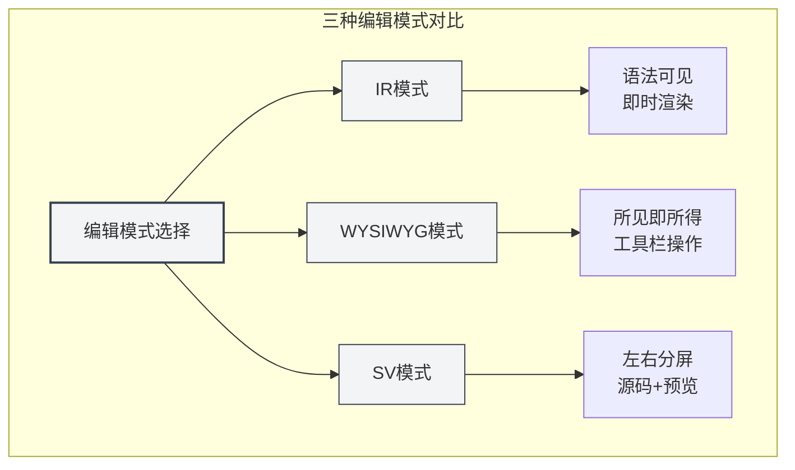
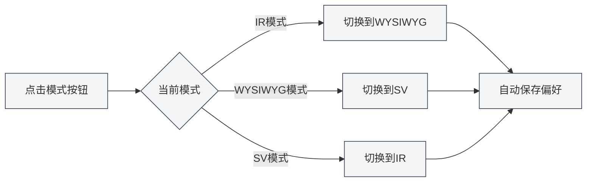
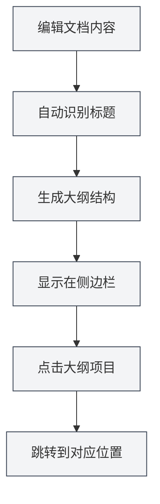
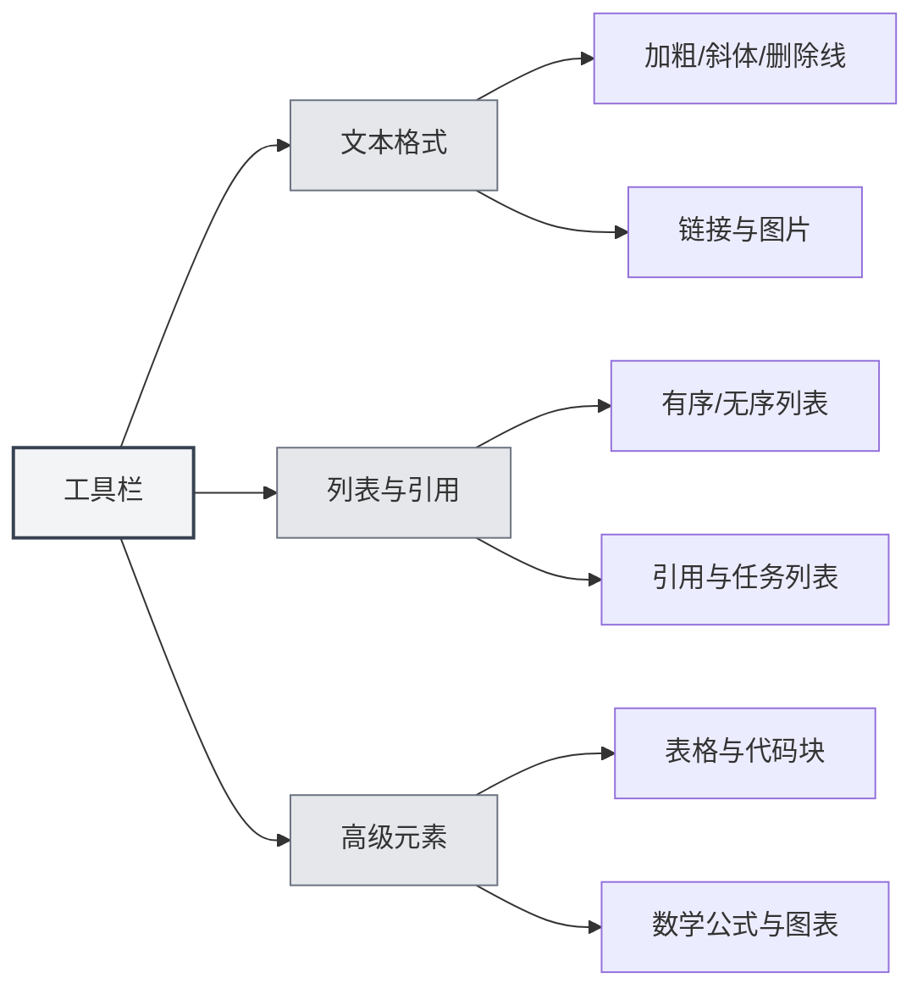

# Guía de uso del editor Markdown

## Descripción general

El editor Markdown de MetaDoc le proporciona un entorno de escritura profesional y elegante. No es solo un cuadro de texto, sino un espacio de creación profundamente optimizado que admite tres modos de edición flexibles, vista previa en tiempo real y ricas herramientas de formato, permitiéndole concentrarse en el contenido sin preocuparse por el formato.

Ya sea que esté escribiendo un blog técnico, organizando notas de estudio o redactando documentación de proyectos, este editor puede satisfacer sus necesidades. Especialmente, su capacidad de IA integrada puede proporcionar autocompletado inteligente y sugerencias mientras escribe, haciendo que la creación sea más fluida.

<TitleMenu mode="demo" title="Markdown编辑器示例" path="1" :tree='{}' />

<SectionOptimizer mode="demo" title="段落优化示例" path="1" :tree='{}' language="markdown" :adapter='null' />


## Tres modos de edición

MetaDoc entiende que diferentes usuarios tienen diferentes hábitos de edición, por lo que ofrece tres modos de edición para elegir:

### Modo IR (Renderizado instantáneo)

Este es el modo de edición predeterminado y la opción preferida por la mayoría de los usuarios de Markdown. En este modo:

- **Retroalimentación instantánea**: Mientras escribe la sintaxis de Markdown, el contenido se muestra inmediatamente con el formato aplicado.
- **Sintaxis visible**: Los símbolos de marcado de Markdown (como `#`, `**`) siguen siendo visibles, facilitando el control preciso del formato.
- **Edición fluida**: La velocidad de renderizado es rápida, sin retrasos incluso al editar documentos largos.
- **Amigable para aprender**: Para los usuarios que están aprendiendo la sintaxis de Markdown, pueden ver la correspondencia entre la sintaxis y el efecto al instante.

**Escenarios de aplicación**:

- Usuarios familiarizados con la sintaxis de Markdown.
- Escenarios que requieren un control preciso del formato del documento.
- Edición de documentos técnicos largos o artículos de blog.

### Modo WYSIWYG (Lo que ves es lo que obtienes)

Si está más acostumbrado a una experiencia de edición similar a Word, este modo le resultará familiar:

- **Edición directa**: Lo que ve es el resultado final, puede hacer clic para editar directamente.
- **Sin necesidad de memorizar sintaxis**: Realice operaciones como negrita, títulos, listas, etc., a través de botones en la barra de herramientas.
- **Operación intuitiva**: Seleccione el texto y haga clic en un botón para aplicar el formato.
- **Reduce la barrera de entrada**: Los usuarios no familiarizados con la sintaxis de Markdown pueden comenzar rápidamente.

**Escenarios de aplicación**:

- Usuarios que se inician en Markdown.
- Escenarios que requieren formato rápido sin preocuparse por la sintaxis subyacente.
- Usuarios que prefieren la edición visual.

### Modo SV (Vista previa dividida)

Este modo divide el área de edición en dos:

- **Comparación lado a lado**: El lado izquierdo muestra el código fuente Markdown, el lado derecho muestra el efecto renderizado.
- **Sincronización en tiempo real**: Al editar en el lado izquierdo, la vista previa en el lado derecho se actualiza instantáneamente.
- **Herramienta de aprendizaje**: Puede ver simultáneamente la sintaxis y el efecto final, profundizando la comprensión de Markdown.
- **Corrección precisa**: Facilita la verificación de que formatos complejos (como tablas, listas anidadas) sean correctos.

**Escenarios de aplicación**:

- Usuarios que aprenden la sintaxis de Markdown.
- Usuarios que necesitan verificar el código fuente y el efecto simultáneamente.
- Edición de documentos que contienen formatos complejos.



### Cómo cambiar de modo

Cambiar el modo de edición es muy simple:

1. **Botón de la barra de herramientas**: En la barra de herramientas en la parte superior del editor, busque el botón para cambiar de modo.
2. **Cambio cíclico**: Hacer clic en el botón alterna cíclicamente entre los tres modos.
3. **Recordar preferencia**: El sistema recordará el último modo que utilizó y lo restaurará automáticamente la próxima vez que abra el documento.



## Vista previa en tiempo real

La función de vista previa en tiempo real de MetaDoc hace que escribir sea un placer:

- **Renderizado automático**: Mientras escribe contenido en la izquierda, el efecto renderizado se muestra inmediatamente a la derecha (o abajo).
- **Soporte completo**: Desde títulos y listas básicas hasta fórmulas matemáticas y gráficos complejos, todo se renderiza correctamente.
- **Resaltado de sintaxis**: Los bloques de código se resaltan automáticamente según el tipo de lenguaje, haciendo el código más legible.
- **Fórmulas matemáticas**: Admite fórmulas matemáticas con sintaxis LaTeX, ya sea fórmulas en línea `$E=mc^2$` o bloques de fórmulas independientes, se muestran perfectamente.
- **Imágenes adaptativas**: Las imágenes insertadas se adaptan automáticamente al ancho del editor, se puede hacer clic para ampliarlas.

## Sincronización del esquema

Navegar por documentos largos nunca ha sido tan fácil:

- **Extracción automática**: El editor identifica automáticamente los títulos en el documento y genera un esquema con niveles claros.
- **Actualización en tiempo real**: Cuando agrega, modifica o elimina títulos, el esquema se actualiza en sincronía.
- **Salto con un clic**: Haga clic en cualquier título del esquema y el editor saltará inmediatamente a la posición correspondiente.
- **Vista previa de la estructura**: A través del esquema puede comprender rápidamente el marco estructural de todo el documento.

Puede acceder a la vista de esquema a través de la barra lateral:

<ViewMenuItemsDemo mode="demo" :items='["editor", "outline"]' />



Para una introducción detallada de la función de esquema, consulte [[outline.basics|大纲视图功能]].

## Funciones de la barra de herramientas

La barra de herramientas en la parte superior del editor reúne las funciones de formato más utilizadas:



### Formato de texto

- **Negrita** (`Ctrl+B`): Hace que el contenido importante sea más llamativo.
- **Cursiva** (`Ctrl+I`): Se utiliza para enfatizar o indicar un significado especial.
- **Tachado**: Indica contenido obsoleto o modificado.
- **Código en línea**: Marca fragmentos de código o términos técnicos.
- **Enlace** (`Ctrl+K`): Inserta un hipervínculo en el que se puede hacer clic.
- **Imagen**: Inserta imágenes locales o de la web.

### Listas y citas

- **Lista desordenada**: Enumera contenido con viñetas.
- **Lista ordenada**: Enumera contenido con números.
- **Bloque de cita**: Cita las opiniones de otros o indicaciones importantes.
- **Lista de tareas**: Lista de tareas pendientes con casillas de verificación.

### Elementos avanzados

- **Tabla**: Crea tablas de datos estructuradas, admite alineación y anidación.
- **Bloque de código**: Inserta múltiples líneas de código, admite resaltado de sintaxis para docenas de lenguajes de programación.
- **Fórmula matemática**: Inserta fórmulas matemáticas usando sintaxis LaTeX.
- **Gráfico**: Inserta gráficos como Mermaid, PlantUML, ECharts, etc.

## Atajos de teclado

El uso hábil de atajos de teclado puede mejorar significativamente la eficiencia de escritura:

### Atajos de formato

| Operación     | Windows/Linux  | macOS         |
| ------------- | -------------- | ------------- |
| Negrita       | `Ctrl+B`       | `Cmd+B`       |
| Cursiva       | `Ctrl+I`       | `Cmd+I`       |
| Insertar enlace | `Ctrl+K`       | `Cmd+K`       |
| Insertar código | `Ctrl+Shift+K` | `Cmd+Shift+K` |

### Atajos de edición

| Operación | Windows/Linux | macOS         |
| --------- | ------------- | ------------- |
| Deshacer  | `Ctrl+Z`      | `Cmd+Z`       |
| Rehacer   | `Ctrl+Y`      | `Cmd+Shift+Z` |
| Seleccionar todo | `Ctrl+A` | `Cmd+A`       |
| Buscar    | `Ctrl+F`      | `Cmd+F`       |

## Consejos de uso

### Entrada rápida

1. **Crear título rápidamente**: Escriba `#` y presione espacio, se convierte automáticamente en formato de título.
2. **Crear lista rápidamente**: Escriba `-` o `*` y presione espacio, se convierte automáticamente en elemento de lista.
3. **Insertar bloque de código rápidamente**: Escriba tres comillas invertidas ` ``` ` y presione Enter.
4. **Insertar línea divisoria rápidamente**: Escriba tres guiones `---` y presione Enter.

### Técnicas de formato

1. **Formatear después de seleccionar texto**: Primero seleccione el texto, luego haga clic en el botón de la barra de herramientas o use el atajo de teclado.
2. **Reemplazo por lotes**: Use la función de buscar y reemplazar (`Ctrl+H`) para modificar el formato por lotes.
3. **Resaltado de sintaxis**: Especifique el lenguaje en la primera línea del bloque de código, por ejemplo ````python`.

### Técnicas de vista previa

1. **Vista previa al cambiar de modo**: En el modo SV puede ver simultáneamente el código fuente y el efecto.
2. **Vista previa de fórmulas matemáticas**: Escriba `$` envolviendo la fórmula para ver el efecto renderizado en tiempo real.
3. **Renderizado en tiempo real de gráficos**: Los gráficos Mermaid se renderizan automáticamente después de terminar la edición.

## Preguntas frecuentes

### P: ¿Cómo insertar una imagen?

R: Hay tres formas:

1. Haga clic en el botón de imagen en la barra de herramientas.
2. Use el atajo de teclado `Ctrl+Shift+I`.
3. Pegue directamente una imagen del portapapeles.

Las imágenes se pueden guardar en el directorio local del documento o subir a un servicio de alojamiento de imágenes.

### P: ¿Cómo crear una tabla?

R: Se recomienda usar el botón de tabla en la barra de herramientas para crear tablas visualmente. También puede ingresar manualmente la sintaxis de tabla Markdown:

```markdown
| Columna 1 | Columna 2 | Columna 3 |
| --------- | --------- | --------- |
| Contenido | Contenido | Contenido |
```

### P: ¿Qué hacer si no se muestra la fórmula matemática?

R: Verifique que la sintaxis sea correcta:

- Fórmula en línea: Envuelva con un solo `$`, por ejemplo `$E=mc^2$`.
- Fórmula independiente: Envuelva con dos `$$`, ocupando una línea exclusiva.

### P: ¿Cómo ver el esquema del documento?

R: Haga clic en el icono "Esquema" en la barra lateral o use el atajo de teclado para cambiar a la vista de esquema. Los títulos del documento se extraen automáticamente en el esquema.

### P: ¿Se pierde el contenido al cambiar el modo de edición?

R: No. Los tres modos comparten el mismo contenido del documento, cambiar el modo solo altera la forma de visualización y edición, el contenido se conserva completamente.

## Documentación relacionada

- [[markdown.basics|Markdown语法]] - Aprender la sintaxis básica de Markdown.
- [[markdown.features|Markdown编辑器功能]] - Conocer más funciones avanzadas.
- [[core.editor-basics|编辑器基础操作]] - Técnicas de edición generales.
- [[core.editor-settings|编辑器设置]] - Configuración personalizada.
- [[outline.basics|大纲视图功能]] - Conocer en profundidad la función de esquema.

<LaTeXEditorDemo mode="demo" />

<Outline mode="demo" />

<MenuItemsDemo mode="demo" :items='[{"id": "file", "items": ["new", "open", "save"]}]' />

<TitleMenu mode="demo" title="Markdown编辑器示例" path="1" :tree='{}' />

<SectionOptimizer mode="demo" title="段落优化示例" path="1" :tree='{}' language="markdown" :adapter='null' />
