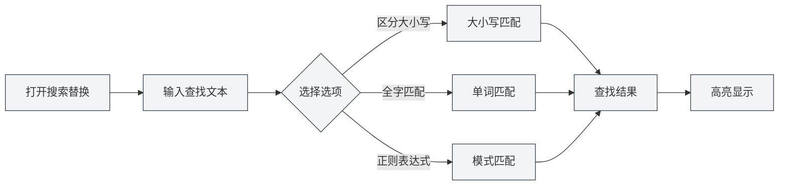
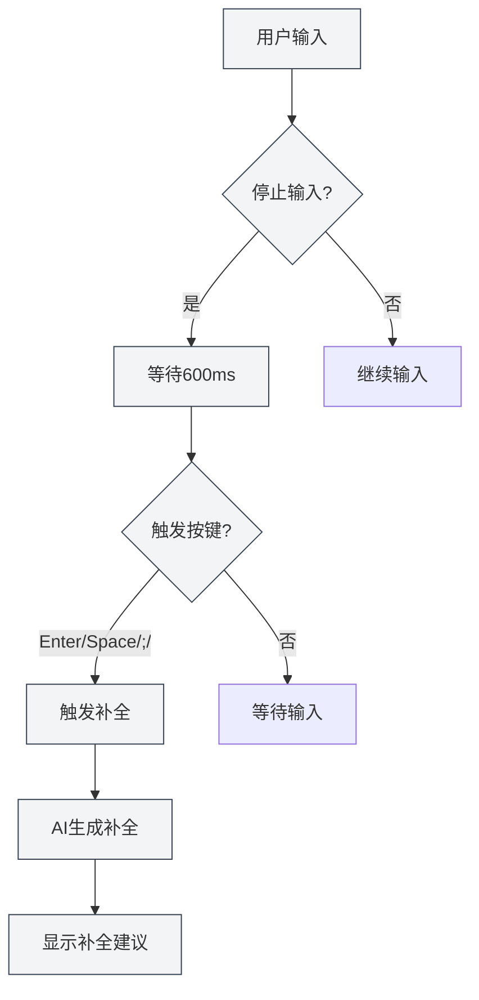

# Funciones del editor Markdown

## Descripción general

El editor Markdown ofrece una amplia gama de funciones, incluyendo búsqueda y reemplazo, menú contextual, autocompletado con IA, integración con base de conocimiento, entre otras. Estas funciones pueden mejorar significativamente su eficiencia de edición y la calidad de sus documentos.

Este documento describe las diversas funciones del editor Markdown y cómo utilizarlas.

## Búsqueda y reemplazo

### Abrir búsqueda y reemplazo

Existen varias formas de abrir la función de búsqueda y reemplazo:

- **Atajo de teclado**: `Ctrl+F` para abrir búsqueda, `Ctrl+H` para abrir búsqueda y reemplazo
- **Menú**: Haga clic en "Editar" → "Buscar" o "Buscar y reemplazar"
- **Barra de herramientas**: Haga clic en el icono de búsqueda en la barra de herramientas

Puede acceder a las operaciones de archivo a través del menú Archivo en la barra de menú superior, y a las funciones de edición a través del menú Editar:

<MenuItemsDemo mode="demo" :items='[{"id": "file", "items": ["new", "open", "save"]}]' />

### Función de búsqueda

La función de búsqueda admite las siguientes opciones:

- **Distinguir mayúsculas y minúsculas**: Solo coincide con texto que tenga exactamente las mismas mayúsculas y minúsculas
- **Coincidencia de palabra completa**: Solo coincide con palabras completas (no con parte de una palabra)
- **Expresión regular**: Utiliza expresiones regulares para la coincidencia de patrones
- **Conservar mayúsculas/minúsculas**: Conserva el formato de mayúsculas y minúsculas del texto original al reemplazar

La interfaz del menú de búsqueda y reemplazo es la siguiente:

<SearchReplaceMenu mode="demo" :adapter='null' />

### Función de reemplazo

La función de reemplazo admite:

- **Reemplazo individual**: Reemplazar el texto coincidente uno por uno
- **Reemplazar todo**: Reemplazar todo el texto coincidente de una vez
- **Vista previa del reemplazo**: Previsualizar el resultado antes de reemplazar

### Lista de coincidencias

El panel de búsqueda y reemplazo mostrará una lista de coincidencias:

- **Mostrar ubicación**: Muestra el número de línea y columna de cada coincidencia
- **Vista previa del contexto**: Muestra el contenido contextual de la coincidencia
- **Navegación rápida**: Haga clic en una coincidencia para saltar rápidamente a su ubicación

### Consejos de uso

1. **Expresiones regulares**: Utilice expresiones regulares para implementar patrones complejos de búsqueda y reemplazo
2. **Reemplazo por lotes**: Utilice "Reemplazar todo" para modificar rápidamente el documento por lotes
3. **Conservar formato**: Utilice la opción "Conservar mayúsculas/minúsculas" para mantener el formato de mayúsculas y minúsculas del texto original

## Menú contextual

### Operaciones básicas de edición

El menú contextual proporciona las siguientes operaciones básicas de edición:

- **Cortar**: `Ctrl+X` o clic derecho y seleccionar "Cortar"
- **Copiar**: `Ctrl+C` o clic derecho y seleccionar "Copiar"
- **Pegar**: `Ctrl+V` o clic derecho y seleccionar "Pegar"
- **Seleccionar todo**: `Ctrl+A` o clic derecho y seleccionar "Seleccionar todo"

### Funciones de IA

El menú contextual proporciona las siguientes funciones de IA:

- **Análisis con IA**: Analiza el contenido del documento actual y abre la ventana de diálogo de IA
- **Optimización de párrafo**: Optimiza el contenido del párrafo actual
- **Insertar gráfico**: Utiliza la IA para generar código de gráfico e insertarlo en el documento

### Interruptores de función

El menú contextual permite activar/desactivar rápidamente las siguientes funciones:

- **Autocompletado con IA**: Activar/desactivar la función de autocompletado con IA
- **Integración con base de conocimiento**: Activar/desactivar la función de integración con base de conocimiento

### Activar complemento manualmente

El menú contextual proporciona la opción "Activar complemento manualmente":

- **Atajo de teclado**: `Shift+Tab`
- **Menú contextual**: Clic derecho y seleccionar "Activar complemento manualmente"

Activar el complemento manualmente inicia inmediatamente el autocompletado con IA, sin esperar al activador automático.

## Autocompletado con IA

### Activar/Desactivar

La función de autocompletado con IA se puede activar o desactivar en las siguientes ubicaciones:

- **Menú contextual**: Clic derecho y seleccionar "Activar/Desactivar autocompletado con IA"
- **Página de configuración**: Configurar las opciones de autocompletado con IA en los ajustes

### Activación automática

El autocompletado con IA se activará automáticamente en las siguientes situaciones:

- **Detención de la escritura**: Se activa automáticamente después de 600ms de dejar de escribir
- **Teclas de activación**: Se activa después de escribir teclas específicas (Enter, Espacio, `;`, `,`)

### Activación manual

Formas de activar el complemento manualmente:

- **Atajo de teclado**: `Shift+Tab`
- **Menú contextual**: Clic derecho y seleccionar "Activar complemento manualmente"

La activación manual inicia el complemento inmediatamente, omitiendo el retraso de la activación automática.

### Modos de complemento

El autocompletado con IA admite dos modos:

- **Generación completa**: Genera el contenido de complemento completo
- **Generación parcial**: Solo genera contenido parcial (según la configuración)

El modo de complemento se puede configurar en los ajustes.

### Configuración de teclas de activación

Las teclas de activación del complemento se pueden configurar en los ajustes:

- **Enter**: Se activa con la tecla Intro
- **Space**: Se activa con la tecla Espacio
- **;**: Se activa con punto y coma
- **,**: Se activa con coma

Se pueden habilitar múltiples teclas de activación simultáneamente.

### Número máximo de Tokens para complemento

El número máximo de Tokens para el complemento se puede configurar en los ajustes:

- **Valor mínimo**: 20 Tokens
- **Valor máximo**: Ilimitado (establecer en 0 significa ilimitado)
- **Valor predeterminado**: 50 Tokens

Cuanto mayor sea el número de Tokens, más contenido se completará, pero el tiempo de generación también será más largo.

### Aceptar complemento

Una vez que se muestra la sugerencia de complemento, puede:

- **Tecla Tab**: Aceptar la sugerencia de complemento
- **Tecla Esc**: Cancelar la sugerencia de complemento
- **Continuar escribiendo**: Cancelar el complemento y continuar escribiendo

<TitleMenu mode="demo" title="Markdown编辑器示例" path="1" :tree='{}' />

<SectionOptimizer mode="demo" title="段落优化示例" path="1" :tree='{}' language="markdown" :adapter='null' />

<QuickStartMarkdown mode="demo" />

<ViewMenuItemsDemo mode="demo" :items='["editor", "outline", "agent"]' />

## Integración con base de conocimiento

### Activar/Desactivar

La función de integración con base de conocimiento se puede activar o desactivar en las siguientes ubicaciones:

- **Menú contextual**: Clic derecho y seleccionar "Activar/Desactivar base de conocimiento"
- **Página de configuración**: Configurar las opciones de base de conocimiento en los ajustes

### Recuperación de contexto

Una vez activada la integración con base de conocimiento, las funciones de IA recuperarán automáticamente contenido relevante de la base de conocimiento:

- **Autocompletado con IA**: El complemento hará referencia a contenido relevante en la base de conocimiento
- **Análisis con IA**: El análisis del documento utilizará el conocimiento de la base de conocimiento
- **Optimización de párrafo**: La optimización del párrafo hará referencia al contenido de la base de conocimiento

### Principio de recuperación

La recuperación de la base de conocimiento utiliza tecnología de búsqueda vectorial:

- **Coincidencia semántica**: Coincide con contenido relevante según la similitud semántica
- **Coincidencia de palabras clave**: También utiliza la coincidencia de palabras clave para mejorar la precisión
- **Recuperación híbrida**: Combina búsqueda vectorial y coincidencia de palabras clave

### Umbral de confianza

La recuperación de la base de conocimiento admite establecer un umbral de confianza:

- **Rango del umbral**: 0.0 - 1.0
- **Valor predeterminado**: 0.5
- **Función**: Solo devuelve contenido con una similitud superior al umbral

El umbral de confianza se puede configurar en los ajustes, consulte [[knowledge-base.config|Configuración de la base de conocimiento]].

## Uso combinado de funciones

### Búsqueda y reemplazo + Autocompletado con IA

Combine el uso de búsqueda y reemplazo con autocompletado con IA:

1. Utilice búsqueda y reemplazo para encontrar el contenido que necesita modificar
2. Utilice autocompletado con IA para generar nuevo contenido
3. Utilice la función de reemplazo para actualizar por lotes

### Menú contextual + Base de conocimiento

Combine el uso del menú contextual con la base de conocimiento:

1. Active la integración con base de conocimiento
2. Utilice las funciones de IA del menú contextual
3. Las funciones de IA utilizarán automáticamente el contenido de la base de conocimiento

### Análisis con IA + Optimización de párrafo

Combine el uso de análisis con IA y optimización de párrafo:

1. Utilice análisis con IA para comprender el contenido del documento
2. Utilice optimización de párrafo para mejorar párrafos específicos
3. Optimice según las sugerencias del análisis con IA

## Consejos de uso

### Mejorar la calidad del complemento

1. **Activar base de conocimiento**: Activar la integración con base de conocimiento puede mejorar la calidad del complemento
2. **Ajustar número de Tokens**: Ajuste el número máximo de Tokens para el complemento según sus necesidades
3. **Activación manual**: Utilice la activación manual cuando sea necesario para obtener mejores resultados de complemento

### Búsqueda y reemplazo eficiente

1. **Usar expresiones regulares**: Utilice expresiones regulares para patrones complejos
2. **Vista previa del reemplazo**: Previsualice el resultado antes de reemplazar
3. **Operaciones por lotes**: Utilice "Reemplazar todo" para modificar rápidamente por lotes

### Uso de la base de conocimiento

1. **Agregar documentos relevantes**: Agregue documentos relevantes a la base de conocimiento
2. **Ajustar confianza**: Ajuste el umbral de confianza según sus necesidades
3. **Actualizar periódicamente**: Actualice periódicamente el contenido de la base de conocimiento

## Preguntas frecuentes

### P: ¿El autocompletado con IA no se muestra?

R: Verifique si el autocompletado con IA está activado, asegúrese de que la configuración del LLM sea correcta. Intente activar el complemento manualmente (`Shift+Tab`).

### P: ¿La búsqueda y reemplazo no encuentra contenido?

R: Verifique si las opciones "Distinguir mayúsculas y minúsculas" o "Coincidencia de palabra completa" están habilitadas. Si utiliza expresiones regulares, verifique que la expresión sea correcta.

### P: ¿La integración con base de conocimiento no funciona?

R: Verifique si la base de conocimiento está activada, asegúrese de que haya documentos relevantes en la base de conocimiento. Ajustar el umbral de confianza puede ayudar a recuperar más contenido.

### P: ¿Cómo desactivar el autocompletado con IA?

R: En el menú contextual seleccione "Desactivar autocompletado con IA", o desactive la opción de autocompletado con IA en los ajustes.

### P: ¿El contenido del complemento no es preciso?

R: Intente activar la integración con base de conocimiento, ajustar el número máximo de Tokens para el complemento, o utilizar la activación manual para obtener mejores resultados.

## Documentación relacionada

- [[markdown.editor|Guía de uso del editor Markdown]]
- [[markdown.basics|Sintaxis Markdown]]
- [[ai.completion|Autocompletado con IA]]
- [[knowledge-base.usage|Uso de la base de conocimiento]]
- [[core.editor-basics|Operaciones básicas del editor]]

<LaTeXEditorDemo mode="demo" />

<Outline mode="demo" />

<MenuItemsDemo mode="demo" :items='[{"id": "file", "items": ["new", "open", "save"]}]' />

<TitleMenu mode="demo" title="Markdown编辑器功能示例" path="1" :tree='{}' />

<SearchReplaceMenu mode="demo" :adapter='null' />

<ViewMenuItemsDemo mode="demo" :items='["editor", "outline", "agent"]' />

<QuickStartMarkdown mode="demo" />

<MenuItemsDemo mode="demo" :items='[{"id": "edit", "items": ["find", "replace"]}]' />