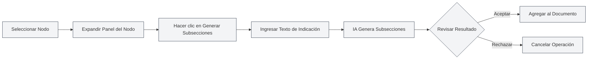
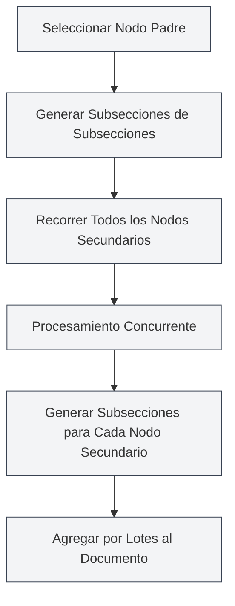

# Funciones de IA para Esquemas

## Descripción General

La función de IA para esquemas utiliza tecnología de inteligencia artificial para ayudarle a generar y optimizar rápidamente la estructura de documentos. A través de las funciones de IA, puede generar subsecciones, contenido de secciones, optimizar la estructura del esquema, etc., mejorando significativamente la eficiencia en la creación de documentos.

<Outline mode="demo" />

La función de IA para esquemas admite múltiples modos de operación, incluidas operaciones en nodos individuales y operaciones por lotes, permitiéndole utilizar de manera flexible la IA para asistir en la creación de documentos.

<Outline mode="demo" />

## Generar Subsecciones

### Generar Subsecciones para un Nodo

Para generar subsecciones para un nodo específico:

<OutlineAiToolbar mode="demo" />

1.  **Seleccionar Nodo**: Seleccione el nodo en la vista de esquema para el cual desea generar subsecciones.
2.  **Expandir Nodo**: Haga clic en el nodo para expandir el panel de detalles.
3.  **Generar Subsecciones**: Haga clic en el botón "Generar subsecciones".
4.  **Ingresar Indicación (Prompt)**: Opcionalmente, ingrese un texto de indicación para guiar a la IA en la generación.
5.  **Esperar Generación**: La IA generará subsecciones basándose en el título y el contenido del nodo.
6.  **Confirmar y Aceptar**: Revise el resultado generado y acéptelo después de confirmar.

Puede acceder a la vista de esquema a través de la barra lateral:

<ViewMenuItemsDemo mode="demo" :items='["outline"]' />

Las subsecciones generadas se agregarán automáticamente al documento y se actualizará la estructura del esquema.

### Principio de Generación

<OutlineTreeDisplay mode="demo" />

Al generar subsecciones, la IA considera:

-   **Título del Nodo**: Comprende el tema de la sección basándose en el título del nodo.
-   **Estructura del Documento**: Toma en cuenta la estructura general del documento.
-   **Indicación del Usuario**: Ajusta el contenido generado según el texto de indicación proporcionado por el usuario.
-   **Requisitos de Formato**: Genera el formato de título correcto según el formato del documento (Markdown/LaTeX).

### Consejos de Uso

1.  **Proporcionar Indicaciones Claras**: Ingrese textos de indicación claros para guiar a la IA a generar subsecciones que cumplan con sus necesidades.
2.  **Referenciar la Estructura Existente**: La IA hará referencia a la estructura existente del documento para mantener la coherencia de estilo.
3.  **Generar Múltiples Veces**: Si no está satisfecho, puede generar varias veces y seleccionar el mejor resultado.

## Generar Contenido de Sección

<Outline mode="demo" />

### Generar Contenido para un Nodo

Para generar contenido de texto para un nodo específico:

1.  **Seleccionar Nodo**: Seleccione el nodo en la vista de esquema para el cual desea generar contenido.
2.  **Expandir Nodo**: Haga clic en el nodo para expandir el panel de detalles.
3.  **Generar Contenido**: Haga clic en el botón "Generar contenido".
4.  **Ingresar Indicación (Prompt)**: Opcionalmente, ingrese un texto de indicación para guiar a la IA en la generación.
5.  **Establecer Número de Palabras**: Opcionalmente, establezca un número objetivo de palabras.
6.  **Esperar Generación**: La IA generará contenido basándose en el título del nodo y la estructura del documento.
7.  **Confirmar y Aceptar**: Revise el resultado generado y acéptelo después de confirmar.

El contenido generado se agregará automáticamente a la sección correspondiente en el documento.

### Modos de Generación de Contenido

<OutlineAiToolbar mode="demo" />

La generación de contenido admite los siguientes modos:

-   **Generación Completa**: Genera el contenido completo de la sección.
-   **Generación Parcial**: Genera solo parte del contenido (según la configuración).
-   **Agregar Contenido**: Agrega nuevo contenido sobre la base del contenido existente.

### Control del Número de Palabras

Puede establecer un número objetivo de palabras al generar contenido:

-   **Establecer Número de Palabras**: Ingrese el número objetivo de palabras en el cuadro de diálogo de generación.
-   **Ajuste por la IA**: La IA ajustará el nivel de detalle del contenido generado según el requisito de número de palabras.
-   **Control Flexible**: Puede establecer diferentes números de palabras según la importancia de la sección.

<OutlineTreeDisplay mode="demo" />

## Generar Subsecciones de Subsecciones

### Generar Subsecciones por Lotes

Para generar subsecciones por lotes para todos los nodos secundarios de un nodo específico:

1.  **Seleccionar Nodo**: Seleccione el nodo sobre el cual desea realizar la operación por lotes.
2.  **Expandir Nodo**: Haga clic en el nodo para expandir el panel de detalles.
3.  **Generar Subsecciones de Subsecciones**: Haga clic en el botón "Generar subsecciones de subsecciones".
4.  **Ingresar Indicación**: Ingrese un texto de indicación para guiar a la IA en la generación.
5.  **Esperar Generación**: La IA procesará concurrentemente todos los nodos secundarios, generando subsecciones para cada uno.
6.  **Confirmar y Aceptar**: Revise el resultado generado y acéptelo después de confirmar.

Esta función utiliza un mecanismo de procesamiento concurrente, permitiendo generar rápidamente subsecciones para múltiples secciones por lotes.

### Ventajas del Procesamiento Concurrente

<OutlineAiToolbar mode="demo" />

La generación por lotes utiliza un mecanismo de procesamiento concurrente:

-   **Procesamiento Eficiente**: Procesa múltiples nodos simultáneamente, aumentando la velocidad decenas de veces.
-   **Sincronización Automática**: Se sincroniza automáticamente con el documento una vez completada la generación.
-   **Visualización del Progreso**: Muestra el progreso de generación de cada nodo.

### Escenarios de Uso

Adecuado para los siguientes escenarios:

-   **Generación a Gran Escala**: Cuando necesita generar subsecciones para múltiples secciones.
-   **Operaciones por Lotes**: Generar subsecciones para todas las secciones con un solo clic.
-   **Generación Estructurada**: Generar contenido por lotes según la estructura del esquema.

## Generar Contenido de Subsecciones

### Generar Contenido por Lotes

Para generar contenido por lotes para todos los nodos secundarios de un nodo específico:

1.  **Seleccionar Nodo**: Seleccione el nodo sobre el cual desea realizar la operación por lotes.
2.  **Expandir Nodo**: Haga clic en el nodo para expandir el panel de detalles.
3.  **Generar Contenido de Subsecciones**: Haga clic en el botón "Generar contenido de subsecciones".
4.  **Ingresar Indicación**: Ingrese un texto de indicación para guiar a la IA en la generación.
5.  **Establecer Número de Palabras**: Opcionalmente, establezca un número objetivo de palabras.
6.  **Esperar Generación**: La IA procesará concurrentemente todos los nodos secundarios, generando contenido para cada uno.
7.  **Confirmar y Aceptar**: Revise el resultado generado y acéptelo después de confirmar.

Esta función puede generar rápidamente contenido para todas las secciones de un documento completo.

### Generación Recursiva

La generación de contenido de subsecciones se procesa de forma recursiva:

-   **Recorrer Todos los Nodos Secundarios**: Recorre recursivamente todos los nodos secundarios.
-   **Generar Contenido**: Genera contenido para cada nodo secundario.
-   **Mantener la Estructura**: Preserva la estructura jerárquica del documento.

### Seguimiento del Progreso

Durante la generación por lotes, se muestra el progreso:

-   **Progreso del Nodo**: Muestra el nodo que se está procesando actualmente.
-   **Progreso General**: Muestra el progreso general de la generación.
-   **Actualización en Tiempo Real**: Actualiza el contenido generado en tiempo real.

<Outline mode="demo" />

## Optimización de Esquemas

### Funcionalidad de Optimización

La función de optimización de esquemas puede ayudarle con:

-   **Ajuste de Estructura**: Optimizar la estructura y jerarquía del documento.
-   **Optimización de Títulos**: Optimizar la nomenclatura y formato de los títulos.
-   **Reorganización Estructural**: Reorganizar la estructura del documento.

### Operaciones de Optimización

La optimización de esquemas admite las siguientes operaciones:

-   **Mover Nodo**: Mover un nodo a una nueva posición.
-   **Eliminar Nodo**: Eliminar nodos innecesarios.
-   **Ajustar Nivel**: Ajustar la relación jerárquica de los nodos.
-   **Fusionar Nodos**: Fusionar nodos similares.

### Uso de la Optimización

<OutlineTreeDisplay mode="demo" />

1.  **Analizar Estructura**: La IA analizará la estructura actual del documento.
2.  **Proporcionar Sugerencias**: Proporcionará sugerencias de optimización.
3.  **Aplicar Optimización**: Aplicará los resultados de optimización después de la confirmación.

## Configuración de Funciones de IA

### Configuración de Temperatura

Se puede configurar el parámetro de temperatura al generar con IA:

-   **Rango de Temperatura**: 0.0 - 1.0
-   **Valor Predeterminado**: Según la configuración.
-   **Función**: Controla la creatividad de la generación de IA (a mayor temperatura, más creatividad).

### Configuración de Textos de Indicación (Prompts)

Se pueden configurar textos de indicación para cada operación:

-   **Indicación General**: Establecer un texto de indicación general.
-   **Indicación por Operación**: Establecer textos de indicación específicos para cada operación.
-   **Requisito de Número de Palabras**: Incluir el requisito de número de palabras en el texto de indicación.

### Reconocimiento de Formato

La IA reconocerá automáticamente el formato del documento:

-   **Formato Markdown**: Genera títulos y contenido en formato Markdown.
-   **Formato LaTeX**: Genera títulos y contenido en formato LaTeX.
-   **Adaptación Automática**: Ajusta automáticamente el contenido generado según el formato del documento.

## Consejos de Uso

### Generación Eficiente

1.  **Usar Operaciones por Lotes**: Utilice operaciones por lotes para mejorar la eficiencia cuando necesite generar grandes cantidades de contenido.
2.  **Proporcionar Indicaciones Claras**: Ingrese textos de indicación claros para obtener mejores resultados de generación.
3.  **Generación por Pasos**: Genere primero la estructura, luego el contenido, perfeccionando el documento gradualmente.

### Control de Calidad

1.  **Revisar Resultados Generados**: Revise cuidadosamente los resultados después de la generación para asegurarse de que cumplan con los requisitos.
2.  **Generar Múltiples Veces**: Si no está satisfecho, puede generar varias veces y seleccionar el mejor resultado.
3.  **Ajuste Manual**: Puede ajustar y perfeccionar manualmente el contenido después de generarlo.

### Planificación de Estructura

1.  **Planificar la Estructura Primero**: Utilice la IA para generar subsecciones y planificar la estructura del documento.
2.  **Generar Contenido Después**: Genere el contenido específico una vez que la estructura esté definida.
3.  **Perfeccionar Gradualmente**: Perfeccione el documento paso a paso, no genere todo el contenido de una vez.

## Preguntas Frecuentes

### P: ¿El contenido generado por la IA no es preciso?

R: El contenido generado por la IA es solo de referencia. Se recomienda revisar y ajustar después de la generación. Puede proporcionar textos de indicación más detallados para obtener mejores resultados.

### P: ¿La generación por lotes es muy lenta?

R: La generación por lotes utiliza procesamiento concurrente y ya es bastante rápida. Si aún es lenta, podría deberse a problemas de red o a una respuesta lenta del servicio de IA.

### P: ¿Cómo cancelar la generación?

R: Puede hacer clic en el botón "Cancelar" durante el proceso de generación para cancelar la operación. El contenido ya generado no se perderá.

### P: ¿El formato del contenido generado es incorrecto?

R: La IA reconocerá automáticamente el formato del documento. Si el formato es incorrecto, verifique la configuración del formato del documento o ajuste manualmente el contenido generado.

### P: ¿Se puede modificar el contenido generado?

R: Sí. El contenido generado se puede editar y modificar en cualquier momento. La generación es solo una ayuda para la creación; el contenido final lo decide usted.

## Documentación Relacionada

-   [[outline.basics|Funciones de la Vista de Esquema]]
-   [[ai.llm-config|Configuración de LLM]]
-   [[markdown.editor|Guía de Uso del Editor Markdown]]
-   [[latex.editor|Guía de Uso del Editor LaTeX]]

<Outline mode="demo" />

<OutlineAiToolbar mode="demo" />

<ViewMenuItemsDemo mode="demo" :items='["ai"]' />