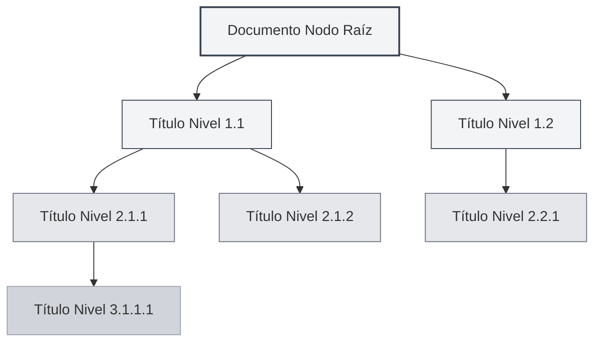
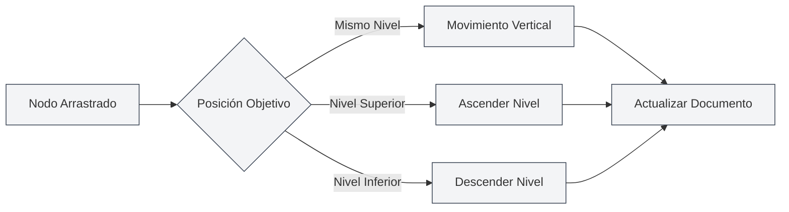

# Vista de Esquema

## Descripción General

La vista de esquema muestra la jerarquía de títulos del documento en una estructura de árbol, ayudándole a navegar y editar rápidamente la estructura del documento. A través de la vista de esquema, puede saltar rápidamente a cualquier parte del documento, editar la estructura del documento y utilizar funciones de IA para generar contenido.

La vista de esquema de MetaDoc admite funciones como extracción automática, edición manual, ordenación por arrastre, generación con IA, etc., permitiéndole organizar y gestionar la estructura del documento de manera eficiente.

## Introducción a la Vista de Esquema

### Ubicación de la Vista

La vista de esquema generalmente se muestra en la barra lateral izquierda o derecha del editor:

- **Barra lateral**: La vista de esquema se muestra como parte de la barra lateral.
- **Panel independiente**: La vista de esquema se puede mostrar u ocultar de forma independiente.
- **Ajuste de ancho**: Se puede ajustar el ancho de la vista de esquema.

Puede acceder a la vista de esquema a través de la barra lateral, que proporciona alternancia entre vistas como editor, esquema, etc.:

<ViewMenuItemsDemo mode="demo" :items='["editor", "outline"]' />

### Vista Previa de la Interfaz

La vista de esquema muestra la jerarquía de títulos del documento en una estructura de árbol, admitiendo ordenación por arrastre y edición de nodos:

<Outline mode="demo" />

<ViewMenuItemsDemo mode="demo" :items='["outline"]" />

### Estructura del Esquema

La vista de esquema muestra la jerarquía de títulos del documento en una estructura de árbol:

- **Nodo raíz**: El nodo raíz del documento (generalmente no se muestra).
- **Título de nivel 1**: Los títulos de nivel 1 (H1) del documento.
- **Título de nivel 2**: Los títulos de nivel 2 (H2) del documento.
- **Anidamiento multinivel**: Admite la visualización anidada de títulos de múltiples niveles.

### Extracción Automática

La vista de esquema extrae automáticamente la estructura de títulos del documento:

- **Documentos Markdown**: Extrae de los títulos Markdown (`#`, `##`, etc.).
- **Documentos LaTeX**: Extrae de los comandos de sección LaTeX (`\section`, `\subsection`, etc.).
- **Actualización en tiempo real**: Actualiza automáticamente la estructura del esquema al editar el documento.

## Operaciones con Nodos del Esquema

### Agregar Nodo Hijo

Agregar un nuevo nodo hijo en el esquema:

1. **Seleccionar nodo**: Haga clic en el nodo al que desea agregar un hijo.
2. **Botón agregar**: Haga clic en el botón "Agregar nodo hijo" (icono +) junto al nodo.
3. **Ingresar título**: Ingrese el título del nuevo nodo.
4. **Confirmar creación**: Confirme para crear el nuevo nodo.

El nuevo nodo se agregará a la posición correspondiente en el documento y el contenido del documento se actualizará automáticamente.

<Outline mode="demo" />

### Editar Nodo

Editar el título de un nodo del esquema:

1. **Seleccionar nodo**: Haga clic en el nodo que desea editar.
2. **Botón editar**: Haga clic en el botón "Editar" junto al nodo.
3. **Modificar título**: Modifique el título del nodo.
4. **Confirmar guardado**: Confirme para guardar los cambios.

Editar el título de un nodo actualizará automáticamente el título correspondiente en el documento.

<TitleMenu mode="demo" title="Título de Ejemplo" path="1" :tree='{}' />

<ViewMenuItemsDemo mode="demo" :items='["outline"]' />

### Eliminar Nodo

Eliminar un nodo del esquema:

1. **Seleccionar nodo**: Haga clic en el nodo que desea eliminar.
2. **Botón eliminar**: Haga clic en el botón "Eliminar" junto al nodo.
3. **Confirmar eliminación**: Confirme para eliminar el nodo.

Eliminar un nodo también eliminará el título y el contenido correspondiente en el documento (si está configurado para hacerlo).

<SectionOptimizer mode="demo" title="Ejemplo de Optimización de Nodo de Esquema" path="1" :tree='{}' language="markdown" :adapter='null' />

<OutlineTreeDisplay mode="demo" />

### Mover Nodo

Mover la posición de un nodo del esquema:

- **Mover arriba/abajo**: Use los botones "Mover arriba" y "Mover abajo" para cambiar el orden de los nodos.
- **Mover izquierda/derecha**: Use los botones "Mover izquierda" y "Mover derecha" para cambiar el nivel del nodo.
- **Mover por arrastre**: Arrastre directamente el nodo a la posición objetivo.

Mover un nodo actualizará automáticamente la estructura del documento.

<OutlineTreeDisplay mode="demo" />

## Arrastre de Nodos del Esquema

### Operación de Arrastre

La vista de esquema admite operaciones de arrastre para reorganizar la estructura del documento:

1. **Mantener presionado el ratón**: Mantenga presionado el botón izquierdo del ratón sobre un nodo.
2. **Arrastrar nodo**: Arrastre el nodo a la posición objetivo.
3. **Soltar ratón**: Suelte el botón del ratón para completar el movimiento.

Durante el arrastre, habrá retroalimentación visual que muestra la posición objetivo del nodo.

### Modos de Arrastre

El arrastre admite los siguientes modos:

- **Movimiento vertical**: Mover el nodo hacia arriba o abajo dentro del mismo nivel.
- **Movimiento horizontal**: Cambiar el nivel del nodo (ascender o descender).
- **Movimiento entre niveles**: Mover el nodo a otro nivel.

### Restricciones de Arrastre

La operación de arrastre tiene las siguientes restricciones:

- **Nodo raíz**: El nodo raíz no se puede arrastrar.
- **Autocontención**: No se puede arrastrar un nodo dentro de sus propios nodos hijos (para evitar ciclos).
- **Límites de nivel**: Algunas operaciones pueden estar sujetas a límites de nivel.

<Outline mode="demo" />

## Expandir/Contraer Esquema

### Expandir Nodo

Expandir un nodo para ver sus nodos hijos:

- **Clic en nodo**: Haga clic en el título del nodo para expandirlo o contraerlo.
- **Icono expandir**: Haga clic en el icono de expandir delante del nodo.
- **Expandir todo**: Use la función "Expandir todo" para expandir todos los nodos.

### Contraer Nodo

Contraer un nodo para ocultar sus nodos hijos:

- **Clic en nodo**: Haga clic nuevamente en un nodo expandido para contraerlo.
- **Icono contraer**: Haga clic en el icono de contraer delante del nodo.
- **Contraer todo**: Use la función "Contraer todo" para contraer todos los nodos.

### Estado de Expansión

El estado de expansión del esquema se guarda:

- **Guardado automático**: El estado de expansión se guarda automáticamente.
- **Restaurar estado**: Se restaura el estado de expansión la próxima vez que abra el documento.
- **Estado independiente**: El estado de expansión se guarda de forma independiente para cada documento.

## Ajuste del Ancho del Esquema

### Ajustar Ancho

Se puede ajustar el ancho de la vista de esquema:

1. **Arrastrar borde**: Mueva el ratón al borde de la vista de esquema.
2. **Mantener y arrastrar**: Mantenga presionado el botón izquierdo del ratón y arrastre para ajustar el ancho.
3. **Soltar ratón**: Suelte el botón del ratón para completar el ajuste.

### Límites de Ancho

El ancho del esquema tiene los siguientes límites:

- **Ancho mínimo**: No puede ser menor que el ancho mínimo (normalmente 150px).
- **Ancho máximo**: No puede ser mayor que el ancho máximo (normalmente el 50% del ancho de la pantalla).
- **Adaptación automática**: El ancho se ajusta automáticamente según el contenido.

<ResizableDivider mode="demo" />

## Navegación Rápida

### Navegación por Clic

Hacer clic en un nodo del esquema permite saltar rápidamente a la posición correspondiente en el documento:

- **Clic en nodo**: Haga clic en el título del nodo para saltar a la posición correspondiente.
- **Resaltado**: El título correspondiente se resaltará después del salto.
- **Posicionamiento de desplazamiento**: El editor se desplazará automáticamente a la posición correspondiente.

### Desplazamiento Sincronizado

La vista de esquema admite desplazamiento sincronizado con el editor:

- **Sincronización al editar**: Al editar el documento, el esquema resaltará automáticamente la posición de edición actual.
- **Sincronización al desplazar**: Al desplazarse por el editor, el esquema resaltará automáticamente los títulos visibles.
- **Sincronización bidireccional**: Sincronización bidireccional entre el esquema y el editor.

## Visualización de Información del Nodo

### Título del Nodo

El nodo del esquema muestra la siguiente información:

- **Texto del título**: Muestra el contenido textual del título.
- **Nivel del título**: Muestra el nivel del título a través de la sangría.
- **Estado del nodo**: Muestra el estado del nodo (expandido/contraído).

### Operaciones del Nodo

Cada nodo proporciona los siguientes botones de operación:

- **Agregar nodo hijo**: Agregar un nodo hijo bajo el nodo actual.
- **Editar**: Editar el título del nodo.
- **Eliminar**: Eliminar el nodo.
- **Mover**: Mover el nodo hacia arriba, abajo, izquierda o derecha.

Los botones de operación se muestran al pasar el ratón por encima o al seleccionar el nodo.

<OutlineTreeDisplay mode="demo" />

<ViewMenuItemsDemo mode="demo" :items='["editor", "outline"]' />

## Consejos de Uso

### Organizar la Estructura del Documento

1. **Usar el esquema para planificar**: Primero planifique la estructura del documento en el esquema, luego complete el contenido.
2. **Ajustar niveles**: Use el arrastre para ajustar rápidamente los niveles de los títulos.
3. **Operaciones por lotes**: Use la vista de esquema para gestionar múltiples títulos por lotes.

### Navegación Rápida

1. **Usar saltos**: Haga clic en los nodos del esquema para saltar rápidamente a posiciones del documento.
2. **Usar búsqueda**: Busque títulos en el esquema para localizarlos rápidamente.
3. **Usar contracción**: Contraiga las partes que no necesita ver para concentrarse en el contenido actual.

### Eficiencia de Edición

1. **Ordenar por arrastre**: Use el arrastre para ajustar rápidamente la estructura del documento.
2. **Edición por lotes**: Edite múltiples títulos por lotes en el esquema.
3. **Vista previa de estructura**: Use el esquema para previsualizar toda la estructura del documento.

<OutlineTreeDisplay mode="demo" />

## Preguntas Frecuentes

### P: ¿El esquema no se actualiza?

R: El esquema se actualiza automáticamente. Si no se actualiza, intente cambiar de vista o actualizar el documento. Asegúrese de que el documento tenga el formato de título correcto.

### P: ¿Cómo agregar rápidamente múltiples títulos?

R: Use la función "Agregar nodo hijo" para agregar títulos rápidamente, o ingrese los títulos directamente en el editor; el esquema se actualizará automáticamente.

### P: ¿Falló el arrastre de un nodo?

R: Verifique si está arrastrando el nodo dentro de sus propios nodos hijos (esto causaría un ciclo). Asegúrese de que la posición objetivo sea válida.

### P: ¿El esquema se muestra incorrectamente?

R: Verifique que el formato de los títulos en el documento sea correcto. Markdown usa `#`, LaTeX usa comandos como `\section`, etc.

### P: ¿Cómo restablecer el esquema?

R: El esquema se extrae automáticamente del documento. Si necesita restablecerlo, puede volver a abrir el documento o editar manualmente la estructura del documento.

## Documentación Relacionada

- [[outline.ai-features|Funciones de IA del Esquema]]
- [[markdown.editor|Guía de Uso del Editor Markdown]]
- [[latex.editor|Guía de Uso del Editor LaTeX]]
- [[core.editor-basics|Operaciones Básicas del Editor]]
