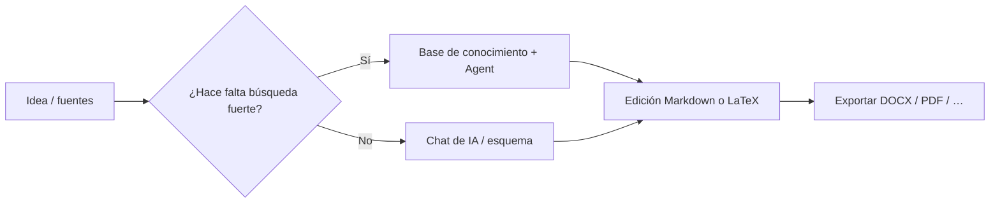

# 🚀 MetaDoc – Buenas prácticas

MetaDoc no es una aplicación con **un solo flujo fijo**.

Se parece más a un **conjunto de herramientas**: para redactar, hacer gráficos o traducir, **hay varios caminos** hacia el mismo resultado.

👉 Eso implica:

* Una misma tarea puede tener **varias rutas**
* Cada ruta equilibra de otro modo **velocidad, coste y control**
* Elegir bien la ruta importa más que memorizar todos los menús

Esta guía no es un catálogo de funciones. Responde a una pregunta práctica:

> 👉 **En mi situación, ¿qué enfoque conviene probar primero?**

---

## 🧭 Cómo leer las marcas

| Marca      | Significado                                      |
| ---------- | ------------------------------------------------ |
| ⭐⭐⭐⭐⭐ | Opción por defecto en la mayoría de los casos    |
| ⭐⭐⭐⭐   | Muy fiable; a veces un paso extra                 |
| ⭐⭐⭐     | Especialmente útil en contextos concretos        |
| ⚠️       | Riesgos de calidad, cumplimiento o uso           |
| 💰         | Mayor consumo de tokens / coste de API           |

---

Pestañas de la ventana principal (vista de ejemplo):

<MainTabs mode="demo" />

---

# 📝 1. Redacción: de la idea al texto acabado

Hay tres rutas habituales. Basta con la que encaje con su objetivo.

---

## ⭐⭐⭐⭐⭐ Ruta 1 (recomendación por defecto)

### Borrador en el chat de IA → edición Markdown → exportar

**Flujo**:
[[ai.chat|Chat de IA]] → edición Markdown → [[core.export|Exportar]]

**Tiene sentido si:**

* quiere empezar pronto
* prevé varias rondas de revisión
* el entregable es Word, PDF o LaTeX

---

**Por qué suele ser la primera opción**

* Markdown reduce el **ruido de maquetación** y centra el contenido
* Primero estructura y texto; el formato, después
* Tras exportar puede rematar en Word o LaTeX

👉 Resumido: **contenido primero, formato después**

---

**Precauciones**

* Revise hechos, citas y cifras generados por la IA
* Eche un vistazo rápido a la maquetación tras exportar

---

Chat de IA (vista de ejemplo):

<AIChat mode="demo" />

---

## ⭐⭐⭐⭐ Ruta 2

### Redacción con base de conocimiento (sobre todo técnica o con fuentes)

**Flujo**:
[[knowledge-base.usage|Base de conocimiento]] → [[agent.introduction|Agent]] → unificar en el editor

---

**Tiene sentido si:**

* escribe textos **con respaldo documental** (artículos, informes)
* ya dispone de PDF, documentos o notas

---

**Ventajas**

* La generación puede apoyarse en los archivos que subió
* Es más fácil mantener el texto **ligado a fuentes que controla**

---

**Tenga en cuenta**

* ⚠️ La calidad depende de los archivos y del troceado (chunks)
* 💰 Los diálogos largos suelen gastar más tokens

---

👉 En pocas palabras:

> Si necesita escribir **con fuentes**, empiece aquí.

---

Base de conocimiento (vista de ejemplo):

<KnowledgeBase mode="demo" />

---

## ⭐⭐⭐ Ruta 3

### El Agent genera un proyecto LaTeX completo

**Flujo**:
Agent → proyecto LaTeX → compilar PDF

---

**Tiene sentido si:**

* necesita una estructura tipo artículo académico
* ya decidió usar LaTeX
* el tiempo aprieta

---

### ⚠️ Antes de confiar en ello

* 💰 Suele costar **más tokens** que chats cortos o acciones pequeñas del menú contextual
* Paquetes, rutas o codificación pueden requerir ajustes manuales
* Contenido sensible o muy regulado: no automatice todo sin revisión

---

Agent (vista de ejemplo):

<AgentView mode="demo" />

---

**Plantilla de prompt (sustituya el título)**

```text
Eres editor técnico LaTeX. Para el tema «(título del trabajo aquí)», genera un proyecto LaTeX compilable en el espacio de trabajo actual.

Requisitos:
1) Clase article o la indicada; archivo principal main.tex; capítulos en varios .tex con \input.
2) Estructura clara: figures/, sections/, bib/; figuras de ejemplo y entradas bibliográficas.
3) Paquetes estándar para matemáticas (amsmath), gráficos (graphicx), citas (biblatex o natbib); liste paquetes adicionales a instalar.
4) Indique comando de compilación recomendado (latexmk -pdf; para Unicode/CJK, XeLaTeX o LuaLaTeX).
5) No omita el cuerpo de los archivos; rutas coherentes. Si faltan datos, enuncie supuestos y luego genere.
```

---

# 📊 2. Gráficos y visualización

La pregunta útil no es «¿dónde está el botón?», sino:

> 👉 **¿Prioriza velocidad o control fino?**

---


| Vía | Qué hacer | Valoración | Cuándo |
| --- | --------- | ---------- | ------ |
| A | Chat de IA o Agent para código Mermaid / PlantUML / ECharts, pegado en Markdown | ⭐⭐⭐⭐ | Iterar rápido junto al texto |
| B | Ventana de gráficos ([[charts.introduction|Gráficos]]) | ⭐⭐⭐⭐ | Prefiere interfaz gráfica |
| C | Seleccionar texto → menú contextual → insertar gráfico | ⭐⭐⭐⭐⭐ | Máxima cercanía al párrafo actual |

Relacionado: [[ai.chat|Chat de IA]], [[agent.introduction|Agent]].

---

**Consejos breves**

* Redacción diaria → el menú contextual suele ser lo más rápido
* Diagramas complejos → ventana de gráficos
* Probar variantes → código generado por IA

---

Ventana de gráficos (vista de ejemplo):

<GraphWindow mode="demo" />

---

# 🌐 3. Traducción

En una frase:

> 👉 **Cuanto más corto el texto, más simple puede ser la herramienta**

---


| Vía | Valoración | Ideal para |
| --- | ---------- | ---------- |
| Traducir en el menú contextual | ⭐⭐⭐⭐⭐ | Frases / párrafos breves |
| Chat de IA | ⭐⭐⭐⭐   | Varios bloques |
| Agent | ⭐⭐⭐⭐   | Documentos largos |

---

👉 Regla práctica:

* Corto → menú contextual
* Largo → chat de IA o Agent

---

Barra divisoria redimensionable (vista de ejemplo):

<ResizableDivider mode="demo" />

---

# ✨ 4. Pulir párrafos

Mandar el manuscrito entero de una vez suele ser más lento y caro.

Mejor:

---


| Vía | Valoración | Motivo |
| --- | ---------- | ------ |
| Optimizar con clic derecho en el párrafo | ⭐⭐⭐⭐⭐ | Contexto pequeño, menor coste |
| Pases por el árbol del esquema | ⭐⭐⭐⭐   | Ordenar la estructura |
| Chat de IA / Agent | ⭐⭐⭐⭐   | Cambios amplios |

---

👉 Idea clave:

> **Trabajar por trozos pequeños**

---

Vista de esquema (ejemplo):

<Outline mode="demo" />

---

# 🎯 5. Elegir según el escenario

Si duda, lea solo esta sección.

---

## 🎒 Apuntes de clase

**Sugerencias**

* ⭐⭐⭐⭐⭐ Markdown rápido en clase → ampliar con IA después
* ⭐⭐⭐⭐ PDF de diapos en la base → resúmenes de repaso

👉 Primero capturar, luego ordenar

---

## 🧪 Informes de laboratorio

**Sugerencias**

* ⭐⭐⭐⭐⭐ Markdown → exportar DOCX para borradores
* ⭐⭐⭐⭐ Base de conocimiento para partes de análisis

⚠️ Los datos medidos: verifíquelos usted

---

## 🛠️ Documentación técnica

**Sugerencias**

* ⭐⭐⭐⭐⭐ Markdown + retoques locales con clic derecho
* ⭐⭐⭐⭐ Agent + base para alinear con documentación antigua

👉 Claridad y coherencia primero

---

## 💬 Preguntas y respuestas / blog

**Sugerencias**

* ⭐⭐⭐⭐⭐ Esquema primero → cuerpo después
* ⭐⭐⭐⭐ Árbol de esquema en textos largos

👉 La estructura antes que el volumen

---

## 📱 Newsletters / creación de contenido

**Sugerencias**

* ⭐⭐⭐⭐⭐ Terminar en Markdown → exportar → maquetar en la plataforma
* ⭐⭐⭐⭐ IA para variantes de titular y resumen

⚠️ Pedir el texto completo de una vez: coste alto y voz difícil de controlar

---

# 🔁 Visión general del flujo



---

# 📚 Más lectura

* [[quick-start.guide|Guía de inicio rápido]]
* [[core.export|Exportar]]
* [[features.paragraph-optimization|Optimización de párrafos]]
* [[charts.introduction|Introducción a gráficos]]
