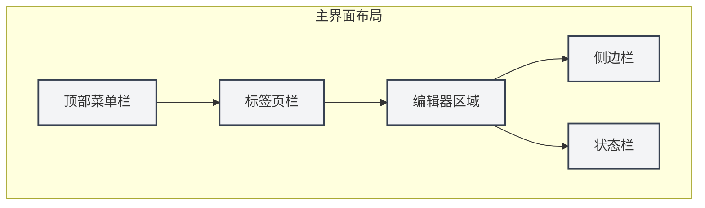
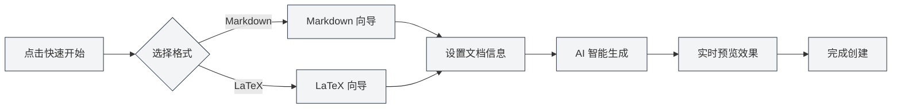

# Guía de Inicio Rápido

## Descripción General

¡Bienvenido a MetaDoc! Esta es una herramienta inteligente de procesamiento de documentos diseñada para trabajadores del conocimiento. Ya sea que esté escribiendo un blog técnico, organizando notas de estudio o preparando un artículo académico, MetaDoc le ofrece una experiencia de edición profesional y elegante.

MetaDoc integra profundamente capacidades de inteligencia artificial y admite dos formatos de documento principales: Markdown y LaTeX. No es solo un editor de texto, sino su asistente de escritura inteligente: funciones integradas como diálogo con IA, autocompletado, corrección inteligente, etc., hacen que la creación de documentos sea más eficiente y placentera.

## Primer Uso

### Iniciar la Aplicación

Al iniciar MetaDoc, lo primero que verá es la página de inicio. Este es un punto de partida cuidadosamente diseñado para que pueda comenzar a trabajar rápidamente:

- **Inicio Rápido**: Un asistente inteligente le guiará para elegir el formato del documento y crear uno nuevo.
- **Nuevo Documento**: Cree directamente un documento en blanco, seleccionando el formato que necesite.
- **Abrir Archivo**: Explore y abra documentos existentes.
- **Manual del Usuario**: Consulte la guía de uso detallada en cualquier momento.

### Introducción a la Interfaz

El diseño de la interfaz de MetaDoc sigue los principios de diseño de editores modernos, siendo clara e intuitiva:

1. **Barra de Menú Superior**

   Ubicada en la parte superior de la ventana, reúne funciones principales como archivo, editar, vista, etc. Ya sea que necesite crear un nuevo documento, buscar y reemplazar texto o cambiar el modo de vista, puede encontrar la entrada aquí. La barra de menú es personalizable; puede ajustar la visualización y el orden de los elementos del menú según sus hábitos de uso.

2. **Barra de Pestañas**

   Ubicada debajo de la barra de menú, muestra todos los documentos abiertos actualmente. Cada documento corresponde a una pestaña; haga clic para cambiar entre ellos. Las pestañas admiten ordenación por arrastre, y también puede fijar documentos frecuentes para evitar cierres accidentales. Cuando hay muchas pestañas, también puede organizar documentos entre ventanas.

3. **Área del Editor**

   Esta es su área de trabajo principal. MetaDoc proporciona entornos de edición especializados para diferentes tipos de documentos:

   - **Editor Markdown**: Experiencia de edición WYSIWYG (lo que ves es lo que obtienes), admite funciones avanzadas como vista previa en tiempo real, fórmulas matemáticas, diagramas, etc.
   - **Editor LaTeX**: Entorno profesional para escritura académica, admite funciones como resaltado de sintaxis, sugerencias inteligentes, compilación y vista previa, etc.

4. **Barra Lateral**

   Ubicada a la izquierda del editor, es su centro de navegación de documentos. Aquí puede:

   - Cambiar entre diferentes vistas como editor, esquema, Agente, etc.
   - Ver el esquema de la estructura del documento.
   - Gestionar bases de conocimiento y materiales de referencia.

5. **Barra de Estado**

   Ubicada en la parte inferior de la ventana, muestra información de estado del documento actual en tiempo real, incluyendo recuento de palabras, estado de guardado, configuración de idioma, etc., permitiéndole ver claramente el progreso de su trabajo.

A continuación se muestran los controles de interfaz reales correspondientes, para facilitar su operación:

**Barra de Menú Superior**

Ubicada en la parte superior de la ventana, contiene los menús principales como Archivo, Editar, Vista, proporcionando puntos de entrada para operaciones a nivel de aplicación. Puede usar la barra de menú para ejecutar acciones como nuevo, abrir, guardar documentos, así como acceder a varias funciones de edición y vista.

<MenuItemsDemo mode="demo" :items='[{"id": "file", "items": ["new", "open", "save"]}, {"id": "edit", "items": ["undo", "redo", "find"]}, {"id": "view", "items": ["editor", "outline"]}]' />

**Barra de Pestañas**

Ubicada debajo de la barra de menú, muestra todas las pestañas de documentos abiertos actualmente. Puede cambiar de documento haciendo clic en una pestaña, ajustar el orden arrastrando las pestañas, o hacer clic derecho en una pestaña para más acciones (como cerrar, fijar, mover a una nueva ventana, etc.).

<MainTabs mode="demo" />

**Barra Lateral**

Ubicada a la izquierda del editor, proporciona acceso a varios paneles de funciones auxiliares. Puede usar la barra lateral para cambiar rápidamente entre la vista del editor, vista de esquema, vista de Agente, etc., mejorando la eficiencia de la edición de documentos.

<ViewMenuItemsDemo mode="demo" :items='["editor", "outline", "home"]' />

## Creación Rápida de Documentos

### Método 1: Usar el Asistente de Inicio Rápido

El asistente de inicio rápido de MetaDoc es un diseño considerado. No solo crea documentos en blanco de manera simple, sino que actúa como un asistente experimentado, guiándole a través de cada paso de la creación del documento:

1. Haga clic en el botón "Inicio Rápido" en la página de inicio.
2. Seleccione el formato del documento según sus necesidades:
   - **Markdown**: Si va a escribir blogs, documentación técnica, actas de reuniones o cualquier contenido de texto diario, esta es la opción más ligera. La sintaxis de Markdown es simple e intuitiva, al mismo tiempo que satisface ricas necesidades de formato.
   - **LaTeX**: Si está preparando un artículo académico, tesis o documentos técnicos que requieren un formato preciso, LaTeX es el estándar reconocido en el mundo académico. MetaDoc hace que la compleja compilación de LaTeX sea simple y comprensible.
3. Según su elección, el asistente proporcionará plantillas correspondientes y funciones de asistencia de IA.

#### Interfaz de Selección de Formato

El primer paso del asistente es seleccionar el formato del documento. MetaDoc recomendará inteligentemente las opciones adecuadas según su escenario de uso:

<QuickStartPanel mode="demo" />

#### Inicio Rápido de Markdown

Al seleccionar Markdown, el asistente proporcionará:

- **Sugerencias Inteligentes de Título**: La IA sugerirá títulos de documento apropiados según su entrada inicial.
- **Esquema Estructurado**: Generará automáticamente el marco del documento, ayudándole a organizar sus ideas.
- **Vista Previa en Tiempo Real**: Escriba y vea simultáneamente, comprendiendo al instante el efecto de presentación final del documento.

<QuickStartMarkdown mode="demo" />

#### Inicio Rápido de LaTeX

Al seleccionar LaTeX, el asistente proporcionará:

- **Plantillas Profesionales**: Plantillas optimizadas para diferentes escenarios académicos (artículos, informes, presentaciones, etc.).
- **Guía de Estructura**: Generará automáticamente la estructura estándar de un documento LaTeX.
- **Autocompletado Inteligente**: Asistencia de IA para generar código LaTeX, reduciendo la barrera de aprendizaje.

<QuickStartLatex mode="demo" />

#### Valor Central del Asistente

La esencia del asistente de inicio rápido es **reducir la barrera de entrada y mejorar la eficiencia**:

- **Amigable para Principiantes**: No necesita memorizar sintaxis complejas; el asistente le guiará paso a paso.
- **Eficiente para Expertos**: Las funciones de asistencia de IA pueden generar rápidamente el marco del documento, ahorrando trabajo repetitivo.
- **Consciente del Contexto**: Si ya tiene algunas ideas, puede decírselo directamente a la IA, y esta le ayudará a expandirlas en una estructura de documento completa.

#### Flujo de Trabajo del Asistente

### Método 2: Crear Documento Directamente

Si ya está familiarizado con MetaDoc, puede comenzar a trabajar creando directamente un documento en blanco:

1. Haga clic en el botón "Nuevo Documento" en la página de inicio, o presione el atajo `Ctrl+N`.
2. Seleccione el formato del documento (Markdown / LaTeX / Texto Plano).
3. El documento se abrirá inmediatamente en el editor y podrá comenzar a crear.

Este método es adecuado para usuarios experimentados o escenarios con un plan de escritura claro.

### Método 3: Abrir Archivo Existente

Continuar su trabajo anterior también es simple:

1. Haga clic en el botón "Abrir Archivo" en la página de inicio, o presione `Ctrl+O`.
2. Encuentre su documento en el explorador de archivos.
3. El archivo seleccionado se abrirá en una nueva pestaña, y podrá continuar editando sin interrupciones.

MetaDoc admite el recordatorio automático de los documentos abiertos recientemente, facilitando un rápido regreso a su estado de trabajo.

## Operaciones Básicas

### Editar Documentos

La experiencia de edición de MetaDoc está cuidadosamente diseñada para que su atención se centre en el contenido mismo:

- **Entrada Fluida**: Ya sea para registrar ideas rápidamente o pulir textos detalladamente, el editor puede seguir su ritmo de pensamiento.
- **Formato Inteligente**: El editor Markdown admite WYSIWYG; el editor LaTeX proporciona resaltado de sintaxis y sugerencias inteligentes.
- **Elementos Enriquecidos**: Inserte fácilmente elementos como imágenes, tablas, bloques de código, fórmulas matemáticas, etc., haciendo que el documento sea más vívido y profesional.
- **Vista Previa en Tiempo Real**: Los documentos Markdown permiten escribir y ver simultáneamente, comprendiendo al instante el efecto final.

### Guardar Documentos

MetaDoc ofrece múltiples formas de guardar, asegurando que su trabajo no se pierda:

- **Guardado Instantáneo**: `Ctrl+S` guarda rápidamente el documento actual; esta es la operación más común.
- **Guardar Como Nuevo Documento**: `Ctrl+Mayús+S` se usa cuando necesita guardar el documento actual como una copia.
- **Guardado por Lotes**: `Ctrl+K S` guarda todos los documentos abiertos a la vez, ideal para finalizar sesiones de trabajo.

Además, puede habilitar la función de guardado automático en la configuración, permitiendo que MetaDoc guarde automáticamente sus documentos periódicamente.

### Cambiar Vista

MetaDoc ofrece múltiples modos de vista para satisfacer las necesidades de diferentes etapas de trabajo:

- **Vista de Editor**: Área de trabajo principal para la edición de documentos, proporcionando funciones completas de edición.
- **Vista de Esquema**: Muestra la jerarquía de títulos del documento en una estructura de árbol, ideal para navegación rápida y ajustes estructurales.
- **Vista Previa PDF**: Vista previa después de compilar documentos LaTeX, conveniente para verificar el efecto de formato final.

A través de la barra lateral o atajos de teclado, puede cambiar rápidamente entre diferentes vistas.

## Obtener Ayuda

MetaDoc incluye un manual de usuario detallado, listo para resolver sus dudas en cualquier momento:

1. Presione la tecla `F1` o haga clic en el botón "Manual del Usuario" en la página de inicio.
2. El manual está clasificado por temas, cubriendo desde operaciones básicas hasta funciones avanzadas.
3. Use la función de búsqueda para localizar rápidamente el contenido que necesita.

El manual cubre:

- Guía detallada de uso del editor.
- Técnicas de gestión de archivos y proyectos.
- Tutoriales en profundidad sobre funciones de IA.
- Cómo funciona el marco de Agentes.
- Opciones de configuración personalizada.

## Explorar Más

Completar el inicio rápido es solo el primer paso. MetaDoc tiene muchas funciones poderosas esperando a ser exploradas:

1. **Dominar Técnicas de Edición**: Conozca las [[core.editor-basics|operaciones básicas del editor]] para mejorar la eficiencia de escritura.
2. **Dominar la Gestión de Archivos**: Aprenda las mejores prácticas de [[core.file-operations|operaciones de archivo]].
3. **Profundizar en las Funciones del Editor**:
   - Usuarios de Markdown: Consulte la [[markdown.editor|guía de uso del editor Markdown]].
   - Usuarios de LaTeX: Consulte la [[latex.editor|guía de uso del editor LaTeX]].
4. **Experimentar las Capacidades de IA**: Pruebe las funciones de [[ai.chat|diálogo con IA]] y [[ai.completion|autocompletado con IA]].

La filosofía de diseño de MetaDoc es **hacer invisible la tecnología y liberar la creación**. Esperamos que esta herramienta se convierta en su valioso asistente para el trabajo del conocimiento.

## Documentación Relacionada

- [[core.file-operations|Operaciones de Archivo]]
- [[core.editor-basics|Operaciones Básicas del Editor]]
- [[markdown.editor|Guía de Uso del Editor Markdown]]
- [[latex.editor|Guía de Uso del Editor LaTeX]]
- [[settings.basic|Configuración Básica]]