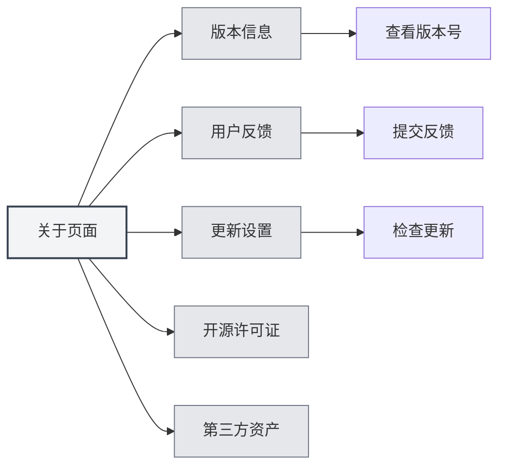
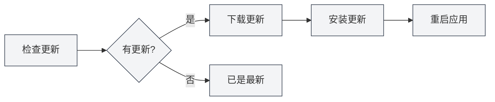

# Acerca de la información

## Resumen

La página Acerca de proporciona información sobre la versión de MetaDoc, configuración de actualizaciones, licencias de código abierto e información de activos de terceros. A través de esta página, puede conocer la información de la aplicación, verificar actualizaciones, enviar comentarios, etc.

## Información de versión

### Ver la versión

En la página Acerca de, puede ver la siguiente información:

- **Nombre de la aplicación**: MetaDoc
- **Número de versión**: El número de versión actualmente instalado
- **Fecha de lanzamiento**: La fecha de lanzamiento de la versión actual
- **Entorno de compilación**: Versión de desarrollo o versión de lanzamiento

Puede acceder a la página Acerca de a través de la barra de menú superior:

<MenuItemsDemo mode="demo" :items='[{"id": "settings", "items": ["about"]}]' />



### Formato de versión

El número de versión utiliza el formato de versionado semántico:

```
Versión principal.Versión secundaria.Número de revisión
```

Por ejemplo: `0.12.1`

### Entorno de compilación

- **Versión de desarrollo**: Versión compilada en entorno de desarrollo, puede contener información de depuración
- **Versión de lanzamiento**: Versión lanzada oficialmente, probada y optimizada

<SettingAboutSection mode="demo" />

## Comentarios del usuario

### Enviar comentarios

Puede enviar comentarios de las siguientes maneras:

1. En la página Acerca de, haga clic en el botón "Comentarios del usuario"
2. Complete el contenido de los comentarios en la página de comentarios
3. Envíe los comentarios

### Contenido de los comentarios

Al enviar comentarios, puede incluir la siguiente información:

- **Descripción del problema**: Describa en detalle el problema encontrado
- **Pasos para reproducir**: Explique cómo reproducir el problema
- **Comportamiento esperado**: Describa el comportamiento esperado
- **Comportamiento real**: Describa el comportamiento que realmente ocurrió
- **Información del entorno**: Sistema operativo, número de versión, etc.

### Sugerencias para comentarios

- **Descripción detallada**: Describa el problema con el mayor detalle posible
- **Proporcionar capturas de pantalla**: Si es necesario, proporcione capturas de pantalla o grabaciones
- **Información de versión**: Incluya el número de versión y la información del entorno de compilación
- **Pasos para reproducir**: Proporcione pasos claros para reproducir el problema

<UserFeedbackView mode="demo" />

## Grupo QQ oficial

### Unirse al grupo QQ

Grupo QQ oficial de MetaDoc: **1079841705**

Unirse al grupo QQ permite:

- Obtener las últimas noticias y avisos de actualizaciones
- Intercambiar experiencias de uso con otros usuarios
- Obtener soporte técnico
- Participar en discusiones sobre funciones

### Recursos del grupo

El grupo QQ proporciona los siguientes recursos:

- **Tutoriales de uso**: Tutoriales de uso en los archivos del grupo
- **Respuestas a preguntas**: Los miembros del grupo se ayudan mutuamente
- **Avisos de actualización**: Obtenga información de actualización de inmediato
- **Sugerencias de funciones**: Participe en discusiones y sugerencias de funciones

## Configuración de actualizaciones

### Comprobar actualizaciones automáticamente

Al habilitar "Comprobar actualizaciones automáticamente", MetaDoc verificará automáticamente si hay una nueva versión al iniciar:

- **Habilitado**: Comprueba automáticamente las actualizaciones al iniciar
- **Deshabilitado**: No comprueba automáticamente las actualizaciones

### Canal de actualización

Puede elegir el canal de actualización:

- **Versión estable**: Usar la versión lanzada oficialmente (recomendado)
- **Versión de desarrollo**: Usar la versión de desarrollo (puede ser inestable)

<MainTabs mode="demo" />

### Comprobar actualizaciones manualmente

Puede comprobar manualmente las actualizaciones en cualquier momento:

1. En la pestaña "Configuración de actualizaciones" de la página Acerca de
2. Haga clic en el botón "Comprobar actualizaciones"
3. Espere a que se complete la comprobación

### Estado de la actualización

Después de comprobar las actualizaciones, se mostrarán los siguientes estados:

- **Actualización disponible**: Muestra información de la nueva versión, puede descargar la actualización
- **Ya es la versión más reciente**: La versión actual es la más reciente
- **Error en la comprobación**: Muestra un mensaje de error

### Descargar e instalar actualizaciones

Si hay una actualización disponible:

1. **Descargar actualización**: Haga clic en el botón "Descargar actualización"
2. **Esperar la descarga**: Vea el progreso de la descarga
3. **Instalar actualización**: Una vez completada la descarga, haga clic en el botón "Instalar y reiniciar"
4. **Reinicio automático**: La aplicación se reiniciará automáticamente e instalará la actualización



<QuickStartPanel mode="demo" />

## Licencia de código abierto

### Ver la licencia

En la pestaña "Licencia de código abierto" de la página Acerca de, puede ver:

- **Licencia de código abierto**: La licencia de código abierto utilizada por MetaDoc
- **Contenido de la licencia**: El texto completo de la licencia

### Información de la licencia

MetaDoc sigue una licencia de código abierto, usted puede:

- Ver el contenido de la licencia
- Conocer los términos de uso
- Conocer los derechos y obligaciones

## Activos de terceros

### Ver activos de terceros

En la pestaña "Activos de terceros" de la página Acerca de, puede ver:

- **Bibliotecas de terceros**: Bibliotecas de código abierto de terceros utilizadas por MetaDoc
- **Información de activos**: Información de licencia y origen de los activos de terceros

### Lista de activos

La lista de activos de terceros incluye:

- **Nombre de la biblioteca**: Nombre de la biblioteca de terceros
- **Versión**: Número de versión utilizado
- **Licencia**: Tipo de licencia de la biblioteca
- **Origen**: Enlace de origen de la biblioteca

## Mejores prácticas

1. **Actualizar periódicamente**: Se recomienda habilitar la comprobación automática de actualizaciones para obtener nuevas versiones oportunamente
2. **Informar problemas**: Enviar comentarios oportunamente cuando encuentre problemas
3. **Unirse al grupo QQ**: Unirse al grupo QQ oficial para obtener soporte e información
4. **Revisar la licencia**: Conocer los términos de uso de la licencia de código abierto
5. **Seguir las actualizaciones**: Estar atento a los avisos de actualización para conocer nuevas funciones y correcciones

## Consideraciones

1. **Copia de seguridad antes de actualizar**: Se recomienda hacer una copia de seguridad de los datos importantes antes de actualizar
2. **Conexión a Internet**: Comprobar actualizaciones requiere conexión a Internet
3. **Compatibilidad de versiones**: Después de actualizar, puede ser necesario reconfigurar algunos ajustes
4. **Información en los comentarios**: Al enviar comentarios, tenga cuidado de proteger la información privada
5. **Cumplimiento de la licencia**: Al usar MetaDoc, cumpla con la licencia de código abierto

<ResizableDivider mode="demo" />

## Documentación relacionada

- [[settings.basic|Configuración básica]]
- [[settings.logging|Configuración de registros]]
- [[quick-start.guide|Guía de inicio rápido]]

<SettingAboutSection mode="demo" />

<UserFeedbackView mode="demo" />

<MenuItemsDemo mode="demo" :items='[{"id": "settings", "items": ["about"]}]' />

<MainTabs mode="demo" />