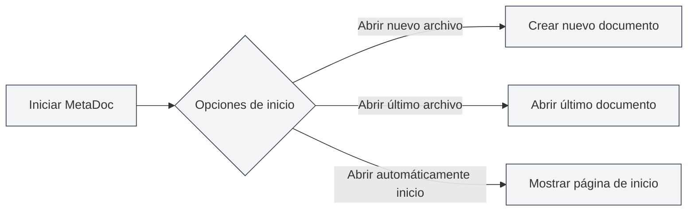
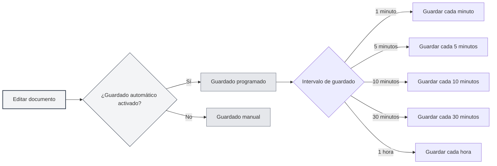
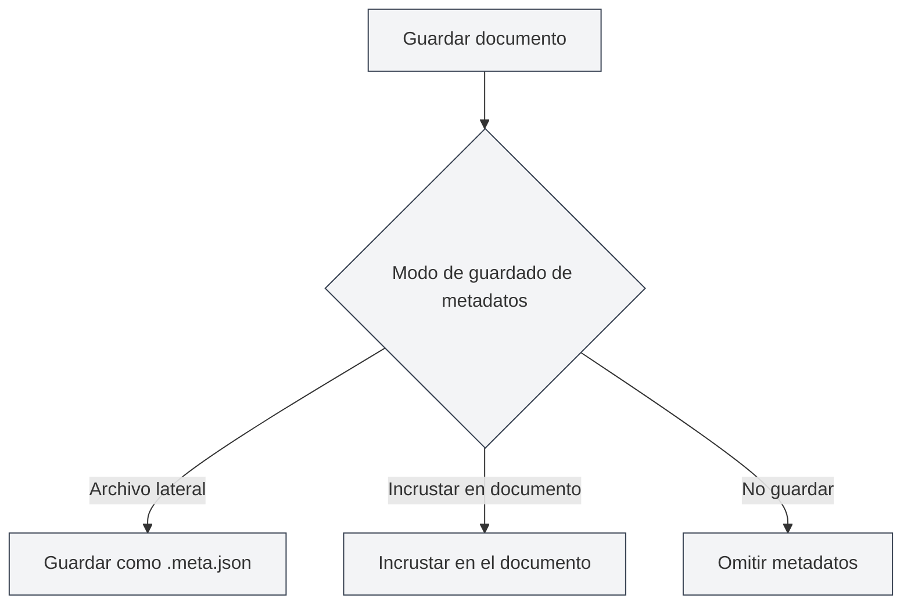

# Configuración Básica

## Resumen

La Configuración Básica contiene las opciones centrales de configuración de MetaDoc, abarcando funciones importantes como el comportamiento de inicio de la aplicación, el guardado automático, las estadísticas de documentos y la gestión de metadatos. Configurar estas opciones adecuadamente puede mejorar su experiencia de uso y productividad.

## Opciones de Inicio

### Configurar el Comportamiento de Inicio

Las opciones de inicio determinan el comportamiento predeterminado al iniciar MetaDoc:

- **Abrir un nuevo archivo**: Crea un nuevo documento en blanco cada vez que se inicia.
- **Abrir el último archivo editado**: Abre automáticamente el documento que se estaba editando al cerrar la aplicación.

Puede elegir la opción de inicio que se adapte a sus hábitos de uso. Si a menudo necesita continuar desde donde lo dejó, se recomienda seleccionar "Abrir el último archivo editado".

Puede acceder a la configuración a través de la barra de menú superior:

<MenuItemsDemo mode="demo" :items='[{"id": "settings"}]' />

### Interfaz de Configuración Básica

La siguiente imagen muestra la interfaz completa de la página de Configuración Básica:

<SettingBasicSection mode="demo" />

La interfaz de Configuración Básica contiene las siguientes áreas principales de configuración:

- **Opciones de inicio**: Configura el comportamiento predeterminado al iniciar la aplicación (abrir nuevo archivo/último archivo editado).
- **Guardado automático**: Configura el intervalo de guardado automático para prevenir la pérdida de datos.
- **Guardado de metadatos**: Selecciona el método de almacenamiento de metadatos (dentro del documento/archivo independiente).
- **Directorio de referencias**: Gestiona la ubicación de almacenamiento de archivos externos referenciados por el documento.
- **Otras opciones**: Configuraciones avanzadas como el procesamiento de bloques de código, la incrustación de imágenes, fórmulas matemáticas, etc.

### Abrir Automáticamente la Página de Inicio al Arrancar

Al habilitar esta opción, MetaDoc abrirá automáticamente la pestaña de la página de inicio al iniciar. La página de inicio proporciona funciones como inicio rápido y lista de documentos recientes, facilitando el acceso rápido a las funciones más utilizadas.

## Guardado Automático

<SettingBasicSection mode="demo" />

### Configurar el Guardado Automático

La función de guardado automático puede prevenir la pérdida de contenido debido a eventos inesperados (como fallos del programa, cortes de energía, etc.). MetaDoc admite los siguientes intervalos de guardado automático:

- **Desactivado**: No guarda automáticamente, requiere guardado manual.
- **1 minuto**: Guarda automáticamente cada minuto.
- **5 minutos**: Guarda automáticamente cada 5 minutos.
- **10 minutos**: Guarda automáticamente cada 10 minutos.
- **30 minutos**: Guarda automáticamente cada 30 minutos.
- **1 hora**: Guarda automáticamente cada hora.

### Recomendaciones de Uso

- **Edición frecuente**: Se recomienda establecer un intervalo de guardado automático corto (1-5 minutos) para asegurar que el contenido se guarde oportunamente.
- **Escritura prolongada**: Se puede establecer un intervalo más largo (10-30 minutos) para reducir la frecuencia de escritura en disco.
- **Documentos importantes**: Se recomienda activar el guardado automático y complementarlo con guardados manuales (`Ctrl+S`) para garantizar la seguridad de los datos.

El guardado automático se realiza en silencio en segundo plano y no interrumpe su trabajo de edición.

## Configuración de Estadísticas del Documento

<SettingBasicSection mode="demo" />

### Excluir Bloques de Código de las Estadísticas

Al habilitar esta opción, al contar palabras, frecuencia de términos y otra información estadística del documento, se excluirá el contenido dentro de los bloques de código. Esto es especialmente útil para documentación técnica, ya que el contenido dentro de bloques de código normalmente no debería contarse en las estadísticas de texto del documento.

**Casos de uso**:

- Documentación técnica que contiene muchos ejemplos de código.
- Necesidad de contar con precisión el contenido de texto real del documento.
- Evitar que el código afecte los resultados del análisis de frecuencia de palabras.

## Configuración de Procesamiento de Imágenes

<SettingBasicSection mode="demo" />

### Analizar Imágenes Incrustadas (Función OCR)

Al habilitar esta opción, MetaDoc procesará las imágenes incrustadas en el documento mediante OCR (Reconocimiento Óptico de Caracteres) para extraer el contenido de texto de las imágenes. Esto es especialmente útil para procesar documentos que contienen imágenes (como PDF, documentos Word).

**Descripción de la función**:

- Las imágenes en archivos DOCX, PPTX, PDF subidos serán procesadas por OCR.
- Los archivos de imagen subidos directamente seguirán siendo procesados por OCR (no afectados por esta opción).
- Los resultados de OCR pueden usarse para búsqueda en la base de conocimiento y funciones de asistencia por IA.

**Consideraciones**:

- El procesamiento OCR requiere ciertos recursos de cálculo y puede afectar la velocidad de carga del documento.
- Si no necesita extraer texto de las imágenes, puede desactivar esta función para mejorar el rendimiento.

### Números en Línea para Fórmulas Matemáticas

Al habilitar esta opción, los números dentro de las fórmulas matemáticas se mostrarán en modo en línea, en lugar de modo de bloque. Esto permite que las fórmulas se integren mejor en el flujo del texto, siendo adecuado para insertar expresiones matemáticas simples dentro de párrafos.

## Modo de Guardado de Metadatos

<SettingBasicSection mode="demo" />

### Configurar el Método de Guardado

La información de metadatos del documento (título, autor, descripción, palabras clave, etc.) se puede guardar de tres maneras:

- **Archivo lateral**: Guarda los metadatos en un archivo independiente (`.meta.json`) en el mismo directorio que el documento.
  - Ventaja: No afecta el contenido original del documento, facilita el control de versiones.
  - Desventaja: Requiere gestionar dos archivos simultáneamente.
- **Incrustar en documento**: Incrusta los metadatos dentro del archivo del documento.
  - Ventaja: Gestión de un solo archivo, fácil de compartir.
  - Desventaja: Algunos formatos pueden no admitir la incrustación.
- **No guardar**: No guarda metadatos.
  - Caso de uso: Documentos temporales o que no requieren metadatos.

### Recomendaciones de Elección

- **Documentación técnica**: Se recomienda el modo "Archivo lateral", facilita la gestión con sistemas de control de versiones como Git.
- **Notas personales**: Se puede usar el modo "Incrustar en documento", mantiene la organización de un solo archivo.
- **Documentos temporales**: Se puede elegir el modo "No guardar".

## Gestión del Directorio de Archivos de Referencia

<SettingBasicSection mode="demo" />

### Ver Información del Directorio

El directorio de archivos de referencia se utiliza para almacenar archivos externos referenciados en el documento (como imágenes, archivos adjuntos, etc.). En la página de Configuración Básica, puede:

- **Ver tamaño del directorio**: Muestra el espacio en disco ocupado por el directorio de archivos de referencia.
- **Actualizar**: Actualiza la información del tamaño del directorio.
- **Abrir directorio**: Abre el directorio de archivos de referencia en el explorador de archivos.
- **Vaciar directorio**: Elimina todos los archivos dentro del directorio (la acción no se puede deshacer).

### Casos de Uso

El directorio de archivos de referencia se utiliza normalmente para:

- Almacenar imágenes insertadas en el documento.
- Guardar archivos adjuntos del documento.
- Gestionar archivos de recursos relacionados con el documento.

**Consideraciones**:

- La acción de vaciar el directorio no se puede deshacer, proceda con precaución.
- Se recomienda hacer una copia de seguridad de los archivos importantes antes de vaciarlo.
- El tamaño del directorio aumentará a medida que se agreguen más archivos referenciados en los documentos.

## Consideraciones Importantes

1. **Opciones de inicio**: Los cambios en las opciones de inicio surtirán efecto la próxima vez que se inicie la aplicación.
2. **Guardado automático**: El guardado automático no sobrescribe sus acciones de guardado manual; ambos pueden usarse en conjunto.
3. **Modo de metadatos**: Después de cambiar el modo de guardado de metadatos, los documentos guardados a partir de ese momento usarán el nuevo modo; los documentos existentes no se verán afectados.
4. **Directorio de referencias**: Antes de vaciar el directorio de referencias, asegúrese de que ningún documento esté usando esos archivos.

## Documentación Relacionada

- [[core.file-operations|Operaciones de archivo]]
- [[core.document-metadata|Metadatos del documento]]
- [[settings.theme|Configuración de tema]]
- [[settings.image|Configuración de imágenes]]

<MenuItemsDemo mode="demo" :items='[{"id": "settings", "items": ["basic"]}]' />
