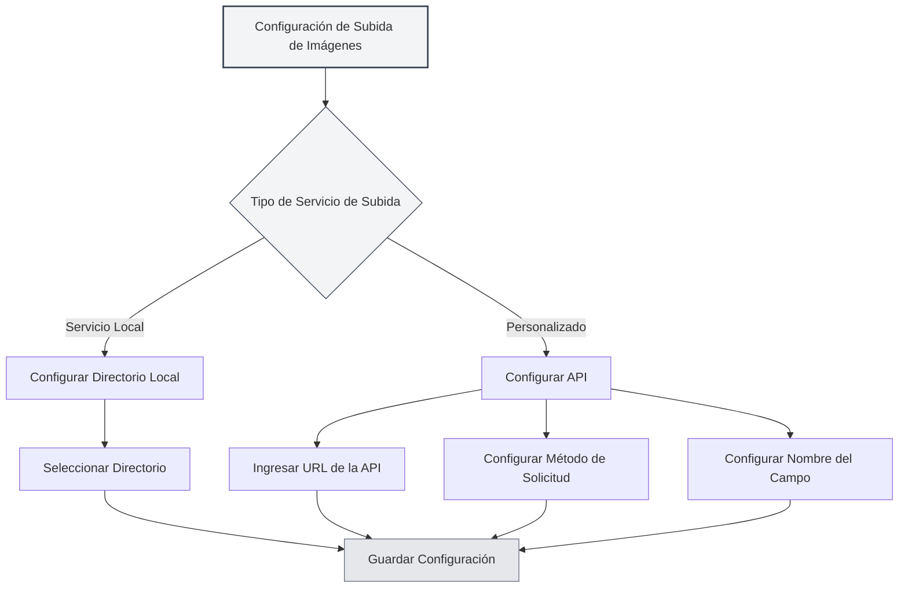

# Configuración del Servicio de Subida

## Descripción General

La configuración del servicio de subida permite configurar el servicio de destino para la carga de imágenes. MetaDoc admite dos métodos de subida: servicio local y API personalizada. Puede elegir el servicio adecuado según sus necesidades.

## Tipos de Servicio de Subida

### Selección del Servicio

En la página de configuración de imágenes, cuando la "Operación de inserción de imágenes" está configurada como "Subir", puede seleccionar el servicio de subida:

- **Servicio local**: Guarda las imágenes en un directorio local.
- **Personalizado**: Utiliza una API personalizada para subir imágenes.

Puede acceder a la configuración de subida de imágenes a través de la barra de menú superior:

<MenuItemsDemo mode="demo" :items='[{"id": "settings"}]' />



### Servicio Local

El servicio local guarda las imágenes en el sistema de archivos local:

- **Ventajas**: Control completamente local, seguridad de los datos.
- **Desventajas**: Requiere configurar un directorio local.
- **Casos de uso**: Uso local, requisitos altos de privacidad de datos.

<SettingImageSection mode="demo" />

### Servicio Personalizado

El servicio personalizado utiliza una API externa para subir imágenes:

- **Ventajas**: Puede subir a almacenamiento en la nube, alojamiento de imágenes, etc.
- **Desventajas**: Requiere configurar una interfaz API.
- **Casos de uso**: Necesidad de almacenamiento en la nube, CDN de imágenes, etc.

<MainTabs mode="demo" />

## Configuración del Directorio de Imágenes Local

### Establecer Directorio

Al usar el servicio local, es necesario configurar el directorio de guardado de imágenes:

1. En la página de configuración de imágenes, seleccione "Servicio local".
2. Haga clic en el botón "Examinar" para seleccionar un directorio.
3. O ingrese directamente la ruta del directorio en el campo de entrada.
4. Haga clic en el botón "Abrir" para abrir el directorio en el explorador de archivos.

### Selección del Directorio

Al seleccionar el directorio de imágenes:

- **Botón Examinar**: Abre el cuadro de diálogo de selección de directorio.
- **Entrada de Ruta**: Ingresa directamente la ruta del directorio.
- **Botón Abrir**: Abre el directorio ya configurado en el explorador de archivos.

### Directorio Predeterminado

Si no se establece un directorio local de imágenes, el sistema utilizará el directorio predeterminado:

- **Windows**: `%APPDATA%/MetaDoc/images`
- **macOS**: `~/Library/Application Support/MetaDoc/images`
- **Linux**: `~/.config/MetaDoc/images`


### Gestión del Directorio

- **Ver Directorio**: Haga clic en el botón "Abrir" para ver el contenido del directorio.
- **Cambiar Directorio**: Haga clic en el botón "Examinar" para seleccionar un nuevo directorio.
- **Requisitos del Directorio**: Asegúrese de que el directorio exista y tenga permisos de escritura.

## Configuración de la API de Subida Personalizada

### Configuración de la URL de la API

Al usar el servicio personalizado, es necesario configurar la dirección de la API:

1. En la página de configuración de imágenes, seleccione el servicio "Personalizado".
2. En el campo de entrada "URL de la API de subida personalizada", ingrese la dirección de la API.
3. Ejemplo de formato: `https://api.example.com/upload`

### Configuración del Método de la API

Configure el método de solicitud de la API:

- **POST**: Utiliza el método POST para subir (recomendado).
- **PUT**: Utiliza el método PUT para subir.

La mayoría de las API utilizan el método POST; algunas API especiales pueden usar el método PUT.

### Configuración del Nombre del Campo

Configure el nombre del campo para el archivo a subir:

- **Valor predeterminado**: `file`
- **Personalizado**: Establezca el nombre del campo según los requisitos de la API.

Diferentes API pueden usar diferentes nombres de campo, como `file`, `image`, `upload`, etc.

### Ejemplos de Configuración de API

**Ejemplo 1: API de alojamiento de imágenes estándar**

```
URL de la API: https://api.example.com/upload
Método: POST
Nombre del campo: file
```

**Ejemplo 2: API con nombre de campo personalizado**

```
URL de la API: https://api.example.com/image
Método: POST
Nombre del campo: image
```

**Ejemplo 3: API con método PUT**

```
URL de la API: https://api.example.com/upload
Método: PUT
Nombre del campo: file
```

<ViewMenuItemsDemo mode="demo" :items='["home", "editor"]'
/>

## Formato de Respuesta de la API

### Requisitos de Respuesta

La API personalizada debe devolver una respuesta JSON con el siguiente formato:

```json
{
  "success": true,
  "imagePath": "https://example.com/image.png"
}
```

### Campos de Respuesta

- **success**: Valor booleano que indica si la subida fue exitosa.
- **imagePath**: Cadena de texto que devuelve la URL o ruta de la imagen.

### Manejo de Errores

Si la subida falla, la API debe devolver:

```json
{
  "success": false,
  "message": "Mensaje de error"
}
```

<DialogDemo mode="demo" dialogType="api-config" />

## Validación de la Configuración

### Probar Configuración

Después de configurar la API personalizada, se recomienda probar la configuración:

1. Inserte una imagen en el documento.
2. Revise el resultado de la subida.
3. Si falla, verifique si la configuración es correcta.

### Problemas Comunes

**Fallo de conexión**:

- Verifique que la URL de la API sea correcta.
- Verifique la conexión de red.
- Verifique si el servicio API está funcionando correctamente.

**Fallo en la subida**:

- Verifique que el método de la API sea correcto.
- Verifique que el nombre del campo sea correcto.
- Verifique que el formato de respuesta de la API cumpla con los requisitos.

**Problemas de permisos**:

- Verifique si la API requiere autenticación.
- Verifique que la API Key o Token sean correctos.

<SettingBasicSection mode="demo" />

## Configuración del Servicio Local

### Permisos del Directorio

Al usar el servicio local, asegúrese de que el directorio tenga permisos de escritura:

- **Windows**: Revise la configuración de permisos de la carpeta.
- **macOS/Linux**: Revise los permisos del directorio (chmod).

### Estructura del Directorio

El servicio local guardará las imágenes en el directorio especificado:

- **Nombrado de archivos**: Utiliza marca de tiempo + nombre de archivo original.
- **Formato de archivo**: Mantiene el formato original.
- **Estructura del directorio**: Todas las imágenes se guardan en el mismo directorio.

<OcrWindow mode="demo" />

### Acceso a las Imágenes

Las imágenes del servicio local se pueden acceder de las siguientes maneras:

- **Servicio HTTP**: A través de la ruta `/images/` del servidor en tiempo de ejecución (la dirección predeterminada la configura la aplicación, por ejemplo, `http://127.0.0.1:52521/images/`).
- **Ruta de archivo**: Utilice directamente la ruta del sistema de archivos.

## Mejores Prácticas

1. **Uso local**: Para uso local, se recomienda el servicio local.
2. **Almacenamiento en la nube**: Use una API personalizada cuando necesite almacenamiento en la nube.
3. **Gestión de directorios**: Limpie periódicamente el directorio de imágenes para evitar ocupar demasiado espacio.
4. **Prueba de API**: Pruebe primero después de configurar una API personalizada.
5. **Estrategia de respaldo**: Se recomienda hacer una copia de seguridad de las imágenes importantes simultáneamente.

<MenuItemsDemo mode="demo" :items='[{"id": "file", "items": ["new", "open", "save"]}]' />

## Consideraciones

1. **Aplicación de la configuración**: Los cambios en la configuración solo se aplicarán a las imágenes insertadas después del cambio.
2. **Compatibilidad de la API**: Asegúrese de que la API personalizada cumpla con los requisitos de formato de respuesta.
3. **Permisos del directorio**: Asegúrese de que el directorio local tenga permisos de escritura.
4. **Conexión de red**: La API personalizada requiere conexión a Internet.
5. **Espacio de almacenamiento**: El servicio local ocupará espacio de almacenamiento local.

## Documentación Relacionada

- [[settings.image|Configuración de Subida de Imágenes]]
- [[settings.basic|Configuración Básica]]
- [[core.file-operations|Operaciones de Archivo]]

<ResizableDivider mode="demo" />
