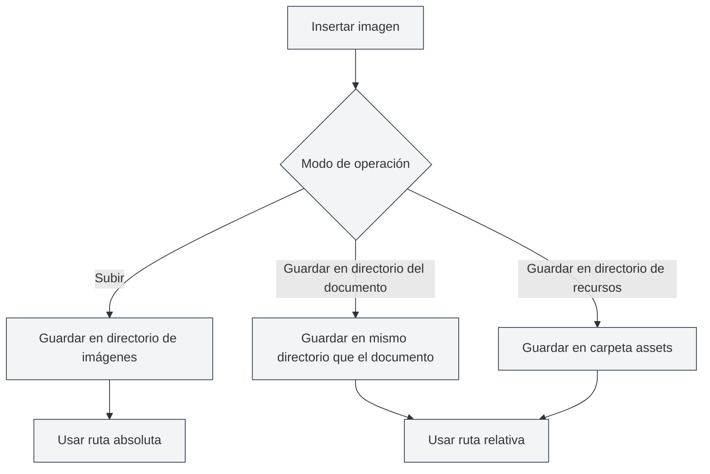

# Configuración de carga de imágenes

## Descripción general

La configuración de carga de imágenes determina cómo se procesan las imágenes al insertarlas en los documentos. MetaDoc admite múltiples modos de procesamiento de imágenes, y puede elegir la configuración adecuada según sus necesidades.

## Operación de inserción de imágenes

### Modos de operación

Al insertar una imagen, puede elegir entre los siguientes modos de operación:

- **Subir**: Subir la imagen al directorio de imágenes especificado
- **Guardar en el directorio del documento**: Guardar la imagen en el directorio donde se encuentra el documento
- **Guardar en el directorio de recursos**: Guardar la imagen en la carpeta `assets` dentro del directorio del documento

Puede acceder a la configuración de imágenes a través de la barra de menú superior:

<MenuItemsDemo mode="demo" :items='[{"id": "settings"}]' />

### Interfaz de configuración de imágenes

La siguiente imagen muestra la interfaz completa de la página de configuración de imágenes:

<SettingImageSection mode="demo" />

La interfaz de configuración de imágenes contiene las siguientes áreas principales de configuración:

- **Servicio de carga de imágenes**: Elegir almacenamiento local o un servicio de alojamiento de imágenes de terceros
- **Ruta de almacenamiento local**: Configurar el directorio local donde se guardarán las imágenes
- **Procesamiento de imágenes de red**: Configurar opciones como si se conserva la URL original, si se realiza una copia automática, etc.

### Modo de subida

El modo de subida guarda las imágenes en el directorio de imágenes local configurado:

- **Ventajas**: Gestión centralizada de todas las imágenes, facilitando la copia de seguridad y la migración
- **Desventajas**: Las imágenes están separadas del documento, al mover el documento también hay que mover las imágenes
- **Casos de uso**: Documentos múltiples que comparten imágenes, gestión centralizada de recursos de imágenes

<DialogDemo mode="demo" dialogType="image-upload" />

### Guardar en el directorio del documento

Guarda la imagen en el directorio donde se encuentra el documento:

- **Ventajas**: La imagen y el documento están en el mismo directorio, facilitando la gestión
- **Desventajas**: Cada directorio de documento tiene sus imágenes, lo que puede causar duplicación
- **Casos de uso**: Proyectos de documento único, documentos que necesitan empaquetarse de forma independiente

<DialogDemo mode="demo" dialogType="file-save" />

### Guardar en el directorio de recursos

Guarda la imagen en la carpeta `assets` dentro del directorio del documento:

- **Ventajas**: Las imágenes se almacenan de forma unificada en la carpeta `assets`, con una estructura clara
- **Desventajas**: Es necesario crear la carpeta `assets`
- **Casos de uso**: Necesidad de una estructura de archivos clara, documentos que necesitan exportarse y compartirse

<DialogDemo mode="demo" dialogType="folder-select" />

## Conservar URL de imágenes de red

### Descripción de la función

Cuando se habilita "Conservar URL de imágenes de red", al insertar una imagen de red no se descarga la imagen, sino que se utiliza directamente la URL original:

- **Habilitado**: Conserva la URL original de la imagen de red, no la descarga localmente
- **Deshabilitado**: Descarga la imagen de red localmente y utiliza la ruta local

### Casos de uso

- **Escenarios para habilitar**:

  - El recurso de imagen es grande y no necesita copia de seguridad local
  - La imagen se actualiza periódicamente y necesita mostrar la versión más reciente en tiempo real
  - Ahorrar espacio de almacenamiento local

- **Escenarios para deshabilitar**:
  - Se necesita acceso sin conexión a las imágenes
  - Se necesita hacer copia de seguridad de los recursos de imágenes
  - Las imágenes de red pueden dejar de estar disponibles

### Consideraciones

- Al conservar la URL de red, se necesita conexión a internet para mostrar la imagen
- Si la imagen de red deja de estar disponible, la imagen en el documento no se mostrará
- Se recomienda deshabilitar esta opción para imágenes importantes, para garantizar su disponibilidad

## Escapado automático de URL de imágenes

### Descripción de la función

Cuando se habilita "Escapado automático de URL de imágenes", al insertar una imagen se escapan automáticamente los caracteres especiales en la URL:

- **Habilitado**: Escapa automáticamente caracteres especiales en la URL (como espacios, caracteres chinos, etc.)
- **Deshabilitado**: Mantiene la URL tal cual, sin realizar escapado

### Reglas de escapado

El sistema escapa automáticamente los siguientes caracteres:

- **Espacios**: Convertidos a `%20`
- **Caracteres chinos**: Codificados en URL
- **Caracteres especiales**: Escapados a un formato seguro para URL

### Recomendaciones de uso

- **Habilitar**: Se recomienda habilitar, para garantizar que la URL se analice correctamente en diversos entornos
- **Deshabilitar**: Deshabilitar solo cuando se esté seguro de que el formato de la URL es correcto y no necesita escapado

## Formato de rutas

### Ruta absoluta

Cuando se utiliza el modo de subida, las imágenes usan rutas absolutas:

- **Formato**: `/ruta/a/imagen.png`
- **Ventajas**: La ruta es explícita, no se ve afectada por la ubicación del documento
- **Desventajas**: La ruta deja de funcionar si se mueve el documento o la imagen

### Ruta relativa

Cuando se utiliza guardar en el directorio del documento o en el directorio de recursos, las imágenes usan rutas relativas:

- **Formato**: `./imagen.png` o `./assets/imagen.png`
- **Ventajas**: El documento y las imágenes se pueden mover juntos
- **Desventajas**: Si cambia la ubicación del documento, es necesario ajustar la ruta

## Aplicación de la configuración

### Momento de aplicación

Los cambios en la configuración de carga de imágenes se aplican en las siguientes situaciones:

- **Imágenes insertadas nuevas**: Usan la nueva configuración inmediatamente
- **Documentos ya abiertos**: Es necesario volver a abrir el documento para que surta efecto
- **Documentos ya guardados**: Los documentos ya guardados no se ven afectados

### Volver a abrir el archivo

Algunos cambios de configuración requieren volver a abrir el archivo para que surtan efecto:

1. Modificar la configuración de carga de imágenes
2. Cerrar el documento actual
3. Volver a abrir el documento
4. La nueva configuración entra en vigor

## Mejores prácticas

1. **Gestión unificada**: Usar el modo de subida para gestionar las imágenes de forma centralizada
2. **Documentos independientes**: Cuando se necesita independencia del documento, usar guardar en el directorio del documento
3. **Estructura clara**: Usar el modo de directorio de recursos para mantener una estructura de archivos clara
4. **Imágenes de red**: Para imágenes importantes, se recomienda deshabilitar la opción de conservar URL
5. **Escapado de rutas**: Se recomienda habilitar el escapado automático para garantizar compatibilidad

## Consideraciones

1. **Aplicación de configuración**: Algunas configuraciones requieren volver a abrir el archivo para que surtan efecto
2. **Formato de rutas**: Prestar atención a la diferencia entre rutas absolutas y relativas
3. **Imágenes de red**: Al conservar la URL de red, se necesita conexión a internet
4. **Copia de seguridad de imágenes**: Para imágenes importantes, se recomienda deshabilitar la conservación de URL, para garantizar la copia de seguridad
5. **Espacio de almacenamiento**: El modo de subida ocupa espacio de almacenamiento local

## Documentación relacionada

- [[settings.image-upload|Configuración del servicio de carga]]
- [[settings.basic|Configuración básica]]
- [[core.file-operations|Operaciones de archivo]]

<SettingImageSection mode="demo" />

<MenuItemsDemo mode="demo" :items='[{"id": "settings", "items": ["image"]}]' />

<DialogDemo mode="demo" dialogType="image-upload" />

<DialogDemo mode="demo" dialogType="file-save" />
