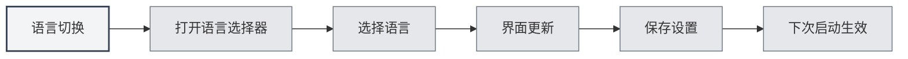

# Soporte Multilingüe

## Descripción General

MetaDoc admite una interfaz multilingüe, permitiéndole seleccionar el idioma que mejor se adapte a sus hábitos de uso. Al cambiar el idioma, la interfaz se actualizará inmediatamente al idioma seleccionado.

## Idiomas Soportados

MetaDoc actualmente soporta los siguientes idiomas:

- **Chino Simplificado** (zh_CN): Idioma predeterminado
- **English** (en_US): Inglés
- **日本語** (ja_JP): Japonés
- **한국어** (ko_KR): Coreano
- **Français** (fr_FR): Francés
- **Deutsch** (de_DE): Alemán

## Cambio de Idioma

### Cambiar Idioma

1. Haga clic en el selector de idioma en la parte inferior del menú lateral
2. Seleccione el idioma que desea utilizar
3. La interfaz se actualizará inmediatamente al idioma seleccionado

Puede acceder a la configuración de idioma a través de la barra de menú superior:

<MenuItemsDemo mode="demo" :items='[{"id": "settings"}]' />

<SettingBasicSection mode="demo" />

<SettingLlmSection mode="demo" />



### Guardado del Idioma

El idioma seleccionado se guarda automáticamente:

- **Guardado automático**: Se guarda inmediatamente después de seleccionar un idioma
- **Próximo inicio**: La aplicación utilizará el último idioma seleccionado en el próximo inicio
- **Sincronización multi-ventana**: Todos las ventanas sincronizarán automáticamente la configuración de idioma

<SettingThemeSection mode="demo" />

## Localización de la Interfaz

### Alcance de la Localización

El cambio de idioma afecta los siguientes elementos de la interfaz:

- **Elementos del menú**: Todos los menús y elementos de menú
- **Texto de botones**: El texto de todos los botones
- **Diálogos**: Todos los cuadros de diálogo y mensajes de aviso
- **Páginas de configuración**: Las etiquetas y descripciones de todas las páginas de configuración
- **Mensajes de error**: Mensajes de error y advertencia

### Idioma del Contenido

La configuración de idioma solo afecta el idioma de la interfaz, no:

- **Contenido del documento**: El contenido del documento permanece sin cambios
- **Rutas de archivo**: Las rutas de archivo permanecen sin cambios
- **Entrada del usuario**: El contenido ingresado por el usuario no se ve afectado

<ViewMenuItemsDemo mode="demo" :items='["settings"]' />

## Sugerencias para la Selección de Idioma

### Según los Hábitos de Uso

- **Usuarios chinos**: Utilice Chino Simplificado para una interfaz más familiar
- **Usuarios de inglés**: Utilice English para que se ajuste a sus hábitos de uso
- **Otros idiomas**: Seleccione según su preferencia personal

### Según el Idioma del Documento

- **Documentos en chino**: Puede utilizar la interfaz en chino
- **Documentos en inglés**: Puede utilizar la interfaz en inglés
- **Documentos multilingües**: Elija el idioma más utilizado

## Efecto del Cambio de Idioma

### Efecto Inmediato

El cambio de idioma surte efecto inmediatamente:

- **Actualización de interfaz**: Todos los elementos de la interfaz se actualizan al instante
- **Sin reinicio**: No es necesario reiniciar la aplicación
- **Estado preservado**: El estado de edición actual no se pierde

<MainTabs mode="demo" />

### Sincronización Multi-ventana

Todas las ventanas sincronizan automáticamente el idioma:

- **Ventana principal**: Cambio de idioma en la ventana principal
- **Ventanas auxiliares**: Todas las ventanas auxiliares se actualizan de forma sincronizada
- **Nueva ventana**: Las ventanas recién abiertas utilizan el idioma actual

## Archivos de Idioma

### Ubicación de los Archivos de Idioma

Los archivos de idioma se almacenan en el directorio de la aplicación:

- **Formato de archivo**: Formato JSON
- **Ubicación del archivo**: `src/renderer/src/locales/`
- **Nomenclatura**: Se nombran usando códigos de idioma (ej. `zh_cn.json`)

### Estructura del Archivo de Idioma

Los archivos de idioma utilizan una estructura de pares clave-valor:

```json
{
  "common": {
    "confirm": "确认",
    "cancel": "取消"
  },
  "setting": {
    "basic": "基础设置"
  }
}
```

## Consideraciones

1. **Código de idioma**: Los códigos de idioma utilizan el formato con guión bajo (ej. `zh_CN`)
2. **Integridad de la traducción**: Algunas funciones nuevas pueden tener solo traducciones parciales temporalmente
3. **Idioma de respaldo**: Si falta una traducción, se recurrirá al Chino Simplificado
4. **Contenido del documento**: La configuración de idioma no afecta el contenido del documento
5. **Rutas de archivo**: La configuración de idioma no afecta la visualización de las rutas de archivo

## Documentación Relacionada

- [[settings.basic|Configuración Básica]]
- [[quick-start.guide|Guía de Inicio Rápido]]

<ViewMenuItemsDemo mode="demo" :items='["settings"]' />