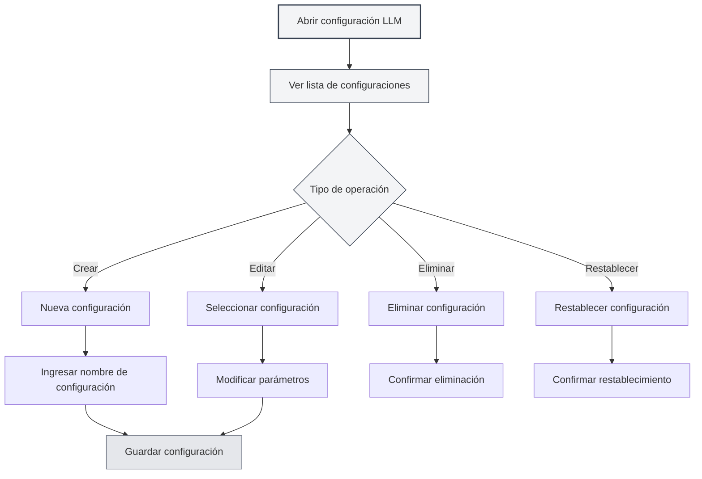

# Gestión de Configuración de LLM

## Descripción General

La gestión de configuración de LLM le permite crear, editar, eliminar y administrar múltiples configuraciones de LLM. A través de la gestión de configuraciones, puede configurar diferentes servicios LLM para distintos escenarios de uso, cambiando entre ellos de manera flexible para satisfacer diversas necesidades.

## Crear Configuración

### Crear Nueva Configuración

1.  En la página de configuración de LLM, haga clic en el botón "Nueva configuración" (icono +) sobre la lista de configuraciones a la izquierda.
2.  Ingrese un nombre para la configuración en el cuadro de diálogo emergente.
3.  El sistema creará una nueva configuración basada en la configuración actual.
4.  Una vez creada, el sistema cambiará automáticamente a la nueva configuración.

Puede acceder a la configuración de LLM a través de la barra de menú superior:

<MenuItemsDemo mode="demo" :items='[{"id": "settings"}]' />

### Demostración de la Interfaz de Configuración

La siguiente imagen muestra las funciones principales de la interfaz de gestión de configuración de LLM:

<SettingLlmSection mode="demo" />

**Notas importantes**:

-   El nombre de la configuración no puede estar vacío.
-   El nombre de la configuración debe ser descriptivo para facilitar su identificación.
-   La nueva configuración heredará todos los ajustes actuales.
-   El tipo de configuración manual (`manual`) no admite la creación de nuevas configuraciones.



### Crear desde la Configuración Actual

Al crear una nueva configuración, el sistema:

-   Copiará el tipo de LLM actualmente seleccionado.
-   Copiará todos los parámetros de configuración actuales (URL de la API, Clave de API, modelo, etc.).
-   Creará un nuevo ID de configuración.
-   Agregará la nueva configuración a la lista de configuraciones.

Puede crear una nueva configuración basada en una existente y luego modificar los parámetros, lo que permite crear configuraciones similares rápidamente.

<DialogDemo mode="demo" dialogType="llm-config" />

## Editar Configuración

### Modificar Parámetros de Configuración

1.  Seleccione la configuración que desea editar en la lista de configuraciones.
2.  Modifique los diversos parámetros en el formulario de la derecha.
3.  Después de realizar cambios, el sistema los marcará como "Cambios no guardados".
4.  Haga clic en el botón "Guardar cambios" para guardar las modificaciones.

<DialogDemo mode="demo" dialogType="api-config" />

### Explicación de los Parámetros de Configuración

Los parámetros de configuración varían según el tipo de LLM:

-   **MetaDoc API**: Selección de modelo.
-   **Ollama**: URL de la API, selección de modelo, número máximo de tokens.
-   **OpenAI compatible**: URL de la API, Clave de API, selección de modelo, configuración de sufijo.
-   **OpenAI oficial**: Clave de API, selección de modelo.
-   **DeepSeek**: Clave de API, selección de modelo.
-   **Gemini**: Clave de API, selección de modelo.

### Vista Previa en Tiempo Real

Al modificar los parámetros de configuración, el sistema detecta los cambios en tiempo real:

-   Muestra una etiqueta de advertencia cuando hay cambios no guardados.
-   Puede hacer clic en "Descartar cambios" en cualquier momento para revertir.
-   Los cambios surten efecto inmediatamente después de guardar.

<AIChat mode="demo" />

## Eliminar Configuración

### Eliminar Configuración

1.  Haga clic en el botón "Más" (icono de tres puntos) a la derecha del elemento de configuración.
2.  Seleccione "Eliminar configuración".
3.  Confirme la acción de eliminación.

**Restricciones**:

-   Debe conservarse al menos una configuración; no se puede eliminar la última.
-   La configuración predeterminada (`isDefault`) no se puede eliminar, solo restablecer.
-   La acción de eliminación no se puede deshacer; proceda con precaución.

### Confirmación de Eliminación

Antes de eliminar una configuración, el sistema le pedirá confirmación:

-   Después de confirmar, la configuración se eliminará permanentemente.
-   Si se elimina la configuración en uso, el sistema cambiará automáticamente a otra configuración.
-   La eliminación no se puede deshacer; asegúrese de que ya no necesita esa configuración.

<DialogDemo mode="demo" dialogType="confirm-delete" />

## Restablecer Configuración

### Restablecer Configuración Predeterminada

Para las configuraciones predeterminadas (como "Ollama (predeterminado)"), puede restablecerlas a sus valores iniciales:

1.  Haga clic en el botón "Más" a la derecha del elemento de configuración.
2.  Seleccione "Restablecer configuración".
3.  Confirme la acción de restablecimiento.

Después del restablecimiento, la configuración volverá a sus valores predeterminados originales y todas las modificaciones personalizadas se borrarán.

**Casos de uso**:

-   La configuración se modificó accidentalmente y necesita restaurar los valores predeterminados.
-   Necesita restablecer después de probar una configuración.
-   Limpiar ajustes personalizados innecesarios.

## Exportar Configuración

### Exportar Configuración Individual

1.  Haga clic en el botón "Más" a la derecha del elemento de configuración.
2.  Seleccione "Exportar configuración".
3.  El sistema generará un archivo de configuración en formato JSON.
4.  Guarde el archivo localmente.

<DialogDemo mode="demo" dialogType="export-config" />

El archivo de configuración exportado contiene:

-   ID y nombre de la configuración.
-   Tipo de LLM.
-   Todos los parámetros de configuración.
-   Fecha de creación y actualización.

### Exportar Todas las Configuraciones

1.  Haga clic en el botón "Exportar todas las configuraciones" (icono de descarga) sobre la lista de configuraciones.
2.  El sistema exportará todas las configuraciones a un único archivo JSON.
3.  Guarde el archivo localmente.

Exportar todas las configuraciones es útil para:

-   Hacer copias de seguridad de todas las configuraciones.
-   Migrar a otro dispositivo.
-   Compartir configuraciones con otros usuarios.

## Importar Configuración

### Importar Configuración

1.  Haga clic en el botón "Importar configuración" (icono de copia de documento) sobre la lista de configuraciones.
2.  Seleccione un archivo de configuración exportado previamente.
3.  El sistema analizará e importará la configuración.
4.  Las configuraciones importadas se agregarán a la lista de configuraciones.

<DialogDemo mode="demo" dialogType="import-config" />

**Reglas de importación**:

-   Admite la importación de una configuración individual o un array de configuraciones.
-   Si el ID de una configuración importada ya existe, se creará un nuevo ID para evitar conflictos.
-   Después de importar, debe cambiar manualmente a la nueva configuración.

### Formato de Importación

El archivo de configuración debe estar en formato JSON y admitir las siguientes estructuras:

```json
{
  "id": "config-xxx",
  "name": "Nombre de configuración",
  "type": "ollama",
  "ollama": {
    "apiUrl": "http://localhost:11434/api",
    "selectedModel": "llama2"
  }
}
```

O un array de configuraciones:

```json
[
  { "id": "config-1", ... },
  { "id": "config-2", ... }
]
```

## Ordenar Configuraciones

### Ordenar por Arrastrar y Soltar

La lista de configuraciones admite ordenar por arrastrar y soltar:

1.  Haga clic y mantenga presionado un elemento de configuración.
2.  Arrástrelo a la posición deseada.
3.  Suelte el botón del mouse para completar el ordenamiento.

El orden resultante se guarda y se mantendrá la próxima vez que abra la página de configuración.

**Casos de uso**:

-   Colocar configuraciones de uso frecuente en la parte superior.
-   Ordenar por frecuencia de uso.
-   Agrupar por tipo de LLM.

## Estado de la Configuración

### Configuración Actual

La configuración que se está utilizando actualmente:

-   Se resalta en la lista.
-   Muestra la etiqueta "Cambios no guardados" (si hay modificaciones sin guardar).
-   Todas las funciones de IA utilizan el servicio LLM de esta configuración.

### Cambiar de Configuración

Al cambiar de configuración:

-   El sistema verificará si la configuración actual tiene cambios no guardados.
-   Si hay cambios no guardados, se sugiere guardarlos o descartarlos primero.
-   El cambio surte efecto inmediatamente; todas las funciones de IA utilizarán la nueva configuración.

## Mejores Prácticas

1.  **Convenciones de nomenclatura**: Use nombres de configuración claros, como "Trabajo-Ollama", "Experimento-OpenAI".
2.  **Copias de seguridad periódicas**: Exporte copias de seguridad de configuraciones importantes regularmente.
3.  **Probar configuraciones**: Después de crear una nueva configuración, pruébela primero para confirmar que funciona antes de usarla.
4.  **Limpiar configuraciones inútiles**: Elimine periódicamente configuraciones que ya no use para mantener la lista ordenada.
5.  **Documentar**: Agregue notas o documentación para configuraciones complejas.

## Consideraciones Importantes

1.  **Seguridad de la configuración**: Guarde de forma segura las configuraciones que contengan Claves de API; no las comparta.
2.  **Conflictos de configuración**: Tenga en cuenta los posibles conflictos de ID al importar configuraciones.
3.  **Configuración predeterminada**: Las configuraciones predeterminadas no se pueden eliminar, solo restablecer.
4.  **Dependencias de configuración**: Algunas funciones pueden depender de configuraciones específicas; verifique antes de eliminar.
5.  **Sincronización entre ventanas**: Las modificaciones de configuración se sincronizarán entre todas las ventanas abiertas.

## Documentación Relacionada

-   [[settings.llm|Configuración LLM]]
-   [[settings.llm-types|Configuración de tipos LLM]]
-   [[ai.chat|Función de chat con IA]]
-   [[agent.config|Gestión de configuración de Agentes]]

<QuickStartPanel mode="demo" />

<MainTabs mode="demo" />