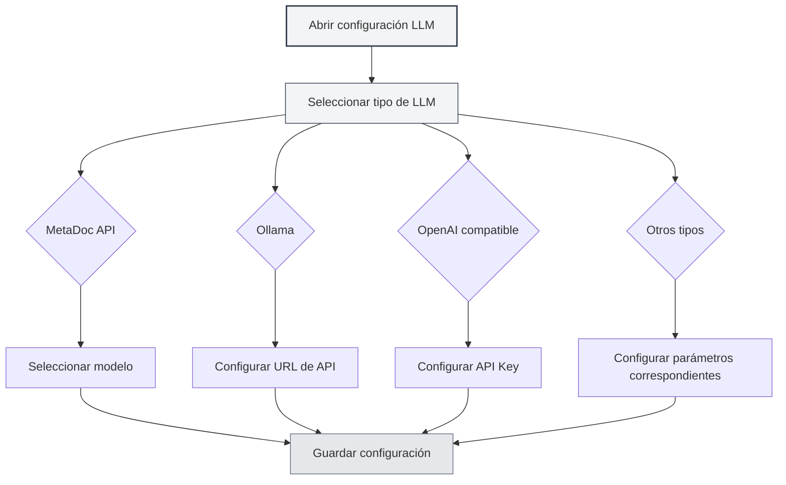

# Configuración de tipos de LLM

## Descripción general

MetaDoc admite múltiples proveedores de servicios LLM, cada uno con diferentes requisitos de configuración. Este documento explica cómo configurar varios tipos de LLM, incluyendo MetaDoc API, Ollama, OpenAI, DeepSeek y Gemini.

## MetaDoc API

### Instrucciones de configuración

MetaDoc API es el servicio LLM oficial proporcionado por MetaDoc, es simple de usar y no requiere configurar una clave API.

### Pasos de configuración

1. Selecciona "MetaDoc" en el menú desplegable de tipo de LLM
2. Selecciona un modelo disponible en el menú desplegable "Seleccionar modelo"
3. Configura el número máximo de tokens (opcional)

Puedes acceder a la configuración de LLM a través de la barra de menú superior:

<MenuItemsDemo mode="demo" :items='[{"id": "settings"}]' />

### Demostración de la interfaz de configuración de LLM

La siguiente imagen muestra las áreas funcionales principales de la página de configuración de LLM:

<SettingLlmSection mode="demo" />

### Requisitos de configuración

- **Cuenta de inicio de sesión**: Se requiere iniciar sesión en una cuenta de MetaDoc para usarlo
- **Selección de modelo**: Elige de la lista de modelos disponibles
- **Número máximo de tokens**: Opcional, limita el número máximo de tokens por solicitud

<MainTabs mode="demo" />

### Casos de uso

- Comenzar rápidamente con funciones de IA
- No requiere configurar servicios externos
- Usar el servicio oficial de MetaDoc

<DialogDemo mode="demo" dialogType="llm-config" />

## Ollama

### Instrucciones de configuración

Ollama es un entorno de ejecución local para LLM que permite ejecutar modelos de lenguaje grandes localmente, sin necesidad de conexión a internet.

### Pasos de configuración

1. Selecciona "Ollama" en el menú desplegable de tipo de LLM
2. Configura la URL base de la API (por defecto: `http://localhost:11434/api`)
3. Haz clic en el menú desplegable "Seleccionar modelo", el sistema obtendrá automáticamente la lista de modelos disponibles localmente
4. Selecciona el modelo a utilizar
5. Configura el número máximo de tokens (opcional)

### Requisitos de configuración

- **Instalar Ollama**: Es necesario instalar Ollama e iniciar el servicio primero
- **URL de la API**: Por defecto es `http://localhost:11434/api`, si Ollama se ejecuta en otra dirección, debe modificarse
- **Descarga de modelos**: Es necesario descargar el modelo primero usando Ollama (ej: `ollama pull llama2`)

### Obtener lista de modelos

Al hacer clic en el menú desplegable "Seleccionar modelo", MetaDoc se conectará automáticamente al servicio Ollama y obtendrá la lista de modelos disponibles. Si la conexión falla, verifica:

- Si el servicio Ollama está en ejecución
- Si la URL de la API es correcta
- Si la conexión de red es normal

### Casos de uso

- Ejecutar LLM localmente, protegiendo la privacidad de los datos
- No requiere conexión a internet
- Tener suficientes recursos de computación (se recomienda GPU)

<DialogDemo mode="demo" dialogType="api-config" />

## OpenAI compatible

### Instrucciones de configuración

La API compatible con OpenAI admite todos los servicios que son compatibles con el formato de API de OpenAI, incluyendo la API oficial de OpenAI y servicios de terceros compatibles.

### Pasos de configuración

1. Selecciona "OpenAI compatible" en el menú desplegable de tipo de LLM
2. Configura la URL base de la API (por defecto: `https://api.openai.com/v1`)
3. Ingresa la API Key
4. Haz clic en el menú desplegable "Seleccionar modelo" para obtener la lista de modelos disponibles
5. Selecciona el modelo a utilizar
6. Configura el sufijo de Completion y el sufijo de Chat (opcional, para personalizar las rutas de API)
7. Configura el número máximo de tokens (opcional)

### Requisitos de configuración

- **URL de la API**: Dirección de la API oficial de OpenAI o de servicios compatibles
- **API Key**: Clave de API obtenida del proveedor del servicio
- **Lista de modelos**: El sistema obtendrá automáticamente la lista de modelos disponibles

### Configuración de sufijos de API

Algunos servicios compatibles pueden requerir rutas de API personalizadas:

- **Sufijo de Completion**: Sufijo de ruta personalizado para la API de Completion
- **Sufijo de Chat**: Sufijo de ruta personalizado para la API de Chat

En la mayoría de los casos no es necesario configurarlos, se pueden usar los valores por defecto.

### Casos de uso

- Usar la API oficial de OpenAI
- Usar servicios de terceros compatibles con la API de OpenAI
- Servicios que requieren rutas de API personalizadas

<QuickStartPanel mode="demo" />

<MainTabs mode="demo" />

## OpenAI oficial

### Instrucciones de configuración

La configuración oficial de OpenAI está específicamente diseñada para la API oficial de OpenAI, es más simple de configurar y la URL de la API es fija.

### Pasos de configuración

1. Selecciona "OpenAI oficial" en el menú desplegable de tipo de LLM
2. Ingresa la API Key de OpenAI
3. Haz clic en el menú desplegable "Seleccionar modelo" para obtener la lista de modelos disponibles
4. Selecciona el modelo a utilizar
5. Configura el número máximo de tokens (opcional)

### Requisitos de configuración

- **API Key**: Clave de API obtenida del sitio web oficial de OpenAI
- **URL de la API**: Fijada en `https://api.openai.com/v1`, no se puede modificar

### Obtener API Key

1. Visita el [sitio web oficial de OpenAI](https://platform.openai.com/)
2. Regístrate o inicia sesión en tu cuenta
3. Ve a la página de API Keys
4. Crea una nueva API Key
5. Copia la API Key y pégala en la configuración de MetaDoc

<ResizableDivider mode="demo" />

### Casos de uso

- Usar los modelos GPT oficiales de OpenAI
- Necesitar un servicio oficial estable
- Tener una cuenta de OpenAI y cuota de API

## DeepSeek

### Instrucciones de configuración

DeepSeek es un proveedor de servicios LLM de alto rendimiento que ofrece potentes capacidades de comprensión del chino.

### Pasos de configuración

1. Selecciona "DeepSeek" en el menú desplegable de tipo de LLM
2. Ingresa la API Key de DeepSeek
3. Selecciona el modelo (deepseek-chat o deepseek-reasoner)
4. Configura el número máximo de tokens (opcional)

### Requisitos de configuración

- **API Key**: Clave de API obtenida del sitio web oficial de DeepSeek
- **Selección de modelo**:
  - `deepseek-chat`: Modelo de conversación general
  - `deepseek-reasoner`: Modelo de razonamiento

### Obtener API Key

1. Visita el [sitio web oficial de DeepSeek](https://www.deepseek.com/)
2. Regístrate o inicia sesión en tu cuenta
3. Ve a la página de API Keys
4. Crea una nueva API Key
5. Copia la API Key y pégala en la configuración de MetaDoc

### Casos de uso

- Necesitar potentes capacidades de comprensión del chino
- Necesitar capacidades de razonamiento (usando deepseek-reasoner)
- Servicio LLM rentable

<SettingKnowledgeBaseSection mode="demo" />

<CompletionSettingsPanel mode="demo" />

## Gemini

### Instrucciones de configuración

Gemini es el servicio LLM proporcionado por Google, que admite capacidades multimodales.

### Pasos de configuración

1. Selecciona "Gemini" en el menú desplegable de tipo de LLM
2. Ingresa la API Key de Gemini
3. Haz clic en el menú desplegable "Seleccionar modelo" para obtener la lista de modelos disponibles
4. Selecciona el modelo a utilizar
5. Configura el número máximo de tokens (opcional)

### Requisitos de configuración

- **API Key**: Clave de API obtenida de Google AI Studio
- **Selección de modelo**: El sistema obtendrá automáticamente la lista de modelos disponibles

### Obtener API Key

1. Visita [Google AI Studio](https://makersuite.google.com/app/apikey)
2. Inicia sesión con tu cuenta de Google
3. Crea una nueva API Key
4. Copia la API Key y pégala en la configuración de MetaDoc

### Casos de uso

- Usar el servicio LLM de Google
- Necesitar capacidades multimodales
- Tener una cuenta de Google

<AgentView mode="demo" />

## Configuración del número máximo de tokens

### Descripción de la función

El número máximo de tokens limita la cantidad máxima de tokens que se pueden generar en una sola solicitud. Habilitar esta función permite:

- Controlar la longitud del contenido generado
- Ahorrar costos de API
- Evitar generar contenido demasiado largo

### Método de configuración

1. Activa el interruptor "Número máximo de tokens"
2. Establece la cantidad de tokens (rango: 1-32768)
3. Guarda la configuración

### Recomendaciones de uso

- **Generación de texto corto**: 100-500 tokens
- **Longitud media**: 500-2000 tokens
- **Generación de texto largo**: 2000-8000 tokens
- **Sin límite**: Desactiva esta opción

## Verificación de configuración

### Probar configuración

Después de completar la configuración, se recomienda probar si funciona correctamente:

1. Guarda la configuración
2. Habilita la función LLM
3. Intenta usar la función de chat con IA
4. Si aparece un error, verifica si la configuración es correcta

### Problemas comunes

**Error de conexión**:

- Verifica si la URL de la API es correcta
- Verifica la conexión de red
- Verifica si el servicio se está ejecutando normalmente

**Error de autenticación**:

- Verifica si la API Key es correcta
- Verifica si la API Key ha expirado
- Verifica si la cuenta tiene suficiente cuota

**Modelo no disponible**:

- Verifica si el nombre del modelo es correcto
- Verifica si la cuenta tiene permiso para usar ese modelo
- Verifica si el servicio admite ese modelo

## Consideraciones importantes

1. **Seguridad de la API Key**: Guarda de forma segura las claves de API, no las compartas con otros
2. **Control de costos**: El uso de API externas puede generar gastos, presta atención al consumo
3. **Requisitos de red**: El uso de API externas requiere una conexión de red estable
4. **Disponibilidad del servicio**: La disponibilidad y estabilidad pueden variar entre diferentes servicios
5. **Selección de modelo**: Diferentes modelos tienen diferentes capacidades y limitaciones, elige según tus necesidades

## Documentación relacionada

- [[settings.llm|Configuración de LLM]]
- [[settings.llm-management|Gestión de configuración de LLM]]
- [[ai.chat|Función de chat con IA]]
- [[ai.completion|Autocompletado con IA]]

<MenuItemsDemo mode="demo" :items='[{"id": "file"}]' />

<ViewMenuItemsDemo mode="demo" :items='["settings"]' />

<SettingLlmSection mode="demo" />

<DialogDemo mode="demo" dialogType="llm-config" />

<MainTabs mode="demo" />