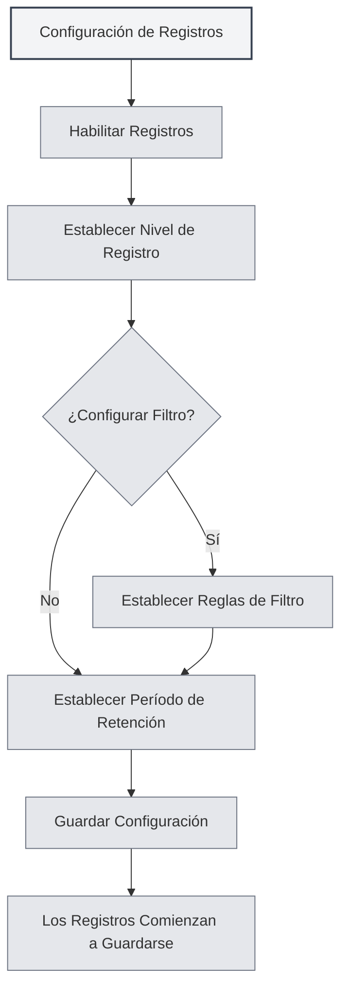

# Configuración de Registros

## Descripción General

La configuración de registros le permite gestionar las funciones de registro de MetaDoc. Al configurar los registros, puede registrar el estado de ejecución de la aplicación, facilitando la resolución de problemas y el análisis de rendimiento.

<Demo component="SettingLoggerSection" mode="demo" />

## Habilitar Registros

### Activar la Función de Registro

En la página de configuración de registros, primero debe habilitar la función de registro:

1.  Encuentre el interruptor "Habilitar registros"
2.  Cambie el interruptor al estado "Habilitado"
3.  Los registros comenzarán a guardarse en un archivo

Puede acceder a la configuración de registros a través de la barra de menú superior:

<MenuItemsDemo mode="demo" :items='[{"id": "settings"}]' />

Una vez habilitados los registros, el sistema registrará información de ejecución de la aplicación, incluyendo:

-   Registros de operaciones
-   Información de errores
-   Información de advertencias
-   Información de depuración (si está habilitada)



**Consideraciones**:

-   Los registros ocupan espacio en disco
-   Se recomienda habilitarlos cuando sea necesario para resolver problemas
-   En entornos de producción se pueden desactivar para reducir el uso de recursos

## Nivel de Registro

### Descripción de Niveles

El nivel de registro determina qué niveles de registro se guardan:

<ConsoleTerminal mode="demo" consoleKey="log-levels" :history='[{"content": "[INFO] 应用启动完成", "type": "out"}, {"content": "[DEBUG] 加载配置文件", "type": "out"}, {"content": "[WARN] 配置项缺失，使用默认值", "type": "warn"}, {"content": "[ERROR] 连接失败，正在重试...", "type": "error"}]' />

-   **DEBUG**: Información detallada de depuración, incluyendo todos los detalles de las operaciones
-   **INFO**: Información general, registra operaciones y estados importantes
-   **WARN**: Información de advertencia, registra posibles problemas
-   **ERROR**: Información de error, registra errores y excepciones

### Prioridad de Niveles

Los niveles de registro tienen una relación de prioridad:

```
DEBUG < INFO < WARN < ERROR
```

Al seleccionar un nivel, se registrarán los registros de ese nivel y los superiores. Por ejemplo:

-   Seleccionar INFO: registra INFO, WARN, ERROR
-   Seleccionar WARN: solo registra WARN, ERROR
-   Seleccionar ERROR: solo registra ERROR

### Recomendaciones para Elegir Nivel

-   **Desarrollo/Depuración**: Use el nivel DEBUG para obtener información detallada
-   **Uso Diario**: Use el nivel INFO para registrar operaciones importantes
-   **Resolución de Problemas**: Use el nivel WARN para centrarse en advertencias y errores
-   **Entorno de Producción**: Use el nivel ERROR para registrar solo errores

<SettingLoggerSection mode="demo" />

## Filtrado de Registros

### Función de Filtrado

El filtrado de registros le permite registrar solo registros de un rango específico:

-   **Filtrar por ámbito (scope)**: Registrar solo registros de módulos específicos
-   **Coincidencia por prefijo**: Admite coincidencia por prefijo, por ejemplo, "ai-graph" coincidirá con todos los ámbitos que comiencen con "ai-graph"
-   **Coincidencia exacta**: Admite coincidencia exacta, por ejemplo, "[ai-graph][WorkflowTool]"

### Reglas de Filtrado

Las reglas de filtrado admiten los siguientes formatos:

-   **Coincidencia simple**: `ai-graph` - Coincide con todos los ámbitos que contengan "ai-graph"
-   **Coincidencia por prefijo**: `ai-` - Coincide con todos los ámbitos que comiencen con "ai-"
-   **Coincidencia exacta**: `[ai-graph][WorkflowTool]` - Coincidencia exacta con ese ámbito

### Casos de Uso

-   **Depurar un módulo específico**: Registrar solo los registros de un módulo
-   **Reducir el volumen de registros**: Filtrar registros no relevantes
-   **Localizar problemas**: Centrarse en los registros de una funcionalidad específica

<SettingDebugSection mode="demo" />

### Ejemplos de Filtrado

**Ejemplo 1: Registrar solo registros relacionados con IA**

```
Condición de filtro: ai-
```

**Ejemplo 2: Registrar solo registros de flujo de trabajo**

```
Condición de filtro: workflow
```

**Ejemplo 3: Registrar solo registros de una herramienta específica**

```
Condición de filtro: [ai-graph][WorkflowTool]
```

## Período de Retención de Registros

### Configuración del Período de Retención

El período de retención de registros determina cuánto tiempo se conservan los archivos de registro:

-   **No conservar**: No limpia automáticamente los registros
-   **1 día**: Conserva registros de 1 día
-   **3 días**: Conserva registros de 3 días
-   **7 días**: Conserva registros de 7 días
-   **1 mes**: Conserva registros de 1 mes
-   **3 meses**: Conserva registros de 3 meses
-   **6 meses**: Conserva registros de 6 meses
-   **1 año**: Conserva registros de 1 año
-   **Permanente**: Conserva los registros permanentemente

### Limpieza Automática

Después de establecer el período de retención, el sistema limpiará automáticamente los archivos de registro caducados:

-   **Momento de limpieza**: Se ejecuta inmediatamente al cambiar el período de retención
-   **Regla de limpieza**: Elimina archivos de registro que superen el período de retención
-   **Alcance de limpieza**: Solo limpia archivos dentro del directorio de registros

<ConsoleTerminal mode="demo" consoleKey="cleanup" :history='[{"content": "[INFO] 开始清理过期日志文件...", "type": "out"}, {"content": "[INFO] 删除: 2026-02-10 10-30-45.log (超过保留期限)", "type": "out"}, {"content": "[INFO] 删除: 2026-02-11 14-20-30.log (超过保留期限)", "type": "out"}, {"content": "[INFO] 清理完成，共删除 2 个文件", "type": "out"}]' />

### Recomendaciones de Selección

-   **Entorno de desarrollo**: Use un período de retención corto (1-3 días)
-   **Entorno de producción**: Use un período de retención medio (7 días - 1 mes)
-   **Proyectos importantes**: Use un período de retención largo (3-6 meses)
-   **Requisitos de auditoría**: Use retención permanente

## Ruta de Archivos de Registro

### Ver la Ruta del Registro

En la página de configuración de registros, puede ver:

-   **Ruta del archivo de registro**: La ruta completa del archivo de registro actual
-   **Ruta del directorio de registros**: La ruta del directorio donde se encuentran los archivos de registro

### Abrir Archivo de Registro

1.  En la página de configuración de registros, encuentre "Ruta del archivo de registro"
2.  Haga clic en el botón "Abrir archivo de registro"
3.  El sistema abrirá el archivo de registro con el editor de texto predeterminado

### Abrir Directorio de Registros

1.  En la página de configuración de registros, encuentre "Directorio de registros"
2.  Haga clic en el botón "Abrir directorio de registros"
3.  El sistema abrirá el directorio de registros en el explorador de archivos

<ViewMenuItemsDemo mode="demo" :items='["home", "editor"]'
/>

## Consola de Registros

### Ver Registros en Tiempo Real

La página de configuración de registros proporciona una consola de registros para verlos en tiempo real:

-   **Visualización en tiempo real**: Muestra las entradas de registro más recientes
-   **Historial**: Muestra el historial reciente de registros (máximo 500 entradas)
-   **Nivel de registro**: Los diferentes niveles de registro se muestran con colores diferentes

<ConsoleTerminal mode="demo" consoleKey="realtime-logs" :history='[{"content": "[2026-02-24 10:30:15] [INFO] [main][App] 应用启动完成", "type": "out"}, {"content": "[2026-02-24 10:30:16] [DEBUG] [renderer][Editor] 编辑器初始化", "type": "out"}, {"content": "[2026-02-24 10:30:18] [INFO] [renderer][Workspace] 加载工作目录", "type": "out"}]' />

### Funciones de la Consola

-   **Ver registros**: Ver los registros de la aplicación en tiempo real
-   **Filtrar visualización**: Filtrar la visualización según el nivel de registro
-   **Buscar en registros**: Buscar contenido dentro de los registros en la consola

## Formato de Archivos de Registro

### Nomenclatura de Archivos

Los archivos de registro utilizan el siguiente formato de nombre:

```
YYYY-MM-DD HH-mm-ss.log
```

Por ejemplo: `2026-02-19 14-30-45.log`

### Formato del Registro

Cada entrada de registro contiene la siguiente información:

-   **Marca de tiempo**: Hora en que se registró el evento
-   **Nivel**: Nivel del registro (DEBUG/INFO/WARN/ERROR)
-   **Tipo de proceso**: main (proceso principal) o renderer (proceso de renderizado)
-   **Ámbito (Scope)**: Módulo o componente de origen del registro
-   **Mensaje**: Contenido del mensaje de registro

### Ejemplo de Registro

```
[2026-02-19 14:30:45] [INFO] [main][Logger] 日志配置更新: enabled=true, level=info
[2026-02-19 14:30:46] [DEBUG] [renderer][Editor] 文档已保存
[2026-02-19 14:30:47] [WARN] [main][RAG] 知识库文件未找到
[2026-02-19 14:30:48] [ERROR] [renderer][LLM] API调用失败
```

<ConsoleTerminal mode="demo" consoleKey="log-examples" :history='[{"content": "[2026-02-19 14:30:45] [INFO] [main][Logger] 日志配置更新: enabled=true, level=info", "type": "out"}, {"content": "[2026-02-19 14:30:46] [DEBUG] [renderer][Editor] 文档已保存", "type": "out"}, {"content": "[2026-02-19 14:30:47] [WARN] [main][RAG] 知识库文件未找到", "type": "warn"}, {"content": "[2026-02-19 14:30:48] [ERROR] [renderer][LLM] API调用失败", "type": "error"}]' />

## Mejores Prácticas

1.  **Establecer nivel adecuadamente**: Elija el nivel de registro apropiado según el caso de uso
2.  **Usar filtrado**: Utilice la función de filtrado para reducir el volumen de registros
3.  **Limpieza periódica**: Establezca un período de retención razonable para evitar ocupar demasiado espacio
4.  **Resolución de problemas**: Al encontrar problemas, aumente temporalmente el nivel de registro para obtener información detallada
5.  **Copia de seguridad de registros**: Se recomienda hacer copias de seguridad de registros importantes

<MainTabs mode="demo" />

## Consideraciones

1.  **Espacio en disco**: Los registros ocupan espacio en disco, preste atención a la limpieza periódica
2.  **Impacto en el rendimiento**: El nivel DEBUG puede afectar el rendimiento, se recomienda usarlo solo durante la depuración
3.  **Privacidad y seguridad**: Los registros pueden contener información sensible, proteja los archivos de registro
4.  **Permisos de archivos**: Asegúrese de que el directorio de registros tenga permisos de escritura
5.  **Ubicación de registros**: La ubicación de los archivos de registro es gestionada automáticamente por el sistema, no se recomienda modificarla manualmente

## Documentación Relacionada

-   [[settings.basic|Configuración Básica]]
-   [[settings.about|Información Acerca de]]

<QuickStartPanel mode="demo" />

<ResizableDivider mode="demo" />