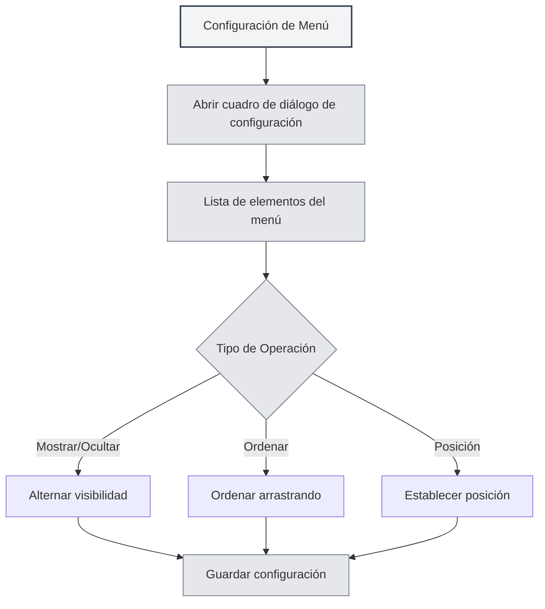

# Configuración de Menú

## Descripción General

La función de configuración de menú le permite personalizar la visualización y el orden del menú lateral izquierdo. A través de la configuración del menú, puede ocultar elementos de menú no deseados, ajustar el orden del menú, establecer la posición de los elementos y crear un diseño de interfaz personalizado.

## Abrir la Configuración de Menú

### Formas de Acceso

Puede abrir la configuración del menú de las siguientes maneras:

- **Página de Configuración**: Puede haber una entrada para la configuración del menú en la página de configuración.
- **Opción de Menú**: Puede haber una opción de configuración de menú en "Más funciones" del menú lateral izquierdo.
- **Menú Contextual (clic derecho)**: Algunos elementos del menú pueden tener opciones de configuración.

Puede acceder a la configuración del menú a través de la barra de menú superior:

<MenuItemsDemo mode="demo" :items='[{"id": "settings"}]' />

## Gestión de Elementos del Menú

### Lista de Elementos del Menú

La página de configuración del menú muestra todos los elementos de menú configurables:

- **Nombre del Elemento**: Muestra el nombre del elemento del menú.
- **Visibilidad**: Indica si el elemento del menú es visible o no.
- **Posición**: Muestra la posición del elemento (superior/inferior).
- **Identificador Principal**: Identifica los elementos de menú principales (no se pueden ocultar).

### Tipos de Elementos del Menú

Los elementos del menú se dividen en dos tipos:

- **Elementos de Menú Principales**: Elementos que deben mostrarse, no se pueden ocultar.
  - Inicio
  - Archivo
  - Configuración
  - Más funciones
  - Salir
- **Elementos de Menú Comunes**: Elementos que se pueden ocultar.
  - Asistente de IA
  - Archivos Recientes
  - Base de Conocimiento
  - Directorio de Trabajo
  - Manual de Usuario
  - Comentarios del Usuario
  - Estadísticas de LLM
  - Herramientas de Depuración (entorno de desarrollo)

## Mostrar/Ocultar Elementos del Menú

### Ocultar Elementos del Menú

Puede ocultar elementos de menú no deseados:

1. **Abrir Configuración**: Abra el cuadro de diálogo de configuración del menú.
2. **Encontrar el Elemento**: Localice el elemento de menú que desea ocultar.
3. **Alternar Visibilidad**: Cambie el interruptor de visibilidad del elemento del menú.
4. **Guardar Configuración**: Haga clic en el botón "Guardar" para guardar la configuración.

<DialogDemo mode="demo" dialogType="menu-config" />

### Mostrar Elementos del Menú

Puede mostrar elementos de menú previamente ocultos:

1. **Abrir Configuración**: Abra el cuadro de diálogo de configuración del menú.
2. **Encontrar el Elemento**: Localice el elemento de menú que desea mostrar.
3. **Alternar Visibilidad**: Cambie el interruptor de visibilidad del elemento del menú.
4. **Guardar Configuración**: Haga clic en el botón "Guardar" para guardar la configuración.

### Restricciones de los Elementos Principales

Los elementos de menú principales no se pueden ocultar:

- **Visualización Forzada**: Los elementos principales siempre se muestran.
- **No se Pueden Ocultar**: El interruptor de visibilidad de los elementos principales estará deshabilitado.
- **Restauración Automática**: Si se intenta ocultar un elemento principal, se restaurará automáticamente al estado visible.

## Ordenar Elementos del Menú

### Ordenar por Arrastre

Puede ajustar el orden de los elementos del menú arrastrándolos:

1. **Abrir Configuración**: Abra el cuadro de diálogo de configuración del menú.
2. **Arrastrar el Elemento**: Haga clic y arrastre el mango de arrastre del elemento del menú.
3. **Ajustar Posición**: Arrastre el elemento del menú a la posición deseada.
4. **Guardar Configuración**: Haga clic en el botón "Guardar" para guardar la configuración.

### Reglas de Ordenación

El orden de los elementos del menú sigue estas reglas:

- **Agrupación por Posición**: Los elementos del menú superior e inferior se ordenan por separado.
- **Línea Divisoria**: Habrá una línea divisoria entre las secciones superior e inferior.
- **Ajuste Automático**: Al arrastrar a una posición diferente, el atributo de posición se ajusta automáticamente.

## Configurar la Posición del Menú

### Tipos de Posición

Los elementos del menú pueden tener dos posiciones:

- **Superior**: Se muestra en el área superior de la barra de menú.
- **Inferior**: Se muestra en el área inferior de la barra de menú.

### Establecer Posición

Puede establecer la posición de un elemento del menú:

1. **Abrir Configuración**: Abra el cuadro de diálogo de configuración del menú.
2. **Arrastrar a la Posición**: Arrastre el elemento del menú al área superior o inferior.
3. **Ajuste Automático**: El sistema ajustará automáticamente el atributo de posición.
4. **Guardar Configuración**: Haga clic en el botón "Guardar" para guardar la configuración.

<LeftMenu mode="demo" />

### Línea Divisoria de Posición

Habrá una línea divisoria entre las secciones superior e inferior:

- **Visualización Automática**: Si hay elementos en la parte superior e inferior, la línea divisoria se muestra automáticamente.
- **No Arrastrable**: La línea divisoria no se puede arrastrar, sirve para separar visualmente.
- **Ocultación Automática**: Si solo hay elementos en la parte superior o inferior, la línea divisoria se oculta automáticamente.

## Guardar la Configuración

### Guardado Automático

Algunas operaciones guardan la configuración automáticamente:

- **Alternar Visibilidad**: Se guarda automáticamente al cambiar la visibilidad de un elemento.
- **Ajustar Posición**: Se guarda automáticamente al ajustar la posición de un elemento.

### Guardado Manual

También puede guardar la configuración manualmente:

1. **Ajustar Configuración**: Ajuste el orden y la visibilidad de los elementos del menú.
2. **Hacer Clic en Guardar**: Haga clic en el botón "Guardar".
3. **Configuración Activa**: La configuración surtirá efecto inmediatamente.

### Restablecer Configuración

Puede restablecer la configuración del menú:

1. **Abrir Configuración**: Abra el cuadro de diálogo de configuración del menú.
2. **Hacer Clic en Restablecer**: Haga clic en el botón "Restablecer".
3. **Confirmar Restablecimiento**: Confirme la operación de restablecimiento.
4. **Restaurar Valores Predeterminados**: La configuración volverá al estado predeterminado.

**Notas**:

- La operación de restablecimiento no se puede deshacer.
- Después del restablecimiento, los elementos de menú principales seguirán visibles.

<DialogDemo mode="demo" dialogType="confirm-reset" />

## Persistencia de la Configuración

### Almacenamiento de la Configuración

La configuración del menú se guarda localmente:

- **Almacenamiento Local**: La configuración se guarda en la configuración local.
- **Carga Automática**: La configuración se carga automáticamente al iniciar la aplicación la próxima vez.
- **Sincronización Multiventana**: La configuración se sincroniza entre todas las ventanas.

### Migración de Configuración

La configuración de versiones anteriores se migra automáticamente:

- **Migración de Posición**: La posición "middle" de versiones antiguas se migra automáticamente a "bottom".
- **Procesamiento de Compatibilidad**: El sistema maneja automáticamente los formatos de configuración antiguos.
- **Actualización Fluida**: Después de una actualización, la configuración se adapta automáticamente a la nueva versión.

## Mejores Prácticas

1. **Simplificar el Menú**: Oculte elementos de menú poco usados para mantener la interfaz limpia.
2. **Ordenar Racionalmente**: Coloque los elementos de menú más usados al principio para un acceso fácil.
3. **Agrupar por Posición**: Coloque elementos de menú relacionados en la misma área de posición.
4. **Ajustar Periódicamente**: Ajuste la configuración del menú periódicamente según sus hábitos de uso.
5. **Hacer Copia de Seguridad**: Puede hacer una copia de seguridad de configuraciones importantes para facilitar su restauración.

## Consideraciones

1. **Elementos Principales**: Los elementos de menú principales no se pueden ocultar, deben mostrarse.
2. **Guardado de Configuración**: Algunas operaciones se guardan automáticamente, otras requieren guardado manual.
3. **Operación de Restablecimiento**: La operación de restablecimiento no se puede deshacer, úsela con precaución.
4. **Sincronización Multiventana**: La configuración se sincroniza entre todas las ventanas.
5. **Herramientas de Desarrollo**: Las herramientas de depuración solo se muestran en el entorno de desarrollo.

## Documentación Relacionada

- [[settings.basic|Configuración Básica]]
- [[core.multi-tab|Gestión de Pestañas Múltiples]]

<MainTabs mode="demo" />

<LeftMenu mode="demo" />

<MenuItemsDemo mode="demo" :items='[{"id": "settings"}]' />

<DialogDemo mode="demo" dialogType="menu-config" />

<MenuItemsDemo mode="demo" :items='[{"id": "file", "items": ["new", "open"]}]' />

<DialogDemo mode="demo" dialogType="confirm-reset" />