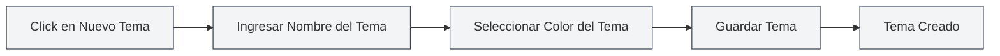

# Gestión de Temas Personalizados

## Descripción General

La gestión de temas personalizados le permite crear, editar, eliminar y copiar temas personalizados. A través de los temas personalizados, puede crear una apariencia de interfaz que se ajuste a sus preferencias personales, mejorando así la experiencia de uso.

## Crear un Nuevo Tema Personalizado

### Crear un Nuevo Tema

1.  En la página de configuración de temas, haga clic en la tarjeta "Nuevo tema" (icono +)
2.  En el cuadro de diálogo que aparece:
    -   Ingrese el nombre del tema (opcional, por defecto se usa el valor del color)
    -   Seleccione el color del tema (usando el selector de color)
3.  Haga clic en el botón "Guardar"

Puede acceder a la configuración de temas a través de la barra de menú superior:

<MenuItemsDemo mode="demo" :items='[{"id": "settings"}]' />

### Selección del Color del Tema

El selector de color ofrece las siguientes funciones:

-   **Selección de color**: Haga clic en el área de color para seleccionar un color
-   **Colores predefinidos**: Seleccione de una lista de colores preestablecidos
-   **Ajuste de transparencia**: Ajuste la transparencia del color (canal Alfa)
-   **Entrada del valor de color**: Ingrese directamente el valor de color HEX

### Nombrado del Tema

-   **Nombrado automático**: Si no ingresa un nombre, el sistema usará el valor del color como nombre
-   **Nombre personalizado**: Ingrese un nombre significativo para facilitar la identificación y gestión
-   **Sugerencia de nombres**: Use nombres descriptivos, como "Tema de trabajo", "Modo nocturno", etc.

<SettingThemeSection mode="demo" />

## Editar un Tema Personalizado

### Modificar un Tema

1.  En la lista de temas, encuentre el tema personalizado que desea editar
2.  Haga clic en el botón "Más" (icono de tres puntos) en la tarjeta del tema
3.  Seleccione "Editar"
4.  En el cuadro de diálogo, modifique el nombre o el color del tema
5.  Haga clic en el botón "Guardar"

<DialogDemo mode="demo" dialogType="theme-edit" />

### Edición Rápida del Color

También puede editar el color directamente en la tarjeta del tema:

1.  Haga clic en el selector de color en la tarjeta del tema
2.  Seleccione un nuevo color
3.  El color se aplicará inmediatamente

**Notas importantes**:

-   Los temas predefinidos no se pueden editar
-   Solo los temas personalizados se pueden editar
-   Después de editar, debe guardar para que los cambios sean permanentes

## Eliminar un Tema Personalizado

### Eliminar un Tema

1.  En la lista de temas, encuentre el tema personalizado que desea eliminar
2.  Haga clic en el botón "Más" en la tarjeta del tema
3.  Seleccione "Eliminar"
4.  Confirme la acción de eliminación

**Notas importantes**:

-   La acción de eliminación no se puede deshacer
-   Si elimina el tema que está en uso, el sistema cambiará automáticamente al tema predeterminado
-   Los temas predefinidos no se pueden eliminar

## Copiar un Tema

### Copiar un Tema Existente

1.  En la lista de temas, encuentre el tema que desea copiar
2.  Haga clic en el botón "Más" en la tarjeta del tema
3.  Seleccione "Copiar"
4.  El sistema creará una copia, agregando "copia" al nombre
5.  Puede editar la copia para crear un nuevo tema

### Casos de Uso

-   **Crear un nuevo tema basado en uno existente**: Copiar y luego modificar el color
-   **Crear variantes de un tema**: Crear temas similares pero ligeramente diferentes
-   **Hacer una copia de seguridad del tema**: Copiar como respaldo

## Configuración del Color del Tema

### Funciones del Selector de Color

El selector de color ofrece funciones completas para elegir colores:

-   **Panel de color**: Haga clic para seleccionar un color
-   **Colores predefinidos**: Selección rápida de colores comunes
-   **Entrada del valor de color**: Ingrese directamente formatos HEX, RGB, HSL, etc.
-   **Ajuste de transparencia**: Ajuste la transparencia del color

<DialogDemo mode="demo" dialogType="color-picker" />

### Colores Predefinidos

MetaDoc proporciona varios colores predefinidos:

-   **Colores básicos**: Rojo, naranja, amarillo, verde, cian, azul, púrpura, gris
-   **Tonalidades claras**: Rojo claro, naranja claro, amarillo claro, etc.
-   **Tonalidades oscuras**: Rojo oscuro, naranja oscuro, amarillo oscuro, etc.

### Formatos de Color

Formatos de color admitidos:

-   **HEX**: `#FF5733` (el más común)
-   **RGB**: `rgb(255, 87, 51)`
-   **HSL**: `hsl(9, 100%, 60%)`

## Aplicar un Tema

### Aplicar un Tema Personalizado

1.  En la lista de temas, haga clic en la tarjeta del tema personalizado que desea usar
2.  El tema se aplicará inmediatamente
3.  Los colores de la interfaz se generarán automáticamente según el color del tema

### Elementos Afectados por el Color del Tema

El color del tema afecta los siguientes elementos de la interfaz:

-   **Color de fondo**: Fondo principal y secundario
-   **Color del texto**: Texto principal y secundario
-   **Barra lateral**: Fondo y texto de la barra lateral
-   **Editor**: Fondo y barra de herramientas del editor
-   **Otros elementos**: Botones, bordes, resaltados, etc.

### Combinación de Colores Automática

MetaDoc genera automáticamente una paleta de colores basada en el color del tema:

-   **Tema claro**: Cuando el color del tema es brillante, genera una combinación de colores claros
-   **Tema oscuro**: Cuando el color del tema es oscuro, genera una combinación de colores oscuros
-   **Algoritmo de combinación**: Utiliza mezcla de colores y ajuste de saturación

## Gestión de Temas

### Lista de Temas

La página de configuración de temas muestra todos los temas disponibles:

-   **Temas predefinidos**: Temas integrados en el sistema
-   **Temas personalizados**: Temas creados por el usuario
-   **Tema actual**: Muestra la marca de selección

### Orden de los Temas

Los temas se muestran en el siguiente orden:

1.  Tema sincronizado con el sistema (sigue al sistema)
2.  Temas predefinidos claros/oscuros
3.  Temas personalizados (ordenados por fecha de creación)

### Estado del Tema

Cada tarjeta de tema muestra:

-   **Vista previa del color del tema**: Muestra el color principal del tema
-   **Nombre del tema**: Muestra el nombre del tema
-   **Valor del color**: Muestra el valor HEX del color
-   **Marca de selección**: Tema actualmente en uso

## Mejores Prácticas

1.  **Nombrado del tema**: Use nombres significativos para facilitar la identificación
2.  **Selección de color**: Elija colores que cuiden la vista, evite colores demasiado brillantes
3.  **Copia de seguridad del tema**: Se recomienda copiar temas importantes como respaldo
4.  **Limpieza periódica**: Elimine temas que ya no use para mantener la lista ordenada
5.  **Probar el efecto**: Después de crear un tema, pruebe el efecto real y ajústelo según la experiencia de uso

## Notas Importantes

1.  **Temas predefinidos**: Los temas predefinidos no se pueden editar ni eliminar
2.  **Compatibilidad del tema**: Algunos temas pueden mostrarse de manera diferente en distintos entornos
3.  **Selección de color**: Se recomienda elegir colores con un contraste moderado para garantizar la legibilidad
4.  **Cantidad de temas**: Se recomienda no crear demasiados temas para mantener la lista simple
5.  **Sincronización de temas**: Los cambios en los temas se sincronizarán entre todas las ventanas

## Documentación Relacionada

-   [[settings.theme|Configuración de Temas]]
-   [[settings.basic|Configuración Básica]]
-   [[core.editor-settings|Configuración del Editor]]

<ResizableDivider mode="demo" />

<SettingThemeSection mode="demo" />

<MenuItemsDemo mode="demo" :items='[{"id": "settings", "items": ["theme"]}]' />

<DialogDemo mode="demo" dialogType="color-picker" />

<DialogDemo mode="demo" dialogType="theme-edit" />

<MenuItemsDemo mode="demo" :items='[{"id": "settings"}]' />
