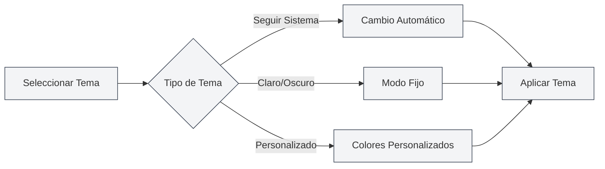

# Configuración de Temas

## Descripción General

La configuración de temas permite personalizar la apariencia de MetaDoc, incluyendo el tema global, el tema del contenido, el tema del código, entre otros. Una configuración adecuada de los temas puede mejorar la experiencia de uso y reducir la fatiga visual.

## Tema Global

### Tipos de Tema

MetaDoc admite los siguientes tipos de temas globales:

- **Seguir sistema claro/oscuro**: Sigue automáticamente el modo claro/oscuro del sistema operativo.
- **Seguir color del sistema**: Sigue el color del tema del sistema operativo (Windows 11).
- **Claro**: Utiliza un tema claro de forma fija.
- **Oscuro**: Utiliza un tema oscuro de forma fija.
- **Personalizado**: Utiliza colores de tema personalizados.

### Seleccionar Tema

1. En la página de configuración de temas, navega por las tarjetas de temas.
2. Haz clic en la tarjeta del tema que deseas usar.
3. El tema se aplicará inmediatamente.

Puedes acceder a la configuración de temas a través de la barra de menú superior:

<MenuItemsDemo mode="demo" :items='[{"id": "settings"}]' />

### Vista Previa del Tema Claro

<SettingThemeSection mode="demo" theme="light" />

### Vista Previa del Tema Oscuro

<SettingThemeSection mode="demo" theme="dark" />

### Interfaz de Configuración de Temas

La siguiente imagen muestra la interfaz completa de la página de configuración de temas:

<SettingThemeSection mode="demo" />

<ViewMenuItemsDemo mode="demo" :items='["editor", "outline"]' />

La interfaz de configuración de temas incluye las siguientes áreas funcionales principales:

- **Tema Global**: Selecciona tema claro, oscuro, seguir sistema o personalizado.
- **Tema del Contenido**: Configura el tema de visualización del área del editor.
- **Tema del Código**: Selecciona el tema de resaltado de sintaxis para los bloques de código.
- **Mostrar Números de Línea**: Controla si los bloques de código muestran números de línea.
- **Tema Personalizado**: Crea y gestiona temas de colores personalizados.

### Vista Previa del Tema

Cada tarjeta de tema mostrará:

- **Vista previa del color del tema**: Muestra el color principal del tema.
- **Nombre del tema**: Muestra el nombre del tema.
- **Marca de selección**: El tema actualmente en uso mostrará una marca de selección.

## Tema del Contenido

<SettingThemeSection mode="demo" />

### Configurar Tema del Contenido

El tema del contenido controla el tema de visualización del área de edición de documentos:

- **Automático**: Sigue el tema global.
- **Claro**: Utiliza un tema de contenido claro de forma fija.
- **Oscuro**: Utiliza un tema de contenido oscuro de forma fija.

### Casos de Uso

- **Global oscuro, contenido claro**: Adecuado para editar documentos claros en entornos oscuros.
- **Global claro, contenido oscuro**: Adecuado para editar documentos oscuros en entornos luminosos.
- **Modo automático**: El tema del contenido sigue automáticamente el tema global.

## Tema del Código

<SettingThemeSection mode="demo" />

### Configurar Tema del Código

El tema del código controla el tema de resaltado de sintaxis para los bloques de código:

- **Automático**: Selecciona automáticamente según el tema global.
- **Personalizado**: Selecciona de una lista de temas de código.

### Lista de Temas de Código

MetaDoc admite múltiples temas de código, incluyendo:

- **Temas claros**: GitHub, VS, OneLight, etc.
- **Temas oscuros**: Monokai, Dracula, OneDark, etc.

### Sugerencias de Selección

- **Documentos claros**: Usa temas de código claros.
- **Documentos oscuros**: Usa temas de código oscuros.
- **Modo automático**: Deja que el sistema elija automáticamente para mantener la coherencia.

## Mostrar Números de Línea

<SettingThemeSection mode="demo" />

### Mostrar Números de Línea

Al habilitar "Mostrar números de línea en bloques de código", los bloques de código mostrarán números de línea:

- **Habilitado**: Muestra números de línea en el lado izquierdo del bloque de código.
- **Deshabilitado**: No muestra números de línea.

### Casos de Uso

- **Depuración de código**: Los números de línea ayudan a ubicar posiciones en el código.
- **Compartir código**: Los números de línea facilitan la referencia a líneas específicas.
- **Lectura de código**: Los números de línea ayudan a comprender la estructura del código.

## Cambio de Tema

<SettingThemeSection mode="demo" />

<ViewMenuItemsDemo mode="demo" :items='["editor", "outline"]' />

### Cambio en Tiempo Real

El cambio de tema surte efecto inmediatamente:

1. Selecciona un nuevo tema.
2. La interfaz se actualiza al instante.
3. Se aplica de forma sincronizada en todas las ventanas.

### Sincronización de Temas

- **Sincronización multi-ventana**: Todas las ventanas sincronizan el tema automáticamente.
- **Guardado de configuración**: La selección del tema se guarda automáticamente.
- **Próximo inicio**: Al iniciar la próxima vez, se usará el último tema seleccionado.

## Temas Predefinidos

<SettingThemeSection mode="demo" />

### Temas Integrados

MetaDoc proporciona varios temas predefinidos:

- **Temas claros**: Adecuados para entornos luminosos.
- **Temas oscuros**: Adecuados para entornos oscuros.
- **Sincronización con el sistema**: Sigue automáticamente la configuración del sistema.

### Características de los Temas Predefinidos

- **Combinación de colores optimizada**: Esquemas de color cuidadosamente diseñados.
- **Diseño para cuidado visual**: Reduce la fatiga visual.
- **Coherencia**: Garantiza la uniformidad de los elementos de la interfaz.

## Mejores Prácticas

1. **Adaptación al entorno**: Elige el tema según el entorno de uso.
2. **Coincidencia con el contenido**: Haz coincidir el tema del contenido con el tipo de documento.
3. **Legibilidad del código**: Elige temas de código con alta legibilidad.
4. **Ajustes periódicos**: Ajusta la configuración del tema según la experiencia de uso.

## Consideraciones

1. **Compatibilidad del sistema**: Seguir el tema del sistema requiere soporte del sistema operativo.
2. **Coherencia del tema**: Se recomienda mantener la coherencia entre el tema global y el tema del contenido.
3. **Tema del código**: El tema del código afecta la legibilidad del mismo.
4. **Tema personalizado**: Los temas personalizados requieren creación y gestión manual.

## Documentación Relacionada

- [[settings.theme-custom|Gestión de Temas Personalizados]]
- [[settings.basic|Configuración Básica]]
- [[core.editor-settings|Configuración del Editor]]
