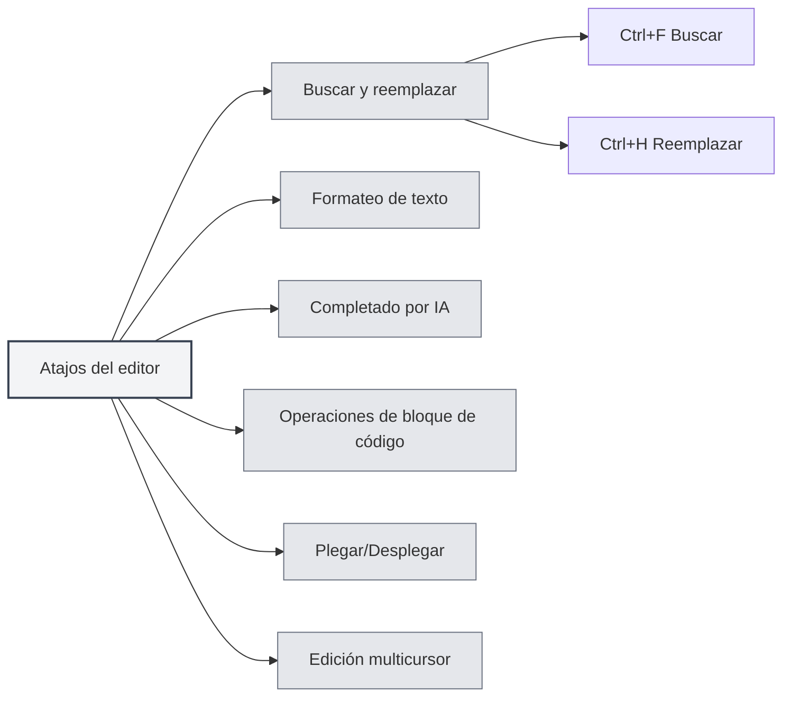

# Atajos del editor

## Descripción general

Los atajos del editor son combinaciones de teclas utilizadas en la interfaz del editor, que incluyen funciones como edición de texto, buscar y reemplazar, formateo, etc. Dominar estos atajos puede mejorar la eficiencia de la edición.

<MenuItemsDemo mode="demo" :items='[{"id": "edit"}]' />

<ViewMenuItemsDemo mode="demo" :items='["editor", "outline"]' />

**Nota**: Buscar/Reemplazar (Ctrl+F, Ctrl+H) se implementa a nivel global de la aplicación; Negrita/Cursiva/Enlace/Bloque de código, etc., los proporciona el editor subyacente (Markdown usa Vditor, LaTeX usa Monaco). Si no funcionan, guíese por el comportamiento real del editor.

## Buscar y reemplazar

### Buscar

- **Atajo**: `Ctrl+F` (Windows/Linux) o `Cmd+F` (macOS)
- **Función**: Abrir el cuadro de diálogo de búsqueda
- **Caso de uso**: Buscar texto específico en el documento

### Buscar y reemplazar

- **Atajo**: `Ctrl+H` (Windows/Linux) o `Cmd+H` (macOS)
- **Función**: Abrir el cuadro de diálogo de buscar y reemplazar
- **Caso de uso**: Buscar y reemplazar texto

### Funciones de búsqueda

El cuadro de diálogo de búsqueda admite las siguientes funciones:

- **Buscar texto**: Ingrese el texto a buscar
- **Reemplazar texto**: Ingrese el texto de reemplazo
- **Expresiones regulares**: Admite búsqueda con expresiones regulares
- **Coincidir mayúsculas/minúsculas**: Distingue entre mayúsculas y minúsculas
- **Coincidir palabra completa**: Coincide con palabras completas

La interfaz del menú de buscar y reemplazar es la siguiente:

<SearchReplaceMenu mode="demo" :position='{"top": 100, "left": 200}' :adapter='null' />

<SearchReplaceMenu mode="demo" :position='{"top": 150, "left": 200}' :adapter='null' />

## Formateo de texto

<TextFormatToolbar mode="demo" />

### Negrita

- **Atajo**: `Ctrl+B` (Windows/Linux) o `Cmd+B` (macOS)
- **Función**: Poner el texto seleccionado en negrita
- **Caso de uso**: Resaltar contenido importante

### Cursiva

- **Atajo**: `Ctrl+I` (Windows/Linux) o `Cmd+I` (macOS)
- **Función**: Poner el texto seleccionado en cursiva
- **Caso de uso**: Indicar una cita o énfasis

### Insertar enlace

- **Atajo**: `Ctrl+K` (Windows/Linux) o `Cmd+K` (macOS)
- **Función**: Insertar un enlace
- **Caso de uso**: Agregar un hipervínculo

**Precaución**: Este atajo puede entrar en conflicto con Guardar todo (Ctrl+K S). Es necesario presionar primero Ctrl+K y luego K, no simultáneamente.

## Completado por IA

<AISuggestionGhost mode="demo" />

<CompletionSettingsPanel mode="demo" />

### Disparar completado manualmente

- **Atajo**: `Shift+Tab`
- **Función**: Disparar manualmente el autocompletado por IA
- **Caso de uso**: Disparar manualmente cuando se necesita completado por IA

### Teclas de activación del completado

El completado por IA también se puede activar automáticamente con las siguientes teclas:

- **Enter**: Se activa al presionar Enter
- **Espacio**: Se activa al presionar la barra espaciadora
- **Punto y coma**: Se activa al presionar punto y coma (;)
- **Barra diagonal**: Se activa al presionar barra diagonal (/)

Estas teclas de activación se pueden configurar en [[settings.llm|Configuración de LLM]].

## Operaciones con bloques de código

### Insertar bloque de código

- **Atajo**: `Ctrl+Shift+K` (Editor Markdown)
- **Función**: Insertar un bloque de código
- **Caso de uso**: Agregar un ejemplo de código

## Plegar y desplegar

### Plegar bloque de código

- **Atajo**: `Ctrl+Shift+[` (Windows/Linux) o `Cmd+Option+[` (macOS)
- **Función**: Plegar el bloque de código o entorno actual
- **Caso de uso**: Ocultar código que no se necesita ver

### Desplegar bloque de código

- **Atajo**: `Ctrl+Shift+]` (Windows/Linux) o `Cmd+Option+]` (macOS)
- **Función**: Desplegar un bloque de código o entorno plegado
- **Caso de uso**: Ver contenido plegado

## Edición multicursor

### Seleccionar todas las palabras iguales

- **Atajo**: `Ctrl+Shift+L` (Windows/Linux) o `Cmd+Shift+L` (macOS)
- **Función**: Seleccionar todas las palabras iguales en el documento y agregar cursores
- **Caso de uso**: Editar en lote texto idéntico

## Deshacer y rehacer

### Deshacer

- **Atajo**: `Ctrl+Z` (Windows/Linux) o `Cmd+Z` (macOS)
- **Función**: Deshacer la última acción
- **Caso de uso**: Deshacer una operación errónea

### Rehacer

- **Atajo**: `Ctrl+Y` o `Ctrl+Shift+Z` (Windows/Linux) o `Cmd+Shift+Z` (macOS)
- **Función**: Rehacer la acción deshecha
- **Caso de uso**: Restaurar una operación deshecha

## Operaciones de selección

### Seleccionar todo

- **Atajo**: `Ctrl+A` (Windows/Linux) o `Cmd+A` (macOS)
- **Función**: Seleccionar todo el texto
- **Caso de uso**: Seleccionar todo el contenido para copiar o eliminar

### Copiar

- **Atajo**: `Ctrl+C` (Windows/Linux) o `Cmd+C` (macOS)
- **Función**: Copiar el texto seleccionado
- **Caso de uso**: Copiar contenido al portapapeles

### Pegar

- **Atajo**: `Ctrl+V` (Windows/Linux) o `Cmd+V` (macOS)
- **Función**: Pegar el contenido del portapapeles
- **Caso de uso**: Pegar contenido copiado

### Cortar

- **Atajo**: `Ctrl+X` (Windows/Linux) o `Cmd+X` (macOS)
- **Función**: Cortar el texto seleccionado
- **Caso de uso**: Mover contenido de texto

## Lista de atajos del editor

### Atajos para Windows/Linux

| Función                     | Atajo                         |
| --------------------------- | ----------------------------- |
| Buscar                      | `Ctrl+F`                      |
| Buscar y reemplazar         | `Ctrl+H`                      |
| Negrita                     | `Ctrl+B`                      |
| Cursiva                     | `Ctrl+I`                      |
| Insertar enlace             | `Ctrl+K`                      |
| Insertar bloque de código   | `Ctrl+Shift+K`                |
| Plegar                      | `Ctrl+Shift+[`                |
| Desplegar                   | `Ctrl+Shift+]`                |
| Seleccionar palabras iguales| `Ctrl+Shift+L`                |
| Deshacer                    | `Ctrl+Z`                      |
| Rehacer                     | `Ctrl+Y` o `Ctrl+Shift+Z`     |
| Seleccionar todo            | `Ctrl+A`                      |
| Copiar                      | `Ctrl+C`                      |
| Pegar                       | `Ctrl+V`                      |
| Cortar                      | `Ctrl+X`                      |
| Completado por IA           | `Shift+Tab`                   |

### Atajos para macOS

| Función                     | Atajo                 |
| --------------------------- | --------------------- |
| Buscar                      | `Cmd+F`               |
| Buscar y reemplazar         | `Cmd+H`               |
| Negrita                     | `Cmd+B`               |
| Cursiva                     | `Cmd+I`               |
| Insertar enlace             | `Cmd+K`               |
| Insertar bloque de código   | `Cmd+Shift+K`         |
| Plegar                      | `Cmd+Option+[`        |
| Desplegar                   | `Cmd+Option+]`        |
| Seleccionar palabras iguales| `Cmd+Shift+L`         |
| Deshacer                    | `Cmd+Z`               |
| Rehacer                     | `Cmd+Shift+Z`         |
| Seleccionar todo            | `Cmd+A`               |
| Copiar                      | `Cmd+C`               |
| Pegar                       | `Cmd+V`               |
| Cortar                      | `Cmd+X`               |
| Completado por IA           | `Shift+Tab`           |

## Atajos específicos del editor Markdown

<LaTeXEditorDemo mode="demo" />

### Atajos de Vditor

El editor Markdown está basado en Vditor y admite los siguientes atajos:

- **Negrita**: `Ctrl+B`
- **Cursiva**: `Ctrl+I`
- **Insertar enlace**: `Ctrl+K`
- **Insertar bloque de código**: `Ctrl+Shift+K`

## Atajos específicos del editor LaTeX

<LaTeXEditorDemo mode="demo" />

### Atajos del editor Monaco

El editor LaTeX está basado en Monaco Editor y admite los siguientes atajos:

- **Plegar**: `Ctrl+Shift+[`
- **Desplegar**: `Ctrl+Shift+]`
- **Seleccionar todas las palabras iguales**: `Ctrl+Shift+L`
- **Edición multicursor**: `Alt+Click` para agregar un cursor

## Consejos para usar los atajos

<LaTeXEditorDemo mode="demo" />

<Outline mode="demo" />

### Uso combinado

Se pueden combinar varios atajos:

1. **Buscar y reemplazar**: `Ctrl+H` para abrir buscar y reemplazar, luego usar Tab para cambiar entre cuadros de entrada.
2. **Formatear texto**: Seleccionar texto y luego usar `Ctrl+B` o `Ctrl+I` para formatear.
3. **Edición en lote**: Usar `Ctrl+Shift+L` para seleccionar todas las palabras iguales y luego editarlas uniformemente.

### Memoria de atajos

- **Formateo**: B (Bold/Negrita), I (Italic/Cursiva) corresponden a negrita y cursiva.
- **Buscar**: F (Find/Buscar), H (Hunt/Buscar y reemplazar).
- **Plegar**: `[` y `]` corresponden a plegar y desplegar.

## Mejores prácticas

<MainTabs mode="demo" />

1. **Dominar el uso**: Dominar los atajos de edición más comunes.
2. **Operaciones combinadas**: Combinar múltiples atajos para completar ediciones complejas.
3. **Edición en lote**: Usar la función multicursor para editar en lote.
4. **Formateo rápido**: Usar atajos para formatear texto rápidamente.
5. **Buscar y reemplazar**: Usar la función buscar y reemplazar para mejorar la eficiencia.

## Consideraciones

1. **Diferencias de plataforma**: Windows/Linux usan Ctrl, macOS usa Cmd.
2. **Conflictos de atajos**: Algunos atajos pueden entrar en conflicto con funciones del editor.
3. **Dependencia del contexto**: Algunos atajos solo son efectivos en contextos específicos.
4. **Diferencias entre editores**: Los atajos admitidos por los editores Markdown y LaTeX pueden diferir.
5. **Completado por IA**: Shift+Tab es la activación manual; la activación automática requiere configurar las teclas de activación.

## Documentación relacionada

- [[shortcuts.global|Atajos globales]]
- [[core.editor-basics|Operaciones básicas del editor]]
- [[markdown.features|Funciones del editor Markdown]]
- [[ai.completion|Autocompletado por IA]]

<MenuItemsDemo mode="demo" :items='[{"id": "file"}]' />

<ViewMenuItemsDemo mode="demo" :items='["editor"]' />

<AISuggestionGhost mode="demo" />

<CompletionSettingsPanel mode="demo" />

<LaTeXEditorDemo mode="demo" />