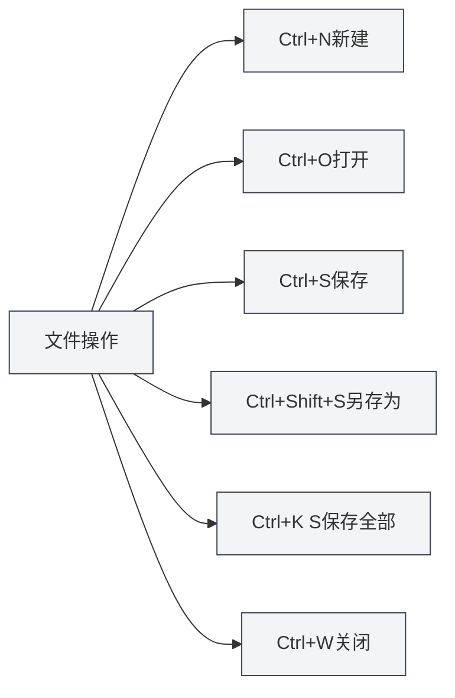

# Atajos globales

## Descripción general

Los atajos globales son combinaciones de teclas que se pueden utilizar en cualquier interfaz de MetaDoc. Dominar estos atajos puede mejorar significativamente la eficiencia del trabajo.

**Nota**: Los atajos de teclado en este documento han sido verificados con la implementación actual del código y están implementados y disponibles tanto en el proceso principal como en el proceso de renderizado.

## Operaciones de archivo

### Crear nuevo documento

- **Atajo**: `Ctrl+N` (Windows/Linux) o `Cmd+N` (macOS)
- **Función**: Crear un nuevo documento en blanco
- **Caso de uso**: Comenzar rápidamente a editar un nuevo documento

### Abrir documento

- **Atajo**: `Ctrl+O` (Windows/Linux) o `Cmd+O` (macOS)
- **Función**: Abrir el cuadro de diálogo de selección de archivos
- **Caso de uso**: Abrir un documento existente

### Guardar documento

- **Atajo**: `Ctrl+S` (Windows/Linux) o `Cmd+S` (macOS)
- **Función**: Guardar el documento actual
- **Caso de uso**: Guardar el contenido editado para evitar pérdidas

### Guardar como

- **Atajo**: `Ctrl+Shift+S` (Windows/Linux) o `Cmd+Shift+S` (macOS)
- **Función**: Guardar el documento actual como un nuevo archivo
- **Caso de uso**: Crear una copia del documento o cambiar la ubicación de guardado

### Guardar todos los documentos

- **Atajo**: `Ctrl+K S` (Windows/Linux) o `Cmd+K S` (macOS)
- **Función**: Guardar todos los documentos abiertos
- **Instrucciones de uso**: Primero presione `Ctrl+K` (o `Cmd+K`), luego presione `S`
- **Caso de uso**: Guardar todos los documentos de una vez

<MenuItemsDemo mode="demo" :items='[{"id": "file", "items": ["save-all"]}]' />

### Cerrar archivo

- **Atajo**: `Ctrl+W` (Windows/Linux) o `Cmd+W` (macOS)
- **Función**: Cerrar la pestaña actual
- **Caso de uso**: Cerrar documentos innecesarios

## Operaciones de pestañas

La barra de pestañas muestra todos los documentos abiertos y admite operaciones como crear, cambiar y cerrar:

<MainTabs mode="demo" />

<ViewMenuItemsDemo mode="demo" :items='["editor", "outline"]' />

### Nueva pestaña

- **Atajo**: `Ctrl+T` (Windows/Linux) o `Cmd+T` (macOS)
- **Función**: Crear una nueva pestaña
- **Caso de uso**: Crear rápidamente un nuevo documento

### Cambiar de pestaña

#### Siguiente pestaña

- **Atajo**: `Ctrl+Tab` (Windows/Linux) o `Cmd+Tab` (macOS)
- **Función**: Cambiar a la siguiente pestaña
- **Instrucciones de uso**: Mantener presionado `Ctrl+Tab` mostrará una superposición de cambio de pestañas, puede continuar presionando Tab para seleccionar o hacer clic directamente
- **Caso de uso**: Cambiar rápidamente entre múltiples documentos

<TabSwitcherOverlay mode="demo" />

#### Pestaña anterior

- **Atajo**: `Ctrl+Shift+Tab` (Windows/Linux) o `Cmd+Shift+Tab` (macOS)
- **Función**: Cambiar a la pestaña anterior
- **Caso de uso**: Cambiar de pestaña en orden inverso

### Reabrir pestaña cerrada

- **Atajo**: `Ctrl+Shift+T` (Windows/Linux) o `Cmd+Shift+T` (macOS)
- **Función**: Reabrir la pestaña cerrada más recientemente
- **Instrucciones de uso**: Se puede usar de forma continua para restaurar sucesivamente las pestañas cerradas más recientemente (hasta 20)
- **Caso de uso**: Recuperar rápidamente una pestaña cerrada por error

<MainTabs mode="demo" />

## Otros atajos

### Abrir manual de usuario

- **Atajo**: `F1`
- **Función**: Abrir la página del manual de usuario
- **Caso de uso**: Cuando se necesita consultar la documentación de ayuda

<MenuItemsDemo mode="demo" :items='[{"id": "help"}]' />

## Lista de atajos

### Atajos de Windows/Linux

| Función                    | Atajo                |
| -------------------------- | -------------------- |
| Crear nuevo documento      | `Ctrl+N`             |
| Abrir documento            | `Ctrl+O`             |
| Guardar documento          | `Ctrl+S`             |
| Guardar como               | `Ctrl+Shift+S`       |
| Guardar todos              | `Ctrl+K S`           |
| Cerrar pestaña             | `Ctrl+W`             |
| Nueva pestaña              | `Ctrl+T`             |
| Siguiente pestaña          | `Ctrl+Tab`           |
| Pestaña anterior           | `Ctrl+Shift+Tab`     |
| Reabrir pestaña cerrada    | `Ctrl+Shift+T`       |
| Abrir manual de usuario    | `F1`                 |

### Atajos de macOS

| Función                    | Atajo                |
| -------------------------- | -------------------- |
| Crear nuevo documento      | `Cmd+N`              |
| Abrir documento            | `Cmd+O`              |
| Guardar documento          | `Cmd+S`              |
| Guardar como               | `Cmd+Shift+S`        |
| Guardar todos              | `Cmd+K S`            |
| Cerrar pestaña             | `Cmd+W`              |
| Nueva pestaña              | `Cmd+T`              |
| Siguiente pestaña          | `Cmd+Tab`            |
| Pestaña anterior           | `Cmd+Shift+Tab`      |
| Reabrir pestaña cerrada    | `Cmd+Shift+T`        |
| Abrir manual de usuario    | `F1`                 |

## Técnicas de uso de atajos

### Orden de combinaciones de teclas

Algunos atajos requieren presionar las teclas en secuencia:

- **Guardar todos**: Primero presione `Ctrl+K`, luego presione `S` (no simultáneamente)
- **Cambio de pestañas**: Mantenga presionado `Ctrl+Tab` para mostrar la superposición, luego continúe presionando Tab para seleccionar

### Conflictos de atajos

Si un atajo entra en conflicto con el sistema u otro software:

- **Atajos del sistema**: Algunos atajos del sistema pueden tener prioridad
- **Otro software**: Cierre el software en conflicto o modifique sus atajos
- **Atajos personalizados**: Las versiones futuras podrían admitir atajos personalizados

### Técnicas de memorización

- **Operaciones de archivo**: Use los atajos estándar de operaciones de archivo (Ctrl+N/O/S)
- **Operaciones de pestañas**: Use combinaciones relacionadas con la tecla Tab
- **Guardar todos**: Use Ctrl+K como prefijo de comando

## Mejores prácticas

1. **Dominar el uso**: Domine los atajos comunes para mejorar la eficiencia
2. **Uso combinado**: Combine múltiples atajos para completar operaciones complejas
3. **Cambio de pestañas**: Use Ctrl+Tab para cambiar rápidamente, evitando operaciones con el mouse
4. **Guardar periódicamente**: Adquiera el hábito de usar Ctrl+S para guardar periódicamente
5. **Recuperación rápida**: Use Ctrl+Shift+T para recuperar rápidamente una pestaña cerrada por error

## Consideraciones

1. **Diferencias de plataforma**: Windows/Linux usan Ctrl, macOS usa Cmd
2. **Conflictos de atajos**: Preste atención a conflictos con atajos de otro software
3. **Orden de combinaciones**: Algunos atajos requieren presionar las teclas en secuencia
4. **Cambio de pestañas**: Ctrl+Tab mostrará una superposición, donde puede continuar seleccionando
5. **Guardar todos**: Ctrl+K S requiere presionar primero Ctrl+K, luego S

## Documentación relacionada

- [[shortcuts.editor|Atajos del editor]]
- [[core.file-operations|Operaciones de archivo]]
- [[core.multi-tab|Gestión de múltiples pestañas]]

<MenuItemsDemo mode="demo" :items='[{"id": "file"}]' />

<MainTabs mode="demo" />

<ViewMenuItemsDemo mode="demo" :items='["editor", "outline", "agent"]' />

<QuickStartPanel mode="demo" />