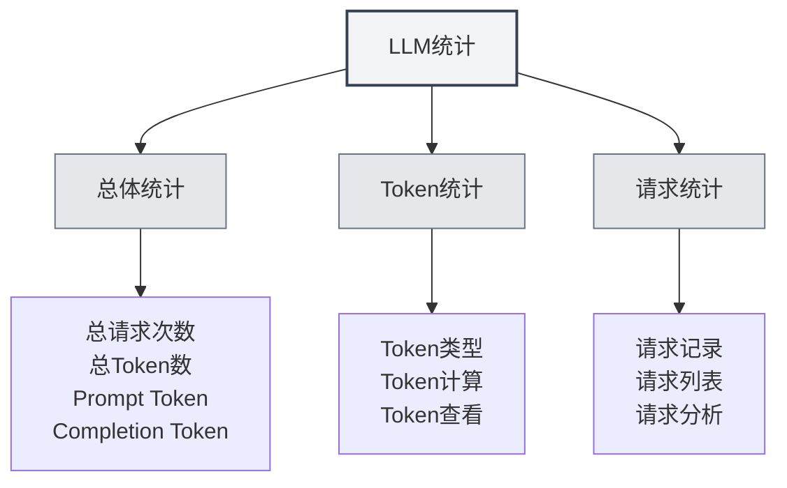

# Estadísticas de LLM

## Descripción general

La función de estadísticas de LLM se utiliza para rastrear y visualizar el uso de la API de LLM, incluyendo información como el consumo de tokens, el número de solicitudes, estadísticas de costos, entre otros. Estos datos estadísticos pueden ayudarle a comprender el uso del LLM y optimizar su estrategia de utilización.

## Abrir las estadísticas de LLM

### Formas de acceso

Puede abrir la página de estadísticas de LLM de las siguientes maneras:

- **Página de configuración**: Puede haber una entrada para estadísticas de LLM en la página de configuración.
- **Opción de menú**: Algunos menús pueden tener una opción para estadísticas de LLM.
- **Atajo de teclado**: En algunos casos, puede haber un atajo de teclado (posiblemente compatible en el futuro).

<SettingLlmSection mode="demo" />

## Información estadística

<LlmStatisticsView mode="demo" />

<LlmStatisticsContent mode="demo" />

### Estadísticas generales

La página de estadísticas de LLM muestra la siguiente información estadística general:

- **Número total de solicitudes**: El número total de todas las solicitudes LLM.
- **Número total de tokens**: El número total de tokens utilizados en todas las solicitudes.
- **Tokens de prompt**: El número total de tokens de prompt en todas las solicitudes.
- **Tokens de completado**: El número total de tokens de completado en todas las solicitudes.

### Filtro por rango de tiempo

Puede filtrar los datos estadísticos por rango de tiempo:

- **Todo el tiempo**: Ver estadísticas de todo el período.
- **Hoy**: Ver las estadísticas de hoy.
- **Esta semana**: Ver las estadísticas de esta semana.
- **Este mes**: Ver las estadísticas de este mes.
- **Rango personalizado**: Seleccionar una fecha de inicio y fin personalizada.

### Gráficos estadísticos

<ChartGenerationDisplay mode="demo" />

La página de estadísticas puede incluir los siguientes gráficos:

- **Tendencia de uso de tokens**: Muestra la tendencia del consumo de tokens a lo largo del tiempo.
- **Tendencia del número de solicitudes**: Muestra la tendencia del número de solicitudes a lo largo del tiempo.
- **Distribución del uso de modelos**: Muestra el uso de diferentes modelos.
- **Distribución del tipo de solicitud**: Muestra la distribución de diferentes tipos de solicitudes.

## Estadísticas de tokens

<DataAnalysisDisplay mode="demo" />

### Tipos de tokens

Las estadísticas de tokens incluyen los siguientes tipos:

- **Tokens de prompt**: Número de tokens en el prompt de entrada.
- **Tokens de completado**: Número de tokens en el contenido generado.
- **Tokens totales**: Número total de tokens (Prompt + Completado).

### Cálculo de tokens

Método de cálculo de tokens:

- **Registro automático**: El uso de tokens se registra automáticamente después de cada solicitud LLM.
- **Actualización en tiempo real**: Los datos estadísticos se actualizan en tiempo real.
- **Estadísticas acumuladas**: Los datos estadísticos se calculan de forma acumulativa.

### Visualización de tokens

Puede ver la siguiente información sobre tokens:

- **Número total de tokens**: El número total de tokens de todas las solicitudes.
- **Número promedio de tokens**: El número promedio de tokens por solicitud.
- **Número máximo de tokens**: El número máximo de tokens en una sola solicitud.
- **Número mínimo de tokens**: El número mínimo de tokens en una sola solicitud.

## Estadísticas de solicitudes

<LlmStatisticsContent mode="demo" />

### Registro de solicitudes

Cada solicitud LLM registra la siguiente información:

- **Marca de tiempo**: La hora de la solicitud.
- **Nombre del modelo**: El nombre del modelo utilizado.
- **Tipo de solicitud**: El tipo de solicitud (chat/completado).
- **Consumo de tokens**: El consumo de tokens de esta solicitud.

### Lista de solicitudes

Puede ver la lista de solicitudes:

- **Orden por tiempo**: Ordenadas en orden cronológico inverso.
- **Información detallada**: Ver detalles de cada solicitud.
- **Función de filtro**: Filtrar solicitudes por modelo, tipo, etc.

### Análisis de solicitudes

Puede analizar las solicitudes:

- **Frecuencia de solicitudes**: Analizar la frecuencia de las solicitudes.
- **Uso del modelo**: Analizar el uso de diferentes modelos.
- **Distribución de tipos**: Analizar la distribución de diferentes tipos de solicitudes.

## Estadísticas de costos

<LlmStatisticsView mode="demo" />

### Cálculo de costos

Las estadísticas de costos se basan en la siguiente información:

- **Consumo de tokens**: Los costos se calculan según el consumo de tokens.
- **Precios del modelo**: Diferentes modelos tienen diferentes precios.
- **Estimación de costos**: Proporciona una estimación de costos (si es compatible).

### Visualización de costos

Puede ver la siguiente información de costos:

- **Costo total**: El costo total de todas las solicitudes.
- **Costo diario promedio**: El costo promedio por día.
- **Costo por modelo**: Distribución de costos por diferentes modelos.
- **Tendencia de costos**: Tendencia de los costos a lo largo del tiempo.

**Nota**: Las estadísticas de costos son solo para referencia; los costos reales deben verificarse en la factura del proveedor de la API.

## Exportación de datos

<DataAnalysisDisplay mode="demo" />

### Función de exportación

Puede exportar los datos estadísticos:

- **Formato de exportación**: Puede admitir múltiples formatos (JSON, CSV, etc.).
- **Rango de exportación**: Puede elegir exportar todos los datos o los datos filtrados.
- **Contenido de exportación**: Puede elegir qué información estadística exportar.

### Copia de seguridad de datos

Los datos estadísticos se guardan automáticamente:

- **Almacenamiento local**: Los datos estadísticos se guardan localmente.
- **Guardado automático**: Se guardan automáticamente después de cada solicitud.
- **Persistencia de datos**: Los datos se conservan después de reiniciar la aplicación.

## Borrar estadísticas

### Operación de borrado

Puede borrar los datos estadísticos:

1. Abra la página de estadísticas de LLM.
2. Encuentre el botón para borrar estadísticas.
3. Confirme la operación de borrado.
4. Los datos estadísticos se borrarán.

**Notas**:

- La operación de borrado no se puede deshacer.
- Se recomienda exportar una copia de seguridad de los datos antes de borrar.
- Después del borrado, se perderán todos los datos estadísticos.

## Configuración de estadísticas

### Interruptor de estadísticas

Puede controlar la función de estadísticas:

- **Habilitar estadísticas**: Activa el seguimiento del uso de LLM.
- **Deshabilitar estadísticas**: Desactiva la función de estadísticas (no registra datos).

### Precisión de estadísticas

Puede configurar la precisión de las estadísticas:

- **Registro detallado**: Registra información detallada de cada solicitud.
- **Registro simplificado**: Solo registra información estadística general.

## Mejores prácticas

1. **Revisar periódicamente**: Revise periódicamente las estadísticas de uso de LLM para comprender su utilización.
2. **Control de costos**: Controle el uso según las estadísticas de costos.
3. **Optimizar estrategia**: Optimice su estrategia de uso basándose en los datos estadísticos.
4. **Copia de seguridad de datos**: Exporte periódicamente una copia de seguridad de los datos estadísticos.
5. **Uso razonable**: Utilice la función LLM de manera razonable según la información estadística.

## Consideraciones

1. **Precisión estadística**: Los datos estadísticos se basan en la información de tokens devuelta por la API.
2. **Estimación de costos**: Las estadísticas de costos son solo para referencia; los costos reales deben verificarse en la factura.
3. **Almacenamiento de datos**: Los datos estadísticos se almacenan localmente y no se cargan.
4. **Protección de privacidad**: Los datos estadísticos no contienen contenido específico, solo información sobre el volumen de uso.
5. **Impacto en el rendimiento**: La función de estadísticas tiene un impacto mínimo en el rendimiento y puede usarse con confianza.

## Documentación relacionada

- [[settings.llm|Configuración de LLM]]
- [[ai.chat|Función de chat de IA]]
- [[ai.completion|Autocompletado de IA]]

<LlmStatisticsView mode="demo" />

<LlmStatisticsContent mode="demo" />
