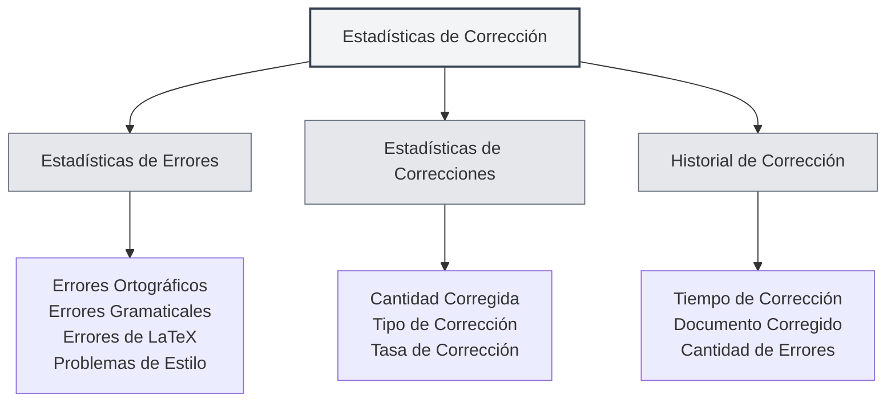

# Estadísticas de la Herramienta de Corrección

## Descripción General

La función de estadísticas de la herramienta de corrección se utiliza para rastrear y visualizar el uso de la corrección de documentos, incluyendo información estadística como la verificación ortográfica y gramatical. Estos datos estadísticos pueden ayudarle a comprender el uso de las funciones de corrección y optimizar la estrategia de revisión.

<ProofreadView mode="demo" />

<ProofreadDisplay mode="demo" />

<DataAnalysisDisplay mode="demo" />

## Introducción a las Estadísticas de Corrección

### ¿Qué son las Estadísticas de Corrección?

Las estadísticas de corrección registran información relevante durante el proceso de revisión de documentos:

- **Estadísticas de Errores**: Registran la cantidad y el tipo de errores detectados.
- **Estadísticas de Correcciones**: Registran la cantidad de errores corregidos.
- **Historial de Corrección**: Registra el historial de operaciones de corrección.

### Tipos de Estadísticas

Las estadísticas de corrección incluyen los siguientes tipos:

- **Errores Ortográficos**: Errores encontrados por la verificación ortográfica.
- **Errores Gramaticales**: Errores encontrados por la verificación gramatical.
- **Errores de LaTeX**: Errores encontrados por la verificación de sintaxis LaTeX.
- **Problemas de Estilo**: Problemas encontrados por la verificación de estilo.
- **Otros Errores**: Otros tipos de errores.

## Estadísticas de Errores

<DataAnalysisDisplay mode="demo" />

<ChartGenerationDisplay mode="demo" />

### Clasificación de Errores

La herramienta de corrección clasifica y cuenta los errores estadísticamente:

- **Errores Ortográficos**: Cantidad de errores de ortografía en palabras.
- **Errores Gramaticales**: Cantidad de errores gramaticales.
- **Errores de LaTeX**: Cantidad de errores de sintaxis en LaTeX.
- **Problemas de Estilo**: Cantidad de problemas relacionados con el estilo de escritura.
- **Otros Errores**: Cantidad de otros tipos de errores.

### Conteo de Errores

Cada sesión de corrección cuenta los errores:

- **Total de Errores**: Número total de todos los errores.
- **Número por Tipo**: Cantidad de errores de cada tipo.
- **Distribución de Errores**: Distribución de los tipos de errores.

## Estadísticas de Correcciones

### Registro de Correcciones

Registra la situación de las correcciones de errores:

- **Cantidad Corregida**: Número de errores que han sido corregidos.
- **Tipo de Corrección**: Tipo de errores que se han corregido.
- **Tasa de Corrección**: Proporción de errores corregidos.

### Historial de Correcciones

Se puede consultar el historial de correcciones:

- **Tiempo de Corrección**: Momento en que se corrigió el error.
- **Contenido Corregido**: Contenido específico que fue corregido.
- **Método de Corrección**: Forma en que se corrigió (manual/automático).

## Historial de Corrección

### Registro Histórico

Registra el historial de las operaciones de corrección:

- **Tiempo de Corrección**: Momento de la operación de corrección.
- **Documento Corregido**: Documento que fue revisado.
- **Cantidad de Errores**: Número de errores encontrados.
- **Cantidad Corregida**: Número de errores corregidos.

### Visualización del Historial

Se puede consultar el historial de corrección:

- **Lista Histórica**: Muestra todos los registros del historial de corrección.
- **Detalles**: Permite ver información detallada de cada sesión de corrección.
- **Análisis Estadístico**: Realiza análisis estadístico sobre los datos históricos.

## Vista de Estadísticas

<ProofreadView mode="demo" />

### Vista Unificada

La vista unificada muestra todos los errores:

- **Lista de Errores**: Muestra todos los errores en orden.
- **Detalles del Error**: Muestra información detallada de cada error.
- **Ubicación del Error**: Permite localizar la posición del error.

<DataAnalysisDisplay mode="demo" />

### Vista por Categorías

La vista por categorías muestra los errores por tipo:

- **Agrupado por Tipo**: Los errores se muestran agrupados por su tipo.
- **Estadísticas por Tipo**: Muestra la cantidad de errores de cada tipo.
- **Filtro por Tipo**: Permite filtrar errores de un tipo específico.

## Exportación de Estadísticas

### Función de Exportación

Se pueden exportar las estadísticas de corrección:

- **Formato de Exportación**: Puede admitir múltiples formatos (JSON, CSV, etc.).
- **Alcance de la Exportación**: Se puede elegir exportar todos los datos o solo los filtrados.
- **Contenido de la Exportación**: Se puede seleccionar qué información estadística exportar.

<ChartGenerationDisplay mode="demo" />

## Mejores Prácticas

1. **Corrección Periódica**: Utilice periódicamente la función de corrección para revisar documentos.
2. **Monitorear Estadísticas**: Preste atención a las estadísticas de errores para comprender la calidad del documento.
3. **Corregir Oportunamente**: Repare los errores descubiertos de manera oportuna.
4. **Analizar Tendencias**: Analice las tendencias de errores para mejorar los hábitos de escritura.
5. **Utilizar el Historial**: Aproveche los registros históricos para rastrear las mejoras del documento.

## Consideraciones

1. **Precisión Estadística**: Los datos estadísticos se basan en los resultados de detección de la herramienta de corrección.
2. **Manejo de Falsos Positivos**: Algunas detecciones pueden ser falsos positivos y requieren juicio humano.
3. **Almacenamiento de Datos**: Los datos estadísticos se almacenan localmente y no se cargan.
4. **Protección de Privacidad**: Los datos estadísticos no contienen contenido específico, solo información estadística.
5. **Impacto en el Rendimiento**: La función estadística tiene un impacto mínimo en el rendimiento y puede usarse con confianza.

## Documentación Relacionada

- [[ai.proofread|Función de Corrección con IA]]
- [[statistics.llm|Estadísticas de LLM]]