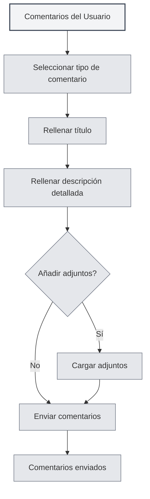

# Comentarios del Usuario

## Descripción General

La función de comentarios del usuario le permite enviar informes de problemas, sugerencias de funciones u otros comentarios al equipo de MetaDoc. Sus comentarios son muy importantes para que mejoremos nuestro producto.

## Abrir Comentarios del Usuario

### Métodos de Acceso

Puede abrir la página de comentarios del usuario de las siguientes maneras:

- **Página de Configuración**: Haga clic en el botón "Comentarios del Usuario" en la página de configuración "Acerca de"
- **Opción de Menú**: Algunos menús pueden tener una opción de comentarios del usuario
- **Atajo de Teclado**: En algunos casos puede haber un atajo de teclado (posiblemente compatible en el futuro)

<SettingAboutSection mode="demo" />

## Tipos de Comentarios

### Selección del Tipo de Comentario

Al enviar comentarios, debe seleccionar un tipo:

- **Comentario sobre ERROR**: Informar sobre errores o problemas del software
- **Sugerencia de Función**: Proponer nuevas funciones o sugerencias de mejora
- **Comentario sobre Seguridad**: Informar sobre problemas de seguridad
- **Otros**: Otros tipos de comentarios

<DialogDemo mode="demo" dialogType="feedback" />

### Explicación de los Tipos

- **Comentario sobre ERROR**: Se utiliza para informar sobre errores de software, bloqueos, comportamientos anómalos, etc.
- **Sugerencia de Función**: Se utiliza para proponer necesidades de nuevas funciones o sugerencias de mejora para funciones existentes
- **Comentario sobre Seguridad**: Se utiliza para informar sobre vulnerabilidades de seguridad o problemas de seguridad
- **Otros**: Se utiliza para otros tipos de comentarios, como problemas de uso, problemas de documentación, etc.

## Contenido de los Comentarios

### Título

El título de los comentarios debe:

- **Ser conciso y claro**: Describir brevemente el problema o la sugerencia
- **Ser específico y preciso**: Evitar títulos vagos
- **Ser obligatorio**: El título es un campo obligatorio

### Descripción Detallada

La descripción detallada debe incluir:

- **Descripción del problema**: Describir claramente el problema encontrado
- **Resultado esperado**: Explicar el resultado esperado
- **Otra información**: Proporcionar otra información útil para el diagnóstico
- **Información de contacto**: Información de contacto opcional para facilitar el seguimiento posterior

### Plantilla de Comentarios

El sistema proporcionará una plantilla de comentarios que incluye las siguientes secciones:

- **Información del sistema**: Información del sistema rellenada automáticamente
- **Descripción del problema**: Área para describir el problema
- **Resultado esperado**: Área para el resultado esperado
- **Otra información**: Área para otra información
- **Información de contacto**: Información de contacto opcional

<MenuItemsDemo mode="demo" :items='[{"id": "settings"}]' />

## Carga de Archivos Adjuntos

### Compatibilidad con Adjuntos

Puede cargar archivos adjuntos para ayudar a explicar el problema:

- **Tipo de archivo**: Admite cualquier tipo de archivo
- **Tamaño del archivo**: Cada archivo no debe superar los 10 MB
- **Tamaño total**: El tamaño total de todos los archivos adjuntos no debe superar los 50 MB
- **Número de archivos**: Se pueden cargar hasta 5 archivos adjuntos

<SettingImageSection mode="demo" />

### Uso de los Adjuntos

Los archivos adjuntos se pueden utilizar para:

- **Capturas de pantalla**: Proporcionar capturas de pantalla del problema
- **Archivos de registro**: Proporcionar registros de errores
- **Archivos de ejemplo**: Proporcionar archivos de ejemplo que muestren el problema
- **Otros archivos**: Proporcionar otros archivos relevantes

### Reglas para los Adjuntos

- **Límite por archivo**: Cada archivo no debe superar los 10 MB
- **Límite de tamaño total**: El tamaño total de todos los archivos adjuntos no debe superar los 50 MB
- **Límite de cantidad**: Se pueden cargar hasta 5 archivos adjuntos
- **Límite de tipo**: Sin restricciones de tipo de archivo, sujeto a la capacidad de Gist

## Enviar Comentarios

### Pasos para Enviar

1. **Seleccionar tipo**: Seleccionar el tipo de comentario
2. **Rellenar título**: Rellenar el título de los comentarios
3. **Rellenar descripción**: Rellenar la descripción detallada
4. **Añadir adjuntos**: Opcional, añadir archivos adjuntos
5. **Enviar comentarios**: Hacer clic en el botón "Enviar Comentarios"

Puede acceder a los comentarios del usuario a través de la página de configuración:

<MenuItemsDemo mode="demo" :items='[{"id": "settings"}]' />

### Validación del Envío

Antes de enviar, se realizará una validación:

- **Validación del título**: Asegurar que el título no esté vacío
- **Validación de la descripción**: Asegurar que la descripción no esté vacía
- **Validación de adjuntos**: Asegurar que los archivos adjuntos cumplan las reglas

<DialogDemo mode="demo" dialogType="submit-confirm" />

### Resultado del Envío

Después de enviar, se mostrará el resultado:

- **Envío exitoso**: Mostrar un mensaje de éxito
- **Envío fallido**: Mostrar un mensaje de error y la causa

## Otros Métodos de Contacto

### Comentarios por Correo Electrónico

También puede enviar comentarios por correo electrónico:

- **Dirección de correo**: Se muestra en la parte inferior de la página de comentarios
- **Copiar dirección**: Puede copiar la dirección de correo electrónico
- **Asunto del correo**: Se recomienda utilizar un asunto claro

<ViewMenuItemsDemo mode="demo" :items='["settings"]' />

### Grupo QQ

Puede unirse al grupo QQ oficial:

- **Número del grupo QQ**: Se muestra en la parte inferior de la página de comentarios
- **Copiar número del grupo**: Puede copiar el número del grupo QQ
- **Unirse al grupo**: Después de unirse al grupo, puede enviar comentarios en tiempo real

## Procesamiento de Comentarios

### Flujo de Procesamiento

El flujo de procesamiento después de enviar los comentarios:

1. **Recibir comentarios**: El sistema recibe sus comentarios
2. **Clasificación**: Clasificar según el tipo de comentario
3. **Análisis del problema**: Analizar el problema o la sugerencia
4. **Seguimiento**: Realizar seguimiento según la situación
5. **Respuesta a los comentarios**: Posible respuesta por correo electrónico o en el grupo QQ

### Prioridad de los Comentarios

Los comentarios tendrán una prioridad establecida según el tipo y la gravedad:

- **Comentarios sobre seguridad**: Prioridad más alta
- **ERROR grave**: Prioridad alta
- **Sugerencia de función**: Prioridad media
- **Otros comentarios**: Prioridad general

<MainTabs mode="demo" />

## Mejores Prácticas

1. **Descripción detallada**: Describir el problema o la sugerencia con el mayor detalle posible
2. **Proporcionar capturas de pantalla**: Si es posible, proporcionar capturas de pantalla del problema
3. **Proporcionar registros**: Si encuentra un error, proporcionar los registros de error
4. **Proporcionar ejemplos**: Si es posible, proporcionar archivos de ejemplo del problema
5. **Información de contacto**: Proporcionar información de contacto para facilitar el seguimiento posterior

## Consideraciones

1. **Formato de los comentarios**: Rellenar los comentarios según el formato de la plantilla
2. **Tamaño de los adjuntos**: Prestar atención a las limitaciones de tamaño de los archivos adjuntos
3. **Información de contacto**: Proporcionar información de contacto para facilitar el seguimiento posterior
4. **Tipo de comentarios**: Seleccionar el tipo de comentario correcto
5. **Información del sistema**: La información del sistema se rellena automáticamente, no la elimine

## Documentación Relacionada

- [[settings.about|Información Acerca de]]
- [[user.profile|Perfil del Usuario]]

<AIChat mode="demo" />
