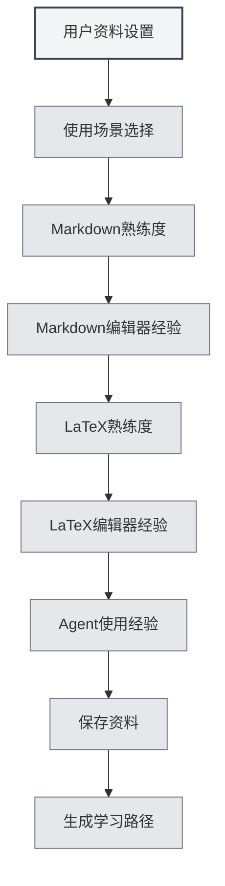

# Perfil de Usuario

## Descripción General

La función de perfil de usuario le permite configurar su información personal y preferencias de uso, ayudando a MetaDoc a comprender mejor sus necesidades y ofrecer una experiencia de uso personalizada y una ruta de aprendizaje adaptada.

## Configuración del Perfil de Usuario

### Abrir el Perfil de Usuario

Puede abrir el cuadro de diálogo del perfil de usuario de las siguientes maneras:

- **Sugerencia en la Página Principal**: En el primer uso, la página principal puede sugerir configurar el perfil de usuario.
- **Manual del Usuario**: Se puede acceder a la configuración del perfil de usuario desde el manual del usuario.
- **Opción de Menú**: Algunos menús pueden tener una opción para el perfil de usuario.

<QuickStartPanel mode="demo" />

### Interfaz del Perfil de Usuario

La interfaz del perfil de usuario contiene las siguientes secciones principales:

<UserProfileView mode="demo" />

### Asistente de Configuración del Perfil

La configuración del perfil de usuario sigue un asistente paso a paso:

1.  **Escenario de Uso**: Seleccione el escenario de uso principal.
2.  **Competencia en Markdown**: Evalúe su familiaridad con la sintaxis de Markdown.
3.  **Experiencia con Editores Markdown**: Seleccione los tipos de editores Markdown que ha utilizado.
4.  **Competencia en LaTeX**: Evalúe su familiaridad con la sintaxis de LaTeX.
5.  **Experiencia con Editores LaTeX**: Seleccione los tipos de editores LaTeX que ha utilizado.
6.  **Experiencia con Agentes (Agents)**: Evalúe su experiencia en el uso de marcos de trabajo de Agentes.

## Selección del Escenario de Uso

### Tipos de Escenarios

Puede seleccionar los siguientes escenarios de uso:

- **Estudiante**: Adecuado para usuarios estudiantes, se centra en aprender funciones básicas de edición y Markdown.
- **Investigador**: Adecuado para investigadores, se centra en aprender funciones de LaTeX y escritura académica.
- **Profesional de TI**: Adecuado para profesionales de TI, se centra en aprender el marco de Agentes y funciones avanzadas.
- **Usuario de Oficina**: Adecuado para usuarios de oficina, se centra en aprender funciones básicas y exportación.
- **Otro**: Otros escenarios de uso.

### Impacto del Escenario

El escenario seleccionado afectará:

- **Ruta de Aprendizaje**: El sistema recomendará una ruta de aprendizaje correspondiente.
- **Recomendación de Funciones**: Se priorizará la recomendación de funciones relacionadas.
- **Comprensión de la IA**: Ayudará a la IA a comprender mejor sus necesidades.

## Evaluación de Habilidades

### Competencia en Markdown

Evalúe su nivel de familiaridad con la sintaxis de Markdown:

- **Sin experiencia**: Nunca ha usado Markdown.
- **Básico**: Conoce la sintaxis básica (encabezados, listas, enlaces, etc.).
- **Intermedio**: Familiarizado con la sintaxis común y funciones extendidas.
- **Avanzado**: Domina Markdown, conoce varias sintaxis extendidas.

<QuickStartLatex mode="demo" />

### Competencia en LaTeX

Evalúe su nivel de familiaridad con la sintaxis de LaTeX:

- **Sin experiencia**: Nunca ha usado LaTeX.
- **Básico**: Conoce la sintaxis básica y la estructura de documentos.
- **Intermedio**: Familiarizado con entornos y comandos comunes.
- **Avanzado**: Domina LaTeX, puede escribir documentos complejos.

<MenuItemsDemo mode="demo" :items='[{"id": "file"}]' />

### Experiencia con Agentes (Agents)

Evalúe su experiencia en el uso de marcos de trabajo de Agentes:

- **Sin experiencia**: Nunca ha usado funciones de Agentes.
- **Básico**: Conoce conceptos básicos, ha usado funciones simples.
- **Intermedio**: Familiarizado con conjuntos de herramientas y flujos de trabajo.
- **Avanzado**: Puede crear configuraciones y flujos de trabajo complejos de Agentes.

<AgentView mode="demo" />

## Experiencia con Editores

### Experiencia con Editores Markdown

Seleccione los tipos de editores Markdown que ha utilizado:

- **Editor WYSIWYG**: Ha usado editores "lo que ves es lo que obtienes".
- **Otros editores Markdown**: Ha usado otros editores Markdown.

### Experiencia con Editores LaTeX

Seleccione los tipos de editores LaTeX que ha utilizado:

- **Editor LaTeX en línea**: Ha usado editores LaTeX en línea.
- **Editor LaTeX local**: Ha usado editores LaTeX locales.

## Configuración de Preferencias de Uso

### Preferencias de Edición

Puede configurar preferencias relacionadas con la edición:

- **Modo de Edición**: Modo de edición preferido.
- **Método de Vista Previa**: Método de vista previa preferido.
- **Guardado Automático**: Preferencia de guardado automático.

<MainTabs mode="demo" />

### Preferencias de Funciones

Puede configurar preferencias relacionadas con las funciones:

- **Funciones Frecuentes**: Marcar funciones de uso común.
- **Prioridad de Funciones**: Establecer la prioridad de las funciones.
- **Disposición de la Interfaz**: Disposición de interfaz preferida.

<ViewMenuItemsDemo mode="demo" :items='["settings"]' />

## Configuración del Perfil de Usuario (Persona)

### Generación del Perfil

Basándose en su configuración, el sistema generará un perfil de usuario (persona):

- **Nivel de Habilidades**: Evalúa el nivel de cada habilidad.
- **Escenario de Uso**: Identifica el escenario de uso principal.
- **Necesidades de Aprendizaje**: Analiza las necesidades de aprendizaje.

### Aplicación del Perfil

El perfil de usuario se aplicará a:

- **Ruta de Aprendizaje**: Recomienda una ruta de aprendizaje personalizada.
- **Recomendación de Funciones**: Prioriza la recomendación de funciones relevantes.
- **Asistencia de IA**: Ayuda a la IA a comprender mejor las necesidades.

## Recomendación de Ruta de Aprendizaje

### Tipos de Rutas

Según el perfil de usuario, el sistema recomendará la ruta de aprendizaje correspondiente:

- **Ruta para Estudiantes**: Ruta de aprendizaje adecuada para usuarios estudiantes.
- **Ruta para Investigadores**: Ruta de aprendizaje adecuada para investigadores.
- **Ruta para Profesionales de TI**: Ruta de aprendizaje adecuada para profesionales de TI.
- **Ruta para Usuarios de Oficina**: Ruta de aprendizaje adecuada para usuarios de oficina.

<AIChat mode="demo" />

### Contenido de la Ruta

La ruta de aprendizaje incluye:

- **Lista de Documentos**: Documentos de aprendizaje ordenados secuencialmente.
- **Objetivos de Aprendizaje**: Objetivos de aprendizaje para cada documento.
- **Tiempo Estimado**: Tiempo estimado necesario para completar el aprendizaje.

## Actualización del Perfil

### Modificar el Perfil

Puede modificar su perfil de usuario en cualquier momento:

1.  Abra el cuadro de diálogo del perfil de usuario.
2.  Modifique las configuraciones.
3.  Guarde los cambios.

### Sincronización del Perfil

El perfil de usuario:

- **Se guarda localmente**: Se almacena localmente.
- **Se sincroniza entre ventanas**: Se sincroniza entre todas las ventanas.
- **Es persistente**: Sigue siendo válido al próximo inicio.

## Mejores Prácticas

1.  **Complete con sinceridad**: Complete la información con veracidad para obtener recomendaciones más precisas.
2.  **Actualice periódicamente**: Actualice su perfil periódicamente a medida que mejoren sus habilidades.
3.  **Seleccione el escenario**: Elija el escenario que mejor se ajuste a su situación real de uso.
4.  **Evalúe sus habilidades**: Evalúe objetivamente su nivel de habilidades.
5.  **Aproveche las recomendaciones**: Aproveche al máximo las rutas de aprendizaje recomendadas por el sistema.

## Consideraciones

1.  **Privacidad del perfil**: El perfil de usuario se almacena solo localmente, no se sube.
2.  **Perfil opcional**: La configuración del perfil de usuario es opcional, puede omitirse.
3.  **Recomendaciones como referencia**: Las recomendaciones de rutas de aprendizaje son solo una referencia, puede ajustarlas según sea necesario.
4.  **Cambio de habilidades**: Los niveles de habilidad cambian, se recomienda actualizar periódicamente.
5.  **Múltiples escenarios**: Si utiliza varios escenarios, puede elegir el principal.

## Documentación Relacionada

- [[home.features|Funciones de la Página Principal]]
- [[user.feedback|Comentarios del Usuario]]
- [[quick-start.guide|Guía de Inicio Rápido]]

<QuickStartPanel mode="demo" />

<MenuItemsDemo mode="demo" :items='[{"id": "settings"}]' />

<MainTabs mode="demo" />