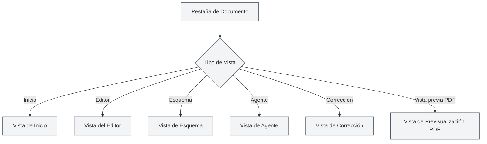

# Tipos de Vista

## Descripción General

MetaDoc admite múltiples tipos de vista, cada uno de los cuales ofrece diferentes funciones e interfaces. Puede cambiar entre las distintas vistas según sea necesario para completar diversas tareas.

## Introducción a los Tipos de Vista

### Vista de Inicio

La Vista de Inicio es la interfaz de entrada de MetaDoc, que proporciona funciones de inicio rápido y documentos recientes.

<QuickStartPanel mode="demo" />

**Funciones principales**:

- **Inicio rápido**: Seleccionar el formato del documento para crear rápidamente un nuevo documento.
- **Documentos recientes**: Mostrar la lista de documentos abiertos recientemente.
- **Manual de usuario**: Acceso rápido al manual de usuario.
- **Perfil de usuario**: Acceder a la configuración del perfil de usuario.

**Casos de uso**:

- Interfaz inicial después de iniciar la aplicación.
- Cuando se necesita crear rápidamente un nuevo documento.
- Para revisar los documentos utilizados recientemente.

Puede cambiar entre diferentes vistas a través de la barra lateral.

### Vista del Editor

La Vista del Editor es la interfaz principal para la edición de documentos, compatible con la edición de Markdown, LaTeX y texto plano.

<LaTeXEditor mode="demo" />

**Funciones principales**:

- **Edición Markdown**: Utilizar el editor Vditor para editar documentos Markdown.
- **Edición LaTeX**: Utilizar el editor Monaco para editar documentos LaTeX.
- **Edición de texto plano**: Utilizar el editor Monaco para editar texto plano.
- **Vista previa en tiempo real**: El editor Markdown admite vista previa en tiempo real.

**Casos de uso**:

- Editar el contenido de un documento.
- Escribir documentación técnica.
- Redactar artículos académicos.

### Vista de Esquema

La Vista de Esquema muestra el esquema estructurado del documento, facilitando la visualización y edición de la estructura del mismo.

<Outline mode="demo" />

**Funciones principales**:

- **Visualización del esquema**: Mostrar los títulos del documento en una estructura de árbol.
- **Operaciones con nodos**: Añadir, editar, eliminar y mover nodos.
- **Ordenar por arrastre**: Ajustar el orden arrastrando los nodos.
- **Funciones de IA**: Generar subcapítulos, generar contenido, optimizar el esquema.

**Casos de uso**:

- Ver la estructura de un documento.
- Navegar rápidamente a un capítulo específico.
- Editar el esquema de un documento.
- Utilizar IA para generar contenido.

### Vista de Agente

La Vista de Agente proporciona una interfaz de interacción para el marco de trabajo de Agentes, utilizada para crear y gestionar sesiones de Agente.

<AgentView mode="demo" />

**Funciones principales**:

- **Gestión de sesiones**: Crear, editar y eliminar sesiones de Agente.
- **Configuración de herramientas**: Configurar el conjunto de herramientas que utiliza el Agente.
- **Flujos de trabajo**: Crear y ejecutar flujos de trabajo.
- **Interacción de mensajes**: Dialogar con el Agente.

**Casos de uso**:

- Utilizar un Agente para completar tareas complejas.
- Automatizar el procesamiento de documentos.
- Realizar operaciones por lotes en documentos.

### Vista de Corrección

La Vista de Corrección proporciona funciones de corrección mediante IA, que revisan los errores en el documento y ofrecen sugerencias de modificación.

<ProofreadView mode="demo" />

**Funciones principales**:

- **Detección de errores**: Detectar errores ortográficos, gramaticales y de sintaxis LaTeX.
- **Lista de errores**: Mostrar todos los errores detectados.
- **Corrección de errores**: Reparar individualmente o reparar todos con un clic.
- **Gestión del diccionario**: Añadir palabras al diccionario.

**Casos de uso**:

- Revisar errores en un documento.
- Mejorar la calidad del documento.
- Corregir errores ortográficos y gramaticales.

### Vista de Previsualización PDF

La Vista de Previsualización PDF muestra la vista previa del PDF compilado a partir de un documento LaTeX (solo para documentos LaTeX).

<PdfPreviewPanel mode="demo" pdfUrl="" />

**Funciones principales**:

- **Visualización PDF**: Mostrar el contenido del PDF compilado.
- **Control de zoom**: Ampliar y reducir el PDF.
- **Actualizar PDF**: Recompilar y actualizar el PDF.
- **Localizar en el código**: Ir desde una posición en el PDF al código LaTeX correspondiente.

**Casos de uso**:

- Previsualizar el resultado de un documento LaTeX.
- Comprobar el formato del PDF.
- Localizar problemas en el PDF.

## Cambio de Vista

### Métodos de Cambio

Puede cambiar de vista de las siguientes maneras:

<MainTabs mode="demo" />

<ViewMenuItemsDemo mode="demo" :items='["editor", "outline", "agent"]' />

1.  **Menú de vistas**: Hacer clic en el botón del menú de vistas en la parte izquierda.
2.  **Selector de vistas**: Seleccionar la vista a la que cambiar en el menú de vistas.
3.  **Atajos de teclado**: Algunas vistas pueden tener atajos de teclado (posiblemente compatibles en el futuro).

### Menú de Vistas

El menú de vistas se muestra en la barra lateral izquierda:

-   **Inicio**: Cambiar a la Vista de Inicio.
-   **Editor**: Cambiar a la Vista del Editor.
-   **Esquema**: Cambiar a la Vista de Esquema.
-   **Agente**: Cambiar a la Vista de Agente.
-   **Corrección**: Cambiar a la Vista de Corrección.
-   **Vista previa PDF**: Cambiar a la Vista de Previsualización PDF (solo para documentos LaTeX).

### Estado de la Vista

Cada pestaña de documento tiene un estado de vista independiente:

-   **Memoria de vista**: Después de cambiar de vista, el estado de la vista se guarda.
-   **Próxima apertura**: La próxima vez que se abra el documento, se restaurará a la última vista utilizada.
-   **Múltiples pestañas**: Diferentes pestañas pueden utilizar diferentes vistas.

## Características de las Vistas

### Independencia de las Vistas

Cada vista es independiente:

-   **Estado independiente**: Cada vista tiene su propio estado.
-   **Sincronización de datos**: Los datos se sincronizan automáticamente entre vistas.
-   **Cambio rápido**: El cambio entre vistas es muy rápido, no requiere recarga.

### Combinación de Vistas

Algunas vistas se pueden utilizar en combinación:

-   **Editor + Esquema**: Ver simultáneamente el editor y el esquema.
-   **Editor + Vista previa PDF**: El editor LaTeX puede mostrar simultáneamente el código y el PDF.
-   **Editor + Corrección**: Se puede realizar corrección mientras se edita.

## Recomendaciones de Uso de las Vistas

### Edición de Documentos

-   **Vista del Editor**: Utilizar principalmente la Vista del Editor para editar.
-   **Vista de Esquema**: Cambiar a la Vista de Esquema cuando se necesite ver la estructura.
-   **Vista previa PDF**: Utilizar la Vista de Previsualización PDF para ver el resultado al editar documentos LaTeX.

### Corrección de Documentos

-   **Vista de Corrección**: Especializada para la corrección de documentos.
-   **Vista del Editor**: Volver a la Vista del Editor para continuar editando después de la corrección.

### Tareas con Agente

-   **Vista de Agente**: Crear y gestionar sesiones de Agente.
-   **Vista del Editor**: Revisar los documentos procesados por el Agente.

## Consideraciones

1.  **Cambio de vista**: El cambio de vista guarda el estado actual.
2.  **Vista previa PDF**: Solo los documentos LaTeX admiten la Vista de Previsualización PDF.
3.  **Estado de la vista**: El estado de la vista de cada pestaña se guarda de forma independiente.
4.  **Sincronización de datos**: Los datos se sincronizan automáticamente entre vistas.
5.  **Consideraciones de rendimiento**: Algunas vistas pueden consumir más recursos.

## Documentación Relacionada

-   [[core.multi-tab|Gestión de Múltiples Pestañas]]
-   [[outline.basics|Funciones de la Vista de Esquema]]
-   [[agent.session|Gestión de Sesiones de Agente]]
-   [[ai.proofread|Función de Corrección por IA]]
-   [[latex.pdf-preview|Función de Previsualización PDF]]