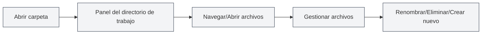

# Gestión del Directorio de Trabajo

## Descripción General

La gestión del directorio de trabajo le permite abrir y administrar carpetas en MetaDoc, proporcionando funcionalidades similares a las de un explorador de archivos. A través del directorio de trabajo, puede navegar, abrir y gestionar archivos de proyecto de manera conveniente.

## Introducción al Directorio de Trabajo

<ViewMenuItemsDemo mode="demo" :items='["workspace"]' />

### ¿Qué es un Directorio de Trabajo?

Un directorio de trabajo es una carpeta abierta en MetaDoc que le permite:

- **Navegar archivos**: Ver archivos y subcarpetas dentro de la carpeta.
- **Abrir archivos**: Abrir archivos directamente en MetaDoc.
- **Gestionar archivos**: Realizar operaciones como renombrar o eliminar archivos.
- **Organización de proyectos**: Organizar archivos relacionados en un directorio.

### Casos de Uso

El directorio de trabajo es adecuado para los siguientes escenarios:

- **Gestión de proyectos**: Administrar todos los documentos de un proyecto.
- **Navegación de archivos**: Navegar y abrir archivos rápidamente.
- **Organización de documentos**: Agrupar documentos relacionados.
- **Operaciones por lotes**: Realizar operaciones en múltiples archivos.

## Abrir un Directorio de Trabajo

<ViewMenuItemsDemo mode="demo" :items='["workspace", "editor"]' />

### Abrir un Directorio

1. Haga clic en el icono "Directorio de trabajo" en el menú lateral.
2. Si no hay un directorio abierto, aparecerá un cuadro de diálogo para seleccionar uno.
3. Seleccione la carpeta que desea abrir.
4. El directorio se mostrará en la barra lateral.

Puede acceder a la vista del directorio de trabajo a través de la barra lateral:

<ViewMenuItemsDemo mode="demo" :items='["workspace"]' />

<ViewMenuItemsDemo mode="demo" :items='["editor", "outline", "home"]' />

### Cambiar de Directorio

Si necesita cambiar a otro directorio:

1. Haga clic en el botón de menú de la barra de título del directorio de trabajo.
2. Seleccione "Abrir carpeta".
3. Seleccione la nueva carpeta.
4. El nuevo directorio reemplazará al actual.

### Cerrar el Directorio

Puede cerrar el directorio de trabajo actualmente abierto:

1. Haga clic en el botón de menú de la barra de título del directorio de trabajo.
2. Seleccione "Cerrar directorio de trabajo".
3. El panel del directorio de trabajo se ocultará.

## Navegación de Archivos

<ViewMenuItemsDemo mode="demo" :items='["workspace", "editor", "outline"]' />

### Estructura de Árbol de Directorios

El directorio de trabajo se muestra en una estructura de árbol:

- **Carpetas**: Muestran un icono de carpeta y se pueden expandir/contraer.
- **Archivos**: Muestran un icono de archivo y el nombre del archivo.
- **Estructura jerárquica**: Admite anidación de carpetas en múltiples niveles.

### Expandir y Contraer

- **Expandir carpeta**: Haga clic en el icono o nombre de la carpeta.
- **Contraer carpeta**: Haga clic nuevamente en una carpeta expandida.
- **Expandir todo**: Use el menú contextual para seleccionar "Expandir todo".
- **Contraer todo**: Use el menú contextual para seleccionar "Contraer todo".

### Reconocimiento de Tipos de Archivo

El directorio de trabajo reconoce los tipos de archivo:

- **Archivos Markdown** (.md): Muestran un icono de Markdown.
- **Archivos LaTeX** (.tex): Muestran un icono de LaTeX.
- **Archivos de imagen** (.png, .jpg, etc.): Muestran un icono de imagen.
- **Otros archivos**: Muestran un icono de archivo genérico.

## Operaciones con Archivos

<ViewMenuItemsDemo mode="demo" :items='["workspace"]' />

<MenuItemsDemo mode="demo" :items='[{"id": "file", "items": ["new", "open"]}]' />

### Abrir Archivos

Hay varias formas de abrir archivos:

- **Doble clic en el archivo**: Haga doble clic en el icono o nombre del archivo.
- **Menú contextual**: Haga clic derecho en el archivo y seleccione "Abrir".
- **Arrastrar y soltar**: Arrastre el archivo al área del editor.

Después de abrir un archivo, este se abrirá en una nueva pestaña.

### Previsualizar Archivos

<ViewMenuItemsDemo mode="demo" :items='["workspace"]' />

Puede previsualizar archivos sin abrirlos:

- **Menú contextual**: Haga clic derecho en el archivo y seleccione "Previsualizar".
- **Modo de previsualización**: El archivo se abre en una pestaña de previsualización.
- **Cambiar a edición**: En modo de previsualización puede cambiar al modo de edición.

### Renombrar Archivos

<ViewMenuItemsDemo mode="demo" :items='["workspace"]' />

1. Haga clic derecho en el archivo que desea renombrar.
2. Seleccione "Renombrar".
3. Ingrese el nuevo nombre del archivo.
4. Presione Enter para confirmar, o Esc para cancelar.

**Consideraciones**:

- Renombrar cambia el nombre del archivo en el sistema de archivos.
- Si el archivo está siendo editado, debe guardarlo primero.
- La ruta del archivo cambiará después de renombrarlo.

### Eliminar Archivos

<ViewMenuItemsDemo mode="demo" :items='["workspace"]' />

1. Haga clic derecho en el archivo que desea eliminar.
2. Seleccione "Eliminar".
3. Confirme la operación de eliminación.

**Consideraciones**:

- La operación de eliminación no se puede deshacer.
- Si el archivo está siendo editado, debe cerrarlo primero.
- Eliminar una carpeta eliminará todos los archivos dentro de ella.

### Crear Nuevos Archivos

1. Haga clic derecho en una carpeta o en un área en blanco.
2. Seleccione "Nuevo archivo".
3. Ingrese el nombre del archivo (incluyendo la extensión).
4. Presione Enter para confirmar.

El archivo nuevo se abrirá inmediatamente en el editor.

### Crear Nuevas Carpetas

<ViewMenuItemsDemo mode="demo" :items='["workspace"]' />

1. Haga clic derecho en una carpeta o en un área en blanco.
2. Seleccione "Nueva carpeta".
3. Ingrese el nombre de la carpeta.
4. Presione Enter para confirmar.

## Funciones Avanzadas de Operaciones con Archivos

<ViewMenuItemsDemo mode="demo" :items='["workspace", "editor"]' />

### Copiar Archivos

1. Haga clic derecho en el archivo que desea copiar.
2. Seleccione "Copiar".
3. Haga clic derecho en la ubicación de destino.
4. Seleccione "Pegar".

### Cortar Archivos

1. Haga clic derecho en el archivo que desea cortar.
2. Seleccione "Cortar".
3. Haga clic derecho en la ubicación de destino.
4. Seleccione "Pegar".

### Pegar Archivos

1. Después de copiar o cortar un archivo.
2. Haga clic derecho en la ubicación de destino.
3. Seleccione "Pegar".

**Consideraciones**:

- Pegar dentro de una carpeta creará el archivo dentro de esa carpeta.
- Si ya existe un archivo con el mismo nombre en la ubicación de destino, se le pedirá que lo sobrescriba o lo renombre.

### Operaciones por Lotes

Puede seleccionar múltiples archivos simultáneamente para operar:

- **Selección múltiple**: Mantenga presionada la tecla Ctrl y haga clic en varios archivos.
- **Seleccionar todo**: Use Ctrl+A para seleccionar todos los archivos.
- **Operaciones por lotes**: Ejecute operaciones como copiar o eliminar en los archivos seleccionados.

## Búsqueda de Archivos

<ViewMenuItemsDemo mode="demo" :items='["workspace"]' />

### Función de Búsqueda

El directorio de trabajo admite la búsqueda de archivos:

1. En el panel del directorio de trabajo, use el cuadro de búsqueda.
2. Ingrese el nombre del archivo o palabras clave.
3. Los resultados de la búsqueda se resaltarán.

### Alcance de la Búsqueda

La búsqueda se realiza dentro de los siguientes alcances:

- **Directorio actual**: El directorio de trabajo actualmente abierto.
- **Subdirectorios**: Incluye todas las subcarpetas.
- **Nombre de archivo**: Busca en los nombres de archivo, no en el contenido.

## Monitoreo del Directorio

<ViewMenuItemsDemo mode="demo" :items='["workspace", "outline"]' />

### Actualización Automática

El directorio de trabajo monitorea automáticamente los cambios en el sistema de archivos:

- **Creación de archivos**: Los archivos nuevos se muestran automáticamente.
- **Eliminación de archivos**: Los archivos eliminados se eliminan automáticamente.
- **Renombrado de archivos**: Los archivos renombrados se actualizan automáticamente.
- **Modificación de archivos**: Los archivos modificados muestran una marca de actualización.

### Actualización Manual

Si necesita actualizar el directorio manualmente:

1. Haga clic derecho en una carpeta o en un área en blanco.
2. Seleccione "Actualizar".
3. El directorio se recargará.

## Rutas de Archivos

### Mostrar Rutas

El directorio de trabajo muestra la ruta completa de los archivos:

- **Información al pasar el cursor**: Pase el cursor sobre un archivo para mostrar su ruta completa.
- **Barra de ruta**: Algunas vistas pueden mostrar una barra de ruta.
- **Menú contextual**: El menú contextual puede mostrar información de la ruta.

### Operaciones con Rutas

- **Copiar ruta**: Puede copiar la ruta completa de un archivo.
- **Abrir ubicación**: Puede abrir la ubicación del archivo en el explorador de archivos.
- **Navegación por ruta**: Puede localizar archivos rápidamente a través de la ruta.

## Mejores Prácticas

1. **Organización de proyectos**: Organice archivos relacionados en un directorio de trabajo.
2. **Nomenclatura de archivos**: Use convenciones de nombres claras.
3. **Copia de seguridad periódica**: Haga copias de seguridad periódicas de archivos importantes.
4. **Limpieza de archivos**: Limpie periódicamente los archivos innecesarios.
5. **Estructura de directorios**: Mantenga una estructura de directorios clara.

## Consideraciones

1. **Permisos de archivo**: Asegúrese de tener permisos de lectura y escritura para los archivos.
2. **Bloqueo de archivos**: Algunos archivos pueden estar bloqueados por otros programas.
3. **Longitud de la ruta**: Tenga en cuenta las limitaciones de longitud de las rutas de archivo.
4. **Caracteres especiales**: Evite usar caracteres especiales en los nombres de archivo.
5. **Tamaño del archivo**: Abrir archivos grandes puede requerir tiempo.

## Documentación Relacionada

- [[core.file-operations|Operaciones con archivos]]
- [[core.multi-tab|Gestión de múltiples pestañas]]
- [[core.multi-window|Gestión de múltiples ventanas]]
