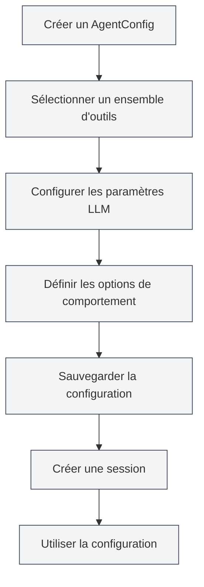

# Gestion de la configuration des Agents

## Vue d'ensemble

La configuration d'Agent (AgentConfig) est un composant central du framework Agent, utilisé pour définir l'identité et le champ de compétences d'un Agent. Chaque AgentConfig est associé à un ensemble d'outils, détermine quels outils l'Agent peut utiliser, et permet de configurer les paramètres LLM et les options de comportement.

Grâce au mécanisme d'intersection des ensembles d'outils, AgentConfig contrôle de manière flexible le champ de compétences de l'Agent, vous permettant de créer des configurations d'Agent spécialisées pour différents scénarios.

<AgentView mode="demo" />

## Concepts clés

### Structure de l'AgentConfig

AgentConfig comprend les parties principales suivantes :

- **Informations de base** : ID, nom, description, numéro de version
- **Association des ensembles d'outils** : Liste des ID d'ensembles d'outils associés (intersection)
- **Configuration LLM** : Modèle, température, nombre maximum de tokens, prompt système, etc.
- **Configuration du comportement** : Autorisation d'appel d'outils, nombre maximum d'appels, etc.
- **Type de scénario** : outline, editor, analysis, visualization, custom

### Intersection des ensembles d'outils

Lorsqu'un AgentConfig est associé à plusieurs ensembles d'outils, les outils disponibles sont l'intersection de tous les ensembles d'outils :

- L'ensemble d'outils A contient : `[tool1, tool2, tool3]`
- L'ensemble d'outils B contient : `[tool2, tool3, tool4]`
- Les outils disponibles pour l'AgentConfig sont : `[tool2, tool3]`

Ce mécanisme vous permet de contrôler avec précision le champ de compétences de l'Agent.

<AgentConfigManager mode="demo" />

## Créer un AgentConfig

### Créer une nouvelle configuration

Étapes pour créer un AgentConfig :

1. **Ouvrir la gestion des Agents** : Dans la vue Agent, cliquer sur "Gérer" → "Configuration des Agents"
2. **Créer une configuration** : Cliquer sur le bouton "Nouvelle configuration"
3. **Remplir les informations de base** :
   - Nom : Nom de la configuration (prise en charge multilingue)
   - Description : Description de la configuration (prise en charge multilingue)
4. **Sélectionner un ensemble d'outils** : Choisir un ou plusieurs ensembles d'outils dans la liste déroulante
5. **Configurer le LLM** (optionnel) :
   - Prompt système : Personnaliser le prompt système
   - Injection d'horodatage : Indiquer si l'horodatage actuel doit être injecté dans le prompt système
6. **Définir le comportement** (optionnel) :
   - Nombre maximum d'appels d'outils : Limiter le nombre d'appels d'outils de l'Agent (null signifie illimité)
7. **Sauvegarder la configuration** : Cliquer sur le bouton "Sauvegarder"

<AgentView mode="demo" />

Vous pouvez accéder à la vue Agent via la barre latérale :

### Configuration par défaut

Le système fournit un AgentConfig par défaut (`default-agent-config`), qui inclut tous les outils intégrés. Il ne peut pas être supprimé mais peut être dupliqué.

## Modifier un AgentConfig

### Opération de modification

Modifier un AgentConfig existant :

1. **Ouvrir l'interface de gestion** : Dans l'interface de gestion des configurations d'Agent, trouver la configuration à modifier
2. **Cliquer sur Modifier** : Cliquer sur le bouton "Modifier" sur la carte de configuration
3. **Modifier la configuration** : Modifier le nom, la description, l'ensemble d'outils, la configuration LLM ou la configuration du comportement
4. **Sauvegarder les modifications** : Cliquer sur le bouton "Sauvegarder"

**Remarque** : La configuration par défaut (`default-agent-config`) ne peut pas être modifiée, mais elle peut être dupliquée puis modifiée.

<AgentConfigManager mode="demo" />

## Supprimer un AgentConfig

### Opération de suppression

Supprimer un AgentConfig inutile :

1. **Ouvrir l'interface de gestion** : Dans l'interface de gestion des configurations d'Agent, trouver la configuration à supprimer
2. **Cliquer sur Supprimer** : Cliquer sur le bouton "Supprimer" sur la carte de configuration
3. **Confirmer la suppression** : Confirmer la suppression dans la boîte de dialogue de confirmation qui s'affiche

<AgentConfigManager mode="demo" />

**Remarques** :

- La configuration par défaut (`default-agent-config`) ne peut pas être supprimée
- La suppression d'une configuration n'affecte pas les sessions déjà créées, mais les nouvelles sessions ne pourront pas utiliser cette configuration
- Si la configuration est utilisée par une session, un avertissement s'affichera avant la suppression

## Dupliquer un AgentConfig

### Opération de duplication

Dupliquer un AgentConfig existant :

1. **Ouvrir l'interface de gestion** : Dans l'interface de gestion des configurations d'Agent, trouver la configuration à dupliquer
2. **Cliquer sur Dupliquer** : Cliquer sur le bouton "Dupliquer" sur la carte de configuration
3. **Modifier la copie** : Le système crée une copie, le nom est automatiquement suffixé par " (copie)"
4. **Sauvegarder les modifications** : Modifier la copie selon les besoins et la sauvegarder

<AgentView mode="demo" />

La duplication d'une configuration copie tous les paramètres, y compris l'association des ensembles d'outils, la configuration LLM et la configuration du comportement.

## Importer/Exporter un AgentConfig

### Exporter une configuration

Exporter un AgentConfig en fichier JSON :

1. **Ouvrir l'interface de gestion** : Dans l'interface de gestion des configurations d'Agent, trouver la configuration à exporter
2. **Cliquer sur Exporter** : Cliquer sur le bouton "Exporter" sur la carte de configuration
3. **Choisir l'emplacement** : Sélectionner l'emplacement de sauvegarde et le nom du fichier
4. **Sauvegarder le fichier** : Cliquer pour sauvegarder et exporter la configuration

Le fichier JSON exporté contient toutes les informations de la configuration et peut être utilisé pour la sauvegarde ou le partage.

<AgentConfigManager mode="demo" />

### Importer une configuration

Importer un AgentConfig à partir d'un fichier JSON :

1. **Ouvrir l'interface de gestion** : Dans l'interface de gestion des configurations d'Agent
2. **Cliquer sur Importer** : Cliquer sur le bouton "Importer une configuration"
3. **Sélectionner le fichier** : Choisir le fichier JSON à importer
4. **Valider les données** : Le système valide le format et le contenu du fichier
5. **Importer la configuration** : Une nouvelle configuration est créée après une importation réussie

La configuration importée crée un nouvel ID et ne remplace pas les configurations existantes (sauf en mode de remplacement).

## Configuration LLM

### Prompt système

AgentConfig peut configurer un prompt système personnalisé :

- **Prompt par défaut** : Si non défini, utilise le prompt système par défaut du framework Agent
- **Prompt personnalisé** : Peut définir un prompt système spécifique pour définir le rôle et le comportement de l'Agent
- **Injection d'horodatage** : Peut choisir d'injecter ou non l'heure actuelle dans le prompt système

### Paramètres LLM

AgentConfig peut remplacer la configuration LLM globale :

- **Modèle** : Spécifier le modèle LLM à utiliser
- **Température** : Contrôler le caractère aléatoire de la sortie (0-2)
- **Nombre maximum de tokens** : Limiter le nombre maximum de tokens par appel

**Remarque** : Si AgentConfig ne définit pas de paramètres LLM, la configuration LLM globale sera utilisée.

<AgentConfigManager mode="demo" />

## Configuration du comportement

### Contrôle des appels d'outils

AgentConfig peut contrôler le comportement des appels d'outils :

- **Autoriser les appels d'outils** : Indiquer si l'Agent est autorisé à appeler des outils (autorisé par défaut)
- **Nombre maximum d'appels d'outils** : Limiter le nombre maximum d'appels d'outils par tâche (null signifie illimité)
- **Autoriser les appels de flux de travail** : Indiquer si l'Agent est autorisé à appeler des flux de travail (autorisé par défaut)

### Scénarios d'utilisation

Différentes configurations de comportement conviennent à différents scénarios :

- **Scénario de dialogue pur** : Désactiver les appels d'outils, uniquement dialoguer
- **Scénario à outils limités** : Limiter le nombre d'appels d'outils pour éviter les appels excessifs
- **Scénario pleinement fonctionnel** : Autoriser tous les appels d'outils, sans limitation

<AgentConfigManager mode="demo" />

## Types de scénarios

AgentConfig peut définir un type de scénario, utilisé pour la classification et la gestion :

- **outline** : Scénario de plan, pour les tâches liées à la structure des documents
- **editor** : Scénario d'éditeur, pour les tâches d'édition de documents
- **analysis** : Scénario d'analyse, pour les tâches d'analyse de documents
- **visualization** : Scénario de visualisation, pour les tâches de génération de graphiques
- **custom** : Scénario personnalisé

Le type de scénario est principalement utilisé pour la classification et n'affecte pas le comportement réel de l'Agent.

## Astuces d'utilisation

### Organisation des configurations

1. **Convention de nommage** : Utiliser des noms clairs, comme "Agent d'analyse de données", "Agent d'édition de documents"
2. **Classification par scénario** : Utiliser les types de scénarios pour une gestion par catégorie
3. **Sélection des ensembles d'outils** : Choisir la combinaison d'ensembles d'outils appropriée en fonction des besoins de la tâche

<AgentConfigManager mode="demo" />

### Intersection des ensembles d'outils

1. **Contrôle précis** : Utiliser l'intersection de plusieurs ensembles d'outils pour contrôler précisément les capacités de l'Agent
2. **Conception des ensembles d'outils** : Concevoir des ensembles d'outils spécialisés, puis les combiner via l'intersection
3. **Test de validation** : Après la création d'une configuration, tester si l'intersection des ensembles d'outils est correcte

<AgentConfigManager mode="demo" />

### Configuration LLM

1. **Prompt système** : Rédiger des prompts système spécifiques pour différents scénarios
2. **Ajustement des paramètres** : Ajuster la température et le nombre maximum de tokens selon les caractéristiques de la tâche
3. **Injection d'horodatage** : Activer l'injection d'horodatage pour les tâches nécessitant une perception du temps

## Questions fréquentes

### Q : Comment créer une configuration d'Agent spécialisée ?

R : Créer une nouvelle configuration, sélectionner un ensemble d'outils spécialisé, définir un prompt système personnalisé et une configuration de comportement. Par exemple, créer un "Agent d'analyse de données", associer un ensemble d'outils d'analyse de données, définir un prompt système spécifique.

### Q : Que signifie l'intersection des ensembles d'outils ?

R : Lorsqu'un AgentConfig est associé à plusieurs ensembles d'outils, les outils disponibles sont l'intersection de tous les ensembles d'outils. Par exemple, si l'ensemble d'outils A contient `[tool1, tool2, tool3]` et l'ensemble d'outils B contient `[tool2, tool3, tool4]`, alors les outils disponibles pour l'AgentConfig sont `[tool2, tool3]`.

### Q : Peut-on modifier la configuration par défaut ?

R : La configuration par défaut (`default-agent-config`) ne peut pas être modifiée, mais elle peut être dupliquée puis modifiée. Dupliquer la configuration par défaut, puis modifier la copie.

### Q : Quelle est la relation entre la configuration LLM et la configuration globale ?

R : Si AgentConfig définit des paramètres LLM, les paramètres d'AgentConfig seront utilisés ; sinon, la configuration LLM globale sera utilisée. Les paramètres d'AgentConfig ont une priorité plus élevée.

### Q : Comment limiter le nombre d'appels d'outils de l'Agent ?

R : Dans la configuration du comportement d'AgentConfig, définir le "nombre maximum d'appels d'outils". Définir un nombre spécifique (par exemple 10) pour limiter les appels, définir sur null pour indiquer une limite illimitée.

### Q : La suppression d'une configuration affecte-t-elle les sessions existantes ?

R : La suppression d'une configuration n'affecte pas les sessions déjà créées, mais les nouvelles sessions ne pourront pas utiliser cette configuration. Si la configuration est utilisée par une session, un avertissement s'affichera avant la suppression.

<AgentView mode="demo" />

## Documentation associée

- [[agent.introduction|Vue d'ensemble du framework Agent]]
- [[agent.tools|Gestion des ensembles d'outils]]
- [[agent.session|Gestion des sessions Agent]]
- [[agent.engine|Gestion du moteur Agent]]