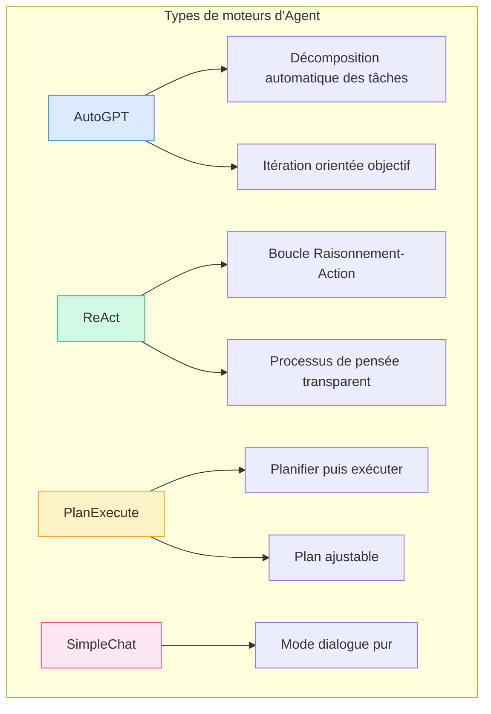
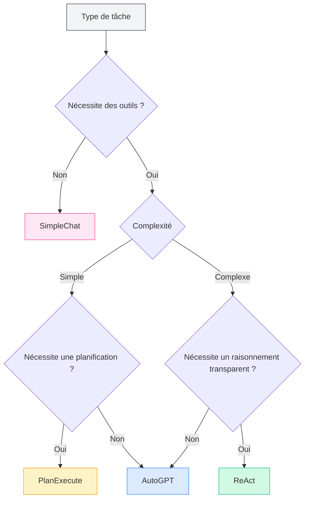
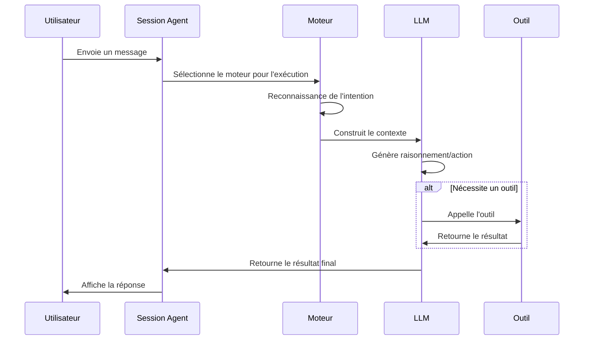

# Gestion des moteurs d'Agent

## Vue d'ensemble

Le moteur d'Agent définit la stratégie d'exécution et le mode de comportement de l'Agent. MetaDoc propose plusieurs moteurs intégrés, chacun utilisant un paradigme d'exécution d'IA différent, adapté à différents scénarios de tâches. En choisissant le moteur approprié, vous pouvez permettre à l'Agent d'accomplir une tâche spécifique de la manière la plus adaptée.

<AgentView mode="demo" />

## Types de moteurs

MetaDoc prend en charge les moteurs d'Agent suivants :

| Nom du moteur   | Caractéristiques                                   | Scénario d'application       |
| --------------- | -------------------------------------------------- | ---------------------------- |
| **AutoGPT**     | Décomposition automatique des tâches, itération orientée objectif | Tâches complexes à multiples étapes |
| **ReAct**       | Boucle Raisonnement-Action, processus de pensée transparent | Tâches nécessitant un raisonnement détaillé |
| **PlanExecute** | Planification d'abord, exécution ensuite, plan ajustable | Tâches structurées           |
| **SimpleChat**  | Dialogue pur, n'appelle pas d'outils              | Questions-réponses simples   |



## Détails des moteurs

### Moteur AutoGPT

**Caractéristiques** :

- **Décomposition automatique des tâches** : Décompose automatiquement les tâches complexes en sous-tâches
- **Orienté objectif** : Exécution itérative centrée sur l'objectif final
- **Prise de décision autonome** : L'Agent décide de manière autonome de l'action suivante

<AgentView mode="demo" />
<AgentEngineManager mode="demo" />

**Scénarios d'application** :

- Recherche et collecte d'informations
- Traitement de documents à multiples étapes
- Tâches de création ouvertes

**Exemple** :

```
Utilisateur : Aide-moi à écrire un article de synthèse sur l'intelligence artificielle
Agent : [Décompose automatiquement en : 1. Collecter des informations 2. Organiser le plan 3. Rédiger le contenu 4. Affiner et modifier]
```

### Moteur ReAct

**Caractéristiques** :

- **Boucle Raisonnement-Action** : Affiche explicitement le processus de raisonnement (Reasoning) et l'action (Action)
- **Traçable** : Chaque étape a une base de raisonnement claire
- **Transparent et contrôlable** : L'utilisateur peut voir la logique de pensée de l'Agent

<AgentView mode="demo" />
<AgentEngineManager mode="demo" />

**Scénarios d'application** :

- Tâches nécessitant d'expliquer le processus de raisonnement
- Tâches d'analyse logique
- Scénarios de démonstration pédagogique

**Exemple** :

```
Raisonnement : L'utilisateur a besoin que j'explique la fonction de ce code
Action : Appeler l'outil d'analyse de code
Observation : [Résultat retourné par l'outil]
Raisonnement : Sur la base des résultats d'analyse, je peux expliquer...
```

### Moteur PlanExecute

**Caractéristiques** :

- **Planifier puis exécuter** : Élabore d'abord un plan complet, puis l'exécute selon le plan
- **Plan ajustable** : Peut modifier le plan pendant l'exécution
- **Sortie structurée** : Format de sortie standardisé, facile à comprendre

<AgentView mode="demo" />
<AgentEngineManager mode="demo" />

**Scénarios d'application** :

- Tâches de gestion de projet
- Génération de documents structurés
- Travail procédural

**Exemple** :

```
Plan :
1. Analyser les besoins
2. Concevoir la solution
3. Implémenter la fonctionnalité
4. Tester et valider

Exécution : Compléter chaque étape selon le plan
```

### Moteur SimpleChat

**Caractéristiques** :

- **Mode dialogue pur** : Seulement des conversations, n'appelle aucun outil
- **Réponse rapide** : Pas d'attente pour l'exécution d'outils
- **Simple et direct** : Adapté aux questions-réponses simples

**Scénarios d'application** :

- Questions-réponses générales
- Explication de concepts
- Conversations simples

**Remarque** : Ce moteur n'appelle pas d'outils, il ne peut donc pas exécuter des fonctions comme les opérations sur fichiers, l'analyse de données, etc.

<AgentEngineManager mode="demo" />

## Choisir un moteur

### Comment choisir le moteur approprié

Choisissez le moteur en fonction des caractéristiques de la tâche :



<AgentView mode="demo" />

### Suggestions de choix

| Scénario de tâche | Moteur recommandé            |
| ----------------- | ---------------------------- |
| Questions-réponses quotidiennes | SimpleChat                   |
| Édition de documents | AutoGPT ou ReAct             |
| Analyse de données | ReAct ou PlanExecute         |
| Écriture de code  | ReAct                        |
| Recherche et étude | AutoGPT                      |
| Gestion de projet | PlanExecute                  |

<AgentView mode="demo" />

## Configurer un moteur

### Choisir un moteur dans la configuration de l'Agent

1. Accédez à [[agent.introduction|Gestion de la configuration de l'Agent]]
2. Créez ou modifiez une configuration d'Agent
3. Dans l'option "Moteur", sélectionnez le type de moteur souhaité
4. Enregistrez la configuration

### Paramètres du moteur

Différents moteurs peuvent avoir des paramètres spécifiques :

**Paramètres généraux** :

- **Nombre maximum d'itérations** : Limite le nombre de cycles de réflexion et d'action de l'Agent
- **Délai d'attente** : Temps d'attente maximum pour un seul appel
- **Température** : Contrôle le degré de créativité de la sortie

**Paramètres spécifiques au moteur** :

- **AutoGPT** : Profondeur de décomposition des objectifs
- **ReAct** : Options d'affichage du processus de raisonnement
- **PlanExecute** : Autorisations d'ajustement du plan

## Flux d'exécution du moteur

### Flux d'exécution général



### Caractéristiques d'exécution des différents moteurs

**Caractéristiques d'exécution d'AutoGPT** :

1. Analyse l'objectif de l'utilisateur
2. Décompose automatiquement en sous-tâches
3. Exécute les sous-tâches une par une
4. Agrège les résultats et les retourne

**Caractéristiques d'exécution de ReAct** :

1. Génère le processus de raisonnement
2. Détermine l'action suivante
3. Exécute l'action (appelle un outil ou génère une réponse)
4. Observe le résultat
5. Boucle jusqu'à l'achèvement de la tâche

**Caractéristiques d'exécution de PlanExecute** :

1. Analyse les besoins
2. Élabore un plan complet
3. Exécute étape par étape
4. Retourne un résultat structuré

## Personnaliser un moteur

### Personnalisation de la configuration du moteur

Pour les utilisateurs avancés, il est possible de personnaliser le comportement du moteur :

1. **Modifier l'invite système** : Ajuster le rôle et le comportement de l'Agent
2. **Définir les préférences d'outils** : Spécifier les outils à utiliser en priorité
3. **Ajuster les paramètres de raisonnement** : Température, nombre maximum de tokens, etc.

### Créer un moteur personnalisé (Avancé)

Les développeurs peuvent créer de nouveaux types de moteurs :

1. Hériter de l'interface du moteur de base
2. Implémenter une logique d'exécution spécifique
3. Enregistrer dans le gestionnaire de moteurs
4. Sélectionner l'utilisation dans la configuration

## Bonnes pratiques

### Principes de choix du moteur

1. **Commencer par le simple** : En cas de doute, tester d'abord avec SimpleChat
2. **Choisir selon la complexité** : Utiliser AutoGPT ou ReAct pour les tâches complexes
3. **Considérer l'explicabilité** : Utiliser ReAct lorsque des explications sont nécessaires

### Optimiser l'efficacité du moteur

1. **Décrire clairement les besoins** : L'efficacité du moteur dépend largement de la clarté de l'entrée
2. **Utiliser les outils de manière raisonnable** : Configurer un ensemble d'outils approprié pour l'Agent
3. **Définir des limites raisonnables** : Contrôler les coûts via des paramètres comme le nombre maximum d'itérations
4. **Fournir un retour d'information rapide** : Donner un retour sur les réponses de l'Agent pour aider à l'amélioration

## Questions fréquentes

### Q : Pourquoi l'Agent n'exécute-t-il pas comme prévu ?

R : Raisons possibles :

- Choix de moteur inapproprié
- Configuration insuffisante de l'ensemble d'outils
- Description de la tâche peu claire
- Limite du nombre maximum d'itérations atteinte

### Q : Peut-on changer de moteur pendant une conversation ?

R : Actuellement, le changement de moteur au sein d'une même conversation n'est pas pris en charge. Si vous devez changer de moteur, il est recommandé de :

1. Terminer la session en cours
2. Créer une nouvelle session
3. Choisir une configuration d'Agent utilisant un moteur différent

### Q : Quel moteur convient le mieux aux débutants ?

R : Suggestions :

- Commencer par SimpleChat pour se familiariser avec la fonction de conversation
- Ensuite essayer ReAct pour observer le processus de raisonnement
- Une fois à l'aise, utiliser AutoGPT pour les tâches complexes

### Q : Le moteur affecte-t-il la qualité des réponses ?

R : Oui. Les modes de pensée et les stratégies d'exécution diffèrent selon les moteurs :

- Pour la même tâche, différents moteurs peuvent donner des réponses différentes
- Choisir le moteur approprié peut améliorer significativement les résultats
- Il est recommandé de configurer différents Agents pour différents types de tâches

## Documentation associée

- [[agent.introduction|Vue d'ensemble du framework Agent]]
- [[agent.introduction|Gestion de la configuration de l'Agent]]
- [[agent.session|Gestion des sessions Agent]]
- [[agent.tools|Gestion de l'ensemble d'outils]]