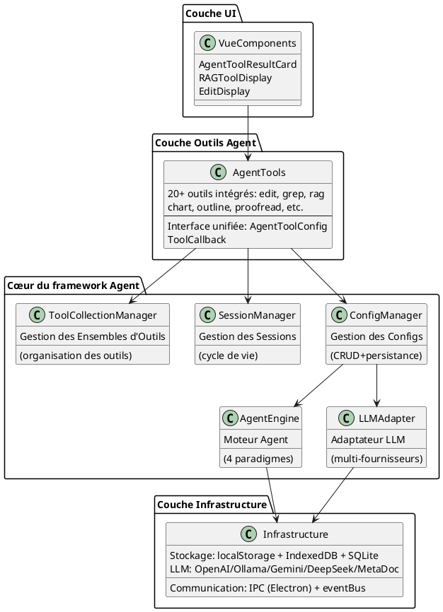
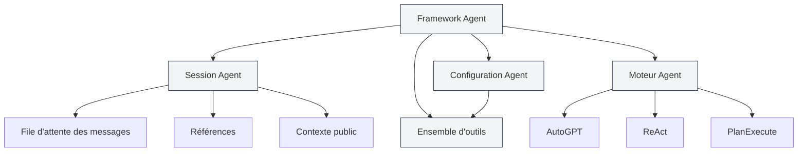
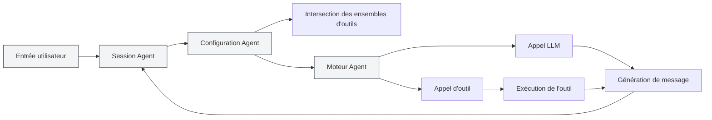
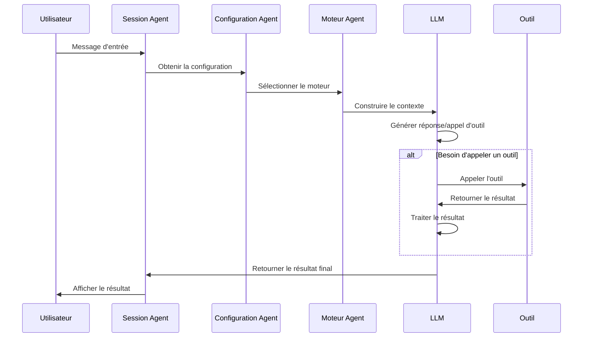

# Vue d'ensemble du framework Agent

## Vue d'ensemble

Le framework Agent est le framework central de MetaDoc pour construire et gérer des systèmes d'Agent intelligents, utilisant une **conception d'architecture en couches**. Il fournit une gestion complète du cycle de vie de l'Agent, incluant des fonctionnalités telles que la gestion des sessions, la gestion des configurations, la gestion des ensembles d'outils et la gestion des moteurs.

Le framework Agent est construit sur le système Tool existant. Grâce à des composants clés comme la configuration d'Agent (AgentConfig), les ensembles d'outils (ToolCollection) et les sessions d'Agent (AgentSession), il réalise un système d'Agent flexible et extensible.

<AgentSessionManager mode="demo" />

## Aperçu de l'interface

Le framework Agent fournit une interface intuitive pour gérer les sessions et les outils de l'Agent :

<AgentView mode="demo" />

## Architecture technique

### Couches de l'architecture



### Chemins des fichiers principaux

| Catégorie         | Chemin du fichier                                                           | Description                              |
| ----------------- | --------------------------------------------------------------------------- | ---------------------------------------- |
| **Définitions de types** | `src/renderer/src/types/agent-framework.ts`                                 | Définitions de types du cœur du framework Agent |
| **Définitions de types** | `src/renderer/src/types/agent-tool.ts`                                      | Définitions de types des outils Agent    |
| **Gestion des configurations** | `src/renderer/src/utils/agent-framework/agent-config-manager.ts`            | CRUD et persistance des AgentConfig      |
| **Gestion des sessions** | `src/renderer/src/utils/agent-framework/agent-session-manager.ts`           | Gestion du cycle de vie des AgentSession |
| **Gestion des ensembles d'outils** | `src/renderer/src/utils/agent-framework/tool-collection-manager.ts`         | Organisation et gestion des ensembles d'outils |
| **Gestion des moteurs** | `src/renderer/src/utils/agent-framework/agent-engine-manager.ts`            | Gestion de la configuration des moteurs Agent |
| **Exécution des moteurs** | `src/renderer/src/utils/agent-framework/agent-engine-executor.ts`           | Implémentation des 4 paradigmes d'exécution |
| **Exécution des outils** | `src/renderer/src/utils/agent-framework/tool-runner.ts`                     | Point d'entrée unifié pour l'appel des outils |
| **Adaptation LLM** | `src/renderer/src/utils/agent-framework/llm-adapter.ts`                     | Adaptation multi-fournisseurs LLM        |



## Concepts clés

### Session Agent (AgentSession)

<AgentView mode="demo" />

Une session Agent est une instance d'un AgentConfig, représentant un environnement d'exécution d'Agent indépendant et contextuel. Implémentée sur la base de `agent-session-manager.ts`, chaque session maintient son propre historique de messages, ses références, son espace de contexte public, et prend en charge des fonctionnalités avancées comme la file d'attente des messages, les nouvelles tentatives, Duplicate, etc.

**Définition de type** (`types/agent-framework.ts` lignes 387-424) :

```typescript
export interface AgentSession {
  entityType: 'agent-session'
  id: string
  title: string
  agentConfigId: string // AgentConfig associé
  messages: AgentMessage[] // Historique des messages
  messageQueue: QueuedMessage[] // File d'attente des messages
  referenceStore: Reference[] // Références
  publicContext: PublicContext // Contexte public
  executionNodes: ExecutionNode[] // Nœuds d'exécution (pour les nouvelles tentatives)
  status: AgentSessionStatus // Statut de la session
}
```

**Machine à états de la session** :

```
inactif → réflexion → génération → appel d'outil → attente d'entrée → erreur
```

Voir [[agent.session|Gestion des sessions Agent]] pour plus de détails.

### Configuration Agent (AgentConfig)

<CompletionSettingsPanel mode="demo" />

AgentConfig définit l'identité et le champ de compétences de l'Agent, implémenté sur la base de `agent-config-manager.ts`.

**Définition de type** (`types/agent-framework.ts` lignes 242-289) :

```typescript
export interface AgentConfig {
  entityType: 'agent-config'
  id: string
  name: LocalizedText // Nom prenant en charge l'i18n
  description: LocalizedText // Description prenant en charge l'i18n
  toolCollectionIds: string[] // IDs des ensembles d'outils associés (intersection)
  maxToolCalls?: number | null // Nombre maximum d'appels d'outils
  llmConfig?: {
    model?: string
    temperature?: number
    systemPrompt?: string // Prompt système
    injectTimestamp?: boolean
  }
  behavior?: {
    allowToolCalls?: boolean
  }
  scenario?: 'outline' | 'editor' | 'analysis' | 'visualization' | 'custom'
}
```

**Fonctionnalités principales** :

- **Configuration par défaut** : `default-agent-config` (intégrée, non supprimable)
- **Intersection des ensembles d'outils** : Lorsque plusieurs ensembles d'outils sont associés, les outils disponibles sont l'intersection de tous les ensembles d'outils
- **Surcharge des paramètres LLM** : Peut remplacer la configuration LLM globale
- **Persistance** : Stockée dans `localStorage`, clé `'agent-configs'`

La gestion liée à l’Agent est regroupée dans le menu de la **vue Agent**. Commencez par [[agent.tools|Gestion des ensembles d’outils]] et [[agent.capabilities|Règles, compétences et gestion MCP]]. (L’entrée d’index « Configuration Agent » a été retirée ; l’article reste en référence.)

### Ensemble d'outils (ToolCollection)

<DataAnalysisDisplay mode="demo" />

Un ensemble d'outils est une collection d'outils Agent, utilisée pour organiser et gérer les outils disponibles pour l'Agent. Un AgentConfig peut être associé à plusieurs ensembles d'outils, les outils disponibles étant l'intersection de tous les ensembles d'outils.

Voir [[agent.tools|Gestion des ensembles d'outils]] pour plus de détails.

### Références (Reference)

<RAGToolDisplay mode="demo" />

Les références sont les documents et fichiers cités dans une session Agent. L'Agent peut percevoir ces contenus et raisonner ou agir en se basant sur eux. Prend en charge divers types de références : fichiers, URL, bases de connaissances, etc.

Les références se gèrent dans les sessions ; voir [[agent.session|Gestion des sessions Agent]]. (L’entrée séparée « Gestion des références » a été retirée de l’index.)

### Moteur Agent (AgentEngine)

<DiffDisplay mode="demo" />

Le moteur Agent définit la stratégie d'exécution et le mode de comportement de l'Agent, incluant plusieurs paradigmes comme AutoGPT, ReAct, PlanExecute. Différents moteurs sont adaptés à différents scénarios de tâches.

Les paradigmes d’exécution sont choisis selon le contexte de session ; voir [[agent.session|Gestion des sessions Agent]]. (L’entrée « Gestion des moteurs Agent » a été retirée de l’index.)

## Architecture du système

L'architecture du système du framework Agent est la suivante :



## Flux d'exécution

Le flux d'exécution de base de l'Agent :

1. **Entrée utilisateur** : L'utilisateur saisit un message dans la session Agent.
2. **Reconnaissance de l'intention** : Le système reconnaît l'intention de l'utilisateur et met à jour la description des outils disponibles.
3. **Sélection du moteur** : Sélectionne le moteur d'exécution selon la configuration de l'Agent.
4. **Construction du contexte** : Construit un contexte incluant l'historique des messages, les références, les descriptions d'outils.
5. **Appel LLM** : Appelle le LLM pour générer une réponse ou un appel d'outil.
6. **Exécution de l'outil** : Si le LLM décide d'appeler un outil, exécute l'outil correspondant.
7. **Traitement du résultat** : Renvoie le résultat de l'exécution de l'outil comme observation (Observation) au LLM.
8. **Boucle d'itération** : Selon le type de moteur, plusieurs itérations peuvent avoir lieu jusqu'à l'achèvement de la tâche.
9. **Sortie du résultat** : Affiche le résultat final à l'utilisateur.



## Caractéristiques fonctionnelles

### Fonctionnalités principales

- **Gestion des sessions** : Créer, supprimer, copier, exporter/importer des sessions.
- **Gestion des configurations** : Configuration flexible de l'Agent, prenant en charge l'intersection de multiples ensembles d'outils.
- **Gestion des ensembles d'outils** : Organiser et gérer les outils de l'Agent.
- **Gestion des références** : Gérer les documents et fichiers de référence dans les sessions.
- **Gestion des moteurs** : Prend en charge plusieurs paradigmes d'exécution, moteurs personnalisables.

### Fonctionnalités avancées

- **File d'attente des messages** : Insérer des messages pendant l'exécution de l'Agent.
- **Mécanisme de nouvelle tentative** : Prend en charge la reprise des nœuds d'exécution ayant échoué.
- **Fonction Duplicate** : Copier des sessions ou des nœuds d'exécution.
- **Contexte public** : Espace de contexte partagé au niveau de la session.
- **Suivi des nœuds d'exécution** : Enregistrer l'état et le résultat de chaque nœud d'exécution.

## Scénarios d'utilisation

Le framework Agent est adapté aux scénarios suivants :

- **Édition de documents** : Utiliser les outils Agent pour éditer et optimiser des documents.
- **Analyse de données** : Utiliser les outils d'analyse de données pour le traitement et la visualisation de données.
- **Génération de contenu** : Utiliser le moteur Agent avec des ensembles d'outils pour générer du contenu structuré.
- **Recherche de connaissances** : Combiner avec des bases de connaissances pour une recherche et une analyse intelligentes.
- **Tâches automatisées** : Réaliser des tâches multi-étapes via l'Agent et des ensembles d'outils.

## Démarrage rapide

Pour commencer à utiliser le framework Agent, il est recommandé d'apprendre dans l'ordre suivant :

1. [[agent.introduction|Vue d'ensemble du framework Agent]] (ce document)
2. [[agent.tools|Gestion des ensembles d'outils]] : Apprendre à gérer les ensembles d'outils.
3. [[agent.capabilities|Règles, compétences et gestion MCP]] : Règles, skills d’espace de travail et MCP.
4. [[agent.session|Gestion des sessions Agent]] : Créer et gérer des sessions.

## Questions fréquentes

### Q : Quelle est la différence entre le framework Agent et le dialogue IA ?

R : Le dialogue IA est une fonctionnalité de conversation simple, tandis que le framework Agent fournit un système d'Agent complet, incluant des fonctionnalités avancées comme l'appel d'outils, la gestion des références, etc. Le framework Agent peut exécuter des tâches complexes, pas seulement dialoguer.

### Q : Comment choisir le moteur Agent approprié ?

R :

- **Moteur AutoGPT** : Adapté à la plupart des tâches intelligentes, forte capacité de décision autonome.
- **Moteur ReAct** : Adapté aux tâches nécessitant des étapes de raisonnement détaillées, processus de réflexion explicite.
- **Moteur PlanExecute** : Adapté aux tâches nécessitant une exécution structurée, planification puis exécution.
- **Moteur SimpleChat** : Adapté aux tâches de dialogue pur, n'appelle pas d'outils.

### Q : Que signifie l'intersection des ensembles d'outils ?

R : Lorsqu'un AgentConfig est associé à plusieurs ensembles d'outils, les outils disponibles sont l'intersection de tous les ensembles d'outils. Par exemple, si l'ensemble d'outils A contient `[tool1, tool2, tool3]` et l'ensemble d'outils B contient `[tool2, tool3, tool4]`, alors les outils disponibles pour l'AgentConfig sont `[tool2, tool3]`.

## Documentation associée

- [[agent.session|Gestion des sessions Agent]]
- [[agent.tools|Gestion des ensembles d'outils]]
- [[agent.capabilities|Règles, compétences et gestion MCP]]
- [[ai.llm-config|Configuration LLM]]

