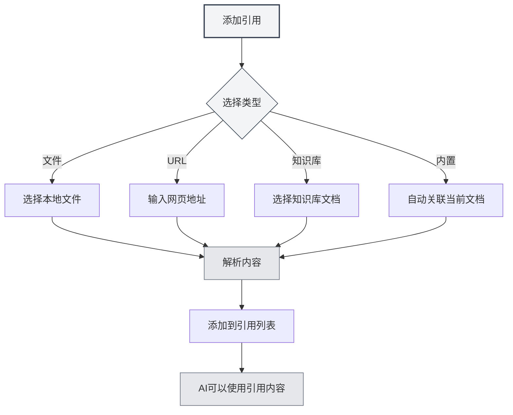

# Gestion des références

## Vue d'ensemble

Les références sont une fonctionnalité essentielle dans les sessions d'Agent, vous permettant d'intégrer dans la conversation des contenus externes tels que des documents, des pages web, des fichiers, etc. L'Agent peut raisonner et répondre en se basant sur ces références, rendant les réponses de l'IA plus précises et pertinentes.

Grâce aux références, vous pouvez :

- Permettre à l'IA de consulter le contenu de documents spécifiques
- Discuter en s'appuyant sur des informations provenant du web
- Analyser le contenu de fichiers locaux
- Réaliser des questions-réponses approfondies en combinant une base de connaissances

## Ouvrir la gestion des références

Dans l'interface de session de l'Agent, cliquez sur l'onglet "Références" pour ouvrir le panneau de gestion des références.

Le panneau des références affiche toutes les références ajoutées dans la session actuelle, y compris :

- Le nom du fichier ou l'URL
- Le type de référence (Fichier/URL/Base de connaissances/Document intégré)
- L'état d'activation
- L'aperçu du contenu

Vous pouvez accéder à la vue Agent via la barre latérale :

<ReferenceManager mode="demo" />
<ReferenceDisplay mode="demo" />

## Ajouter des références

### Ajouter une référence de fichier

Ajouter un fichier local comme référence :

1. Cliquez sur le bouton "Ajouter une référence" dans le panneau des références
2. Sélectionnez le type "Fichier"
3. Choisissez le fichier à référencer dans le sélecteur de fichiers
4. Confirmez l'ajout

**Formats de fichiers pris en charge** :

- Documents Markdown (.md)
- Documents LaTeX (.tex)
- Fichiers PDF (.pdf)
- Documents Word (.docx)
- Fichiers texte brut (.txt)
- Fichiers image (.png, .jpg)

<ReferenceManager mode="demo" />

### Ajouter une référence d'URL

Référencer le contenu d'une page web :

1. Cliquez sur le bouton "Ajouter une référence" dans le panneau des références
2. Sélectionnez le type "URL"
3. Saisissez l'adresse web à référencer
4. Cliquez sur Confirmer

MetaDoc récupérera automatiquement le contenu de la page web et l'ajoutera aux références.

<ReferenceManager mode="demo" />
<ReferenceDisplay mode="demo" />

### Ajouter une référence de base de connaissances

Référencer un document provenant d'une base de connaissances :

1. Cliquez sur le bouton "Ajouter une référence" dans le panneau des références
2. Sélectionnez le type "Base de connaissances"
3. Choisissez le document à référencer dans la liste de la base de connaissances
4. Confirmez l'ajout

<ReferenceDisplay mode="demo" />

### Référence de document intégré

Chaque session d'Agent active par défaut la "Référence de document intégré" (référence n°0), qui récupère dynamiquement le contenu du document actuellement ouvert comme référence.



## Gérer les références

### Activer/Désactiver une référence

Chaque référence peut être contrôlée indépendamment pour son état d'activation :

- **Activée** : Le contenu référencé participe au processus de raisonnement de l'IA
- **Désactivée** : Le contenu référencé ne participe pas temporairement au raisonnement, mais reste dans la liste

Cliquez sur l'interrupteur à côté de la référence pour basculer son état d'activation.

<ReferenceDisplay mode="demo" />

### Prévisualiser le contenu d'une référence

Cliquez sur une référence pour prévisualiser son contenu :

- **Référence de fichier** : Affiche un aperçu textuel du contenu du fichier
- **Référence d'URL** : Affiche le contenu web récupéré
- **Référence de base de connaissances** : Affiche les extraits pertinents de la base de connaissances
- **Référence intégrée** : Affiche le contenu du document actuel

### Supprimer une référence

Retirer de la liste des références celles qui ne sont plus nécessaires :

1. Dans le panneau des références, trouvez la référence à supprimer
2. Cliquez sur le bouton de suppression (icône ×)
3. Confirmez la suppression

**Remarque** : Supprimer une référence ne supprime que la relation de référence, sans affecter le fichier original.

<ReferenceManager mode="demo" />

## Rôle des références dans la conversation

### Conscience des références

Lorsque vous activez des références, l'Agent, en répondant, va :

1. **Analyser le contenu des références** : Comprendre le contenu des documents, pages web ou fichiers référencés
2. **Combiner avec le contexte** : Intégrer le contenu des références à l'historique de la conversation
3. **Générer une réponse** : Produire une réponse plus précise en se basant sur le contenu des références

### Exemples d'utilisation

**Scénario 1 : Questions-réponses basées sur un document**

```
Utilisateur : [a ajouté un document technique comme référence]
Question de l'utilisateur : Quelles sont les meilleures pratiques mentionnées dans ce document ?
IA : D'après le document que vous avez référencé, les meilleures pratiques incluent...
```

**Scénario 2 : Comparaison de plusieurs documents**

```
Utilisateur : [a ajouté deux articles de recherche comme références]
Question de l'utilisateur : Comparez les méthodologies de recherche de ces deux articles
IA : Le premier article utilise... tandis que le second emploie...
```

**Scénario 3 : Analyse du contenu d'une page web**

```
Utilisateur : [a ajouté une page web d'actualité comme référence]
Question de l'utilisateur : Résumez les points principaux de ce reportage
IA : D'après le contenu de la page web, il est principalement rapporté que...
```

## Bonnes pratiques

### Utilisation efficace des références

1. **Sélectionner des contenus pertinents** : N'ajoutez que des références liées au sujet en cours pour éviter la surcharge d'informations
2. **Contrôler le nombre de références** : Il est recommandé de ne pas activer plus de 5 références simultanément pour garantir l'efficacité du traitement
3. **Nettoyer régulièrement** : À la fin d'une conversation, supprimez les références devenues inutiles pour maintenir la liste organisée

### Stratégies d'utilisation des références

1. **Analyse de documents** : Pour analyser un long document, ajoutez-le en référence et posez des questions spécifiques
2. **Recherche de connaissances** : Utilisez les références de base de connaissances pour des questions-réponses basées sur celle-ci
3. **Informations en temps réel** : Obtenez des informations web à jour via les références d'URL
4. **Continuité du contexte** : Utilisez la référence intégrée pour permettre à l'IA de comprendre le document en cours d'édition

## Astuces d'utilisation

### Ajout rapide

- **Ajout par glisser-déposer** : Glissez-déposez directement un fichier dans le panneau des références
- **Ajout par clic droit** : Faites un clic droit sur un fichier ou une page web et sélectionnez "Ajouter aux références"
- **Raccourci clavier** : Utilisez un raccourci clavier pour ouvrir rapidement le panneau des références

<ReferenceManager mode="demo" />

### Combinaison de références

Il est possible d'ajouter simultanément plusieurs références de types différents :

- Un document PDF + un lien web
- Plusieurs documents d'une base de connaissances
- Un fichier local + une référence de document intégré

L'IA analysera de manière synthétique le contenu de toutes les références activées.

<ReferenceDisplay mode="demo" />

### Désactivation temporaire

Si vous n'êtes pas sûr de l'utilité d'une référence, vous pouvez d'abord la désactiver :

1. Observez la réponse de l'IA sans cette référence
2. Réactivez ensuite la référence et comparez la différence dans les réponses
3. Décidez de la conserver ou non en fonction du résultat

## Questions fréquentes

### Q : Y a-t-il une limite de taille pour le contenu des références ?

R : Oui. Les fichiers trop volumineux peuvent être tronqués lors du traitement. Il est recommandé de :

- Ajouter les très gros documents par chapitres
- Utiliser une base de connaissances pour traiter de nombreux documents
- Extraire d'abord les parties clés des longs documents

### Q : Pourquoi l'IA ne semble-t-elle pas utiliser une référence que j'ai ajoutée ?

R : Raisons possibles :

- La référence n'est pas activée (vérifiez l'état de l'interrupteur)
- Le contenu de la référence n'est pas lié à la question
- L'analyse de la référence a échoué (vérifiez le format du fichier)

### Q : Que faire si une référence d'URL échoue ?

R : Raisons possibles :

- La page web nécessite une connexion (login)
- La page web possède un mécanisme anti-robot d'indexation
- Problème de connexion réseau
  Recommandation : Enregistrez le contenu de la page web en tant que fichier, puis ajoutez-le comme référence de fichier

### Q : Les références occupent-elles de l'espace de stockage ?

R : Les références elles-mêmes ne sont que des liens et n'occupent pas d'espace supplémentaire. Cependant, les résultats de l'analyse des références sont mis en cache localement.

## Documentation associée

- [[agent.session|Gestion des sessions Agent]]
- [[agent.introduction|Gestion de la configuration de l'Agent]]
- [[knowledge-base.usage|Utilisation de la base de connaissances]]
- [[agent.introduction|Vue d'ensemble du cadre Agent]]