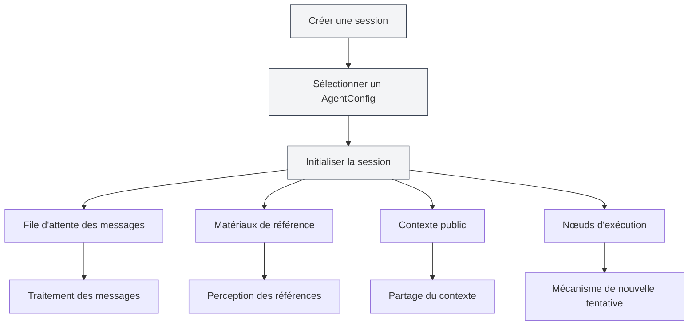
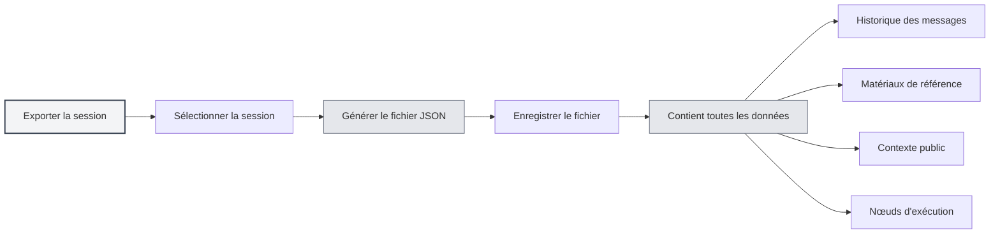
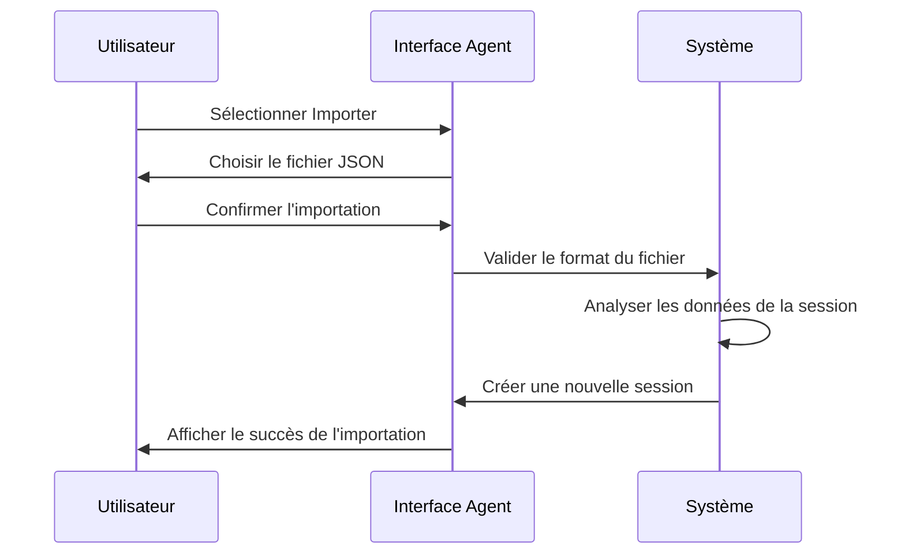
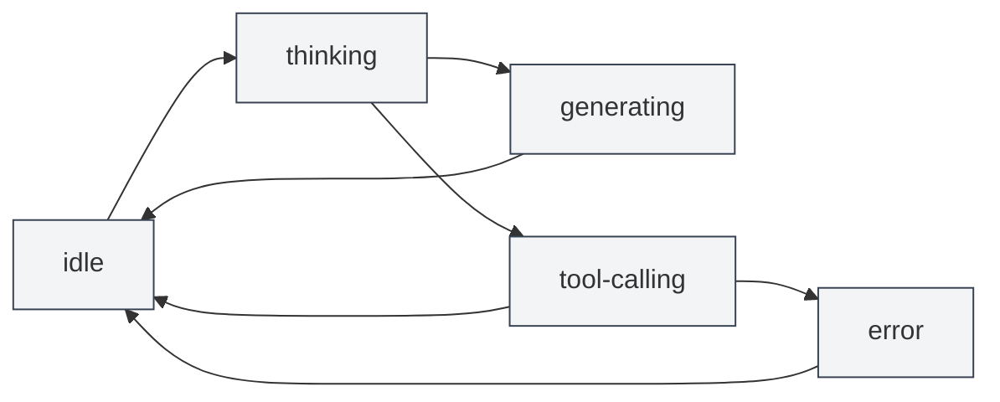

# Gestion des sessions Agent

## Vue d'ensemble

Une session Agent est un composant central du framework Agent, représentant un environnement d'exécution d'Agent indépendant et contextuel. Chaque session maintient son propre historique de messages, ses matériaux de référence, son espace de contexte public, et prend en charge des fonctionnalités avancées telles que la file d'attente des messages, les nouvelles tentatives (retry), la duplication, etc.

<AgentView mode="demo" />

Une session Agent est créée à partir d'un AgentConfig, héritant de son ensemble d'outils et de son périmètre de capacités, mais chaque session possède son propre état d'exécution et son historique indépendants.

## Créer une session

### Créer une nouvelle session

Étapes pour créer une session Agent :

<AgentView mode="demo" />

1.  **Ouvrir la vue Agent** : Cliquez sur "AI" → "Agent" dans la barre de menu pour ouvrir la vue Agent.
2.  **Sélectionner un AgentConfig** : Sélectionnez l'AgentConfig à utiliser au-dessus de la liste des sessions.
3.  **Créer une session** : Cliquez sur le bouton "Nouvelle session".
4.  **Saisir un titre** : Saisissez éventuellement un titre pour la session (par défaut, le premier message est utilisé comme titre).
5.  **Commencer la conversation** : Saisissez le premier message pour commencer à interagir avec l'Agent.

### Initialisation de la session

Lors de la création d'une session, le système effectue automatiquement :

<AgentSessionManager mode="demo" />

-   **Création d'un ID de session** : Génération d'un identifiant de session unique.
-   **Association de l'AgentConfig** : Liaison à l'AgentConfig spécifié.
-   **Initialisation de la file d'attente des messages** : Création d'une file d'attente de messages vide.
-   **Initialisation des matériaux de référence** : Création d'un stockage de matériaux de référence vide.
-   **Initialisation du contexte public** : Création d'un espace de contexte public contenant des informations comme l'heure actuelle.
-   **Création du message de bienvenue** : Ajout automatique du message de bienvenue de l'Agent.
-   **Activation de la référence intégrée** : Activation par défaut de la référence intégrée n°0 (récupération dynamique du contenu du document actuel).

## Renommer une session

### Opération de renommage

Pour renommer une session existante :

<AgentView mode="demo" />

1.  **Menu contextuel** : Faites un clic droit sur la session et sélectionnez "Renommer".
2.  **Saisir le nouveau nom** : Saisissez le nouveau nom de la session dans la boîte de dialogue qui s'affiche.
3.  **Confirmer l'enregistrement** : Cliquez sur Confirmer pour enregistrer le nouveau nom.

Le nom de la session sert à identifier et à distinguer les différentes sessions. Il est recommandé d'utiliser un nom descriptif.

## Supprimer une session

### Opération de suppression

Pour supprimer une session inutile :

<AgentSessionManager mode="demo" />

1.  **Menu contextuel** : Faites un clic droit sur la session et sélectionnez "Supprimer".
2.  **Confirmer la suppression** : Confirmez la suppression dans la boîte de dialogue de confirmation.

**Attention** : La suppression d'une session entraîne également la suppression de tout son historique de messages, de ses matériaux de référence et de ses nœuds d'exécution. Cette opération est irréversible.

### Suppression en masse

La suppression en masse n'est actuellement pas prise en charge. Les sessions doivent être supprimées une par une.

## Dupliquer une session

### Opération de duplication

Pour dupliquer une session existante :

<AgentView mode="demo" />

1.  **Menu contextuel** : Faites un clic droit sur la session et sélectionnez "Dupliquer".
2.  **Créer une copie** : Le système crée une nouvelle copie de la session.

La duplication d'une session copie :

-   **L'historique des messages** : Tous les enregistrements de messages.
-   **Les matériaux de référence** : Tous les matériaux de référence.
-   **Le contexte public** : Le contenu de l'espace de contexte public.
-   **Les nœuds d'exécution** : Tous les enregistrements de nœuds d'exécution.

La session dupliquée est indépendante ; les modifications n'affecteront pas la session originale.

### Cas d'utilisation

La duplication de session est utile pour :

-   **Discussions parallèles** : Poursuivre des discussions sur différents sujets à partir d'une conversation existante.
-   **Tests expérimentaux** : Tester différentes configurations d'Agent ou ensembles d'outils.
-   **Sauvegarde** : Sauvegarder l'état important d'une session.

## Exporter/Importer une session

### Exporter une session

<AgentView mode="demo" />

Pour exporter une session vers un fichier JSON :

<AgentView mode="demo" />

1.  **Menu contextuel** : Faites un clic droit sur la session et sélectionnez "Exporter".
2.  **Choisir l'emplacement** : Sélectionnez l'emplacement de sauvegarde et le nom du fichier.
3.  **Enregistrer le fichier** : Cliquez sur Enregistrer pour exporter la session.

Le fichier JSON exporté contient :

-   Les informations de base de la session (ID, titre, description, etc.)
-   L'historique des messages
-   Les matériaux de référence
-   Le contexte public
-   Les nœuds d'exécution

### Importer une session

<AgentSessionManager mode="demo" />

Pour importer une session depuis un fichier JSON :

1.  **Ouvrir l'importation** : Trouvez la fonction d'importation dans la vue Agent.
2.  **Sélectionner le fichier** : Choisissez le fichier JSON à importer.
3.  **Valider les données** : Le système valide le format et le contenu du fichier.
4.  **Importer la session** : Une nouvelle session est créée après une importation réussie.

La session importée obtient un nouvel ID de session et n'écrase pas les sessions existantes.

## Nouvelle tentative pour une session

### Fonctionnalité de nouvelle tentative

La fonction de nouvelle tentative (retry) vous permet de réexécuter une tâche Agent ayant échoué :

1.  **Voir les nœuds d'exécution** : Consultez la liste des nœuds d'exécution dans la session.
2.  **Sélectionner un nœud** : Sélectionnez le nœud d'exécution à réessayer.
3.  **Réexécuter** : Cliquez sur le bouton "Nouvelle tentative" pour réexécuter.

La nouvelle tentative recommence l'exécution à partir du nœud d'exécution sélectionné, en conservant l'historique des messages précédent.

### Nœuds d'exécution

Les nœuds d'exécution enregistrent chaque étape du processus d'exécution de l'Agent :

-   **Nœud de message** : Message utilisateur ou réponse de l'IA.
-   **Nœud d'appel d'outil** : Appel d'outil et résultat de l'exécution.
-   **Nœud d'appel de flux de travail** : Processus d'exécution d'un flux de travail.
-   **Nœud d'appel LLM** : Appel LLM et réponse.

Chaque nœud a un état (pending, running, succeeded, failed, cancelled) et un résultat.

## Gestion des messages de session

### Opérations sur les messages

Les opérations suivantes peuvent être effectuées sur les messages d'une session :

-   **Modifier un message** : Modifier un message utilisateur et le renvoyer.
-   **Régénérer** : Régénérer une réponse de l'IA.
-   **Copier un message** : Copier le contenu d'un message.
-   **Supprimer un message** : Supprimer un message (cela supprimera également tous les messages qui le suivent).

### File d'attente des messages

<AgentView mode="demo" />

La file d'attente des messages permet d'insérer des messages pendant l'exécution de l'Agent :

1.  **Moment d'insertion** : Lorsque l'Agent génère une réponse ou appelle un outil, les messages sont temporairement stockés dans la file d'attente.
2.  **Moment du traitement** : Une fois la tâche en cours terminée, et avant de passer à l'étape suivante, les messages en file d'attente sont traités.
3.  **Informations d'annotation** : Les messages en file d'attente sont annotés avec l'horodatage d'insertion et l'ID du message au moment de l'insertion, aidant l'Agent à comprendre le contexte.

La fonction de file d'attente des messages vous permet de fournir des informations ou des instructions supplémentaires pendant l'exécution de l'Agent.

## Gestion des matériaux de référence

### Ajouter une référence

<ReferenceManager mode="demo" />

Pour ajouter des matériaux de référence à une session :

1.  **Ouvrir le gestionnaire de références** : Cliquez sur l'onglet "Références" dans la session.
2.  **Ajouter une référence** : Cliquez sur le bouton "Ajouter une référence".
3.  **Choisir le type** : Sélectionnez le type de référence (fichier, URL, texte, etc.).
4.  **Choisir le contenu** : Sélectionnez le contenu à référencer.

Voir [[agent.references|Gestion des matériaux de référence]] pour plus de détails.

### Types de références

Les types de références suivants sont pris en charge :

-   **Référence de fichier** : Référencer un fichier local (Markdown, LaTeX, PDF, Word, image, etc.).
-   **Référence d'URL** : Référencer une URL de page web.
-   **Référence de texte** : Référencer un contenu texte personnalisé.
-   **Référence de base de connaissances** : Référencer du contenu provenant d'une base de connaissances.
-   **Référence intégrée** : Récupération dynamique du contenu du document actuel (activée par défaut).

### Activer une référence

<ReferenceManager mode="demo" />

Les matériaux de référence peuvent être activés ou désactivés :

-   **Activer une référence** : Les références activées sont utilisées lors de l'exécution de l'Agent.
-   **Désactiver une référence** : Les références désactivées n'affectent pas l'exécution de l'Agent.

L'Agent peut percevoir le contenu des matériaux de référence et raisonner ou agir en fonction de ceux-ci.

## Contexte public

### Espace de contexte

Le contexte public est un espace de contexte partagé au niveau de la session, contenant :

<AgentView mode="demo" />

-   **Heure actuelle** : Horodatage mis à jour automatiquement.
-   **Informations sur le document** : Informations sur le document actuellement ouvert (si activé).
-   **Données personnalisées** : Données de contexte définies par l'utilisateur.

### Cas d'utilisation

Le contexte public est utile pour :

-   **Perception du temps** : Permettre à l'Agent de connaître l'heure actuelle.
-   **Perception du document** : Permettre à l'Agent de connaître le document actuellement ouvert.
-   **Partage d'état** : Partager des informations d'état dans un flux de travail.

## État de la session

<AgentSessionManager mode="demo" />

### Types d'état

Une session peut avoir les états suivants :

-   **idle** : État inactif, en attente d'une entrée utilisateur.
-   **thinking** : L'Agent est en train de réfléchir.
-   **generating** : L'Agent est en train de générer une réponse.
-   **tool-calling** : L'Agent est en train d'appeler un outil.
-   **waiting-input** : En attente d'une entrée utilisateur.
-   **error** : Une erreur s'est produite.

### Transition d'état

## Conseils d'utilisation

<AgentView mode="demo" />

### Organisation des sessions

1.  **Gestion par catégorie** : Créez des sessions distinctes pour différents sujets.
2.  **Convention de nommage** : Utilisez des noms de session clairs.
3.  **Nettoyage régulier** : Supprimez régulièrement les sessions inutiles.

### Gestion des messages

1.  **Modifier les messages** : Si une réponse de l'IA n'est pas satisfaisante, vous pouvez modifier le message utilisateur et le renvoyer.
2.  **Utiliser les références** : Ajoutez des matériaux de référence pour fournir plus de contexte.
3.  **File d'attente des messages** : Utilisez la file d'attente des messages pour insérer des informations supplémentaires pendant l'exécution de l'Agent.

### Mécanisme de nouvelle tentative

1.  **Voir les nœuds** : Consultez les nœuds d'exécution pour comprendre le processus d'exécution de l'Agent.
2.  **Sélectionner pour réessayer** : Sélectionnez les nœuds ayant échoué pour une nouvelle tentative.
3.  **Ajuster la configuration** : En cas d'échecs fréquents, envisagez d'ajuster l'AgentConfig ou l'ensemble d'outils.

## Questions fréquentes

<AgentView mode="demo" />

### Q : Comment créer une nouvelle session ?

R : Dans la vue Agent, sélectionnez un AgentConfig, puis cliquez sur le bouton "Nouvelle session". Après la création, saisissez le premier message pour commencer la conversation.

### Q : L'historique des messages de la session est-il sauvegardé ?

R : Oui, l'historique des messages de la session est automatiquement sauvegardé dans les métadonnées du document. Toutes les sessions sont restaurées lors de la réouverture du document.

### Q : Comment supprimer une session ?

R : Faites un clic droit sur la session, sélectionnez "Supprimer", puis confirmez la suppression dans la boîte de dialogue de confirmation. Cette opération est irréversible.

### Q : Que copie la duplication d'une session ?

R : La duplication d'une session copie l'historique des messages, les matériaux de référence, le contexte public et les nœuds d'exécution. La session dupliquée est indépendante.

### Q : Comment exporter une session ?

R : Fait
