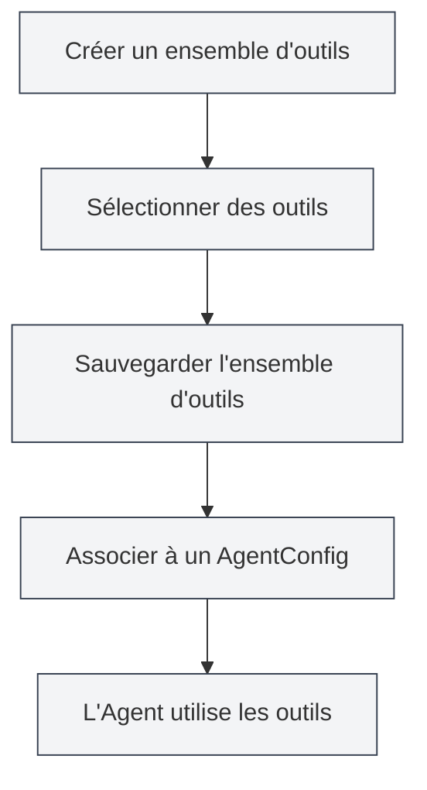

# Gestion des ensembles d'outils

## Vue d'ensemble

Un ensemble d'outils (ToolCollection) est une collection utilisée dans le cadre Agent pour organiser et gérer les outils de l'Agent. L'ensemble d'outils regroupe des outils connexes, facilitant ainsi leur gestion et leur réutilisation. L'AgentConfig détermine quels outils un Agent peut utiliser en associant des ensembles d'outils.

Les ensembles d'outils prennent en charge l'ajout et la suppression dynamiques d'outils. Vous pouvez créer des ensembles d'outils à usage spécifique ou combiner plusieurs ensembles d'outils.

## Concepts clés

### Structure d'un ensemble d'outils

<AgentView mode="demo" />

Un ensemble d'outils comprend les parties principales suivantes :

- **Informations de base** : ID, nom, description, numéro de version
- **Liste d'outils** : Liste des ID d'outils inclus (outils internes et externes)
- **État d'activation** : Indique si l'ensemble d'outils est activé
- **Étiquettes** : Étiquettes utilisées pour la catégorisation et la recherche
- **Indicateur intégré** : Indique s'il s'agit d'un ensemble d'outils intégré (non supprimable)

### Types d'outils

<GrepDisplay mode="demo" />

Un ensemble d'outils peut contenir les types d'outils suivants :

- **Outils internes** : Outils d'Agent intégrés à MetaDoc (comme edit-tool, proofread-tool, etc.)
- **Outils externes** : Outils externes personnalisés par l'utilisateur

### Ensemble d'outils par défaut

Le système fournit un ensemble d'outils par défaut (`default-tool-set`) qui contient tous les outils d'Agent intégrés. Il ne peut pas être supprimé mais peut être dupliqué.

## Créer un ensemble d'outils

<AgentView mode="demo" />

### Créer un nouvel ensemble d'outils

Étapes pour créer un ensemble d'outils :

1.  **Ouvrir la gestion des ensembles d'outils** : Dans la vue Agent, cliquez sur "Gérer" → "Ensembles d'outils"
2.  **Créer un ensemble d'outils** : Cliquez sur le bouton "Nouvel ensemble d'outils"
3.  **Remplir les informations de base** :
    - Nom : Nom de l'ensemble d'outils (prise en charge multilingue)
    - Description : Description de l'ensemble d'outils (prise en charge multilingue)
4.  **Sélectionner des outils** : Choisissez un ou plusieurs outils dans la liste déroulante
    - Vous pouvez rechercher par nom d'outil
    - Sélection multiple prise en charge
    - Le type et la description de l'outil sont affichés
5.  **Sauvegarder l'ensemble d'outils** : Cliquez sur le bouton "Sauvegarder"

Vous pouvez accéder à la vue Agent via la barre latérale :

### Interface des ensembles d'outils de l'Agent

L'illustration suivante montre les principales fonctionnalités de l'interface de gestion des ensembles d'outils :

<AgentView mode="demo" />

### Sélection d'outils

Lors de la sélection d'un outil, le système affiche :

- **Nom de l'outil** : Nom d'affichage de l'outil
- **ID de l'outil** : Identifiant unique de l'outil
- **Type d'outil** : Outil interne, outil externe ou outil de flux de travail
- **Description de l'outil** : Brève description de l'outil

<DialogDemo mode="demo" dialogType="tool-select" />

## Modifier un ensemble d'outils

<AgentView mode="demo" />

### Opération de modification

Modifier un ensemble d'outils existant :

1.  **Ouvrir l'interface de gestion** : Trouvez l'ensemble d'outils à modifier dans l'interface de gestion des ensembles d'outils
2.  **Cliquer sur Modifier** : Cliquez sur le bouton "Modifier" sur la carte de l'ensemble d'outils
3.  **Modifier les informations** : Modifiez le nom, la description ou la liste d'outils
4.  **Sauvegarder les modifications** : Cliquez sur le bouton "Sauvegarder"

**Remarque** : L'ensemble d'outils par défaut (`default-tool-set`) ne peut pas être modifié, mais il peut être dupliqué puis modifié.

### Ajouter un outil

Ajouter un outil à un ensemble d'outils :

1.  **Ouvrir l'interface d'édition** : Modifiez l'ensemble d'outils
2.  **Sélectionner un outil** : Sélectionnez l'outil à ajouter dans la liste déroulante des outils
3.  **Sauvegarder les modifications** : Cliquez sur le bouton "Sauvegarder"

### Supprimer un outil

Supprimer un outil d'un ensemble d'outils :

1.  **Ouvrir l'interface d'édition** : Modifiez l'ensemble d'outils
2.  **Désélectionner** : Désélectionnez l'outil à supprimer dans la liste d'outils
3.  **Sauvegarder les modifications** : Cliquez sur le bouton "Sauvegarder"

## Supprimer un ensemble d'outils

<AgentView mode="demo" />

### Opération de suppression

Supprimer un ensemble d'outils inutile :

1.  **Ouvrir l'interface de gestion** : Trouvez l'ensemble d'outils à supprimer dans l'interface de gestion des ensembles d'outils
2.  **Cliquer sur Supprimer** : Cliquez sur le bouton "Supprimer" sur la carte de l'ensemble d'outils
3.  **Confirmer la suppression** : Confirmez la suppression dans la boîte de dialogue de confirmation qui s'affiche

**Remarque** :

- L'ensemble d'outils par défaut (`default-tool-set`) ne peut pas être supprimé.
- La suppression d'un ensemble d'outils n'affecte pas les AgentConfig déjà créés, mais les AgentConfig associés à cet ensemble d'outils ne pourront plus l'utiliser.
- Si l'ensemble d'outils est utilisé par un AgentConfig, un avertissement s'affichera avant la suppression.

## Dupliquer un ensemble d'outils

### Opération de duplication

<OutlineTreeDisplay mode="demo" />

Dupliquer un ensemble d'outils existant :

1.  **Ouvrir l'interface de gestion** : Trouvez l'ensemble d'outils à dupliquer dans l'interface de gestion des ensembles d'outils
2.  **Cliquer sur Dupliquer** : Cliquez sur le bouton "Dupliquer" sur la carte de l'ensemble d'outils
3.  **Modifier la copie** : Le système crée une copie, le nom est automatiquement suffixé par " (Copie)"
4.  **Sauvegarder les modifications** : Modifiez la copie selon vos besoins et sauvegardez

La duplication d'un ensemble d'outils copie tous les outils, y compris la liste d'outils et la configuration.

## Importer/Exporter un ensemble d'outils

### Exporter un ensemble d'outils

Exporter un ensemble d'outils en fichier JSON :

1.  **Ouvrir l'interface de gestion** : Trouvez l'ensemble d'outils à exporter dans l'interface de gestion des ensembles d'outils
2.  **Cliquer sur Exporter** : Cliquez sur le bouton "Exporter" sur la carte de l'ensemble d'outils
3.  **Choisir l'emplacement** : Sélectionnez l'emplacement de sauvegarde et le nom du fichier
4.  **Sauvegarder le fichier** : Cliquez pour sauvegarder et exporter l'ensemble d'outils

<DialogDemo mode="demo" dialogType="export-config" />

Le fichier JSON exporté contient toutes les informations de l'ensemble d'outils et peut être utilisé pour la sauvegarde ou le partage.

### Importer un ensemble d'outils

<DataAnalysisDisplay mode="demo" />

Importer un ensemble d'outils à partir d'un fichier JSON :

1.  **Ouvrir l'interface de gestion** : Dans l'interface de gestion des ensembles d'outils
2.  **Cliquer sur Importer** : Cliquez sur le bouton "Importer un ensemble d'outils"
3.  **Sélectionner un fichier** : Choisissez le fichier JSON à importer
4.  **Valider les données** : Le système valide le format et le contenu du fichier
5.  **Importer l'ensemble d'outils** : Après une importation réussie, un nouvel ensemble d'outils est créé

<DialogDemo mode="demo" dialogType="import-config" />

L'ensemble d'outils importé reçoit un nouvel ID et ne remplace pas les ensembles d'outils existants (sauf en mode de remplacement).

## Ensembles d'outils et AgentConfig

### Associer un ensemble d'outils

L'AgentConfig détermine les outils disponibles en associant des ensembles d'outils :

1.  **Créer un AgentConfig** : Créez un nouvel AgentConfig
2.  **Sélectionner un ensemble d'outils** : Sélectionnez un ou plusieurs ensembles d'outils dans l'AgentConfig
3.  **Intersection des outils** : Si plusieurs ensembles d'outils sont sélectionnés, les outils disponibles sont l'intersection de tous les ensembles d'outils

### Intersection des ensembles d'outils

<DiffDisplay mode="demo" />

Lorsqu'un AgentConfig est associé à plusieurs ensembles d'outils :

- L'ensemble d'outils A contient : `[tool1, tool2, tool3]`
- L'ensemble d'outils B contient : `[tool2, tool3, tool4]`
- Les outils disponibles pour l'AgentConfig sont : `[tool2, tool3]` (intersection)

Ce mécanisme vous permet de contrôler précisément les capacités de l'Agent.

## Conseils d'utilisation

### Organisation des ensembles d'outils

1.  **Catégorisation par fonction** : Créez des ensembles d'outils classés par fonction, comme "Ensemble d'outils d'édition de documents", "Ensemble d'outils d'analyse de données"
2.  **Catégorisation par scénario** : Créez des ensembles d'outils classés par scénario, comme "Ensemble d'outils de rédaction académique", "Ensemble d'outils d'analyse de code"
3.  **Convention de nommage** : Utilisez des noms clairs pour faciliter l'identification et la gestion

### Conception des ensembles d'outils

1.  **Responsabilité unique** : Chaque ensemble d'outils se concentre sur une fonction ou un scénario spécifique
2.  **Combinaison d'outils** : Combinez judicieusement les outils connexes, évitez les ensembles d'outils trop volumineux
3.  **Réutilisabilité** : Conçoivez des ensembles d'outils réutilisables, faciles à utiliser dans différents AgentConfig

### Gestion des ensembles d'outils

1.  **Nettoyage régulier** : Supprimez les ensembles d'outils qui ne sont plus utilisés
2.  **Gestion des versions** : Sauvegardez les ensembles d'outils importants via la fonction d'exportation
3.  **Documentation** : Indiquez l'utilité et les scénarios d'utilisation dans la description de l'ensemble d'outils

## Questions fréquentes

### Q : Comment créer un ensemble d'outils spécialisé ?

R : Créez un nouvel ensemble d'outils, sélectionnez les outils pertinents, définissez un nom et une description clairs. Par exemple, créez un "Ensemble d'outils d'analyse de données" en sélectionnant les outils liés à l'analyse de données.

### Q : Quelle est la relation entre un ensemble d'outils et un AgentConfig ?

R : L'AgentConfig détermine les outils disponibles en associant des ensembles d'outils. Un AgentConfig peut être associé à plusieurs ensembles d'outils, les outils disponibles étant l'intersection de tous les ensembles d'outils.

### Q : Puis-je modifier l'ensemble d'outils par défaut ?

R : L'ensemble d'outils par défaut (`default-tool-set`) ne peut pas être modifié, mais il peut être dupliqué puis modifié. Dupliquez l'ensemble d'outils par défaut, puis modifiez la copie.

### Q : Comment ajouter un outil personnalisé à un ensemble d'outils ?

R : Vous devez d'abord enregistrer l'outil personnalisé, puis le sélectionner lors de la création ou de la modification de l'ensemble d'outils. Les outils personnalisés doivent être conformes aux spécifications des outils d'Agent.

### Q : La suppression d'un ensemble d'outils affecte-t-elle les AgentConfig ?

R : La suppression d'un ensemble d'outils n'affecte pas les AgentConfig déjà créés, mais les AgentConfig associés à cet ensemble d'outils ne pourront plus l'utiliser. Si l'ensemble d'outils est en cours d'utilisation, un avertissement s'affichera avant la suppression.

## Documentation connexe

- [[agent.introduction|Vue d'ensemble du cadre Agent]]
- [[agent.introduction|Gestion de la configuration de l'Agent]]
- [[agent.session|Gestion des sessions de l'Agent]]