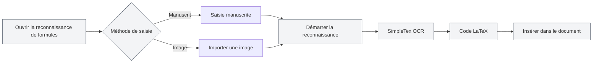

# Fonctionnalités de l'assistant IA

## Vue d'ensemble

La fonction d'assistant IA propose divers outils d'assistance intelligents pour vous aider dans des tâches telles que la création de documents, la reconnaissance de formules, la génération de graphiques, l'analyse de données, etc. Grâce à l'assistant IA, vous pouvez accomplir efficacement divers travaux de traitement de documents.

Les fonctionnalités de l'assistant IA incluent : le dialogue IA, la reconnaissance de formules manuscrites, l'assistant de dessin intelligent, les outils d'analyse de données, la reconnaissance de texte OCR, l'outil d'analyse de pièces jointes, la détection AIGC, etc.

<AgentView mode="demo" />

## Dialogue IA

### Description de la fonction

La fonction de dialogue IA fournit un assistant de conversation intelligent capable de dialoguer en fonction du contenu du document actuel :

- **Compréhension du contexte** : Comprend le contenu et le contexte du document actuel
- **Réponses intelligentes** : Répond aux questions liées au contenu du document
- **Analyse de document** : Analyse la structure, le contenu, le style, etc. du document

Vous pouvez accéder à la fonction de dialogue IA via le menu de l'assistant IA :

<MenuItemsDemo mode="demo" :items='[{"id": "ai-assistant", "items": ["ai-chat"]}]' />

### Aperçu de l'interface

L'interface de dialogue IA comprend une liste de conversations et une zone de dialogue, prenant en charge la gestion de plusieurs conversations et la référence de matériaux :

<AIChat mode="demo" />

Voir [[ai.chat|Dialogue IA]] pour plus de détails.

## Reconnaissance de formules manuscrites

### Description de la fonction

La fonction de reconnaissance de formules manuscrites convertit les formules mathématiques manuscrites en code LaTeX :

<FormulaRecognition mode="demo" />

- **Saisie manuscrite** : Prend en charge la saisie manuscrite à la souris/écran tactile
- **Importation d'image** : Prend en charge l'importation d'images de formules pour la reconnaissance
- **Reconnaissance en temps réel** : Utilise l'API SimpleTex OCR pour la reconnaissance
- **Sortie LaTeX** : Convertit automatiquement au format LaTeX standard

### Mode d'emploi

1. **Ouvrir la reconnaissance de formules** : Ouvrir la fenêtre de reconnaissance de formules depuis le menu de l'assistant IA
2. **Saisie manuscrite** : Écrire la formule mathématique à la main sur le canevas
3. **Ou importer une image** : Cliquer sur le bouton d'importation et sélectionner une image de formule
4. **Démarrer la reconnaissance** : Cliquer sur le bouton de reconnaissance
5. **Voir le résultat** : Consulter le code LaTeX reconnu
6. **Insérer dans le document** : Insérer le code LaTeX dans le document

Vous pouvez accéder à la fonction de reconnaissance de formules manuscrites via le menu de l'assistant IA :

<MenuItemsDemo mode="demo" :items='[{"id": "ai-assistant", "items": ["formula-recognition"]}]' />

### Précision de la reconnaissance

- **Reconnaissance haute précision** : L'API SimpleTex OCR offre une reconnaissance de formules mathématiques de haute précision
- **Prise en charge de formules complexes** : Prend en charge les fractions, racines, intégrales, sommations et autres formules complexes
- **Correction automatique** : Les résultats de reconnaissance peuvent être édités et corrigés manuellement

## Assistant de dessin intelligent

### Description de la fonction

L'assistant de dessin intelligent utilise l'IA pour générer du code de graphiques, prenant en charge plusieurs formats de graphiques :

- **Graphiques Mermaid** : Diagrammes de flux, diagrammes de séquence, diagrammes de classes, diagrammes d'état, etc.
- **Graphiques PlantUML** : Diagrammes UML, diagrammes de séquence, diagrammes d'activité, etc.
- **Graphiques ECharts** : Graphiques en courbes, histogrammes, diagrammes circulaires, nuages de points, etc.
- **Insertion directe** : Les graphiques générés peuvent être insérés directement dans le document

### Aperçu de l'interface

L'assistant de dessin intelligent prend en charge la gestion de plusieurs conversations, sélectionne automatiquement le moteur de graphique et génère des graphiques visuels :

<GraphWindow mode="demo" />

<MenuItemsDemo mode="demo" :items='[{"id": "ai-assistant"}]' />

### Mode d'emploi

1. **Ouvrir l'assistant de dessin** : Ouvrir l'assistant de dessin depuis le menu ou la barre d'outils
2. **Décrire le besoin** : Décrire en langage naturel le graphique à générer
3. **Choisir le type** : Sélectionner le type de graphique (Mermaid, PlantUML, ECharts, etc.)
4. **Générer le graphique** : L'IA génère le code du graphique selon la description
5. **Prévisualiser le graphique** : Prévisualiser le graphique généré
6. **Insérer dans le document** : Insérer le graphique dans le document

### Types de graphiques pris en charge

- **Mermaid** : Diagrammes de flux, diagrammes de séquence, diagrammes de classes, diagrammes d'état, diagrammes ER, diagrammes de Gantt, diagrammes circulaires, diagrammes Git, diagrammes de parcours, cartes mentales, chronologies, etc.
- **PlantUML** : Diagrammes UML, diagrammes de séquence, diagrammes d'activité, diagrammes de composants, diagrammes de déploiement, etc.
- **ECharts** : Graphiques en courbes, histogrammes, diagrammes circulaires, nuages de points, diagrammes radar, cartes thermiques, diagrammes en arbre, diagrammes en arbre rectangulaire, diagrammes solaires, etc.

Voir [[charts.introduction|Présentation des fonctionnalités de graphiques]] pour plus de détails.

## Outils d'analyse de données

### Description de la fonction

Les outils d'analyse de données peuvent analyser les tableaux de données dans un document et générer des graphiques visuels :

- **Reconnaissance de tableaux** : Identifie automatiquement les données tabulaires dans le document
- **Analyse de données** : Analyse les informations statistiques des données tabulaires
- **Génération de graphiques** : Génère des graphiques visuels basés sur les données
- **Insertion de graphiques** : Insère les graphiques générés dans le document

<DataAnalysisWindow mode="demo" />

### Mode d'emploi

1. **Ouvrir l'analyse de données** : Ouvrir la fenêtre d'analyse de données depuis le menu ou la barre d'outils
2. **Sélectionner un tableau** : Sélectionner le tableau à analyser dans le document
3. **Analyser les données** : Cliquer sur le bouton d'analyse, l'IA analyse les données du tableau
4. **Générer un graphique** : Générer un graphique visuel basé sur les résultats de l'analyse
5. **Insérer dans le document** : Insérer le graphique dans le document

## Reconnaissance de texte OCR

### Description de la fonction

La fonction de reconnaissance de texte OCR peut identifier le texte dans les images et en extraire le contenu :

- **Reconnaissance d'image** : Identifie le contenu textuel dans les images
- **Prise en charge multilingue** : Prend en charge le chinois, l'anglais et de nombreuses autres langues
- **Extraction de texte** : Extrait le contenu textuel reconnu
- **Insertion dans le document** : Insère le texte extrait dans le document

### Aperçu de l'interface

La fenêtre de reconnaissance OCR prend en charge la gestion de plusieurs images, l'ajustement des paramètres de prétraitement d'image et l'édition des résultats de reconnaissance :

<OcrWindow mode="demo" />

<MenuItemsDemo mode="demo" :items='[{"id": "ai-assistant", "items": ["proofread"]}]' />

### Mode d'emploi

1. **Ouvrir la reconnaissance OCR** : Ouvrir la fenêtre de reconnaissance OCR depuis le menu ou la barre d'outils
2. **Importer une image** : Importer l'image à reconnaître
3. **Démarrer la reconnaissance** : Cliquer sur le bouton de reconnaissance
4. **Voir le résultat** : Consulter le contenu textuel reconnu
5. **Insérer dans le document** : Insérer le texte dans le document

## Outil d'analyse de pièces jointes

### Description de la fonction

L'outil d'analyse de pièces jointes peut analyser des fichiers joints tels que PDF, Word, etc., et en extraire le contenu :

- **Analyse de fichiers** : Analyse les formats de fichiers PDF, Word, etc.
- **Extraction de contenu** : Extrait le texte et les images des fichiers
- **Ajout à la base de connaissances** : Ajoute le contenu extrait à la base de connaissances
- **Référencement de document** : Référence le contenu des pièces jointes dans le document

<KnowledgeBase mode="demo" />

### Mode d'emploi

1. **Ouvrir l'analyse de pièces jointes** : Ouvrir la fenêtre d'analyse de pièces jointes depuis le menu ou la barre d'outils
2. **Sélectionner un fichier** : Sélectionner le fichier PDF ou Word à analyser
3. **Démarrer l'analyse** : Cliquer sur le bouton d'analyse
4. **Voir le résultat** : Consulter le contenu extrait
5. **Ajouter à la base de connaissances** : Ajouter le contenu à la base de connaissances (optionnel)

## Détection AIGC

### Description de la fonction

La fonction de détection AIGC peut détecter si un texte est généré par une IA :

- **Détection de texte** : Détecte si le texte est généré par une IA
- **Score de confiance** : Fournit un score de probabilité de génération par IA
- **Rapport de détection** : Génère un rapport de détection détaillé

<AigcDetectionWindow mode="demo" />

### Mode d'emploi

1. **Ouvrir la détection AIGC** : Ouvrir la fenêtre de détection AIGC depuis le menu ou la barre d'outils
2. **Sélectionner un texte** : Sélectionner le texte à détecter
3. **Démarrer la détection** : Cliquer sur le bouton de détection
4. **Voir le résultat** : Consulter les résultats de détection et le score de confiance

## Astuces d'utilisation

### Utilisation efficace de l'assistant IA

1. **Expliciter les besoins** : Décrire clairement les besoins pour obtenir de meilleurs résultats
2. **Fournir le contexte** : Fournir suffisamment d'informations contextuelles
3. **Optimisation itérative** : Optimiser itérativement les besoins en fonction des résultats

### Astuces pour la reconnaissance de formules

1. **Écriture claire** : Écrire clairement à la main, éviter les écritures illisibles
2. **Format correct** : Utiliser le format correct des symboles mathématiques
3. **Vérifier le résultat** : Vérifier le résultat après reconnaissance, corriger manuellement si nécessaire

### Astuces pour la génération de graphiques

1. **Description détaillée** : Décrire en détail les besoins en graphiques, y compris le type de données, le style, etc.
2. **Choisir le type** : Choisir le type de graphique approprié selon les besoins
3. **Prévisualiser et ajuster** : Ajuster si nécessaire après avoir prévisualisé le graphique

## Questions fréquentes

### Q : La reconnaissance de formules est-elle inexacte ?

R : La reconnaissance de formules est basée sur l'API SimpleTex OCR et peut être inexacte. Il est recommandé d'écrire clairement à la main ou d'utiliser l'importation d'image.

### Q : Le graphique généré ne correspond pas à mes attentes ?

R : Vous pouvez décrire vos besoins plus en détail ou éditer manuellement le code du graphique généré pour l'ajuster.

### Q : Quelles langues la reconnaissance OCR prend-elle en charge ?

R : La reconnaissance OCR prend en charge le chinois, l'anglais et de nombreuses autres langues, selon le service OCR utilisé.

### Q : Quels formats l'analyse de pièces jointes prend-elle en charge ?

R : L'analyse de pièces jointes prend en charge les formats courants tels que PDF, Word, etc., selon les capacités du service d'analyse.

<AgentView mode="demo" />

## Documents connexes

- [[ai.chat|Dialogue IA]]
- [[charts.introduction|Présentation des fonctionnalités de graphiques]]
- [[knowledge-base.usage|Utilisation de la base de connaissances]]
